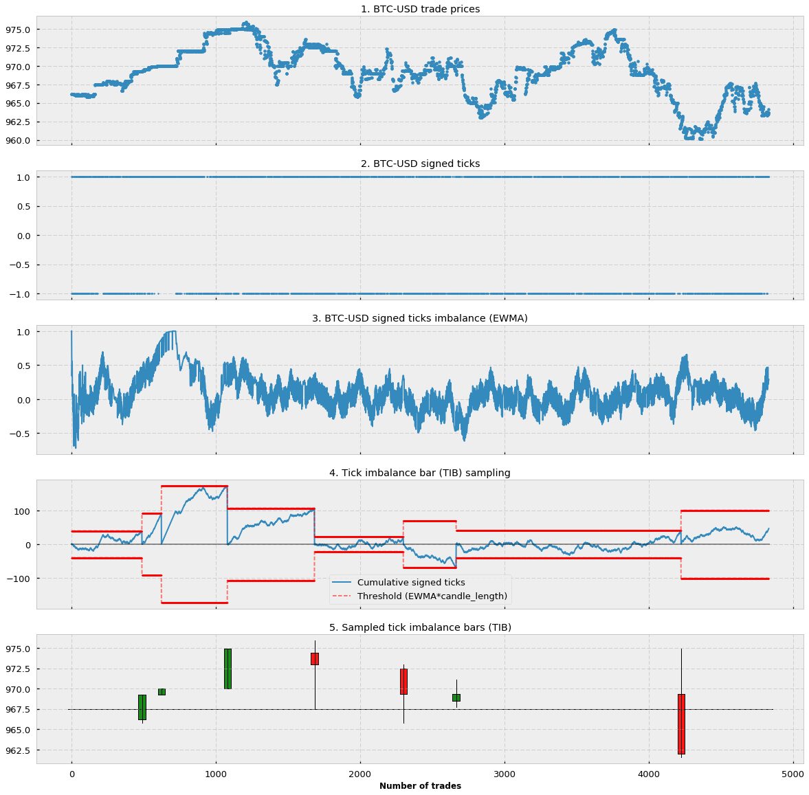

In algorithmic trading, traders are constantly seeking methods to gain an edge over their competitors. Among various innovative techniques, Volume Imbalance Bars (VIBs) have emerged as a significant tool for understanding market conditions. VIBs offer a novel approach by focusing on trade imbalances, thus providing traders with a dynamic perspective beyond conventional time-based charting techniques.

Volume Imbalance Bars are particularly notable for how they capture market dynamics. Traditional time-based candlesticks can often overlook moments of market significance if those moments do not coincide neatly with predefined time intervals. In contrast, VIBs respond directly to changes in buy and sell imbalances, allowing traders to observe shifts in momentum and potential trend reversals with greater preciseness.



Moreover, the integration of VIBs with financial machine learning amplifies their utility. By aligning sampling with market activity, VIBs lend themselves to more sophisticated data analysis and predictive modeling. This capability is crucial in allowing algorithmic trading strategies to identify profitable opportunities earlier than time-based charts typically allow.

In essence, VIBs offer traders a robust framework to enhance the accuracy and relevance of their trading decisions. By focusing on intrinsic market activities, these bars provide a lens through which informed trading strategies may be developed, potentially altering the landscape of algorithmic trading.

## Table of Contents

## Understanding Volume Imbalance Bars

Volume Imbalance Bars (VIBs) are designed to detect and signal changes in the trade imbalance within a market by sampling data based on order flow and the prevalence of buy and sell imbalances. Unlike traditional candlestick charts that rely on fixed time intervals, VIBs focus on actual trading activity, offering a dynamic perspective on market conditions.

The concept of Volume Imbalance Bars is derived from the work of financial researchers like Marcos López de Prado, who emphasized the importance of understanding market microstructure and order flow. VIBs are intended to enhance the extraction of information from market data by highlighting periods of significant trade imbalance. This approach aims to represent the true state of market activity more accurately, reducing noise associated with arbitrary time intervals.

Traders utilize VIBs to anticipate potential trend reversals and shifts in market [momentum](/wiki/momentum). By capturing imbalances in buying and selling pressure, VIBs can signal conditions that may lead to significant price movements before the market reaches equilibrium. This predictive capability makes VIBs particularly valuable for [algorithmic trading](/wiki/algorithmic-trading) strategies where timing and execution precision are crucial.

The methodology behind VIBs involves identifying imbalances through the analysis of order flow data. This entails applying the tick rule to trades and examining the sequence of signed ticks, where each tick is classified as either a buyer-initiated or seller-initiated trade. An imbalance may be indicated when there is a prevalence of either buying or selling activity, suggesting the presence of informed trades that could affect future market direction.

Overall, VIBs present an advanced method for traders seeking to leverage market data more effectively. By concentrating on trade imbalances rather than arbitrary time frames, VIBs strive to reflect significant market information, thereby offering a potentially enhanced tool for market trend analysis.

## How Volume Imbalance Bars Work

Volume Imbalance Bars (VIBs) function by utilizing the tick rule to scrutinize trading activities. The tick rule is a method for categorizing trades based on the direction they move relative to the previous price, effectively labeling trades as either buying or selling. This labeling allows VIBs to detect tick imbalances, which denote a skew in activity towards buying or selling. Such imbalances may signal trades that are informed or based on insider knowledge, providing an edge in predicting market movements.

In technical terms, VIBs are created when the sum of signed ticks surpasses a certain threshold. A signed tick refers to a trade's directional label (+1 for buy, -1 for sell), and the cumulative sum of these ticks indicates the current level of market imbalance. When this sum exceeds a predefined level, it reflects a notable imbalance in the market, prompting the plotting of a VIB. This mechanism ensures that data sampling is not time-bound but rather aligned with significant shifts in market activity, allowing traders to focus on actionable insights rather than noise.

This method has several benefits over traditional time-based sampling by allowing VIBs to capture more substantive market information through reacting to actual trading dynamics rather than arbitrary time intervals. As a result, traders can observe real-time shifts in market sentiment and potentially anticipate price movements before they occur.

## Setting the Threshold in VIBs

Thresholds are crucial for the effective implementation of Volume Imbalance Bars (VIBs), determining when a bar should be plotted based on market condition imbalances. The Exponentially Weighted Moving Average (EWMA) is a powerful technique implemented for establishing dynamic and reactive thresholds, allowing the VIB mechanism to adjust in real-time to evolving market conditions. 

The EWMA technique prioritizes recent data by assigning exponentially decreasing weights to older observations. This characteristic makes EWMA an ideal tool for environments where data relevance changes rapidly, such as financial markets. The formula for EWMA can be expressed as:

$$

S_t = \alpha \times X_t + (1 - \alpha) \times S_{t-1} 
$$

where:
- $S_t$ is the EWMA at time $t$,
- $X_t$ is the current data point,
- $\alpha$ is the smoothing factor, $0 < \alpha \leq 1$.

This method enables the real-time adaptation of VIB thresholds by continuously updating the sensitivity to trade imbalances based on the latest market data.

To effectively set thresholds, practitioners should follow certain practical steps:

1. **Initial Smoothing Factor Selection**: Begin by selecting an appropriate $\alpha$ value that reflects the desired sensitivity level. Smaller $\alpha$ values make the EWMA more stable and less responsive, while larger values increase sensitivity to recent changes. This selection should consider historical market volatility and trading objectives.

2. **Backtesting and Calibration**: Implement backtesting on historical data to evaluate how different $\alpha$ values affect VIB performance. Adjust the smoothing factor to balance responsiveness and noise reduction. The goal is to fine-tune the threshold where VIBs are plotted, enhancing signal accuracy without overreacting to minor fluctuations.

3. **Noise Reduction Techniques**: Employ additional filters or statistical methods to distinguish genuine trade imbalances from market noise. This may include pairing EWMA with z-score calculations or other statistical measures to enhance predictive reliability.

4. **Continuous Monitoring**: Implement real-time monitoring tools to assess EWMA performance under current market conditions. This allows for the ongoing assessment and adjustment of thresholds, helping maintain VIB relevance as market dynamics shift.

The adaptability offered by EWMA empowers traders to fine-tune VIBs, making them more sensitive to significant signals while filtering out unnecessary noise. Consequently, VIBs become better equipped to capture meaningful market imbalances, enhancing their utility in predictive trading models.

## Advantages of Using Volume Imbalance Bars

Volume Imbalance Bars (VIBs) provide distinct advantages over traditional time-based bars by focusing on the dynamics of market transactions rather than the passage of time. One key benefit is the lower serial correlation present in VIBs, which results in more independent data points for analysis. This characteristic makes VIBs particularly valuable in statistical models and algorithmic trading, where independence of observations is critical for accuracy and reliability.

Traditional time-based bars aggregate market data over fixed intervals, which can often lead to the loss of significant market information, especially during periods of high [volatility](/wiki/volatility-trading-strategies) or low activity. In contrast, VIBs are constructed based on market activity, particularly the imbalances in buy and sell orders. This approach allows VIBs to efficiently capture actual market dynamics, enabling traders to obtain more reliable indicators for trading decisions.

One of the primary advantages of VIBs is their potential to contribute to early trend detection. By focusing on order flow imbalances, VIBs can signal changes in market sentiment before they become apparent in price movements represented by conventional time-based candlesticks. This ability to detect shifts in market dynamics ahead of price trends enhances market forecasting and allows traders to adjust their strategies proactively.

Research findings and statistical analyses support the effectiveness of VIBs in improving trading systems. Studies have shown that incorporating VIBs into trading strategies can enhance the predictive power of models by providing a richer set of informative features. Quantitative analyses of trade datasets often demonstrate that VIBs reveal patterns and signals that are less detectable with standard charting methods.

In conclusion, by aligning data sampling with intrinsic market activity rather than arbitrary time intervals, VIBs offer traders a powerful tool for capturing meaningful insights from market conditions. This advantage makes VIBs an attractive option for traders and analysts looking to enhance the quality and effectiveness of their algorithmic trading systems.

## Implementing Volume Imbalance Bars in Algorithmic Trading

Integrating Volume Imbalance Bars (VIBs) into algorithmic trading platforms mandates a clear understanding of their underlying structure and the specifics of their implementation. The inherent complexity of VIBs necessitates meticulous attention to detail in coding and algorithm design, ensuring accurate reflection of market conditions and trade imbalances.

Python emerges as a favored programming language for implementing VIBs due to its comprehensive libraries and active community. Libraries such as NumPy, Pandas, and Scikit-learn are instrumental in handling large datasets, performing statistical analyses, and implementing [machine learning](/wiki/machine-learning) models that VIBs can leverage. The algorithm for VIBs requires precise data processing and real-time analysis capabilities, all of which are efficiently supported by Python's versatile ecosystem.

### Guidelines and Code Samples

To begin crafting an algorithm that generates Volume Imbalance Bars, one must first define the parameters for trade imbalances. The algorithm typically involves:

1. **Data Acquisition**: Capture real-time tick data with buy and sell indicators.
2. **Data Processing**: Utilize the tick rule to assign 'signed' ticks. A sequence of signed ticks is constructed to determine cumulative imbalances.
3. **Threshold Calculation**: Implement an Exponentially Weighted Moving Average (EWMA) for dynamic threshold setting, which determines when a VIB should be plotted.
4. **Bar Generation**: Once the cumulative imbalance exceeds the set threshold, a new VIB is plotted.

Below is a simple illustrative example in Python:

```python
import numpy as np
import pandas as pd

# Function to determine signed ticks
def signed_ticks(trade_prices):
    return np.sign(np.diff(trade_prices))

# Example tick data
trade_prices = np.array([100.5, 100.8, 100.3, 100.7, 101.0])

# Generate signed ticks
ticks = signed_ticks(trade_prices)

# Compute EWMA for threshold
ewma_threshold = pd.Series(ticks).ewm(span=20).mean()

# Function to detect volume imbalance
def detect_VIB(ticks, ewma_threshold):
    cumulative_sum = 0
    for i, tick in enumerate(ticks):
        cumulative_sum += tick
        if abs(cumulative_sum) > ewma_threshold[i]:
            print(f"Volume Imbalance Detected at index {i}")
            cumulative_sum = 0

# Detect VIB
detect_VIB(ticks, ewma_threshold)
```

### Challenges and Solutions

Implementing VIBs in a real-world trading system comes with challenges, primarily related to maintaining efficiency and reducing computational overhead. The system must process substantial volumes of data swiftly while adhering to market regulations. Moreover, systems need to manage false positives that may arise from volatile market conditions, which can be mitigated by optimizing threshold sensitivity through adaptive techniques like EWMA.

Ensuring data quality and integrity is pivotal; any inaccuracies in trade data can lead to flawed imbalances and consequently poor trading decisions. Solutions including data validation processes and redundancy checks can fortify an implementation.

Furthermore, strategies must accommodate conditions such as changing market microstructures and varying [liquidity](/wiki/liquidity-risk-premium), necessitating continuous recalibration of the VIB parameters. Employing machine learning algorithms to dynamically adjust these parameters could provide adaptive resilience to the VIB strategy.

In conclusion, implementing Volume Imbalance Bars within algorithmic trading frameworks presents both a challenge and an opportunity to leverage sophisticated market dynamics for enhanced trading insights. With Python as a platform, traders can equip their systems with robust VIB capabilities, potentially achieving a significant edge in market trend detection.

## Conclusion

Volume Imbalance Bars (VIBs) represent a sophisticated tool for traders aiming to harness market information beyond the constraints imposed by traditional time-based analyses. By focusing on trade imbalances, VIBs offer a nuanced perspective that aligns more closely with actual market dynamics. This non-linear approach allows traders to detect and respond to shifts in market sentiment more promptly than traditional methods.

Understanding and implementing VIBs can provide traders with early insights into market trends and opportunities. The ability of VIBs to detect imbalances in buying and selling activities offers a predictive edge, potentially highlighting trend reversals before they become apparent in time-based charts. Such proactive identification can enhance decision-making processes, giving traders a critical advantage in fast-paced markets.

With the continued evolution of financial technologies and algorithms, Volume Imbalance Bars may play an increasingly important role in the development of advanced algorithmic trading strategies. Their integration with machine learning models could further refine predictive capabilities, providing models with high-quality, less correlated data that better reflects the true state of market tensions and flows. The synergy between VIBs and [artificial intelligence](/wiki/ai-artificial-intelligence) has the potential to advance market forecasting and risk management significantly.

Future research and development could explore enhancing VIBs' adaptability to different market conditions. This could involve refining threshold-setting methodologies, optimizing the balance between signal and noise, and developing more sophisticated algorithms for real-time implementation. Such advancements could expand the applicability of Volume Imbalance Bars, making them a versatile component in a trader's toolkit for various asset classes and trading environments.

## References & Further Reading

[1]: ["Advances in Financial Machine Learning"](https://www.amazon.com/Advances-Financial-Machine-Learning-Marcos/dp/1119482089) by Marcos Lopez de Prado

[2]: ["Evidence-Based Technical Analysis: Applying the Scientific Method and Statistical Inference to Trading Signals"](https://www.amazon.com/Evidence-Based-Technical-Analysis-Scientific-Statistical/dp/0470008741) by David Aronson

[3]: ["Machine Learning for Algorithmic Trading"](https://github.com/PacktPublishing/Machine-Learning-for-Algorithmic-Trading-Second-Edition) by Stefan Jansen

[4]: ["Quantitative Trading: How to Build Your Own Algorithmic Trading Business"](https://books.google.com/books/about/Quantitative_Trading.html?id=j70yEAAAQBAJ) by Ernest P. Chan