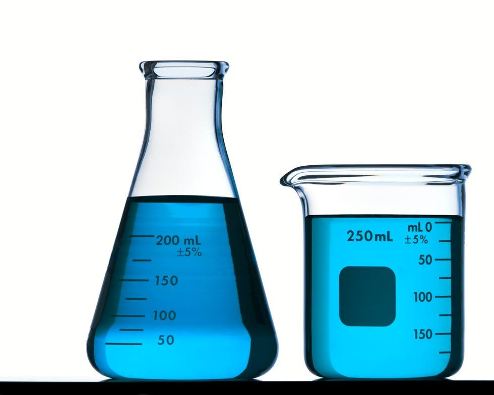

## Table of Contents

## What is volume in the context of measurement?

Volume is a way to measure how much space something takes up. Think of it like figuring out how much water a bucket can hold. If you fill the bucket completely, the amount of water it holds is its volume. Volume is important in many areas, like cooking, where you need to know how much of an ingredient to use, or in shipping, where you need to know how much space a package will take up.

In science, volume is often measured in units like liters or cubic meters. A liter is about the size of a large bottle of soda. To find the volume of a regular shape, like a cube or a box, you can use a simple formula. For a cube, you multiply the length of one side by itself twice (length × length × length). For other shapes, like cylinders or spheres, there are different formulas, but they all help you figure out how much space the shape occupies.

## How is volume different from other measurements like length and mass?

Volume is different from length and mass because it measures how much space an object takes up, while length measures how long something is, and mass measures how heavy something is. Imagine a box: its length tells you how long it is from one end to the other, its mass tells you how heavy it is, but its volume tells you how much stuff you can fit inside it. You can think of volume as the size of the space an object occupies.

Length is a one-dimensional measurement, meaning it only goes in one direction, like a straight line. Mass, on the other hand, is about the amount of matter in an object, and it's usually measured in grams or kilograms. Volume is a three-dimensional measurement because it considers length, width, and height all at once. So, while length and mass give you specific information about an object, [volume](/wiki/volume-trading-strategy) gives you a sense of its overall size and capacity.

## What are the basic units of volume in the metric system?

The basic unit of volume in the metric system is the liter. A liter is about the size of a large bottle of soda. It's used a lot in everyday life, like when you measure liquids in cooking or when you buy drinks at the store. One liter is equal to 1000 milliliters, so if you have a small bottle of water, it might be 500 milliliters, which is half a liter.

For smaller volumes, we use milliliters. A milliliter is very small, about the size of a single drop of water from an eyedropper. Milliliters are great for measuring tiny amounts, like medicine doses or small amounts of liquid in recipes. So, liters and milliliters are the main units of volume in the metric system, and they help us measure everything from big containers to tiny drops.

## How do you measure the volume of a regular solid, like a cube or a cylinder?

To measure the volume of a cube, you just need to know the length of one side. A cube has all sides the same length, so you can find the volume by multiplying the length of one side by itself, and then by itself again. For example, if each side of a cube is 3 centimeters long, you multiply 3 by 3 to get 9, and then multiply 9 by 3 to get 27. So, the volume of the cube is 27 cubic centimeters. It's like filling the cube with little cubes that are each 1 centimeter on each side, and counting how many you can fit inside.

For a cylinder, you need to know the radius of the circular base and the height of the cylinder. The radius is half the distance across the circle. Once you have the radius, you square it (multiply it by itself), and then multiply that number by the height of the cylinder and by pi (about 3.14). For example, if the radius of the base is 2 centimeters and the height is 5 centimeters, you square 2 to get 4, then multiply 4 by 3.14 to get about 12.56, and then multiply that by 5 to get about 62.8 cubic centimeters. This tells you how much space the cylinder takes up.

## What tools are commonly used to measure volume in a laboratory setting?

In a lab, people often use graduated cylinders to measure volume. A graduated cylinder looks like a tall, thin glass with lines on the side that show how much liquid is inside. You pour the liquid into the cylinder until it reaches the line that shows the volume you need. It's like using a measuring cup at home, but it's more precise. Graduated cylinders are great for measuring liquids because they are clear and have very accurate markings.

Another common tool is the beaker. Beakers are wider and shorter than graduated cylinders and also have lines on the side to show volume. They're good for mixing liquids or heating them up, but they're not as precise as graduated cylinders. If you need to measure very small volumes, you might use a pipette. A pipette is a small tool that sucks up a tiny amount of liquid, like a dropper. You can control exactly how much liquid you take up, which is useful for very accurate measurements in experiments.

## How can the volume of irregular objects be determined?

To find the volume of an irregular object, you can use a method called water displacement. This means you put the object in a container full of water and see how much the water level goes up. Imagine you have a rock that doesn't have a regular shape. You fill a graduated cylinder with water and note the level. Then, you carefully drop the rock into the water. The water level will rise because the rock takes up space. The difference between the new water level and the old water level is the volume of the rock.

This method works because the volume of the water pushed out of the way by the rock is equal to the volume of the rock itself. So, if the water level goes up by 50 milliliters when you put the rock in, then the volume of the rock is 50 milliliters. This is a simple way to measure the volume of things that aren't cubes or cylinders, like rocks, shells, or even your own hand. Just remember to be careful so you don't spill the water!

## What is the difference between volume and capacity?

Volume and capacity are related but a bit different. Volume is the amount of space something takes up. It's like how much room a toy car would need in a box. You can find the volume of anything, whether it's a solid, a liquid, or even a gas. For example, the volume of a cube is found by multiplying its length, width, and height.

Capacity, on the other hand, is about how much a container can hold. It's like how many cups of water a bucket can take before it's full. Capacity is usually used for containers and is measured in units like liters or gallons. So while volume is about the space an object occupies, capacity is about the maximum amount a container can contain.

## How does temperature affect the volume of a liquid or a gas?

When you heat up a liquid or a gas, its volume usually gets bigger. This happens because the heat makes the tiny particles inside the liquid or gas move around more. They start to spread out and take up more space. Imagine you have a balloon full of air. If you put the balloon near a warm heater, the air inside it will get warmer, and the balloon will get bigger because the air is expanding. The same thing happens with liquids, like when you heat up water in a pot and it starts to boil and bubble up.

For gases, this effect is even stronger. Gases can expand a lot when they get warmer because there's more room between their particles. Think about a can of spray paint. If you leave it in a hot car, the gas inside might make the can swell up or even explode because it's expanding so much. On the other hand, when you cool down a liquid or a gas, its volume gets smaller. The particles slow down and get closer together, taking up less space. So, temperature really changes how much space liquids and gases take up.

## What are the methods for calculating volume in three-dimensional space?

To calculate the volume of objects in three-dimensional space, you can use different methods depending on the shape of the object. For regular solids like cubes, rectangular prisms, cylinders, cones, and spheres, there are specific formulas. For a cube, you multiply the length of one side by itself twice (length × length × length). For a rectangular prism, you multiply its length, width, and height (length × width × height). A cylinder's volume is found by multiplying the area of its circular base (pi × radius × radius) by its height. For a cone, you use the same base area formula but multiply it by one-third of the height. And for a sphere, you multiply four-thirds by pi and the radius cubed (4/3 × pi × radius × radius × radius).

For irregular solids, you can use the water displacement method. This involves filling a container with a known volume of water, then gently placing the irregular object into the water. The increase in the water level shows the volume of the object. Imagine dropping a rock into a graduated cylinder full of water. The water level rises because the rock takes up space, and the difference between the new and old water levels is the rock's volume. This method is useful because it works for any shape, not just regular ones.

In some cases, you might use more advanced methods like integrating over a three-dimensional region if you're dealing with complex shapes. This is often done in mathematics and engineering to find the volume of objects with curved or irregular surfaces. But for most everyday situations, using the formulas for regular solids or the water displacement method for irregular ones will help you figure out the volume of almost anything you come across.

## How is volume measured in different scientific fields, such as chemistry and physics?

In chemistry, volume is often measured to understand how much of a substance is present or how much space a reaction takes up. Scientists in chemistry use tools like graduated cylinders, beakers, and pipettes to measure the volume of liquids. For example, when mixing chemicals, they need to know exactly how much of each liquid to use, so they use graduated cylinders because they have precise markings. If they're measuring gases, they might use a gas syringe, which is like a big syringe that can hold and measure the volume of gas. Volume in chemistry is usually measured in liters or milliliters, and understanding it helps chemists control and predict the outcomes of their experiments.

In physics, volume is important for studying how objects move and interact in space. Physicists measure volume to figure out things like density, which is how much mass is packed into a certain volume. They use formulas to calculate the volume of regular shapes like cubes, spheres, and cylinders. For irregular shapes, they might use water displacement, where an object is placed in water, and the increase in water level shows the object's volume. Physicists also study how volume changes with temperature and pressure, especially for gases, using concepts like the ideal gas law. This helps them understand how gases behave under different conditions, which is crucial for fields like thermodynamics and fluid dynamics.

## What are the advanced techniques for measuring volume, such as using lasers or tomography?

In some advanced fields, scientists use lasers to measure volume. They shoot a laser beam at an object and measure how the light bounces back. By doing this from different angles, they can create a 3D map of the object's shape. This method is called laser scanning or lidar, and it's super accurate. It's used in places like archaeology to map out ancient ruins or in manufacturing to check if parts are made correctly. The cool thing about lasers is they can measure things without touching them, which is helpful for delicate objects or when you need to measure something that's far away.

Another fancy way to measure volume is with tomography. This is like taking a bunch of X-ray pictures from different angles and then using a computer to put them all together into a 3D image. It's used a lot in medicine to look inside the body, like when you get a CT scan. But it's also used in other areas, like studying the insides of rocks or checking for flaws in materials. Tomography can show you the volume of things you can't see from the outside, which makes it really useful for understanding complex structures. Both laser scanning and tomography let scientists see and measure volumes in ways that are much more detailed than just using a ruler or a graduated cylinder.

## How do errors in volume measurement affect scientific experiments and industrial processes?

Errors in volume measurement can mess up scientific experiments and industrial processes a lot. In science, if you measure the wrong volume of a chemical, your experiment might not work right. For example, if you're trying to make a reaction happen, using too much or too little of a liquid can change the results. This can make your data wrong and lead to bad conclusions. In industry, like making medicine or food, measuring the wrong volume can mean the product isn't safe or doesn't work as it should. If a factory makes a batch of medicine with the wrong volume of ingredients, it could be harmful to people who use it.

These errors can also cost a lot of money and time. In a lab, if an experiment fails because of a volume mistake, scientists have to start over. This wastes time and resources. In industry, if a product has to be thrown away because of a volume error, it means money is lost. Companies might have to stop production to fix the problem, which can delay getting products to customers. So, it's really important to measure volume carefully to keep experiments and industrial processes running smoothly and safely.

## What is the role of Mathematics in Algorithmic Trading?

Algorithmic trading relies heavily on mathematical concepts to devise strategies that can predict and capitalize on market movements. Statistics, econometrics, and linear regression are foundational to these algorithms, providing the tools needed to analyze data and execute trades with minimal human intervention.

### Use of Statistics, Econometrics, and Linear Regression

Statistics is essential for analyzing and interpreting vast amounts of market data. Traders use statistical techniques to identify trends, correlations, and anomalies. Econometrics allows for the modeling of financial time series data and testing of economic theories regarding market behaviors.

Linear regression, a statistical method, is widely used within [algorithmic trading](/wiki/algorithmic-trading) to predict future values based on past data. It models the relationship between a dependent variable, often the future price of a security, and one or more independent variables, such as price history or volume data. The linear regression model is expressed as:

$$
y = \beta_0 + \beta_1x_1 + \beta_2x_2 + \cdots + \beta_nx_n + \epsilon
$$

where $y$ is the dependent variable, $x_1, x_2, \ldots, x_n$ are independent variables, $\beta_0$ is the intercept, $\beta_1, \beta_2, \ldots, \beta_n$ are the coefficients, and $\epsilon$ represents the error term.

Python's `scikit-learn` library offers tools for implementing linear regression models, enabling traders to backtest strategies efficiently.

```python
from sklearn.linear_model import LinearRegression
import numpy as np

# Example data
X = np.array([[1, 2], [2, 3], [3, 4], [4, 5]])  # Independent variables
y = np.array([2, 3, 4, 5])  # Dependent variable

# Create and fit the model
model = LinearRegression().fit(X, y)

# Predict future values
future_values = model.predict(np.array([[5, 6], [6, 7]]))
```

### Descriptive Statistics: Mean, Median, Mode

Descriptive [statistics](/wiki/bayesian-statistics) provides summary measures that describe the main features of a data set, which are critical in forming the foundation of more complex analyses. The mean, median, and mode serve various purposes:

- **Mean**: Provides the average value of a dataset and is used to assess market conditions and price levels.
- **Median**: Offers the middle value, which is particularly useful in identifying price thresholds when the data includes outliers.
- **Mode**: Indicates the most frequently occurring value, helping pinpoint common price levels within a dataset.

These statistics serve as the backbone for more sophisticated models and trading strategies. They are instrumental in data preprocessing and the development of predictive algorithms.

### Probability Theory and Market Trend Prediction

Probability theory enables traders to quantify the likelihood of future events based on historical data. In algorithmic trading, probability models are utilized to assess the risk and potential return of trades. Traders apply probability distributions, like normal distributions, to model price changes and assess the odds of different market outcomes.

Bayesian statistics, a subset of probability theory, appeals to traders for updating probabilities as more data becomes available. It helps refine trading strategies continuously, aligning them more closely with real-world conditions through posterior distributions reflecting both prior beliefs and new evidence.

Overall, mathematics is indispensable in algorithmic trading by enabling the conversion of market data into actionable insights. Whether through linear regression models predicting market behaviors or probability theory assessing the feasibility and risk of trades, these mathematical methods form the core framework upon which successful trading algorithms are built.

## What are Volume Algorithms and How Are They Implemented?

Volume algorithms are integral to algorithmic trading, leveraging mathematical techniques to optimize trade execution based on market volume dynamics. One prominent approach is the Volume Weighted Average Price (VWAP), which calculates the average price a security has traded at throughout the day, based on both volume and price. VWAP is commonly used as a trading benchmark by institutional investors to ensure they execute large orders closer to the average price, minimizing market impact.

The VWAP is calculated using the formula:

$$

\text{VWAP} = \frac{\sum (P_i \times Q_i)}{\sum Q_i} 
$$

where $P_i$ is the price of the trade, and $Q_i$ is the number of shares traded at that price.

VWAP's application in algorithmic trading involves designing algorithms that execute portions of a large order over time to match or beat the VWAP, thus reducing market impact and achieving better average prices. These algorithms are typically programmed to react dynamically to real-time trading volume data, ensuring execution strategies remain adaptable to current market conditions.

Another strategy, the Time Weighted Average Price (TWAP), spreads order execution evenly across a specified time period. Unlike VWAP, TWAP is ideal for executing trades in markets with low [liquidity](/wiki/liquidity-risk-premium) or during periods of minimal volume fluctuation. TWAP helps traders achieve an average price representative of the time period and is less sensitive to short-term market [volatility](/wiki/volatility-trading-strategies) than VWAP.

Implementation of these volume algorithms requires a robust technical infrastructure. Key components include access to high-frequency, real-time market data, and a trading platform equipped to handle the rapid execution and processing of transactions. Effective algo trading necessitates a seamless integration of software capable of processing complex algorithms, reliable data feeds, and execution platforms.

Hardware also plays a critical role, as the need for low latency processing to capitalize on pricing inefficiencies can influence trading outcomes. Consequently, firms may invest in advanced networking equipment and computing hardware to minimize delay in data transmission and order execution. Additionally, algorithmic trading systems often incorporate risk management protocols to monitor and mitigate potential execution risks dynamically.

With the continuous advancement of technology and increasing availability of big data analytics, volume algorithms are anticipated to evolve, offering more sophisticated strategies for traders aiming at optimized trade executions.

## References & Further Reading

[1]: Bergstra, J., Bardenet, R., Bengio, Y., & Kégl, B. (2011). ["Algorithms for Hyper-Parameter Optimization."](https://papers.nips.cc/paper/4443-algorithms-for-hyper-parameter-optimization) Advances in Neural Information Processing Systems 24.

[2]: ["Advances in Financial Machine Learning"](https://www.amazon.com/Advances-Financial-Machine-Learning-Marcos/dp/1119482089) by Marcos Lopez de Prado

[3]: ["Evidence-Based Technical Analysis: Applying the Scientific Method and Statistical Inference to Trading Signals"](https://www.amazon.com/Evidence-Based-Technical-Analysis-Scientific-Statistical/dp/0470008741) by David Aronson

[4]: ["Machine Learning for Algorithmic Trading"](https://github.com/stefan-jansen/machine-learning-for-trading) by Stefan Jansen

[5]: ["Quantitative Trading: How to Build Your Own Algorithmic Trading Business"](https://www.amazon.com/Quantitative-Trading-Build-Algorithmic-Business/dp/1119800064) by Ernest P. Chan

[6]: Glasserman, P. (2013). ["Monte Carlo Methods in Financial Engineering."](https://link.springer.com/book/10.1007/978-0-387-21617-1) Springer.

[7]: Black, F., & Scholes, M. (1973). ["The Pricing of Options and Corporate Liabilities."](https://www.cs.princeton.edu/courses/archive/fall09/cos323/papers/black_scholes73.pdf) Journal of Political Economy.