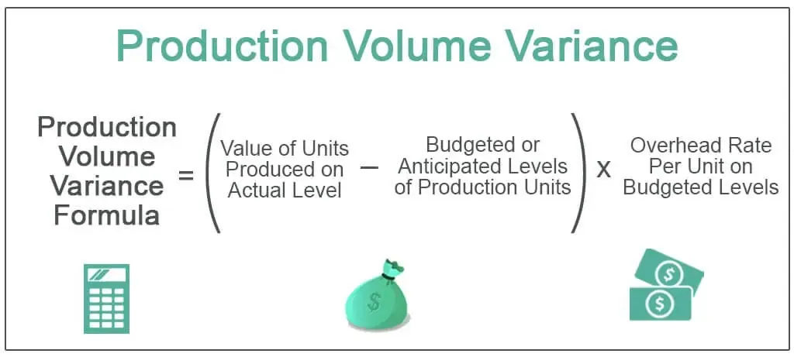

Algorithmic trading represents a profound transformation in the landscape of financial markets, where mathematical acumen and computational power converge to automate trading decisions. At the forefront of this evolution lies measurement mathematics, particularly the concept of trading volume, which is pivotal in crafting robust trading algorithms. Trading volume indicates the number of shares or contracts exchanged within a specific timeframe, offering insight into market activity and liquidity. This metric's significance extends beyond a solitary number; it provides essential context to price movements and helps identify market momentum or reversals.

Trade volume is integral to understanding supply and demand dynamics, as it often complements price data to assess the strength of a market trend. High volume in asset trading can signify robust market interest and ensure liquidity, reducing the slippage during transactions. As such, trading algorithms often incorporate volume data to predict price action more accurately and optimize entry and exit points.



The proliferation of algorithmic trading relies heavily on mathematical models and techniques to process vast amounts of market data efficiently. Algorithms execute trades at speeds and frequencies that surpass human capability, leveraging statistical, econometric, and probabilistic techniques to forecast market trends. By harnessing these mathematical foundations, algorithmic trading provides a systematic approach that reduces emotional biases prevalent in manual trading.

This article aims to scrutinize the essential mathematical structures underpinning volume-centric algorithmic trading strategies. By focusing on how measurement mathematics, particularly volume, intertwines with algorithmic mechanisms, we can better comprehend how these models function and evolve within the dynamic world of financial markets. Through exploring these intersections, we underscore the importance of mathematical precision and the necessity for individuals to deepen their quantitative skills for successful participation in algorithmic trading.

## Table of Contents

## Role of Volume in Trading

Trading volume is a fundamental concept in financial markets, serving as a vital indicator of market activity and liquidity. In essence, trading volume refers to the total quantity of shares or contracts traded for a particular security or across an entire market within a given period. It is a critical variable for traders and investors because it reflects the level of interest and activity in securities. When a security experiences high trading volume, it tends to indicate strong investor interest, potentially leading to significant price movements.

Volume acts as a barometer of market sentiment and a gauge of liquidity. Liquidity is essential for ensuring that transactions can occur smoothly without causing significant price changes. High trading volume typically suggests high liquidity, enabling traders to buy or sell large quantities of a security without causing substantial price fluctuations. Conversely, low trading volume can indicate insufficient liquidity, which may result in higher bid-ask spreads and difficulties in executing buy or sell orders at desired prices.

To better understand how [volume](/wiki/volume-trading-strategy) is used alongside price information, traders often analyze volume in conjunction with price changes. A key concept in this context is the idea that rising prices accompanied by increasing volume confirm a strong trend. On the other hand, if volume decreases while prices are rising, it may signal a weakening trend or potential reversal. Such analysis helps traders make informed decisions by providing insights into the strength or weakness of a market move.

Consider a scenario where a company releases a positive earnings report, and its stock price begins to rise. If this price increase is accompanied by a surge in trading volume, it signifies strong market acceptance of the news and suggests a sustained upward trend. Conversely, if the price rises but volume remains low, the move might lack conviction and could reverse quickly.

Volume analysis is also crucial in various trading strategies, such as [breakout](/wiki/breakout-trading) trading and technical analysis. In breakout trading, traders look for price movements through predefined levels (support or resistance) accompanied by increased volume, indicating a higher likelihood of sustained price movement. Similarly, technical analysts utilize volume alongside chart patterns and technical indicators to predict future price movements.

High volume events can have a significant impact on market activity. For instance, during earnings announcements, economic data releases, or geopolitical events, trading volume often spikes. Such situations can lead to increased [volatility](/wiki/volatility-trading-strategies), offering both opportunities and challenges for traders. Elevated volume during these times provides traders with clues about the market's reaction to new information and aids in the adjustment of trading strategies.

In conclusion, trading volume is a cornerstone of financial market analysis. By serving as an indicator of market activity and [liquidity](/wiki/liquidity-risk-premium), it enables traders to assess the strength of price movements, confirm trends, and make informed trading decisions. Its integration with price data and use in various trading strategies underscore its importance in the financial markets.

## Mathematics in Algorithmic Trading

Algorithmic trading relies heavily on mathematical concepts to devise strategies that can predict and capitalize on market movements. Statistics, econometrics, and linear regression are foundational to these algorithms, providing the tools needed to analyze data and execute trades with minimal human intervention.

### Use of Statistics, Econometrics, and Linear Regression

Statistics is essential for analyzing and interpreting vast amounts of market data. Traders use statistical techniques to identify trends, correlations, and anomalies. Econometrics allows for the modeling of financial time series data and testing of economic theories regarding market behaviors.

Linear regression, a statistical method, is widely used within [algorithmic trading](/wiki/algorithmic-trading) to predict future values based on past data. It models the relationship between a dependent variable, often the future price of a security, and one or more independent variables, such as price history or volume data. The linear regression model is expressed as:

$$
y = \beta_0 + \beta_1x_1 + \beta_2x_2 + \cdots + \beta_nx_n + \epsilon
$$

where $y$ is the dependent variable, $x_1, x_2, \ldots, x_n$ are independent variables, $\beta_0$ is the intercept, $\beta_1, \beta_2, \ldots, \beta_n$ are the coefficients, and $\epsilon$ represents the error term.

Python's `scikit-learn` library offers tools for implementing linear regression models, enabling traders to backtest strategies efficiently.

```python
from sklearn.linear_model import LinearRegression
import numpy as np

# Example data
X = np.array([[1, 2], [2, 3], [3, 4], [4, 5]])  # Independent variables
y = np.array([2, 3, 4, 5])  # Dependent variable

# Create and fit the model
model = LinearRegression().fit(X, y)

# Predict future values
future_values = model.predict(np.array([[5, 6], [6, 7]]))
```

### Descriptive Statistics: Mean, Median, Mode

Descriptive [statistics](/wiki/bayesian-statistics) provides summary measures that describe the main features of a data set, which are critical in forming the foundation of more complex analyses. The mean, median, and mode serve various purposes:

- **Mean**: Provides the average value of a dataset and is used to assess market conditions and price levels.
- **Median**: Offers the middle value, which is particularly useful in identifying price thresholds when the data includes outliers.
- **Mode**: Indicates the most frequently occurring value, helping pinpoint common price levels within a dataset.

These statistics serve as the backbone for more sophisticated models and trading strategies. They are instrumental in data preprocessing and the development of predictive algorithms.

### Probability Theory and Market Trend Prediction

Probability theory enables traders to quantify the likelihood of future events based on historical data. In algorithmic trading, probability models are utilized to assess the risk and potential return of trades. Traders apply probability distributions, like normal distributions, to model price changes and assess the odds of different market outcomes.

Bayesian statistics, a subset of probability theory, appeals to traders for updating probabilities as more data becomes available. It helps refine trading strategies continuously, aligning them more closely with real-world conditions through posterior distributions reflecting both prior beliefs and new evidence.

Overall, mathematics is indispensable in algorithmic trading by enabling the conversion of market data into actionable insights. Whether through linear regression models predicting market behaviors or probability theory assessing the feasibility and risk of trades, these mathematical methods form the core framework upon which successful trading algorithms are built.

## Mathematical Models and Techniques

Monte Carlo Simulation represents a critical tool in predicting market outcomes by utilizing randomness and statistical sampling to solve deterministic problems. This technique involves generating a large number of scenarios for possible future outcomes based on random variables. By applying probability distributions, Monte Carlo methods model the uncertainty and variability in financial markets, allowing traders to estimate the risk and potential profit of various trading strategies. For example, predicting the future price movement of a stock involves simulating price changes multiple times under different conditions, providing a comprehensive view of potential price paths. The method is frequently used to evaluate derivatives, assess risk, and optimize portfolios [Glasserman, P. (2013). Monte Carlo Methods in Financial Engineering. Springer].

Linear algebra, with its focus on matrices and vectors, is integral to trading algorithms. Trading strategies often rely on analyzing multi-dimensional data sets, where matrices and vectors facilitate complex calculations. Matrices can represent large datasets and relationships between different financial variables, while vectors help in the transformation of these data points. For example, in principal component analysis (PCA), a common technique for dimension reduction, linear algebra is used to identify the most significant features in a dataset, thereby informing trading decisions.

Calculus encompasses techniques for modeling and understanding continuous market changes, pivotal for dynamic trading strategies. Differentiation allows traders to determine rates of change, helping in the identification of trends and [momentum](/wiki/momentum). For instance, finding the derivative of a time series of stock prices can help pinpoint acceleration or deceleration in price changes. Integration, on the other hand, assists in computing total accumulated value over time, essential for assessing continuous growth in options pricing and compound interest calculations. Calculus-based models such as the Black-Scholes model employ differential equations to derive the theoretical value of options [Black, F., & Scholes, M. (1973). The Pricing of Options and Corporate Liabilities. Journal of Political Economy].

These mathematical models find numerous real-life applications within trading platforms and strategies. For instance, hedging strategies extensively use Monte Carlo simulations to value complex financial derivatives and manage risk. Quantitative trading systems employ linear algebra for signal processing and [backtesting](/wiki/backtesting) algorithms, allowing traders to refine their strategies based on historical data. Furthermore, stochastic calculus, an extension of traditional calculus, underpins models like the Bachelier and Black-Scholes-Merton models, which predict pricing and volatility in derivative markets. This integration of mathematical models into algorithmic frameworks enhances decision-making processes by providing quantitative insights that drive strategic trading maneuvers.

## Volume Algorithms and Their Implementation

Volume algorithms are integral to algorithmic trading, leveraging mathematical techniques to optimize trade execution based on market volume dynamics. One prominent approach is the Volume Weighted Average Price (VWAP), which calculates the average price a security has traded at throughout the day, based on both volume and price. VWAP is commonly used as a trading benchmark by institutional investors to ensure they execute large orders closer to the average price, minimizing market impact.

The VWAP is calculated using the formula:

$$

\text{VWAP} = \frac{\sum (P_i \times Q_i)}{\sum Q_i} 
$$

where $P_i$ is the price of the trade, and $Q_i$ is the number of shares traded at that price.

VWAP's application in algorithmic trading involves designing algorithms that execute portions of a large order over time to match or beat the VWAP, thus reducing market impact and achieving better average prices. These algorithms are typically programmed to react dynamically to real-time trading volume data, ensuring execution strategies remain adaptable to current market conditions.

Another strategy, the Time Weighted Average Price (TWAP), spreads order execution evenly across a specified time period. Unlike VWAP, TWAP is ideal for executing trades in markets with low liquidity or during periods of minimal volume fluctuation. TWAP helps traders achieve an average price representative of the time period and is less sensitive to short-term market volatility than VWAP.

Implementation of these volume algorithms requires a robust technical infrastructure. Key components include access to high-frequency, real-time market data, and a trading platform equipped to handle the rapid execution and processing of transactions. Effective algo trading necessitates a seamless integration of software capable of processing complex algorithms, reliable data feeds, and execution platforms.

Hardware also plays a critical role, as the need for low latency processing to capitalize on pricing inefficiencies can influence trading outcomes. Consequently, firms may invest in advanced networking equipment and computing hardware to minimize delay in data transmission and order execution. Additionally, algorithmic trading systems often incorporate risk management protocols to monitor and mitigate potential execution risks dynamically.

With the continuous advancement of technology and increasing availability of big data analytics, volume algorithms are anticipated to evolve, offering more sophisticated strategies for traders aiming at optimized trade executions.

## Risks and Challenges

Algorithmic trading has revolutionized financial markets, offering speed, efficiency, and precision that human traders cannot match. However, it also presents a unique set of risks and challenges that need to be addressed to ensure reliable and profitable trading systems.

One of the primary risks associated with algorithmic trading is technical failure. These failures can occur due to hardware malfunctions, software bugs, or network issues. Such failures can lead to incorrect order placements, execution delays, or complete system shutdowns, potentially causing significant financial losses. Preventing technical failures involves robust infrastructure design, regular maintenance, and employing redundancy systems to ensure uninterrupted operation.

Risk management strategies are crucial for minimizing potential losses in algorithmic trading. These strategies include the use of stop-loss orders, position sizing, and diversification across different assets and strategies. Algorithms can also incorporate dynamic risk management techniques that adjust risk exposure based on real-time market conditions. This adaptive approach helps mitigate risks associated with volatile market movements.

Another challenge is integrating complex mathematical models with trading platforms. Sophisticated models often require significant computational resources and complex data integration, which can complicate the implementation and execution processes. Ensuring seamless interaction between mathematical models and trading platforms requires careful design, testing, and optimization of both the algorithm and its supporting infrastructure.

Regular updates and continuous monitoring are essential to maintaining the effectiveness of volume-based algorithms. Markets are dynamic, and algorithms must adapt to evolving conditions to remain competitive. This requires ongoing analysis of algorithm performance, refining strategies, and updating models in response to new market data. Real-time monitoring tools, coupled with [machine learning](/wiki/machine-learning) techniques, can be utilized to automatically identify and correct anomalies or deviations in expected performance.

Python, for example, can be used to implement these risk management and monitoring strategies through libraries like NumPy, pandas, and scikit-learn. Python code can efficiently handle data processing and model updating tasks, integrating seamlessly with trading platforms:

```python
import pandas as pd
import numpy as np
from sklearn.linear_model import LinearRegression

# Sample dataset for demonstration
data = pd.DataFrame({
    'price': np.random.rand(100),
    'volume': np.random.rand(100)
})

# Risk management: calculate moving average as an indicator
data['moving_avg'] = data['price'].rolling(window=10).mean()

# Linear regression model as an example of integrating math models
X = data['volume'].values.reshape(-1, 1)
y = data['price'].values

model = LinearRegression()
model.fit(X, y)

# Monitoring: evaluating model performance
predicted = model.predict(X)
data['predicted'] = predicted

# Adjust strategy based on monitoring results
data['strategy_signal'] = np.where(data['price'] > data['moving_avg'], 'buy', 'hold')
```

In conclusion, while algorithmic trading offers numerous advantages, it requires careful management of technology-related risks and challenges. Implementing robust risk management protocols, ensuring smooth integration of complex models, and maintaining a vigilant approach to updates and monitoring are essential to achieving sustained success in this domain.

## Conclusion

Mathematics plays an indispensable role in the formulation of successful algorithmic trading strategies. Its application provides the necessary precision and systematic approaches that are crucial in navigating the complexities of the financial markets. Mathematical methods facilitate the translation of market dynamics into quantifiable models, allowing traders to systematically exploit inefficiencies and trends. The incorporation of statistical analysis, probability theory, and calculus into trading algorithms ensures that decisions are made on rigorous, data-driven foundations rather than intuition alone.

Trading volume, as a quantitative measure, highlights this dependency by signaling market activity levels, which are critical in identifying trends and potential reversals. Understanding and utilizing trading volume enable traders to assess market liquidity and enhance decision-making processes, thereby improving the performance of trading systems. Mathematical rigor supplements this by providing structured methodologies for analyzing volume data, such as calculating the Volume Weighted Average Price (VWAP).

For aspiring traders and professionals, gaining proficiency in quantitative skills is essential. Mastery of programming languages like Python, which is widely used in financial analysis for its robust libraries and simplicity, can greatly enhance one's capability to implement sophisticated trading models and algorithms. Various online courses and resources are available for those looking to expand their knowledge in this domain. Courses offered by institutes like Coursera and edX cover a range of topics from basic statistics to advanced machine learning applications in trading. Likewise, financial modeling certifications can provide comprehensive syllabi designed to cultivate the necessary skills for thriving in algorithmic trading environments.

In conclusion, as the landscape of trading continues to evolve with technological advancements, the fusion of mathematics and algorithmic trading becomes pivotal. By embracing this interdisciplinary approach, traders can achieve exceptional precision and efficiency in their strategies, positioning themselves advantageously within the competitive global markets. Further education and proficiency in these areas not only equip traders with the means to thrive but also ensure resilience and adaptability in ever-changing financial landscapes.

## References & Further Reading

[1]: Bergstra, J., Bardenet, R., Bengio, Y., & Kégl, B. (2011). ["Algorithms for Hyper-Parameter Optimization."](https://papers.nips.cc/paper/4443-algorithms-for-hyper-parameter-optimization) Advances in Neural Information Processing Systems 24.

[2]: ["Advances in Financial Machine Learning"](https://www.amazon.com/Advances-Financial-Machine-Learning-Marcos/dp/1119482089) by Marcos Lopez de Prado

[3]: ["Evidence-Based Technical Analysis: Applying the Scientific Method and Statistical Inference to Trading Signals"](https://www.amazon.com/Evidence-Based-Technical-Analysis-Scientific-Statistical/dp/0470008741) by David Aronson

[4]: ["Machine Learning for Algorithmic Trading"](https://github.com/stefan-jansen/machine-learning-for-trading) by Stefan Jansen

[5]: ["Quantitative Trading: How to Build Your Own Algorithmic Trading Business"](https://www.amazon.com/Quantitative-Trading-Build-Algorithmic-Business/dp/1119800064) by Ernest P. Chan

[6]: Glasserman, P. (2013). ["Monte Carlo Methods in Financial Engineering."](https://link.springer.com/book/10.1007/978-0-387-21617-1) Springer.

[7]: Black, F., & Scholes, M. (1973). ["The Pricing of Options and Corporate Liabilities."](https://www.cs.princeton.edu/courses/archive/fall09/cos323/papers/black_scholes73.pdf) Journal of Political Economy.