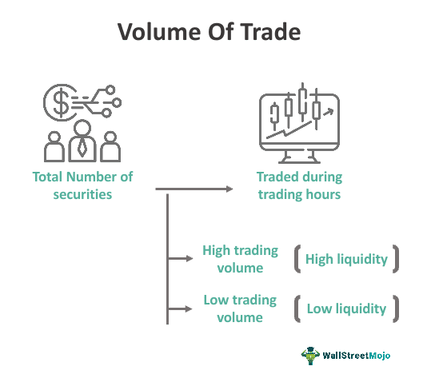

The world of trading is vast and complex, characterized by a myriad of influencing factors. This article seeks to explore these intricacies by examining various components like trading mechanisms, economic indicators, and algorithmic trading. At the core of trading, trade volume represents the total quantity of a security exchanged within a specific timeframe. It serves as a critical metric for assessing market liquidity and gauging investor interest. Furthermore, understanding how underlying systems process trades can enhance efficiency and maximize trading outcomes.

Economic indicators such as GDP, inflation rates, and unemployment figures significantly impact financial markets by offering insights into economic health and potential market movements. Traders harness these indicators for crafting informed strategies aimed at optimizing market opportunities. Additionally, algorithmic trading, which employs sophisticated computer programs to execute trades based on predefined criteria, is reshaping modern financial markets. Offering advantages such as speed, precision, and the elimination of emotional biases, algorithmic trading is becoming an indispensable tool for many traders.

As such, this article will explore trade volume's importance, the processing mechanisms that facilitate trades, and the influential role economic indicators play in shaping trading strategies. We'll also discuss how algorithmic trading is transforming market dynamics, offering new opportunities and challenges for traders navigating today's financial markets.

## Table of Contents

## Understanding Trade Volume

Trade volume represents the total quantity of a security, such as stocks or bonds, traded within a specific timeframe. This metric is fundamental for assessing both market liquidity and investor interest. Market liquidity refers to how easily assets can be bought or sold in the market without causing significant price changes. A high trade volume generally signifies a liquid market, where numerous buyers and sellers participate, allowing for smooth and efficient transactions.

Investor interest often escalates with increased trade volume. When trade volumes are high, it usually indicates strong market activity, driven either by significant news events, upcoming corporate actions, or broader economic shifts. This heightened activity level can lead to improved order execution, where transactions are completed more rapidly and at prices close to the market rate. Conversely, low trade volume can suggest a lack of investor interest or a more uncertain market environment, potentially leading to higher bid-ask spreads and less efficient trade executions.

Additionally, analyzing trade volume in conjunction with price movements can provide insights into potential market trends. For instance, increasing prices supported by rising volumes often indicate a robust upward trend, while decreasing prices with rising volumes may suggest a strong downward trend. Conversely, if price changes are not supported by corresponding volume changes, it might imply a weakening trend.

In [algorithmic trading](/wiki/algorithmic-trading), [volume](/wiki/volume-trading-strategy) data is often used to optimize trading strategies and execution algorithms. High-frequency trading systems may incorporate volume metrics to decide when to enter or [exit](/wiki/exit-strategy) positions, aiming to capitalize on favorable market conditions. Understanding trade volume is essential for traders and investors alike, affecting decisions ranging from immediate trade executions to long-term investment strategies.

## Trading Mechanisms Explained

Trading mechanisms are fundamental components of financial markets that enable the execution of trades between buyers and sellers. These mechanisms include market orders, limit orders, and stop orders, each of which serves distinct purposes and functions within the trading process. 

Market orders are executed immediately at the best available current price, prioritizing speed and certainty of execution over price. This type of order is typically used by traders who prioritize the [liquidity](/wiki/liquidity-risk-premium) and immediacy of their trades over achieving a specific price point. The main advantage of market orders is their ability to guarantee execution, albeit sometimes at a less favorable price in rapidly changing markets.

Limit orders, on the other hand, specify the maximum or minimum price at which a trader is willing to buy or sell a security. These orders will only be executed at the specified price or a more favorable one, giving traders control over the price, but not the timing, of execution. This mechanism is particularly useful in situations where a trader expects future price fluctuations and wants to cap the maximum buying price or set a minimum selling price.

Stop orders become market orders when a predefined trigger price is reached. These orders are often used as a risk management tool to limit potential losses or to lock in profits for existing positions. For example, a stop-loss order can protect a trader from significant downturns by automatically selling a security if it falls to a certain price. Conversely, a stop-buy order can be used to buy a security once it reaches a certain upward threshold, capitalizing on upward [momentum](/wiki/momentum).

The choice of trading mechanism can be heavily influenced by prevailing market conditions and individual trader objectives. For instance, in volatile markets, limit orders might be preferable to avoid the risk of executing at an undesirable price. Conversely, during periods of high liquidity and stability, market orders can be advantageous for their quick execution. Traders may also use a combination of these orders to execute more complex trading strategies, optimizing for both price and execution certainty according to their risk tolerance and market outlook.

Understanding how these trading mechanisms work and their respective advantages and limitations is crucial for both novice and experienced traders. This knowledge allows traders to make informed decisions on which order types best align with their trading goals and market conditions, ultimately playing a significant role in the efficiency of their trading strategies.

## Economic Indicators and Their Impact

Economic indicators play a crucial role in shaping the dynamics of financial markets. These indicators, which include Gross Domestic Product (GDP), inflation rates, and unemployment figures, provide insights into the overall economic health of a country and can significantly influence trading strategies.

GDP is one of the primary metrics for assessing an economy's performance. It represents the total value of all goods and services produced over a specific period and is used to gauge the size and growth rate of an economy. A rising GDP indicates economic expansion, which can lead to bullish market conditions as companies perform better and investor confidence increases. Conversely, a declining GDP often signals a contracting economy, which might result in bearish market trends due to decreased corporate earnings and investor apprehension.

Inflation rates measure the rate at which the general level of prices for goods and services rises, eroding purchasing power. Moderate inflation is typically seen as a sign of a growing economy. However, high inflation can lead to increased interest rates as central banks attempt to control price rises, which can reduce borrowing and spending. Such conditions might prompt traders to adjust their portfolios by shifting towards commodities or inflation-protected securities. In contrast, deflation, characterized by falling prices, may encourage traders to anticipate potential cuts in interest rates aimed at spurring economic activity.

Unemployment figures are another critical economic indicator as they reflect labor market strength and economic stability. High unemployment rates can indicate economic distress, leading to decreased consumer spending and reduced corporate profits. Traders often interpret rising unemployment as a signal of potential monetary policy interventions, such as [interest rate](/wiki/interest-rate-trading-strategies) cuts or quantitative easing, designed to boost economic activity. Low unemployment, on the other hand, suggests a robust economy but can also lead to inflationary pressures, prompting central banks to consider tightening monetary policies.

Traders frequently analyze these indicators to forecast market movements and adjust their strategies. For instance, an unexpected rise in unemployment might lead to a market decline as investor sentiment wanes. Alternatively, better-than-expected GDP growth can trigger a rally with increased buying activity. Understanding how these indicators affect the market is vital for making informed trading decisions and optimizing investment strategies.

## The Rise of Algorithmic Trading

Algorithmic trading, often referred to as algo trading, employs sophisticated computer programs to automate the execution of trades based on a set of predefined criteria. This method has revolutionized modern financial markets by significantly increasing the speed and efficiency of trading. One of the core advantages of algorithmic trading is its ability to execute orders at an exact speed and frequency that is impossible for a human trader. This results in precise execution, minimal transaction costs, and the mitigation of human errors and emotional biases that often accompany manual trading.

Algorithms can monitor multiple market conditions simultaneously, making rapid decisions based on complex mathematical models. These capabilities are essential for handling vast amounts of market data in real-time, thereby optimizing the timing and price at which trades are executed. 

Different algorithms cater to various trading strategies. Arbitrage algorithms, for example, exploit price differentials in different markets or financial instruments, thereby ensuring risk-free profit opportunities. These algorithms need to operate with high speed and reliability to capitalize on price disparities before they disappear.

Trend-following algorithms identify and trade in the direction of established market trends. By detecting patterns and trends across historical data, these algorithms make trading decisions that align with the prevailing direction of the market. 

Market making algorithms, on the other hand, provide liquidity to the market by continuously quoting buy and sell prices. These algorithms benefit from the bid-ask spread, executing trades that help stabilize market prices while [earning](/wiki/earning-announcement) modest profits on each transaction. 

Overall, algorithmic trading has become indispensable in the world of modern finance, offering key advantages that continue to reshape trading landscapes globally. The enhanced speed, accuracy, and emotion-free decision-making delivered by algorithmic trading make it a cornerstone of contemporary trading strategies.

## Volume Indicators in Algorithmic Trading

Volume indicators such as On-Balance Volume (OBV) and Volume Weighted Average Price (VWAP) play a crucial role in algorithmic trading by providing insights into the strength and direction of price movements. These indicators are instrumental in improving the precision of trading strategies, enabling algorithmic systems to make informed decisions based on quantitative data.

**On-Balance Volume (OBV)** is designed to measure buying and selling pressure as a cumulative indicator. It adds volume on up days and subtracts volume on down days, creating a continuous line that helps identify trends. The underlying principle of OBV is that volume precedes price movements. For instance, if a stock sees increasing OBV while the price is flat, it suggests accumulation, potentially foreshadowing a price increase. The OBV can be mathematically expressed as:

$$
OBV = OBV_{prev} + 
\begin{cases} 
V_t, & \text{if price}_{t} > \text{price}_{t-1} \\ 
-V_t, & \text{if price}_{t} < \text{price}_{t-1} \\ 
0, & \text{if price}_{t} = \text{price}_{t-1}
\end{cases}
$$

Where $OBV_{prev}$ is the OBV of the previous day, and $V_t$ is the volume on the current day.

**Volume Weighted Average Price (VWAP)**, on the other hand, serves as an important pricing benchmark. It reflects the average price a security has traded at throughout the day, based on both volume and price. VWAP is primarily used to assess whether the current price trend is higher or lower than the average trading price. A price above VWAP may be considered bullish, whereas a price below VWAP could be seen as bearish. VWAP is calculated using the formula:

$$
VWAP = \frac{\sum_{i=1}^{n} (P_i \times V_i)}{\sum_{i=1}^{n} V_i}
$$

Where $P_i$ is the price and $V_i$ is the volume for each trade.

By integrating volume indicators like OBV and VWAP, algorithmic trading systems can enhance their prediction capabilities and identify potential market trends more effectively. This inclusion allows traders to adjust their strategies based on observed patterns in volume, reducing reliance on price alone. The precision brought by these volume indicators assists in executing strategies that require swift adjustments in the face of changing market conditions, thereby improving the overall efficacy of algorithmic trading.

## Challenges and Considerations in Algo Trading

Algorithmic trading, while offering substantial benefits such as increased speed and precision in executing trades, comes with its own set of challenges and considerations. These challenges can have significant implications on the effectiveness and reliability of trading strategies and systems.

One major challenge is technical failure. Algorithms are highly dependent on the infrastructure supporting them, including hardware, software, and network connectivity. Any malfunction in these components can lead to incorrect trade executions or missed opportunities, potentially resulting in substantial financial losses. Therefore, maintaining a robust and fault-tolerant infrastructure is paramount. This includes redundant systems, regular stress testing, and failover protocols to mitigate the risk of outages and ensure trade continuity.

Overfitting is another critical concern in algorithmic trading. This occurs when an algorithm is too closely tailored to historical data and fails to generalize to new, unseen data. Overfitting can result in algorithms that appear highly effective during [backtesting](/wiki/backtesting) but perform poorly in live markets. To counteract this, traders need to implement cross-validation techniques and maintain separate datasets for training and testing algorithms. Additionally, incorporating [machine learning](/wiki/machine-learning) models with regularization techniques can help manage complexity and enhance model robustness.

Large-scale algorithmic transactions can also impact market dynamics. High-frequency trades executed in large volumes may lead to significant market movements, causing slippage and increased transaction costs. This necessitates careful consideration of trade size and execution timing to minimize market impact. Algorithm designers often incorporate strategies such as slicing large orders into smaller trades and using volume-weighted average price (VWAP) algorithms to distribute trades more evenly over time.

Continuous monitoring and optimization are essential for maintaining effective algorithmic trading systems. Market conditions are dynamic, requiring constant adaptation of algorithms to remain competitive. Regular performance evaluations, parameter adjustments, and strategy refinements are necessary to ensure algorithms operate efficiently in varying market environments. Moreover, implementing real-time monitoring systems can help quickly identify and rectify any discrepancies or inefficiencies in algorithm performance.

In conclusion, while algorithmic trading offers numerous benefits, addressing these challenges requires diligent infrastructure management, careful strategy design, and ongoing optimization. By tackling technical failures, balancing algorithm complexity, managing market impact, and maintaining adaptive systems, traders can harness the full potential of algorithmic trading while mitigating associated risks.

## Conclusion

Trade volumes, economic indicators, and algorithmic trading are pivotal components in the structure of modern financial markets. Mastery of these elements is essential for shaping informed and efficient trading strategies, fostering an environment where decisions are driven by quantitative analysis and comprehensive understanding.

Trade volume, a fundamental metric, serves as a measure of market liquidity and investor interest. High volumes often signify robust market activity and facilitate improved order execution—factors crucial for any trader aiming to optimize their market participation. The ability to read and interpret trade volumes can provide traders with valuable insights into market dynamics, enabling them to adjust strategies accordingly.

Economic indicators, such as Gross Domestic Product (GDP), inflation rates, and unemployment figures, significantly affect market movements and trader sentiments. These indicators offer a snapshot of economic health, serving as vital tools for traders to anticipate potential market trends and shifts. By staying informed about these data points, traders can navigate market [volatility](/wiki/volatility-trading-strategies) with increased precision.

Algorithmic trading has transformed the trading landscape by introducing speed, precision, and objectivity into trade executions. By deploying computer algorithms to execute predefined trade strategies, traders can minimize the emotional biases that often impede performance. Moreover, algorithmic trading accommodates various strategies, from [arbitrage](/wiki/arbitrage) to trend-following, broadening the scope for traders to capitalize on diverse market conditions.

The evolution of technology continues to redefine the trading ecosystem, presenting both opportunities and challenges for market participants. Advanced technologies offer tools that enhance trade execution and strategy formulation, yet they also demand robust infrastructures to mitigate risks associated with technical failures and market impacts. Consequently, traders must continuously adapt by embracing innovations while implementing safeguards against potential drawbacks.

As these elements continue to evolve, traders who adeptly leverage trade volumes, economic indicators, and algorithmic trading systems will find themselves in a better position to harness market opportunities. Embracing this triad will not only enhance trading efficiency but also ensure adaptability in an ever-changing financial landscape.

## References & Further Reading

[1]: Bergstra, J., Bardenet, R., Bengio, Y., & Kégl, B. (2011). ["Algorithms for Hyper-Parameter Optimization."](https://dl.acm.org/doi/10.5555/2986459.2986743) Advances in Neural Information Processing Systems 24.

[2]: ["Advances in Financial Machine Learning"](https://www.amazon.com/Advances-Financial-Machine-Learning-Marcos/dp/1119482089) by Marcos Lopez de Prado

[3]: ["Evidence-Based Technical Analysis: Applying the Scientific Method and Statistical Inference to Trading Signals"](https://www.amazon.com/Evidence-Based-Technical-Analysis-Scientific-Statistical/dp/0470008741) by David Aronson

[4]: ["Machine Learning for Algorithmic Trading"](https://github.com/stefan-jansen/machine-learning-for-trading) by Stefan Jansen

[5]: ["Quantitative Trading: How to Build Your Own Algorithmic Trading Business"](https://www.amazon.com/Quantitative-Trading-Build-Algorithmic-Business/dp/1119800064) by Ernest P. Chan