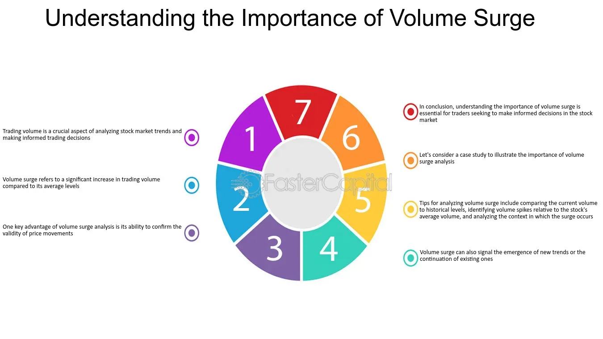

## Table of Contents

## What is the volume of trade?

The volume of trade refers to the total number of shares, contracts, or units of a particular security that are bought and sold within a specific time period, usually a day. It is an important measure used by investors and analysts to gauge the market's activity and the interest in a particular stock or asset. High trading volume often indicates strong interest and can lead to significant price movements, while low volume might suggest less interest or stability in the price.

Understanding the volume of trade can help investors make better decisions. For example, if a stock has a sudden increase in trading volume, it might mean that something important has happened, like a company announcement or a change in market conditions. By looking at the volume, investors can decide if it's a good time to buy or sell. It's a useful tool that, when combined with other data, can give a clearer picture of what's happening in the market.

## Why is the volume of trade important in economics?

The volume of trade is important in economics because it shows how much buying and selling is happening in the market. It helps economists and investors understand how active the market is. If a lot of trading is happening, it means the market is busy and there is a lot of interest in the stocks or assets being traded. On the other hand, if the volume of trade is low, it might mean that people are not very interested or that the market is not very active.

This information is useful for making decisions about buying or selling stocks. For example, if a stock suddenly has a high [volume](/wiki/volume-trading-strategy) of trade, it might mean that something important has happened, like a company making a big announcement or a change in the economy. By looking at the volume of trade, people can get a better idea of what is happening in the market and decide if it's a good time to buy or sell. It's like a tool that helps people see the health and activity of the market, making it easier to make smart choices.

## How is the volume of trade measured?

The volume of trade is measured by counting the total number of shares, contracts, or units of a security that are bought and sold in a specific time period, usually a day. This count is done for each stock or asset on a stock exchange or market. For example, if 100 shares of a company's stock are bought and sold during a day, the volume of trade for that stock on that day is 100 shares.

This measurement is important because it shows how active the market is. When a lot of shares are being traded, it means there is a lot of interest in that stock. On the other hand, if only a few shares are traded, it might mean that people are not very interested in that stock at the moment. Stock exchanges and financial websites report these numbers every day, so people can see how much trading is happening and make better decisions about buying or selling stocks.

## What are the different types of trade volumes?

There are a few different types of trade volumes that people talk about in the stock market. The first one is daily trading volume. This is the total number of shares or units of a stock that are bought and sold in one day. It's a good way to see how busy the market is for that stock on any given day. Another type is average daily trading volume. This is the average number of shares traded over a longer period, like a month or a year. It helps people understand what the normal level of trading is for a stock, so they can see if the current daily volume is high or low compared to usual.

There's also block trading volume. This is when big investors buy or sell a large number of shares at once, usually more than 10,000 shares. These big trades can affect the stock price a lot, so it's important to know about them. Lastly, there's the total trading volume for a market or an exchange. This is the sum of all the shares traded across all the stocks in that market in a day. It gives a big picture of how active the whole market is. Understanding these different types of trade volumes can help people make better decisions about buying and selling stocks.

## How does the volume of trade affect market trends?

The volume of trade can have a big impact on market trends. When a lot of shares of a stock are being bought and sold, it means there is a lot of interest in that stock. This high volume can push the stock price up because more people want to buy it. On the other hand, if the volume is low, it might mean that people are not very interested in the stock, and the price might stay the same or even go down. So, by looking at the volume of trade, people can get a good idea of whether a stock is likely to go up or down in price.

Another way the volume of trade affects market trends is by showing big changes in the market. If the volume suddenly goes up a lot, it could mean that something important has happened, like a company making a big announcement or news about the economy. This can start a trend where the stock price moves a lot in one direction. For example, if a company says it made more money than expected, the volume might go up as more people want to buy the stock, and the price might go up too. By watching the volume, investors can see these trends starting and decide if they want to buy or sell their stocks.

## What role does the volume of trade play in stock market analysis?

The volume of trade is a very important part of stock market analysis. It helps people see how active the market is for a certain stock. When a lot of shares are being bought and sold, it means there is a lot of interest in that stock. This can tell investors if the price of the stock might go up or down. For example, if the volume goes up a lot suddenly, it might mean that something important happened, like a company announcement. By looking at the volume, people can make better guesses about where the stock price might be going next.

Another way the volume of trade helps in stock market analysis is by showing how strong a price movement is. If a stock's price goes up and the volume is high, it means that a lot of people are buying the stock, so the price increase is probably strong and might keep going. But if the price goes up and the volume is low, it might mean that not many people are interested, and the price might not keep going up. So, by looking at both the price and the volume, people can get a better idea of what might happen with the stock in the future.

## How do economic policies influence the volume of trade?

Economic policies can have a big impact on the volume of trade. When governments make rules about taxes, interest rates, or trade agreements, it can change how much people want to buy and sell stocks. For example, if the government lowers taxes on investing, more people might start buying and selling stocks, which would increase the volume of trade. On the other hand, if the government makes new rules that make investing more expensive or harder, fewer people might trade, and the volume could go down.

Another way economic policies affect the volume of trade is through interest rates. When the central bank changes interest rates, it can change how much money people have to invest. If interest rates go down, borrowing money becomes cheaper, and people might buy more stocks, leading to higher trading volumes. But if interest rates go up, borrowing money becomes more expensive, and people might trade less, causing the volume of trade to drop. So, by changing these policies, governments and central banks can influence how active the stock market is.

## What are the global factors affecting the volume of trade?

Global factors can really change how much people buy and sell stocks around the world. One big [factor](/wiki/factor-investing) is what's happening in the world economy. If the economy is doing well, people might feel more confident about investing, and the volume of trade can go up. But if there's a global economic problem, like a recession, people might be scared to invest, and the volume of trade can drop. Another factor is what's going on with different countries' money. If one country's money gets stronger compared to another, it can make their stocks more or less attractive to people from other countries, which can change the volume of trade.

Another important global factor is what's happening with politics and trade between countries. If countries make new trade deals or change their trade rules, it can affect how much people want to invest in stocks from those countries. For example, if two countries start trading more with each other, it might make their stocks more popular, and the volume of trade could go up. But if countries start fighting over trade and put up barriers, it might make people less interested in investing, and the volume of trade could go down. So, what's happening around the world can really influence how active the stock market is.

## How can high-frequency trading impact the volume of trade?

High-frequency trading can make the volume of trade go up a lot. This is because high-frequency traders use computers to buy and sell stocks very quickly, sometimes in just a few seconds. They do this many times a day, which means they are making a lot of trades. All these quick trades add up, so the total number of shares being bought and sold each day can be much higher than it would be without high-frequency trading.

But high-frequency trading can also make the market seem busier than it really is. Sometimes, these traders are just buying and selling the same stocks back and forth without actually changing who owns the stocks in the end. This can make it look like there is a lot of interest in a stock when really, it's just the same shares being traded over and over. So, while high-frequency trading can increase the volume of trade, it's important to understand that not all of this volume means real interest in the stock.

## What are the technological tools used to monitor and analyze trade volumes?

People use special computer programs and software to keep track of how many shares are being bought and sold. These tools can show the number of trades happening in real-time, so people can see what's going on in the market right away. Some popular software includes Bloomberg Terminal, which gives detailed information about trading volumes, and trading platforms like MetaTrader, which help people see how active the market is for different stocks. These tools can also make charts and graphs to help people understand the data better.

Another important tool is [algorithmic trading](/wiki/algorithmic-trading) software. This kind of software uses math to decide when to buy or sell stocks based on the volume of trade. It can help people make quick decisions and find good times to trade. There are also special websites and apps that show trading volumes, like Yahoo Finance and Google Finance. These tools are easy to use and can help anyone who wants to keep an eye on the market, even if they're not experts. By using these technological tools, people can get a better understanding of how busy the market is and make smarter choices about buying and selling stocks.

## How does the volume of trade correlate with economic indicators like GDP?

The volume of trade can tell us a lot about how the economy is doing. When people buy and sell a lot of stocks, it usually means they feel good about the economy. This can be a sign that the Gross Domestic Product (GDP) might go up because more trading means more economic activity. GDP is a way to measure how much a country produces, so if people are trading more, it can mean that businesses are doing well and the economy is growing. On the other hand, if the volume of trade goes down, it might mean people are worried about the economy, and this could lead to a lower GDP.

Another way the volume of trade can relate to GDP is through how much money people are willing to invest. When the economy is doing well, people often have more money to spend on stocks, which increases the volume of trade. This extra money can also be used to start new businesses or expand existing ones, which helps to grow the GDP. So, by looking at the volume of trade, we can get clues about how the economy is doing and whether the GDP might go up or down.

## What advanced statistical methods are used to predict future trade volumes?

People use fancy math methods to guess how much buying and selling will happen in the future. One way they do this is by using something called time series analysis. This is when they look at the numbers of how many shares were traded in the past and try to find patterns. They can use these patterns to make a guess about what might happen next. Another method is called regression analysis, where they look at how trade volumes change with other things like the economy or stock prices. By understanding these relationships, they can make better predictions about future trade volumes.

Another important method is [machine learning](/wiki/machine-learning). This is when computers learn from past data to make guesses about the future. They can look at a lot of different information all at once, like news, economic reports, and past trading volumes, to find out what might affect future trades. Machine learning can be really good at finding small patterns that people might miss. By using these advanced statistical methods, people can get a better idea of what might happen with trade volumes in the future, which can help them make smarter choices about buying and selling stocks.

## What are Volume Indicators in Algorithmic Trading?

Volume indicators such as On-Balance Volume (OBV) and Volume Weighted Average Price (VWAP) play a crucial role in algorithmic trading by providing insights into the strength and direction of price movements. These indicators are instrumental in improving the precision of trading strategies, enabling algorithmic systems to make informed decisions based on quantitative data.

**On-Balance Volume (OBV)** is designed to measure buying and selling pressure as a cumulative indicator. It adds volume on up days and subtracts volume on down days, creating a continuous line that helps identify trends. The underlying principle of OBV is that volume precedes price movements. For instance, if a stock sees increasing OBV while the price is flat, it suggests accumulation, potentially foreshadowing a price increase. The OBV can be mathematically expressed as:

$$
OBV = OBV_{prev} + 
\begin{cases} 
V_t, & \text{if price}_{t} > \text{price}_{t-1} \\ 
-V_t, & \text{if price}_{t} < \text{price}_{t-1} \\ 
0, & \text{if price}_{t} = \text{price}_{t-1}
\end{cases}
$$

Where $OBV_{prev}$ is the OBV of the previous day, and $V_t$ is the volume on the current day.

**Volume Weighted Average Price (VWAP)**, on the other hand, serves as an important pricing benchmark. It reflects the average price a security has traded at throughout the day, based on both volume and price. VWAP is primarily used to assess whether the current price trend is higher or lower than the average trading price. A price above VWAP may be considered bullish, whereas a price below VWAP could be seen as bearish. VWAP is calculated using the formula:

$$
VWAP = \frac{\sum_{i=1}^{n} (P_i \times V_i)}{\sum_{i=1}^{n} V_i}
$$

Where $P_i$ is the price and $V_i$ is the volume for each trade.

By integrating volume indicators like OBV and VWAP, algorithmic trading systems can enhance their prediction capabilities and identify potential market trends more effectively. This inclusion allows traders to adjust their strategies based on observed patterns in volume, reducing reliance on price alone. The precision brought by these volume indicators assists in executing strategies that require swift adjustments in the face of changing market conditions, thereby improving the overall efficacy of algorithmic trading.

## References & Further Reading

[1]: Bergstra, J., Bardenet, R., Bengio, Y., & Kégl, B. (2011). ["Algorithms for Hyper-Parameter Optimization."](https://dl.acm.org/doi/10.5555/2986459.2986743) Advances in Neural Information Processing Systems 24.

[2]: ["Advances in Financial Machine Learning"](https://www.amazon.com/Advances-Financial-Machine-Learning-Marcos/dp/1119482089) by Marcos Lopez de Prado

[3]: ["Evidence-Based Technical Analysis: Applying the Scientific Method and Statistical Inference to Trading Signals"](https://www.amazon.com/Evidence-Based-Technical-Analysis-Scientific-Statistical/dp/0470008741) by David Aronson

[4]: ["Machine Learning for Algorithmic Trading"](https://github.com/stefan-jansen/machine-learning-for-trading) by Stefan Jansen

[5]: ["Quantitative Trading: How to Build Your Own Algorithmic Trading Business"](https://www.amazon.com/Quantitative-Trading-Build-Algorithmic-Business/dp/1119800064) by Ernest P. Chan