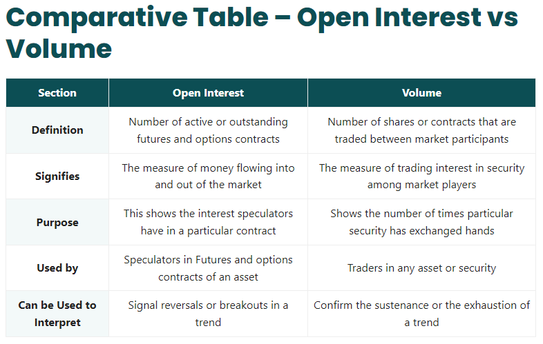

## Table of Contents

## What is volume in the context of financial markets?

In financial markets, volume refers to the number of shares or contracts traded in a security or market during a given period, usually a day. It is an important measure because it shows how active the market is. When volume is high, it means many people are buying and selling, which can indicate strong interest in that security. On the other hand, low volume might mean fewer people are interested, and the market might be less active.

Volume can also give clues about future price movements. For example, if a stock's price goes up and the volume is high, it might mean the price increase is strong and likely to continue. But if the price goes up with low volume, it might not be as reliable, and the price could fall back down. Traders and investors watch volume to help them make decisions about when to buy or sell.

## What is open interest in the context of financial markets?

Open interest is a term used in the financial markets to describe the total number of outstanding derivative contracts, like futures or options, that have not been settled. For example, if someone buys an option to buy a stock in the future, that option adds to the open interest until it is either exercised or expires.

Open interest is different from trading volume. While volume shows how many contracts were traded in a day, open interest shows how many contracts are still active. Traders look at open interest to understand the liquidity and interest in a market. If open interest is going up, it means more people are getting involved in that market, which can make it easier to buy or sell contracts. If open interest is going down, it might mean people are losing interest, and it could be harder to trade.

## How is volume calculated in trading?

Volume in trading is the total number of shares or contracts that are bought and sold in a day. It's a simple count of how many times a stock or other security changes hands. For example, if someone buys 100 shares of a company and someone else sells those 100 shares, that counts as 100 shares in the volume for that day.

You can find the volume for a stock on most financial websites or trading platforms. It's usually shown as a number next to the stock's price. If the volume is high, it means a lot of people are trading that stock, which can show that it's popular or that something important is happening with the company. If the volume is low, fewer people are trading, and the stock might not be as interesting to investors at that time.

## How is open interest calculated in trading?

Open interest is the total number of futures or options contracts that are still open, meaning they haven't been closed or settled yet. It's counted by looking at all the new contracts that were made that day and subtracting all the contracts that were closed. If someone buys a new futures contract, open interest goes up by one. If someone sells a contract they already own to close it, open interest goes down by one.

You can find open interest numbers on trading platforms or financial websites. They usually show it next to the price and volume of the futures or options. Watching open interest can help traders understand how popular a market is. If open interest is going up, more people are getting involved, which can make it easier to trade. If it's going down, fewer people might be interested, and it could be harder to buy or sell contracts.

## What does high volume indicate about a market?

High volume in a market means a lot of people are buying and selling. It shows that the market is active and that many traders are interested in that stock or security. When volume is high, it can mean that something important is happening, like news about the company or changes in the economy. It can also mean that the price of the stock might keep moving in the same direction because so many people are trading.

Traders watch high volume because it can give them clues about what might happen next. If a stock's price goes up and the volume is high, it might mean the price increase is strong and likely to continue. This is because many people are buying, which can push the price up even more. On the other hand, if the price goes down with high volume, it might mean the price drop is strong and likely to keep going because many people are selling.

## What does high open interest indicate about a market?

High open interest means that a lot of people are holding onto futures or options contracts and haven't closed them yet. It shows that many traders are interested in that market and are willing to bet on what might happen in the future. When open interest is high, it can mean that the market is popular and that there's a lot of money and attention focused on it.

Traders look at high open interest because it can help them understand how easy it might be to trade in that market. If open interest is high, it usually means there's more liquidity, which means it's easier to buy or sell contracts without affecting the price too much. This can make the market more attractive to traders because they can get in and out of trades more easily.

## How do volume and open interest differ in their impact on market analysis?

Volume and open interest are both important for understanding what's happening in the market, but they show different things. Volume is the total number of shares or contracts that were traded in a day. It tells you how active the market was and can give clues about how strong a price move might be. If a lot of people are buying or selling, it can mean that the price is likely to keep moving in that direction. Traders watch volume to see if a price change is backed by a lot of interest or if it might just be a short-term thing.

Open interest, on the other hand, is about how many futures or options contracts are still open and haven't been settled yet. It shows how many people are still betting on what might happen in the future. High open interest can mean that a market is popular and has a lot of money and attention on it. It can also make it easier to trade because more people are involved, which means there's more liquidity. Traders use open interest to understand how easy it might be to buy or sell contracts and to see if interest in the market is growing or shrinking.

## Can volume and open interest be used together to predict market trends?

Yes, volume and open interest can be used together to help predict market trends. When both volume and open interest are going up, it means more people are getting involved in the market. This can be a sign that a trend is strong and likely to continue. For example, if a stock's price is going up and both volume and open interest are high, it might mean that the price will keep going up because a lot of people are buying and betting on the future.

On the other hand, if volume is high but open interest is going down, it could mean that people are closing their positions and losing interest. This might be a warning sign that the trend could be weakening. By looking at both volume and open interest, traders can get a better picture of what might happen next in the market. It helps them make smarter decisions about when to buy or sell.

## What are the common misconceptions about volume and open interest?

One common misconception about volume is that it always predicts future price movements. People sometimes think that if a stock has high volume, its price will definitely keep going up or down. But volume just shows how many people are trading, not what will happen next. It's a clue, not a promise. Volume can help understand if a price move is strong, but it's not the only thing to look at.

Another misconception is about open interest. Some people believe that high open interest always means a market is going to get more popular and prices will go up. But open interest just shows how many people are still holding onto contracts. It doesn't predict if prices will go up or down. High open interest can make it easier to trade because more people are involved, but it doesn't tell you what will happen to prices.

Using volume and open interest together can help understand the market better, but they don't give all the answers. They are tools that traders use along with other information to make decisions. It's important to look at the whole picture, not just one part of it.

## How do changes in volume and open interest affect option pricing?

Changes in volume can affect option pricing because they show how many people are trading. When volume is high, it means a lot of people are buying and selling options. This can make the price of the option go up because more people want to trade it. On the other hand, if volume is low, fewer people are interested, and it might be harder to find someone to buy or sell the option. This can make the price go down because there's less demand. Traders look at volume to see if an option is popular and to guess if the price might keep moving in the same direction.

Changes in open interest also affect option pricing. Open interest shows how many people are still holding onto options and haven't closed them yet. If open interest is going up, it means more people are getting involved and betting on the future. This can make the option price go up because more people want to trade it. But if open interest is going down, it might mean people are losing interest and closing their positions. This can make the option price go down because fewer people want to trade it. Traders use open interest to understand how easy it might be to buy or sell an option and to see if the market is getting more or less popular.

## What advanced techniques can traders use to analyze volume and open interest data?

Traders can use a technique called volume analysis to look at how much trading is happening and when. They can use charts to see if the volume is going up or down and compare it to the price of the stock or option. For example, if the price goes up and the volume is high, it might mean the price move is strong. Traders can also use tools like volume-weighted average price (VWAP) to see the average price at which a stock was traded, which can help them decide when to buy or sell. By looking at volume over time, traders can spot patterns and make better guesses about what might happen next.

Another advanced technique is open interest analysis. Traders can look at open interest numbers to see how many people are still betting on the future of a stock or option. If open interest is going up, it means more people are getting involved, which can make the market more liquid and easier to trade. Traders can also use charts to compare open interest with price and volume to see if there are any patterns. For example, if open interest and volume are both going up when the price is going up, it might mean the trend is strong. By looking at open interest over time, traders can get a better idea of how popular a market is and make smarter trading decisions.

## How do volume and open interest data influence algorithmic trading strategies?

Volume and open interest data are important for algorithmic trading strategies because they help computers make smart choices about when to buy or sell. Algorithms can look at volume to see how many people are trading a stock or option. If the volume is high, it means a lot of people are interested, and the price might keep moving in the same direction. Algorithms can use this information to decide if they should buy or sell at that time. They can also use volume-weighted average price (VWAP) to find the best times to trade without moving the price too much.

Open interest is also important for algorithmic trading. It shows how many people are still holding onto futures or options contracts. If open interest is going up, it means more people are getting involved, and the market might be easier to trade. Algorithms can use this information to see if a market is getting more popular and if it's a good time to make a trade. By looking at both volume and open interest, algorithms can make better guesses about what might happen next and adjust their trading strategies to make more money.

## What is Understanding Open Interest?

Open interest refers to the total number of outstanding contracts in the options and futures markets that are still open and have not yet been settled. This measure is crucial for understanding the level of activity and participation within these financial markets. 

The value of open interest increases when new contracts are opened and not immediately closed. Conversely, it decreases when contracts are closed out, either through settlement or offsetting trades. To further elucidate, consider open interest as a balance between market participants holding long positions (buyers) and those holding short positions (sellers). Whenever a new buyer and a new seller create a contract, the open interest increases by one unit. On the other hand, if an existing holder of a long position sells the contract to an existing holder of a short position, open interest decreases by one unit.

This metric is widely used to gauge market sentiment and predict future price movements. For instance, an increase in open interest, when accompanied by rising prices, often signals a continuation of a current upward trend, indicating strong bullish sentiment. Conversely, if open interest rises while prices decline, it might suggest that a downward trend could persist, reflecting bearish sentiment.

Mathematically, open interest ($OI$) can be understood through a simple equation that accounts for the daily changes:

$$
OI_{t} = OI_{t-1} + C_{new} - C_{closed}
$$

Where:
- $OI_{t}$ is the open interest at the current time period.
- $OI_{t-1}$ is the open interest from the previous time period.
- $C_{new}$ represents the number of new contracts created.
- $C_{closed}$ represents the number of contracts closed.

Traders and analysts closely monitor changes in open interest alongside price action to assess the strength or weakness of a trend. A rising open interest with an associated price increase denotes a confirmation of an upward trend, while a declining open interest might signal trend exhaustion or a forthcoming reversal. Understanding open interest is essential for traders seeking to comprehend the complexities of market dynamics and to forecast potential market movements effectively.

## References & Further Reading

[1]: Lopez de Prado, M. (2018). ["Advances in Financial Machine Learning."](https://www.amazon.com/Advances-Financial-Machine-Learning-Marcos/dp/1119482089) Wiley.

[2]: Aronson, D. R. (2007). ["Evidence-Based Technical Analysis: Applying the Scientific Method and Statistical Inference to Trading Signals."](https://www.amazon.com/Evidence-Based-Technical-Analysis-Scientific-Statistical/dp/0470008741) Wiley.

[3]: Jansen, S. (2018). ["Machine Learning for Algorithmic Trading."](https://github.com/stefan-jansen/machine-learning-for-trading) Packt Publishing.

[4]: Chan, E. P. (2009). ["Quantitative Trading: How to Build Your Own Algorithmic Trading Business."](https://github.com/ftvision/quant_trading_echan_book) Wiley.

[5]: Hull, J. C. (2014). ["Options, Futures, and Other Derivatives."](https://books.google.com/books/about/Options_Futures_and_Other_Derivatives_eB.html?id=2iopDwAAQBAJ) Pearson.