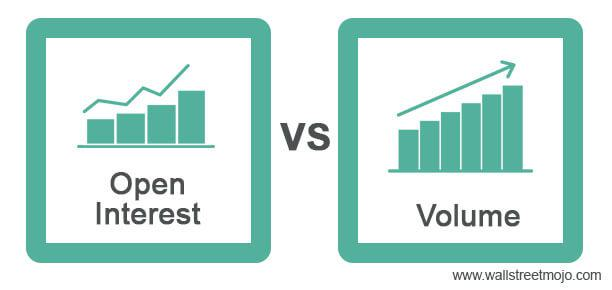

Understanding key metrics such as open interest and volume is crucial for successful trading in financial markets. These indicators provide vital insights into market activity, sentiment, and liquidity, helping traders make more informed decisions. Open interest refers to the total number of open contracts in the options and futures markets that have not yet been settled, reflecting the strength of market trends. Volume, on the other hand, measures the total number of contracts traded within a specific period, serving as an indicator of market liquidity and interest.

Traders rely on these metrics to gauge market dynamics and assess potential trading opportunities. High open interest alongside rising volume typically signifies robust market activity and can indicate the continuation of a trend. Conversely, low volume and declining open interest might suggest market consolidation or the weakening of a trend. 



Moreover, the advancement of technology has enabled the incorporation of algorithmic trading strategies that analyze open interest and volume to optimize trading performance and manage risk. Algorithms can identify potential entry and exit points based on these parameters, providing traders with sophisticated tools to navigate the financial landscape. As algorithmic trading continues to evolve, the role of open interest and volume data becomes increasingly significant in the development of trading strategies.

## Table of Contents

## Understanding Open Interest

Open interest refers to the total number of outstanding contracts in the options and futures markets that are still open and have not yet been settled. This measure is crucial for understanding the level of activity and participation within these financial markets. 

The value of open interest increases when new contracts are opened and not immediately closed. Conversely, it decreases when contracts are closed out, either through settlement or offsetting trades. To further elucidate, consider open interest as a balance between market participants holding long positions (buyers) and those holding short positions (sellers). Whenever a new buyer and a new seller create a contract, the open interest increases by one unit. On the other hand, if an existing holder of a long position sells the contract to an existing holder of a short position, open interest decreases by one unit.

This metric is widely used to gauge market sentiment and predict future price movements. For instance, an increase in open interest, when accompanied by rising prices, often signals a continuation of a current upward trend, indicating strong bullish sentiment. Conversely, if open interest rises while prices decline, it might suggest that a downward trend could persist, reflecting bearish sentiment.

Mathematically, open interest ($OI$) can be understood through a simple equation that accounts for the daily changes:

$$
OI_{t} = OI_{t-1} + C_{new} - C_{closed}
$$

Where:
- $OI_{t}$ is the open interest at the current time period.
- $OI_{t-1}$ is the open interest from the previous time period.
- $C_{new}$ represents the number of new contracts created.
- $C_{closed}$ represents the number of contracts closed.

Traders and analysts closely monitor changes in open interest alongside price action to assess the strength or weakness of a trend. A rising open interest with an associated price increase denotes a confirmation of an upward trend, while a declining open interest might signal trend exhaustion or a forthcoming reversal. Understanding open interest is essential for traders seeking to comprehend the complexities of market dynamics and to forecast potential market movements effectively.

## Decoding Volume in Trading

Volume in trading is a fundamental metric that represents the total number of contracts or shares traded during a specified period, commonly a single trading day. It serves as a crucial indicator of market [liquidity](/wiki/liquidity-risk-premium) and strength. High trading volumes indicate significant trader interest, suggesting active participation and a liquid market, while low volumes may imply less interest and reduced liquidity. 

The importance of [volume](/wiki/volume-trading-strategy) is further highlighted by its ability to signal potential price [volatility](/wiki/volatility-trading-strategies). For instance, when a sudden increase in volume accompanies a price change, it may suggest a strong shift in market sentiment, potentially leading to continued price movements in the direction of the initial change. Conversely, price movements with low volume may lack sustainability, indicating that they are driven by limited trader interest.

Volume analysis is frequently paired with open interest data to provide a comprehensive view of market conditions. While volume reflects the immediate trading activity, open interest indicates the number of open positions in the market. Together, these metrics offer insights into market trends and sentiment. For example, a scenario where both volume and open interest are rising usually signals a robust trend, whereas increasing volume with declining open interest might suggest that the market is changing hands with little long-term commitment.

In practical terms, traders often employ volume indicators such as the Volume Moving Average or Volume Oscillator to analyze market trends. These tools help to smooth out volume data, allowing traders to identify significant divergences or confirmations in tandem with price movements. Python libraries such as `pandas` and `matplotlib` can be utilized to compute and visualize these indicators, aiding traders in their decision-making processes. Here is a simple example of how one might calculate and plot a volume moving average using Python:

```python
import pandas as pd
import matplotlib.pyplot as plt

# Assume df is a DataFrame containing your trading data with columns 'Date', 'Volume', 'Price'
# Here's a hypothetical example of using pandas to calculate a moving average of volume

df['Vol_MA'] = df['Volume'].rolling(window=20).mean()

plt.figure(figsize=(12, 6))
plt.plot(df['Date'], df['Volume'], label='Daily Volume')
plt.plot(df['Date'], df['Vol_MA'], label='20-Day Volume MA', color='orange')
plt.title('Volume and 20-Day Volume Moving Average')
plt.xlabel('Date')
plt.ylabel('Volume')
plt.legend()
plt.grid()
plt.show()
```

This code snippet calculates a 20-day moving average of volume and plots it alongside daily volume data, providing a visual representation that can help traders quickly assess volume trends relative to historical averages.

## Significance of Open Interest and Volume in Trading

Open interest and volume are critical indicators for traders seeking to understand market dynamics. They provide valuable insights into liquidity, market sentiment, and the potential direction of long-term trends. 

High open interest combined with rising volume typically signifies strong market activity and robust trends. This scenario indicates that more investors are entering the market, reinforcing existing trends and often leading to sustained price movements. For example, in a bullish market, increasing open interest and volume may suggest continued upward price [momentum](/wiki/momentum), as more positions are taken in anticipation of future gains.

Conversely, declining open interest with low volume points to weakening trends or consolidation phases. In such cases, traders may observe that existing market positions are being closed, with fewer participants willing to engage at current price levels. This situation could imply uncertainty or the potential for a market reversal, as the diminishing interest may precede significant price corrections.

Understanding the interplay between open interest and volume assists traders in identifying the strength of trends and potential turning points in the market. By analyzing these metrics together, traders can better gauge whether a trend is likely to continue or if a new phase of market behavior is emerging.

## Algorithmic Trading Strategies Using Open Interest and Volume

Algorithmic trading utilizes sophisticated computational methods to execute trades strategically with the aim of maximizing profits and minimizing risks. By integrating metrics like open interest and volume, traders can enhance their strategies to gain competitive advantages in financial markets.

Open interest denotes the total number of active derivative contracts that have not yet been settled, serving as a proxy for market sentiment and positioning. Volume, on the other hand, indicates the number of trades executed in a particular timeframe, reflecting market liquidity and activity. Both these metrics, combined with [algorithmic trading](/wiki/algorithmic-trading), can provide valuable insights for strategizing entry and [exit](/wiki/exit-strategy) points in the market.

### Developing Algorithms for Optimal Trading

1. **Trend-Following Strategies**:
    - Traders can deploy trend-following algorithms that capitalize on the direction of the market trend confirmed by both rising open interest and increasing volume.
    - Such algorithms are typically designed to go long (buy) when both metrics are increasing alongside rising asset prices, and go short (sell) when they align with falling prices. This approach helps confirm the presence of a strong trend and allows traders to participate in the momentum.

    #### Python Example:
    ```python
    def trend_following_strategy(data):
        # Assuming `data` is a DataFrame with columns 'price', 'volume', and 'open_interest'
        buy_signal = (data['price'].diff() > 0) & (data['volume'].diff() > 0) & (data['open_interest'].diff() > 0)
        sell_signal = (data['price'].diff() < 0) & (data['volume'].diff() > 0) & (data['open_interest'].diff() > 0)
        return buy_signal, sell_signal

    # Example usage
    # buy_signal, sell_signal = trend_following_strategy(market_data)
    ```

2. **Reversal Strategies**:
    - Reversal strategies are implemented to identify potential market turnarounds. These algorithms look for discrepancies where open interest might decrease while volume increases or vice versa, indicating potential exhaustion of the current trend.
    - By analyzing such anomalies, traders can preempt possible reversals and adjust their positions accordingly.

    #### Python Example:
    ```python
    def reversal_strategy(data):
        # Assuming `data` is a DataFrame with columns 'price', 'volume', and 'open_interest'
        possible_reversal = (data['open_interest'].diff() < 0) & (data['volume'].diff() > 0)
        return possible_reversal

    # Example usage
    # possible_reversal_signals = reversal_strategy(market_data)
    ```

3. **Risk Management**:
    - Algorithms also play a crucial role in risk management. By continuously monitoring open interest and volume, algorithms can adjust position sizes and leverage to maintain risk within acceptable boundaries.
    - For example, if open interest signals decreasing interest in a market, an algorithm might reduce exposure to mitigate potential risks associated with diminishing trends.

Incorporating these strategies allows algorithmic traders to navigate the complexities of financial markets efficiently, leveraging both open interest and volume to enhance decision-making and trading outcomes. As technology evolves, the integration of these metrics will likely continue to advance, offering more refined and adaptive trading strategies.

## Comparing Open Interest and Volume: Key Differences

Open interest and volume, while often discussed together, each serve distinct roles in market analysis that are crucial for effective trading strategies. Volume quantifies the total trade activity within a specified time frame, offering a snapshot of market participation and interest. It answers the question: How many contracts or shares were traded during this period? Traders rely on volume to gauge the strength of a price move. High trading volumes often accompany significant price changes, indicating solid market momentum or a genuine interest in the asset being traded. Conversely, low volumes might signal a lack of interest or uncertainty among traders.

Open interest, on the other hand, provides a measure of the number of outstanding contracts that are still active and have not been settled. It is particularly useful in the futures and options markets to assess trader commitment. When a contract is opened, open interest increases; when it is closed or settled, open interest decreases. This metric reveals how many positions are being carried forward to the next trading session, thereby serving as an indicator of potential market activity or inertia. A rising open interest in conjunction with increasing volume can suggest new money flowing into the market, reinforcing the existing trend. Conversely, falling open interest may indicate a possible reversal as traders close out positions.

The critical difference between the two lies in their focus: volume is concerned with what has happened within a specific time frame, while open interest looks at positions that transcend this window into future sessions. Traders must comprehend these differences for effective decision-making. For instance, an increase in volume without a corresponding rise in open interest might suggest speculative trading without long-term conviction, as these transactions do not lead to new positions being held overnight.

Understanding the intricate balance between these metrics allows traders to refine their strategies. For instance, a high volume with little change in open interest might indicate profit-taking or short-term trading strategies. In contrast, both high volume and rising open interest could point towards a strengthening trend, providing confidence to traders considering new positions.

Properly integrating the analysis of open interest and volume into trading strategies enables traders to more accurately interpret market dynamics. By doing so, they can identify potential turning points in the market or confirm ongoing trends, thus enhancing the effectiveness of their strategies and increasing their ability to make informed, data-driven decisions in the fast-paced trading environment.

## Challenges in Using Open Interest and Volume Data

Interpreting open interest and volume data presents a range of challenges, particularly for novice traders who may struggle with the intricacies of these financial indicators. One of the primary difficulties lies in the potential misinterpretation of data due to the influence of seasonal fluctuations or external market conditions. For example, certain times of the year might naturally see heightened trading activity due to scheduled earnings reports or economic announcements, which can affect both open interest and volume. Such seasonality can skew interpretations, leading traders to make erroneous predictions about market trends.

Moreover, external market conditions, such as geopolitical events or macroeconomic changes, can further complicate the interpretation of open interest and volume. An unexpected political development could lead to sudden changes in trading activity, thereby distorting the usual patterns that a trader might expect from historical data. As these external factors are often unpredictable, relying solely on open interest and volume could result in misguided trading decisions.

To mitigate these challenges, it is advisable for traders to combine open interest and volume data with other technical indicators. This multi-faceted approach allows for a more comprehensive analysis of market conditions. Indicators such as moving averages, relative strength index (RSI), or Bollinger Bands can provide additional context, helping traders differentiate between typical market behavior and anomalies caused by seasonal or external factors. For instance, a crossover in moving averages can confirm a trend identified through increasing open interest and volume, offering more robust trading signals.

By using a combination of data points, traders can enhance their analytical framework, reducing the likelihood of misinterpretation and improving strategic decision-making in various market environments. This approach aligns with the broader practice of utilizing diverse tools and strategies to navigate the complexities of financial markets efficiently.

## Conclusion

Open interest and volume are essential indicators in the trading landscape, providing critical insights into market dynamics. By understanding these metrics, traders are better equipped to interpret market sentiment and liquidity, enabling more informed decision-making. Leveraging open interest and volume allows traders to construct sophisticated algorithmic strategies that can adeptly navigate the complexities of financial markets.

Algorithmic trading, which utilizes advanced computational techniques, is significantly enhanced by the strategic use of open interest and volume data. These metrics help identify opportune entry and exit points and manage risk effectively, supporting the development of optimized trading models. As technology continues to evolve, the application of algorithmic trading strategies that incorporate open interest and volume data is becoming increasingly prominent. This trend underscores the growing importance of these concepts in modern trading environments, highlighting their role in facilitating a more nuanced understanding of market conditions and enhancing trading performance. 

Incorporating these indicators into trading frameworks not only aids in recognizing prevailing and potential market trends but also helps in anticipating and responding to market shifts. As traders aim to refine their strategies in a highly competitive sector, the nuanced interpretation and application of open interest and volume remain central to gaining a competitive edge.

## References & Further Reading

[1]: Lopez de Prado, M. (2018). ["Advances in Financial Machine Learning."](https://www.amazon.com/Advances-Financial-Machine-Learning-Marcos/dp/1119482089) Wiley.

[2]: Aronson, D. R. (2007). ["Evidence-Based Technical Analysis: Applying the Scientific Method and Statistical Inference to Trading Signals."](https://www.amazon.com/Evidence-Based-Technical-Analysis-Scientific-Statistical/dp/0470008741) Wiley.

[3]: Jansen, S. (2018). ["Machine Learning for Algorithmic Trading."](https://github.com/stefan-jansen/machine-learning-for-trading) Packt Publishing.

[4]: Chan, E. P. (2009). ["Quantitative Trading: How to Build Your Own Algorithmic Trading Business."](https://github.com/ftvision/quant_trading_echan_book) Wiley.

[5]: Hull, J. C. (2014). ["Options, Futures, and Other Derivatives."](https://books.google.com/books/about/Options_Futures_and_Other_Derivatives_eB.html?id=2iopDwAAQBAJ) Pearson.