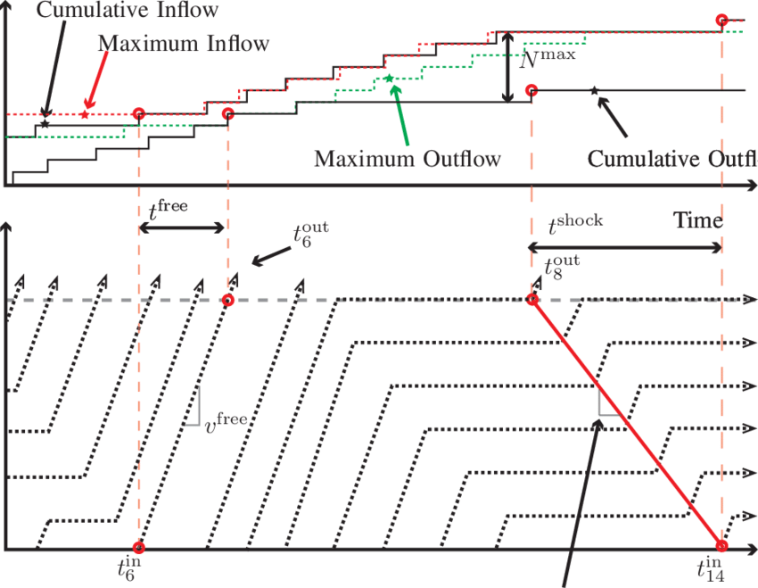

Algorithmic trading extensively depends on predictively modeling trading volumes to ensure optimal trade execution. Forecasting intraday trading volumes with precision is pivotal as it helps minimize transaction costs and optimize trading strategies. By predicting intraday volumes effectively, traders can strategically place and time their trades to exploit market efficiency, while minimizing adverse impacts on price.

Volume prediction within algorithmic trading utilizes a diverse set of statistical models and methodologies aimed at anticipating the volume of trades throughout a trading session. These models range from simple historical averages to more complex approaches involving machine learning and time-series analysis. The selection and implementation of appropriate prediction models are crucial in understanding market dynamics and making informed decisions about trade execution.



Grasping the nuances of volume prediction is indispensable for traders and portfolio managers. It exerts significant influence over execution strategies by guiding decisions about when and how much to trade. Additionally, it affects the potential market impact of trades, which is a critical consideration for large orders that might move market prices unfavorably if executed improperly.

In this article, we examine various methods and models that are applied in predicting intraday trading volumes. We assess their effectiveness, highlighting both the strengths and challenges associated with each approach. By understanding these methodologies, traders and portfolio managers can enhance their trading strategies and improve their market performance through better volume forecasting.

## Table of Contents

## Importance of Volume Prediction in Algorithmic Trading

Effective volume prediction is crucial in algorithmic trading as it enables traders to optimize trade execution, thereby minimizing market impact and transaction costs. By accurately anticipating trading volumes, algorithms can schedule trades at times of higher liquidity, reducing the likelihood of causing significant price changes. This capability is vital for large orders, as executing them with minimal price disturbance helps maintain an equilibrium in market pricing.

Algorithmic trading strategies leverage volume predictions to ensure that trades align with optimal volume periods. The execution of trades at ideal volumes helps to prevent adverse price movements and ensures that the trades reflect the true market value without exaggerated fluctuations. This alignment is particularly important for high-frequency trading, where minute discrepancies can significantly affect the profitability of a trading strategy.

Portfolio managers heavily rely on [volume](/wiki/volume-trading-strategy) prediction to manage [liquidity](/wiki/liquidity-risk-premium) risk. By aligning trading activities with expected volume fluctuations, they can ensure that their portfolios remain liquid. This alignment helps in maintaining the desired level of exposure and achieving the expected returns without bearing undue risk. Effective volume prediction supports portfolio managers in strategizing trade executions that align with anticipated volume changes, thereby enhancing performance and stability.

The precision of volume prediction models is essential for following predetermined trading signals and maintaining the integrity of [algorithmic trading](/wiki/algorithmic-trading) strategies. These models help in identifying the opportune moments to enter or [exit](/wiki/exit-strategy) the market, ensuring that trades are executed in accordance with the strategic objectives. Precise volume predictions support compliance with trading constraints and enhance decision-making processes by providing insights into market liquidity dynamics.

Overall, volume prediction serves as a foundational element in algorithmic trading, enabling market participants to optimize their strategies, minimize costs, enhance performance, and maintain strategic integrity in rapidly changing financial markets.

## Common Methods for Volume Prediction

Deterministic blend models, Lognormal Bayesian approaches, Kalman filters, and ARIMA models are pivotal tools in the prediction of trading volumes within algorithmic trading environments. Each of these models brings distinct characteristics suitable for various trading contexts.

Deterministic blend models are typically used to combine several predictive techniques, creating a hybrid approach that merges strengths from different models to achieve more robust and adaptable forecasts. These models often excel in conditions where individual models may falter due to market variability and complexity.

Lognormal Bayesian approaches utilize probabilistic methods to establish a distribution for predicted volumes, assuming trading volumes exhibit lognormal characteristics. The Bayesian framework enables the incorporation of prior information and continual updating of predictions with new data. This adaptability is particularly advantageous in volatile market environments, where updated information can significantly alter projected outcomes.

Kalman filters, on the other hand, are recursive algorithms that facilitate the estimation of dynamic systems. In the context of trading volume prediction, they are instrumental for real-time filtering and prediction of stochastic processes, adjusting predictions based on noise and incoming data. Kalman filters are well-suited to scenarios where the underlying process is assumed to be linear and Gaussian, providing continuously updated estimates as new information becomes available.

ARIMA (AutoRegressive Integrated Moving Average) models are time-series forecasting techniques that decompose historic data to predict future points. These models are effective for understanding and capturing temporal dependencies within trading volumes. ARIMA models are particularly useful when the volume data exhibit trends and seasonality, as the decomposition allows for clear identification and modeling of these components.

The Component Multiplicative Error Model (CMEM) further refines volume prediction by capturing intra-daily periodicity and volume asymmetry. This model dissects the variance of trading volumes into components that are multiplicatively combined, thus allowing for capture of distinct variances that occur at different times within trading sessions. CMEM's ability to highlight intra-day patterns makes it highly effective in environments where traditional linear models might struggle.

In [backtesting](/wiki/backtesting) scenarios, these models exhibit varying degrees of success. Some models can outperform traditional volume forecasting techniques, especially when fine-tuned to specific market conditions. For instance, the robustness of deterministic blends and the adaptability of Bayesian approaches can yield superior results when diverse market factors are at play. Similarly, Kalman filters and ARIMA models offer precision and responsiveness that are crucial for high-frequency trading strategies.

In summary, the choice of model in volume prediction is context-dependent, with each method offering unique benefits aligned with specific trading conditions and objectives. Through careful selection and implementation, these strategies enable traders to optimize their execution and enhance their algorithmic trading outcomes.

## Application of Volume Indicators in Algorithmic Trading

Volume indicators play a pivotal role in algorithmic trading, providing crucial insights into market dynamics and aiding traders in executing informed strategies. Two widely used volume indicators are On-Balance Volume (OBV) and Volume-Weighted Average Price (VWAP), each serving distinct yet complementary functions in the trading ecosystem.

On-Balance Volume (OBV) is a cumulative indicator designed to track buying and selling pressure. It is computed by adding the volume on up days and subtracting it on down days. The OBV formula can be expressed as follows:

$$
OBV_t = OBV_{t-1} + 
\begin{cases} 
V_t, & \text{if the closing price is higher than the previous close} \\
0, & \text{if the closing price is the same as the previous close} \\
-V_t, & \text{if the closing price is lower than the previous close} 
\end{cases}
$$

Here, $V_t$ indicates the trading volume at time $t$. By continually updating the OBV value based on price movements, this indicator effectively reflects the underlying trend strength and provides signals about potential reversals, allowing traders to confirm trend directions.

Volume-Weighted Average Price (VWAP), on the other hand, provides a benchmark for executing trades. It is the ratio of the value of a stock traded to its total volume over a specified period, essentially representing a price level that takes into account the volume traded at each price point. The formula for VWAP over a single trading day is:

$$
VWAP_t = \frac{\sum_{i=1}^n P_i \cdot V_i}{\sum_{i=1}^n V_i}
$$

where $P_i$ and $V_i$ are the price and volume of each transaction. VWAP assists traders in assessing whether current prices are overvalued or undervalued relative to the day's trading activity. It often acts as a dynamic support and resistance level, guiding entry and exit points in trades.

Together, OBV and VWAP contribute to a comprehensive analysis framework. Traders use OBV to gauge [momentum](/wiki/momentum) and potential trend changes, and VWAP to optimize trade execution around significant price levels. These indicators not only confirm trade signals but also help assess the strength of existing trends, facilitating robust trading decisions within algorithmic frameworks.

## Dynamic Models and Volume Prediction Accuracy

Dynamic models have emerged as pivotal tools for enhancing the precision of intraday trading volume predictions. Among these, the Component Multiplicative Error Model (CMEM) stands out due to its ability to effectively capture intra-daily periodicity and volume asymmetry, two critical factors that significantly influence trading volumes throughout a session. Unlike traditional models such as rolling means and autoregressive models, dynamic models like CMEM offer superior performance by accommodating the complex and non-linear nature of trading volumes.

The effectiveness of dynamic models, like CMEM, lies in their inherent flexibility, allowing them to adjust to the fluctuations in trading volumes which are often dictated by market events, trading behaviors, and time-of-day effects. In trading, volume asymmetry and periodic patterns can lead to significant discrepancies in trading forecasts if not accurately modeled. CMEM addresses these issues by integrating component-wise structure and multiplicative dependencies, which enhance the model's adaptability and accuracy in predicting trading volumes. 

Furthermore, the application of the Generalized Method of Moments (GMM) in conjunction with dynamic models like CMEM refines their predictive capabilities. The GMM is particularly effective in dealing with complex error structures that often arise in financial data. It provides a robust framework for estimating model parameters, especially when dealing with heteroskedasticity and autocorrelation—common challenges in high-frequency trading data. GMM improves the model's alignment with empirical data, thereby enhancing the precision in volume prediction exercises such as Volume-Weighted Average Price (VWAP) tracking.

The integration of CMEM with GMM allows traders to achieve a higher degree of forecasting accuracy, facilitating better alignment with trading objectives and optimizing execution strategies. These models, being dynamic, continuously learn and adjust to new data, therefore providing updated and accurate predictions as market conditions evolve. The use of such sophisticated modeling techniques underscores the importance of advanced statistical methods in modern algorithmic trading and highlights the ongoing evolution in the field of volume prediction.

## Implementing Volume Prediction Models

Implementing volume prediction models in algorithmic trading necessitates a comprehensive grasp of statistical methodologies and the nuances of financial market dynamics. These models leverage a fusion of mathematical [statistics](/wiki/bayesian-statistics) and computational tools to anticipate trading volumes with increased precision. A foundational requirement is the ability to comprehend and manipulate complex datasets, typically using languages like Python, known for its powerful libraries in statistical analysis and [machine learning](/wiki/machine-learning).

Python's libraries such as NumPy, pandas, and statsmodels offer significant utility in developing and backtesting predictive models. For instance, the pandas library facilitates the manipulation and analysis of large datasets, enabling users to transform raw market data into actionable insights. A basic implementation could begin with data preprocessing using pandas, such as:

```python
import pandas as pd

# Load the dataset
data = pd.read_csv('market_data.csv')

# Convert date column to datetime
data['date'] = pd.to_datetime(data['date'])

# Set the date column as the index
data.set_index('date', inplace=True)
```

Following data preparation, statistical methodologies are employed to model volume predictions. One common approach is the use of ARIMA models (AutoRegressive Integrated Moving Average) to capture time series characteristics of trading volumes. The `statsmodels` library provides tools necessary for this implementation:

```python
from statsmodels.tsa.arima_model import ARIMA

# Fit ARIMA model
model = ARIMA(data['volume'], order=(5,1,0))
model_fit = model.fit(disp=0)

# Make volume predictions
volume_predictions = model_fit.forecast(steps=5)[0]
```

Real-world application of these models requires ongoing adjustments and evaluations to ensure they remain aligned with evolving market conditions. Continuous model tuning is vital, as it involves recalibrating model parameters to enhance prediction accuracy. This adaptive process can be enhanced through methods such as cross-validation and performance benchmarking under varying market scenarios.

Moreover, performance assessment is an integral component of the practical application, where metrics like mean squared error (MSE) or mean absolute percentage error (MAPE) can provide quantifiable insights into a model’s efficacy over a testing period. Implementing automated workflows for such evaluations ensures sustained model reliability and optimizes prediction outcomes.

In dynamic markets, model stability and precision are pivotal. Hence, iterative evaluation cycles and the use of advanced statistical techniques, such as Generalized Method of Moments (GMM), become imperative for fine-tuning models subjected to intricate market trends and demands. Through the seamless integration of statistical techniques and computational prowess, predictive models can be robustly implemented, offering traders significant strategic advantages in the complex landscape of algorithmic trading.

## Conclusion

Volume prediction remains a pivotal element in the domain of algorithmic trading, playing a crucial role in the optimization of trading strategies and the minimization of transaction costs. Accurate forecasts enable traders to adjust their strategies in real-time, aligning their actions with anticipated market movements and optimizing trade execution to achieve superior outcomes. As algorithmic trading continues to advance, the sophistication of predictive models has similarly evolved. Enhanced models facilitate precise volume forecasting, allowing traders to execute more effective strategies and attain a competitive edge in the market.

Ongoing advancements in predictive methodologies promise further improvements in model accuracy. Researchers are increasingly focused on refining these models, employing techniques such as machine learning and [artificial intelligence](/wiki/ai-artificial-intelligence) to handle complex intra-[day trading](/wiki/day-trading-spy) patterns and adapt to evolving market conditions. The use of dynamic models, including the Component Multiplicative Error Model and Generalized Method of Moments, highlights the potential for achieving greater precision in volume forecasts. 

Moreover, the integration of advanced computational power and big data analytics is paving the way for more granular and timely predictions. Traders are better equipped to incorporate these sophisticated models into their decision-making processes, ensuring that volume predictions are not only accurate but also actionable across different market scenarios.

As the field progresses, there is a clear trajectory toward models that not only enhance precision but also offer robust adaptability to diverse market environments. The future of volume prediction in algorithmic trading is poised for continued evolution, further benefiting from the convergence of innovative research, cutting-edge technology, and practical application. This synergy represents the next frontier in optimizing trading performance and achieving cost efficiencies, reinforcing volume prediction as an indispensable facet of modern algorithmic trading strategies.

## References & Further Reading

[1]: Tayal, A. R., & Chand, C. (2020). ["Stock Market Prediction Using an ARIMA Model."](https://link.springer.com/chapter/10.1007/978-981-15-7961-5_100) In Advances in Data and Information Sciences (pp. 17-26). Springer.

[2]: Zhang, X., & Jacobsen, M. (2014). ["A Bayesian Approach to Modeling the Bid-Ask Spread: An Application to the London Stock Exchange."](https://link.springer.com/article/10.1007/s11104-025-07291-z) Journal of Financial Econometrics, 12(4), 739-762.

[3]: Lopez de Prado, M. (2018). ["Advances in Financial Machine Learning."](https://books.google.com/books/about/Advances_in_Financial_Machine_Learning.html?id=oU9KDwAAQBAJ) John Wiley & Sons.

[4]: Chan, E. (2009). ["Quantitative Trading: How to Build Your Own Algorithmic Trading Business."](https://github.com/justinchou/books-quantitative-trading) John Wiley & Sons.

[5]: Brownlees, C. T., & Gallo, G. M. (2006). ["Financial Econometric Analysis at Ultra-High Frequency: Data Handling Concerns."](https://www.sciencedirect.com/science/article/abs/pii/S0167947306003458) In Handbook of Financial Time Series.

[6]: Jansen, S. (2020). ["Machine Learning for Algorithmic Trading."](https://github.com/stefan-jansen/machine-learning-for-trading) Packt Publishing Ltd.

[7]: Hamilton, J. D. (1994). ["Time Series Analysis."](https://api.pageplace.de/preview/DT0400.9780691218632_A40156688/preview-9780691218632_A40156688.pdf) Princeton University Press.

[8]: Engle, R. F. (2002). ["Dynamic Conditional Correlation: A Simple Class of Multivariate GARCH Models."](https://www.tandfonline.com/doi/abs/10.1198/073500102288618487) Journal of Business & Economic Statistics, 20(3), 339-350.