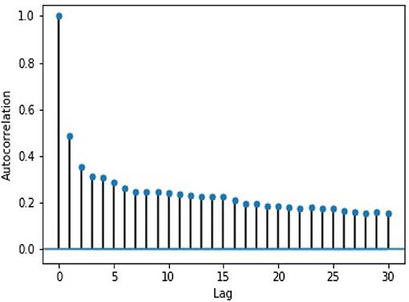

## Table of Contents

## What is volume prediction?

Volume prediction is a way to guess how much of something will be used or needed in the future. This could be things like how much water a city will use, how many products a store will sell, or how much traffic will be on a road. People use math and computers to look at past information and make these guesses. This helps businesses and cities plan better and make sure they have enough of what they need.

For example, a store might use volume prediction to figure out how many bottles of soda to order for next month. They would look at how many bottles they sold in the past few months and use that information to make a guess. If they predict they will need more bottles than usual, they can order more to make sure they don't run out. This way, they can keep their customers happy and avoid wasting money on too much stock.

## Why is volume prediction important in various industries?

Volume prediction is important in many industries because it helps them plan and make smart decisions. For example, in the food industry, restaurants and grocery stores use volume prediction to figure out how much food to buy and cook. If they predict they will have a lot of customers, they can make sure they have enough food. This way, they don't run out of food and make their customers happy. It also helps them save money by not buying too much food that might go to waste.

In the manufacturing industry, [volume](/wiki/volume-trading-strategy) prediction helps companies know how many products to make. If they predict they will sell a lot of a certain product, they can make more of it. This helps them meet customer demand and make more money. If they make too many products and they don't sell, it can be a waste of money and resources. So, volume prediction helps them find the right balance and be more efficient.

In the transportation industry, volume prediction is used to plan how many buses, trains, or planes are needed. If they predict a lot of people will travel, they can add more transportation options. This helps avoid overcrowding and long wait times. If they predict fewer people will travel, they can reduce the number of vehicles to save on costs. This makes the transportation system run smoother and be more cost-effective.

## What are the basic methods used for volume prediction?

One basic method for volume prediction is using historical data. This means looking at past information to guess what will happen in the future. For example, a store might look at how many bottles of soda they sold last summer to predict how many they will sell this summer. They can use simple math, like averages, to make these guesses. This method is easy to understand and use, but it assumes that the future will be a lot like the past, which is not always true.

Another method is using trend analysis. This involves looking at patterns over time to predict future volumes. For example, if a company sees that their sales have been growing by 10% each year, they might predict that next year's sales will also grow by 10%. This method can be more accurate than just using historical data because it takes into account changes and trends. However, it still relies on the assumption that these trends will continue, which can be risky if the market changes suddenly.

A third method is using more advanced techniques like [machine learning](/wiki/machine-learning). This involves using computers to find patterns in large amounts of data that might be too complex for humans to see. For example, a company might use machine learning to predict how many customers will visit their store based on factors like the weather, holidays, and local events. This method can be very accurate, but it requires a lot of data and technical expertise. It's often used by big companies that can afford to invest in these technologies.

## How does historical data influence volume prediction?

Historical data is very important for volume prediction because it helps us guess what will happen in the future based on what happened in the past. For example, if a store wants to know how many bottles of soda to order next month, they can look at how many bottles they sold last month or the same month last year. By using this past information, they can make a good guess about how many bottles they will need. This method is simple and easy to use because it just involves looking at numbers from the past.

However, using historical data has some problems. It assumes that the future will be a lot like the past, which is not always true. For example, if there was a big event last year that made people buy more soda, and that event is not happening this year, the store might order too many bottles. Also, things like new products, changes in customer tastes, or even the weather can make the future different from the past. So, while historical data is a good starting point for volume prediction, it's important to think about other things that might change the future.

## What are the key factors to consider when predicting volume?

When predicting volume, one key [factor](/wiki/factor-investing) to consider is historical data. This means looking at past numbers to guess what will happen in the future. For example, a store might look at how many bottles of soda they sold last summer to predict how many they will sell this summer. Historical data is a good starting point, but it's important to remember that the future might not be the same as the past. Things like new products, changes in what customers want, or even the weather can make a big difference.

Another important factor is trends and patterns. This means looking at how things have been changing over time to predict what will happen next. For example, if a company sees that their sales have been going up by 10% each year, they might guess that next year's sales will also go up by 10%. This can be more accurate than just using historical data because it takes into account changes. But, it's still risky because trends can change suddenly.

A third factor to consider is external influences. These are things outside the company that can affect how much of something will be used or needed. For example, the economy, holidays, or special events can change how many people visit a store or buy a product. Using advanced methods like machine learning can help predict how these external factors will affect volume. This can make predictions more accurate, but it needs a lot of data and technical skills.

## How can statistical models be applied to volume prediction?

Statistical models can help predict volume by using math to look at past data and find patterns. For example, a store might use a simple model called a moving average to predict how many bottles of soda they will sell next month. They would look at how many bottles they sold in the last few months and use those numbers to guess the future. This helps them order the right amount of soda and avoid running out or having too much left over. Statistical models like regression can also be used to see how things like the weather or holidays affect sales, making the predictions more accurate.

More advanced statistical models, like time series analysis, can take into account trends and seasonal changes. For example, a company might use time series analysis to predict how many products they will sell over the next year. This model looks at how sales have changed over time and uses that information to make a guess about the future. It can be very helpful for planning because it considers not just past numbers, but also how those numbers have been changing. By using these models, businesses can make better decisions about how much to produce or order, helping them save money and meet customer needs.

## What role do machine learning algorithms play in volume prediction?

Machine learning algorithms are really helpful for predicting volume because they can find patterns in big sets of data that are too hard for people to see. For example, a store might use machine learning to guess how many bottles of soda they will sell next month. The algorithm can look at past sales, the weather, holidays, and even local events to make a good guess. This makes the prediction more accurate because it takes into account many different things that can affect how much soda people will buy.

Using machine learning for volume prediction can help businesses make better decisions. For example, a company might use machine learning to predict how many products they need to make or how many buses they need to run. By looking at a lot of data, the algorithm can find trends and patterns that help the company plan better. This can save them money and make sure they have enough of what they need without wasting resources.

## How can real-time data improve the accuracy of volume predictions?

Real-time data can make volume predictions more accurate because it gives up-to-date information about what's happening right now. For example, if a store uses real-time data, they can see how many people are in the store at this moment or how the weather is affecting sales today. This helps them adjust their predictions quickly. If they see that more people are coming in because of a special event, they can order more products right away to meet the demand.

Using real-time data also helps businesses react faster to changes. If something unexpected happens, like a sudden rainstorm that keeps people at home, the store can see this in their real-time data and change their predictions. This way, they don't order too much stock that they won't sell. By keeping their predictions up to date with what's happening now, businesses can make better decisions and be more efficient.

## What are the challenges faced in volume prediction?

Volume prediction can be hard because the future is not always like the past. If a store uses past sales to guess how many bottles of soda to order next month, they might get it wrong if something new happens. For example, if there was a big event last year that made people buy more soda, and that event is not happening this year, the store might order too many bottles. Also, things like new products, changes in what customers want, or even the weather can make the future different from the past. So, it's tough to predict volume accurately because there are so many things that can change.

Another challenge is getting good data. To predict volume well, you need a lot of information about the past and what's happening now. But sometimes, this data is hard to get or not very accurate. For example, if a company wants to use real-time data to predict how many people will visit their store, they need to make sure their data is correct and up to date. If the data is wrong, their predictions will be wrong too. Also, using advanced methods like machine learning needs a lot of data and special skills, which can be hard for some businesses to get.

## How do advanced techniques like neural networks enhance volume prediction?

Neural networks can make volume prediction better because they can find patterns in big sets of data that are too hard for people to see. For example, a store might use a [neural network](/wiki/neural-network) to guess how many bottles of soda they will sell next month. The neural network can look at past sales, the weather, holidays, and even local events to make a good guess. This makes the prediction more accurate because it takes into account many different things that can affect how much soda people will buy. By using neural networks, businesses can make better decisions about how much to order or produce, helping them save money and meet customer needs.

Using neural networks for volume prediction can also help businesses react faster to changes. If something unexpected happens, like a sudden rainstorm that keeps people at home, the neural network can quickly adjust its predictions based on real-time data. This way, the store can order the right amount of stock and avoid having too much left over. Neural networks are good at finding trends and patterns that help companies plan better, making them a powerful tool for volume prediction.

## What are the best practices for validating volume prediction models?

To make sure volume prediction models work well, it's important to check them carefully. One good way to do this is by using a part of your data to test the model. You can split your data into two parts: one part to train the model and another part to test it. If the model guesses the right numbers for the test data, you know it's working well. Another way to check is by comparing your model's guesses with what actually happens. If the model's guesses are close to the real numbers, it's a good sign that the model is accurate.

Another important thing to do is to keep checking the model over time. Things can change, so a model that worked well last month might not work as well this month. By looking at how well the model is doing regularly, you can make changes to keep it accurate. It's also a good idea to use different ways to check the model. For example, you can use simple math to see how close the model's guesses are to the real numbers, or you can use more advanced methods to see if the model is finding the right patterns in the data. By doing all these things, you can make sure your volume prediction model stays reliable and useful.

## How can volume prediction be integrated into business strategies for optimal results?

Volume prediction can help businesses plan better and make smart choices. By using volume prediction, a store can guess how many bottles of soda they will sell next month and order the right amount. This way, they don't run out of soda and make their customers happy. It also helps them save money by not buying too much soda that might go to waste. Companies can use volume prediction to decide how many products to make, how many buses to run, or how much food to cook. This helps them meet customer demand and make more money without wasting resources.

To get the best results, businesses should keep checking and updating their volume prediction models. Things can change, so a model that worked well last month might not work as well this month. By looking at how well the model is doing regularly, businesses can make changes to keep it accurate. They can also use real-time data to adjust their predictions quickly if something unexpected happens. By using volume prediction in their business strategies, companies can be more efficient, save money, and better meet the needs of their customers.

## How are Volume Indicators Applied in Algorithmic Trading?

Volume indicators play a pivotal role in [algorithmic trading](/wiki/algorithmic-trading), providing crucial insights into market dynamics and aiding traders in executing informed strategies. Two widely used volume indicators are On-Balance Volume (OBV) and Volume-Weighted Average Price (VWAP), each serving distinct yet complementary functions in the trading ecosystem.

On-Balance Volume (OBV) is a cumulative indicator designed to track buying and selling pressure. It is computed by adding the volume on up days and subtracting it on down days. The OBV formula can be expressed as follows:

$$
OBV_t = OBV_{t-1} + 
\begin{cases} 
V_t, & \text{if the closing price is higher than the previous close} \\
0, & \text{if the closing price is the same as the previous close} \\
-V_t, & \text{if the closing price is lower than the previous close} 
\end{cases}
$$

Here, $V_t$ indicates the trading volume at time $t$. By continually updating the OBV value based on price movements, this indicator effectively reflects the underlying trend strength and provides signals about potential reversals, allowing traders to confirm trend directions.

Volume-Weighted Average Price (VWAP), on the other hand, provides a benchmark for executing trades. It is the ratio of the value of a stock traded to its total volume over a specified period, essentially representing a price level that takes into account the volume traded at each price point. The formula for VWAP over a single trading day is:

$$
VWAP_t = \frac{\sum_{i=1}^n P_i \cdot V_i}{\sum_{i=1}^n V_i}
$$

where $P_i$ and $V_i$ are the price and volume of each transaction. VWAP assists traders in assessing whether current prices are overvalued or undervalued relative to the day's trading activity. It often acts as a dynamic support and resistance level, guiding entry and exit points in trades.

Together, OBV and VWAP contribute to a comprehensive analysis framework. Traders use OBV to gauge [momentum](/wiki/momentum) and potential trend changes, and VWAP to optimize trade execution around significant price levels. These indicators not only confirm trade signals but also help assess the strength of existing trends, facilitating robust trading decisions within algorithmic frameworks.

## References & Further Reading

[1]: Tayal, A. R., & Chand, C. (2020). ["Stock Market Prediction Using an ARIMA Model."](https://link.springer.com/chapter/10.1007/978-981-15-7961-5_100) In Advances in Data and Information Sciences (pp. 17-26). Springer.

[2]: Zhang, X., & Jacobsen, M. (2014). ["A Bayesian Approach to Modeling the Bid-Ask Spread: An Application to the London Stock Exchange."](https://link.springer.com/article/10.1007/s11104-025-07291-z) Journal of Financial Econometrics, 12(4), 739-762.

[3]: Lopez de Prado, M. (2018). ["Advances in Financial Machine Learning."](https://books.google.com/books/about/Advances_in_Financial_Machine_Learning.html?id=oU9KDwAAQBAJ) John Wiley & Sons.

[4]: Chan, E. (2009). ["Quantitative Trading: How to Build Your Own Algorithmic Trading Business."](https://github.com/justinchou/books-quantitative-trading) John Wiley & Sons.

[5]: Brownlees, C. T., & Gallo, G. M. (2006). ["Financial Econometric Analysis at Ultra-High Frequency: Data Handling Concerns."](https://www.sciencedirect.com/science/article/abs/pii/S0167947306003458) In Handbook of Financial Time Series.

[6]: Jansen, S. (2020). ["Machine Learning for Algorithmic Trading."](https://github.com/stefan-jansen/machine-learning-for-trading) Packt Publishing Ltd.

[7]: Hamilton, J. D. (1994). ["Time Series Analysis."](https://api.pageplace.de/preview/DT0400.9780691218632_A40156688/preview-9780691218632_A40156688.pdf) Princeton University Press.

[8]: Engle, R. F. (2002). ["Dynamic Conditional Correlation: A Simple Class of Multivariate GARCH Models."](https://www.tandfonline.com/doi/abs/10.1198/073500102288618487) Journal of Business & Economic Statistics, 20(3), 339-350.