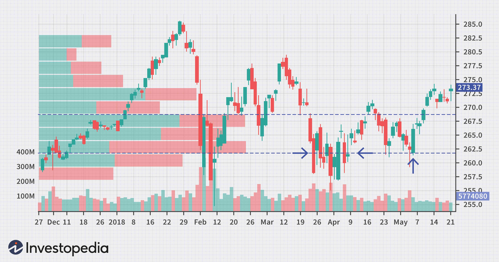

The Volume Price Trend (VPT) indicator is a significant instrument in technical analysis, used to evaluate the buying and selling pressure of a security through the integration of price and volume data. By correlating the percentage change in price with volume, VPT provides insights into market trends and potential reversals, making it a crucial component for traders and analysts alike.

This article investigates the application of the VPT indicator in the context of algorithmic trading, where automation and precision are paramount. Traders use VPT to interpret market signals, guiding their entry and exit points. Key areas of focus will include the interpretation of VPT signals, the formula used for its calculation, and comparisons with other volume-based indicators such as On-Balance Volume (OBV).



Understanding the benefits and limitations of VPT is essential for effective stock analysis. While it offers advantages like trend confirmation and reversal indications, it also relies on accurate volume data and may experience lag as it is a cumulative indicator. This article aims to provide a comprehensive overview, enabling traders to leverage VPT alongside other technical tools for enhanced decision-making in both short-term and long-term trading strategies.

## Table of Contents

## Understanding the VPT Indicator

The Volume Price Trend (VPT) indicator serves as a vital tool for identifying market trends and potential reversal points. By integrating the percentage change in price with the trading volume, it provides a more nuanced understanding of a security's market dynamics. The primary function of the VPT indicator is to measure the equilibrium between supply and demand, offering insight into buying and selling pressures.

Unlike some other volume-based indicators, the VPT specifically incorporates the percentage change in price into its calculation. This distinguishing feature allows it to more accurately reflect the proportional impact of price changes on volume. The VPT accumulates by adding or subtracting the product of the current volume and the percentage change in price to the previous VPT value. Mathematically, the VPT is expressed as:

$$
\text{VPT} = \text{Previous VPT} + \left( \text{Current Volume} \times \frac{\text{Current Price} - \text{Previous Price}}{\text{Previous Price}} \right)
$$

By calculating the percentage change in price, the VPT adjusts for the influence of actual price movements, offering a comprehensive view of market strength. This approach provides traders with a confirmation of existing trends, as an increasing VPT alongside rising prices suggests strong buying [momentum](/wiki/momentum). Conversely, a falling VPT in tandem with decreasing prices may indicate potent selling forces.

Furthermore, the VPT's ability to signal potential market reversals makes it a valuable component in technical analysis. When the VPT begins to diverge from the actual price movement — rising as prices fall or falling as prices rise — it can suggest an impending shift in market direction. This divergence can alert traders to potential opportunities for entering or exiting positions, thus enhancing their market strategies. The unique integration of percentage price changes makes VPT an essential indicator for gauging market sentiment and dynamics effectively.

## VPT Indicator Formula and Calculation

The Volume Price Trend (VPT) indicator is calculated using the following formula:

$$
\text{VPT} = \text{Previous VPT} + \left(\text{Current Volume} \times \frac{\text{Current Price} - \text{Previous Price}}{\text{Previous Price}}\right)
$$

This formula calculates the VPT by incorporating both the percentage change in the security's price and its trading [volume](/wiki/volume-trading-strategy). The combination of price movement and volume helps to ascertain the buying or selling pressure on a stock, enabling analysts to gauge trend strength or potential reversals.

For an upward price movement, the volume is multiplied by the percentage increase in price. This result is then added to the previous VPT value, thus increasing the VPT to reflect stronger buying interest:

$$
\text{VPT}_{\text{new}} = \text{VPT}_{\text{old}} + \left(\text{Volume} \times \frac{\text{Price}_{\text{current}} - \text{Price}_{\text{previous}}}{\text{Price}_{\text{previous}}}\right)
$$

Conversely, if the price declines, the volume is multiplied by the percentage decrease in price, which reduces the VPT, reflecting selling pressure:

$$
\text{VPT}_{\text{new}} = \text{VPT}_{\text{old}} - \left(\text{Volume} \times \frac{\text{Price}_{\text{previous}} - \text{Price}_{\text{current}}}{\text{Price}_{\text{previous}}}\right)
$$

### Example Calculation

To demonstrate, consider a stock with a previous VPT of 100,000, a current volume of 5,000 shares, a previous closing price of $10, and a current closing price of $11. 

For an upward movement:

$$
\text{Price Change} = \frac{\text{11} - \text{10}}{\text{10}} = 0.10
$$

$$
\text{VPT}_{\text{new}} = 100,000 + (5,000 \times 0.10) = 100,000 + 500 = 100,500
$$

This indicates strong buying momentum as the VPT increases.

### Practical Applications

In practical terms, traders and analysts use the VPT indicator to verify the strength and sustainability of price trends. Suppose the VPT grows while the price rises; this confirms continuing buying interest and suggests a robust upward trend. On the other hand, if the VPT declines alongside falling prices, it signals persistent selling pressure.

In the context of automated trading systems, the VPT can be integrated into algorithms to trigger buy or sell signals. For example:

```python
def calculate_vpt(vpt_prev, current_volume, current_price, previous_price):
    vpt_change = current_volume * ((current_price - previous_price) / previous_price)
    return vpt_prev + vpt_change

vpt_prev = 100000
current_volume = 5000
current_price = 11
previous_price = 10

vpt_new = calculate_vpt(vpt_prev, current_volume, current_price, previous_price)
print(f"New VPT: {vpt_new}")
```

In this example, the code snippet determines the new VPT value using previous and current trading data, thus allowing for dynamic updates and decision-making in a trading system.

## Interpreting VPT Trading Signals

VPT, or Volume Price Trend, is a valuable tool for interpreting trading signals and confirming market trends. Analyzing the relationship between VPT and price movements can provide insights into the strength of buying or selling momentum. When the VPT increases in tandem with rising prices, it signals strong buying momentum. This alignment suggests that the upward price movement is supported by significant trading volume, reinforcing the trend's validity.

Conversely, a declining VPT accompanying falling prices indicates strong selling momentum. This scenario reflects a market where decreasing prices are paired with substantial volume, underscoring a convincing downward trend.

An essential aspect of VPT analysis is identifying divergence signals, which can suggest possible market reversals. A bullish divergence occurs when the VPT rises while prices continue to fall. This situation implies that, despite the price decline, there is persistent volume support pointing towards underlying buying interest. The divergence suggests that the existing downward trend may lose strength and a price reversal could occur.

For practical application, traders often look for confirming indicators to reinforce VPT signals. For instance, a bullish divergence in VPT might be substantiated by additional technical indicators, such as relative strength index (RSI) or moving average convergence divergence (MACD), thereby increasing confidence in a potential reversal. Understanding these nuances aids traders in making informed decisions and optimizing their trading strategies.

## Comparing VPT with Other Indicators

The Volume Price Trend (VPT) indicator is often compared with other volume-based indicators, with On-Balance Volume (OBV) being one of the most notable. Both VPT and OBV assess market momentum by analyzing cumulative volume but differ in their approach. 

The primary distinction between VPT and OBV lies in VPT's inclusion of percentage price change in its calculation. The VPT calculation is expressed as:

$$
\text{VPT} = \text{Previous VPT} + \left( \text{Current Volume} \times \frac{\text{Current Price} - \text{Previous Price}}{\text{Previous Price}} \right)
$$

This consideration allows VPT to provide deeper market insights by incorporating not just the direction of price changes but also their magnitude. In contrast, OBV simply adds volume when prices close higher than the previous day and subtracts it when prices close lower, ignoring the extent of price changes.

In addition to OBV, other technical indicators such as the Relative Strength Index (RSI) and Moving Average Convergence Divergence (MACD) are often employed alongside VPT to enhance market analysis. RSI is a momentum oscillator that measures the speed and change of price movements, primarily helping identify overbought or oversold conditions in a security. MACD, on the other hand, is a trend-following momentum indicator that shows the relationship between two moving averages of a security's price.

When integrated with VPT, RSI can help confirm the strength of the trends indicated by volume changes. For instance, if VPT suggests a bullish trend but RSI indicates an overbought condition, traders might exercise caution before proceeding. Similarly, MACD can be used to identify trends and potential reversals when analyzed along with VPT trends. 

Overall, combining these indicators can provide a more comprehensive view of market conditions, helping traders develop robust trading strategies by leveraging the strengths of each tool.

## Applications in Algorithmic Trading

In [algorithmic trading](/wiki/algorithmic-trading), the Volume Price Trend (VPT) indicator serves as a dynamic tool for automating trading decisions. By integrating VPT into trading algorithms, traders can enhance their ability to identify and act upon significant market trends and divergences. The VPT indicator provides a quantitative foundation for establishing entry and [exit](/wiki/exit-strategy) points within trading strategies.

### Automating Trading Decisions with VPT

The VPT indicator is particularly effective in detecting momentum in trading instruments. When incorporated into algorithms, it processes historical and real-time data to determine the buying and selling pressure exerted on a security. An increasing VPT, combined with a rising price, signals robust buying momentum, while a decreasing VPT and declining price indicate strong selling momentum. These signals can be coded into an algorithm to execute trades automatically when specific conditions are met, thereby reducing human intervention and emotional bias.

### Identifying Trends and Divergences

One of the primary applications of VPT in algorithmic trading is in recognizing trend continuation and potential reversals. By monitoring divergences between the VPT and price movements, traders can gain insights into market sentiment changes. For example, a bullish divergence, where VPT increases while prices fall, may suggest a forthcoming upward price correction. Trading algorithms can be programmed to recognize such divergences and adjust trading positions accordingly, optimizing the timing of trades.

### Enhancing Prediction Accuracy

Integrating VPT with other technical indicators and algorithmic tools further refines predictive accuracy. For instance, coupling VPT with indicators like the Relative Strength Index (RSI) or Moving Average Convergence Divergence (MACD) can provide a more comprehensive market view. Such combinations allow algorithms to filter out potential false signals and increase the reliability of predictions. By creating compound conditions, an algorithm might require both a VPT divergence and an RSI threshold breach before initiating a trade, thereby improving the quality of entry and exit decisions.

### Python Implementation

The practical implementation of VPT in trading algorithms can be achieved using programming languages like Python. Below is a basic example of how one might calculate and use the VPT within an automated trading script:

```python
import pandas as pd

def calculate_vpt(prices, volumes):
    vpt = [0]
    for i in range(1, len(prices)):
        vpt_change = volumes[i] * (prices[i] - prices[i-1]) / prices[i-1]
        vpt.append(vpt[-1] + vpt_change)
    return vpt

# Example data
prices = [100, 102, 101, 105, 107]
volumes = [1000, 1200, 1500, 1600, 1800]

# Calculate VPT
vpt_values = calculate_vpt(prices, volumes)
print(vpt_values)

# Example of trade execution logic
for i in range(1, len(prices)):
    if vpt_values[i] > vpt_values[i-1] and prices[i] > prices[i-1]:
        print("Buy Signal at index:", i)
    elif vpt_values[i] < vpt_values[i-1] and prices[i] < prices[i-1]:
        print("Sell Signal at index:", i)
```

In conclusion, the VPT indicator's integration into algorithmic trading strategies provides significant advantages in assessing market conditions and executing trades based on systematic triggers. By enhancing these systems with additional indicators, traders can leverage improved precision and performance in today's complex financial markets.

## Benefits and Limitations of VPT

The Volume Price Trend (VPT) indicator provides unique advantages for traders by confirming market trends and signaling potential reversals. VPT combines volume and price change data, enabling an analysis that reflects both the strength and direction of price movements. This is particularly beneficial for validating ongoing trends: when the VPT line moves in tandem with price, it suggests a continuation of the current trend. Additionally, divergences between price and the VPT line can indicate potential reversals, offering traders timely insights for making strategic decisions.

However, several limitations should be considered when using the VPT indicator. It relies heavily on accurate volume data; inconsistencies or errors in volume reporting can lead to misleading analyses. Furthermore, as a cumulative indicator, VPT can exhibit lag in reflecting recent price changes. This latency can delay the detection of significant market shifts, particularly in volatile markets where rapid price changes occur.

To maximize its effectiveness, VPT should complement a broader trading strategy. Sole reliance on VPT may lead to suboptimal trading decisions due to its inherent limitations. By integrating VPT with other technical indicators and market analysis tools, traders can enhance their market assessment, gaining a more comprehensive view of potential trading opportunities.

## Conclusion

The Volume Price Trend (VPT) indicator stands out as an adaptable and significant tool within technical analysis, playing a crucial role in understanding market dynamics. Traders rely on its capacity to combine volume and price changes to decipher trends and anticipate potential price reversals. By incorporating the VPT indicator into their trading strategies, traders can gain valuable insights that support both short-term and long-term decision-making, enhancing their ability to capitalize on market opportunities.

Nevertheless, to maximize the effectiveness of the VPT indicator, it is advisable to use it alongside other technical indicators and comprehensive market analysis tools. Utilizing a multi-faceted approach allows traders to achieve a more holistic view of market conditions, reducing the risk of reliance on a single indicator which might not capture the full spectrum of market influences. Such integration not only increases the precision of predictions but also fortifies a trader’s overall strategy, thereby contributing to more robust trading outcomes.

## References & Further Reading

[1]: Pring, M. J. (2002). ["Technical Analysis Explained: The Successful Investor's Guide to Spotting Investment Trends and Turning Points."](https://www.amazon.com/Technical-Analysis-Explained-Fifth-Successful/dp/0071825177) McGraw-Hill.

[2]: Achelis, S. B. (2000). ["Technical Analysis from A to Z."](https://www.mhebooklibrary.com/doi/book/10.1036/9780071380119) McGraw-Hill.

[3]: Schwager, J. D. (1996). ["Getting Started in Technical Analysis."](https://www.amazon.com/Getting-Started-Technical-Analysis-Schwager/dp/0471295426) Wiley.

[4]: Murphy, J. J. (1999). ["Technical Analysis of the Financial Markets: A Comprehensive Guide to Trading Methods and Applications."](https://archive.org/details/technicalanalysi0000murp) New York Institute of Finance.

[5]: Elder, A. (1993). ["Trading for a Living: Psychology, Trading Tactics, Money Management."](https://www.amazon.com/Trading-Living-Psychology-Tactics-Management/dp/0471592242) Wiley.