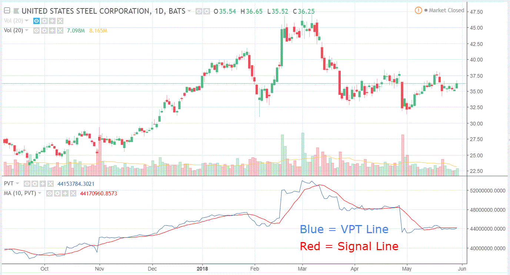

## Table of Contents

## What is the Volume Price Trend Indicator?

The Volume Price Trend Indicator, often called VPT, is a tool that traders use to understand how much money is flowing into or out of a stock. It combines both the price of the stock and the volume of shares traded to give a clearer picture of market trends. When the price goes up and more shares are traded, the VPT goes up, showing that money is flowing into the stock. If the price goes down and more shares are traded, the VPT goes down, indicating money is flowing out.

This indicator helps traders spot when a stock might be getting stronger or weaker. For example, if the VPT is going up while the stock price is still going down, it might mean the stock is about to start going up. Traders look for these signs to decide when to buy or sell. By watching the VPT, they can make better guesses about where the stock price might go next.

## How is the Volume Price Trend Indicator calculated?

The Volume Price Trend Indicator is calculated by taking the volume of shares traded and multiplying it by the difference between the current price and the previous price, then adding this to the previous VPT value. So, if today's price is higher than yesterday's, you add the volume times the price difference to the old VPT. If today's price is lower, you subtract the volume times the price difference from the old VPT. This way, the VPT keeps track of how the money flow is changing over time.

For example, if yesterday's closing price was $50 and today's closing price is $52, and 1000 shares were traded today, the change in VPT would be 1000 times ($52 - $50), which is 2000. If the VPT yesterday was 10000, today's VPT would be 10000 plus 2000, which equals 12000. This simple calculation helps traders see how the volume and price together are affecting the stock's trend.

## What does the Volume Price Trend Indicator tell us about market trends?

The Volume Price Trend Indicator helps us see how money is moving in and out of a stock. It looks at both the price of the stock and how many shares are being traded. When the VPT goes up, it means more money is coming into the stock, which could mean it's getting stronger. If the VPT goes down, it shows money is leaving the stock, suggesting it might be getting weaker. This helps traders understand if the current trend in the stock's price is likely to continue or change.

Traders use the VPT to spot signs that a stock's price might be about to change direction. For example, if the stock price is going down but the VPT is going up, it could mean that the selling is slowing down and the price might soon start to rise. On the other hand, if the stock price is going up but the VPT is going down, it might mean the buying is weakening and the price could soon fall. By watching the VPT, traders can make better guesses about what the stock might do next and decide when to buy or sell.

## How can beginners use the Volume Price Trend Indicator in their trading?

Beginners can start using the Volume Price Trend Indicator by looking at how it moves along with the stock's price. If the VPT is going up, it means more money is coming into the stock, which could be a good sign that the stock's price might keep going up. If the VPT is going down, it means money is leaving the stock, which could be a warning that the stock's price might go down. By watching these movements, beginners can get a better feel for whether a stock is getting stronger or weaker.

It's also helpful for beginners to look for times when the VPT and the stock's price are not moving in the same direction. For example, if the stock's price is going down but the VPT is going up, it might mean the selling is slowing down and the price could soon start to rise again. This can be a good time for beginners to think about buying the stock. On the other hand, if the stock's price is going up but the VPT is going down, it might mean the buying is weakening and the price could soon fall. This could be a signal for beginners to think about selling or avoiding the stock. By paying attention to these signals, beginners can make more informed decisions about when to buy or sell.

## What are the key components of the Volume Price Trend Indicator?

The Volume Price Trend Indicator has two main parts: the volume of shares traded and the change in the stock's price. Volume is how many shares people are buying or selling. If a lot of shares are traded, it means more people are interested in the stock. The price change is the difference between today's closing price and yesterday's closing price. If the price goes up, it's a positive change; if it goes down, it's a negative change.

To calculate the VPT, you take the volume and multiply it by the price change. Then, you add or subtract this number from the previous VPT value, depending on whether the price went up or down. If the price increased, you add the volume times the price change to the old VPT. If the price decreased, you subtract it. This way, the VPT shows how money is moving in and out of the stock over time. By watching the VPT, beginners can see if the stock is getting stronger or weaker and make better trading decisions.

## How does the Volume Price Trend Indicator differ from other volume indicators?

The Volume Price Trend Indicator is different from other volume indicators because it looks at both the volume and the price change at the same time. Many other volume indicators, like the On-Balance Volume (OBV), only focus on the volume. OBV adds the volume when the price goes up and subtracts it when the price goes down, but it doesn't multiply the volume by the price change like VPT does. This means VPT gives a more detailed view of how money is moving in and out of a stock.

Another difference is that VPT keeps a running total of the volume times the price change, which can help show long-term trends in the money flow. In contrast, indicators like the Volume Rate of Change (VROC) look at how the volume is changing over a short period but don't consider the price change. VPT's focus on both volume and price can help traders see if a stock is getting stronger or weaker over time, making it a useful tool for understanding market trends.

## Can the Volume Price Trend Indicator be used for all types of financial markets?

The Volume Price Trend Indicator can be used for many different types of financial markets, not just stocks. It works well for markets like [forex](/wiki/forex-system), commodities, and futures too. The key is that you need to have data on both the price and the volume of trading. As long as you have this information, you can use the VPT to see how money is flowing in and out of whatever you're trading.

Even though the VPT is versatile, it might not be perfect for every market. For example, in some markets, like certain types of forex trading, the volume data might not be as clear or reliable as it is for stocks. But if you can get good volume data, the VPT can still give you useful information about trends and money flow. It's a good idea to use the VPT along with other tools and indicators to get the best picture of what's happening in the market.

## What are common strategies that incorporate the Volume Price Trend Indicator?

One common strategy that uses the Volume Price Trend Indicator is to look for times when the VPT is going up while the stock's price is still going down. This can be a sign that the selling is slowing down and the price might soon start to go up. Traders might see this as a good time to buy the stock because it could be about to get stronger. By watching the VPT, they can catch these moments and make better trading choices.

Another strategy is to use the VPT to confirm trends. If both the stock's price and the VPT are going up together, it can show that the stock is getting stronger and the upward trend is likely to keep going. Traders might use this as a signal to keep holding onto the stock or to buy more. On the other hand, if both the price and the VPT are going down, it could mean the stock is getting weaker, and traders might decide to sell before the price drops even more.

Some traders also use the VPT to spot when a stock's price might change direction. If the stock's price is going up but the VPT is going down, it might mean the buying is weakening and the price could soon fall. This can be a warning for traders to sell or avoid the stock. By paying attention to these signals from the VPT, traders can make more informed decisions about when to buy or sell, helping them to trade more successfully.

## How can the Volume Price Trend Indicator be combined with other technical indicators for better results?

Combining the Volume Price Trend Indicator with other technical indicators can help traders get a clearer picture of what's happening in the market. One common way is to use the VPT with the Moving Average Convergence Divergence (MACD). The MACD shows when a stock's short-term trend is moving away from its long-term trend, which can signal when it's a good time to buy or sell. If the VPT is going up and the MACD line crosses above the signal line, it can be a strong sign that the stock is getting stronger and might keep going up. On the other hand, if the VPT is going down and the MACD line crosses below the signal line, it might mean the stock is getting weaker and could go down.

Another useful combination is to use the VPT with the Relative Strength Index (RSI). The RSI helps traders see if a stock is overbought or oversold, which can tell them if the price might change soon. If the VPT is going up and the RSI is below 30, it might mean the stock is oversold and could be ready to go up. If the VPT is going down and the RSI is above 70, it might mean the stock is overbought and could be ready to go down. By looking at both the VPT and the RSI, traders can get a better idea of when to buy or sell, making their trading decisions more informed and potentially more successful.

## What are the limitations and potential pitfalls of using the Volume Price Trend Indicator?

The Volume Price Trend Indicator has some limitations that traders should know about. One big problem is that it depends on having good volume data. In some markets, like certain types of forex trading, the volume data might not be as clear or reliable as it is for stocks. If the volume data is not right, the VPT might give you the wrong signals about what's happening in the market. Another problem is that the VPT can sometimes give you signals too late. By the time you see the VPT changing, the stock's price might have already moved a lot, which can make it harder to make money from the trade.

Another thing to watch out for is that the VPT works best when you use it with other tools and indicators. If you only use the VPT by itself, you might miss important information about the market. For example, the VPT might show that money is coming into a stock, but if other indicators like the RSI show that the stock is overbought, it might not be a good time to buy. Also, like any other indicator, the VPT is not perfect and can give you false signals. Sometimes, the VPT might tell you that a stock is getting stronger when it's really not, or it might tell you a stock is getting weaker when it's actually about to go up. That's why it's important to use the VPT along with other tools and to always think carefully about your trading decisions.

## How can advanced traders optimize the settings of the Volume Price Trend Indicator for specific assets?

Advanced traders can optimize the settings of the Volume Price Trend Indicator by adjusting how the indicator reacts to different assets. One way to do this is by changing the time frame used for the VPT. For stocks that move quickly, a shorter time frame like a 5-minute or 15-minute chart might be better. This can help traders catch quick changes in the stock's price and volume. For stocks that move more slowly, a longer time frame like a daily or weekly chart might be more useful. This can help traders see bigger trends in the stock's money flow over time.

Another way to optimize the VPT is by using it with other indicators that are set up for the specific asset. For example, if a trader is looking at a stock that often gets overbought or oversold, they might use the VPT with the RSI set to a shorter time frame to catch these moments better. By tweaking the settings of both the VPT and the RSI, traders can get a clearer picture of when to buy or sell the stock. It's also important for advanced traders to test different settings on past data to see what works best for each asset. This can help them find the right balance and make more informed trading decisions.

## What are some real-world examples where the Volume Price Trend Indicator significantly impacted trading decisions?

In early 2020, many traders used the Volume Price Trend Indicator to make smart choices about buying and selling stocks during the big market changes caused by the start of the global health crisis. As stock prices were going down fast, some traders saw that the VPT was going up for certain stocks. This meant that even though the prices were falling, more money was coming into these stocks. Traders who noticed this used the VPT as a sign that the selling might be slowing down and the prices could soon start going back up. They bought these stocks at lower prices and made good profits when the market started to recover.

Another example happened with a tech company's stock in late 2021. The stock's price was going up, but the VPT was starting to go down. This was a warning sign for traders that the buying might be getting weaker, even though the price was still rising. Some traders who saw this decided to sell their shares before the price dropped. A few weeks later, the stock's price did start to fall, and those traders were happy they had sold when they did. By using the VPT, they were able to spot the change in the stock's trend early and make a smart trading decision.

## What is the VPT Indicator and how does it work?

The Volume Price Trend (VPT) indicator serves as a vital tool for identifying market trends and potential reversal points. By integrating the percentage change in price with the trading volume, it provides a more nuanced understanding of a security's market dynamics. The primary function of the VPT indicator is to measure the equilibrium between supply and demand, offering insight into buying and selling pressures.

Unlike some other volume-based indicators, the VPT specifically incorporates the percentage change in price into its calculation. This distinguishing feature allows it to more accurately reflect the proportional impact of price changes on volume. The VPT accumulates by adding or subtracting the product of the current volume and the percentage change in price to the previous VPT value. Mathematically, the VPT is expressed as:

$$
\text{VPT} = \text{Previous VPT} + \left( \text{Current Volume} \times \frac{\text{Current Price} - \text{Previous Price}}{\text{Previous Price}} \right)
$$

By calculating the percentage change in price, the VPT adjusts for the influence of actual price movements, offering a comprehensive view of market strength. This approach provides traders with a confirmation of existing trends, as an increasing VPT alongside rising prices suggests strong buying [momentum](/wiki/momentum). Conversely, a falling VPT in tandem with decreasing prices may indicate potent selling forces.

Furthermore, the VPT's ability to signal potential market reversals makes it a valuable component in technical analysis. When the VPT begins to diverge from the actual price movement — rising as prices fall or falling as prices rise — it can suggest an impending shift in market direction. This divergence can alert traders to potential opportunities for entering or exiting positions, thus enhancing their market strategies. The unique integration of percentage price changes makes VPT an essential indicator for gauging market sentiment and dynamics effectively.

## What is the VPT Indicator Formula and how is it calculated?

The Volume Price Trend (VPT) indicator is calculated using the following formula:

$$
\text{VPT} = \text{Previous VPT} + \left(\text{Current Volume} \times \frac{\text{Current Price} - \text{Previous Price}}{\text{Previous Price}}\right)
$$

This formula calculates the VPT by incorporating both the percentage change in the security's price and its trading [volume](/wiki/volume-trading-strategy). The combination of price movement and volume helps to ascertain the buying or selling pressure on a stock, enabling analysts to gauge trend strength or potential reversals.

For an upward price movement, the volume is multiplied by the percentage increase in price. This result is then added to the previous VPT value, thus increasing the VPT to reflect stronger buying interest:

$$
\text{VPT}_{\text{new}} = \text{VPT}_{\text{old}} + \left(\text{Volume} \times \frac{\text{Price}_{\text{current}} - \text{Price}_{\text{previous}}}{\text{Price}_{\text{previous}}}\right)
$$

Conversely, if the price declines, the volume is multiplied by the percentage decrease in price, which reduces the VPT, reflecting selling pressure:

$$
\text{VPT}_{\text{new}} = \text{VPT}_{\text{old}} - \left(\text{Volume} \times \frac{\text{Price}_{\text{previous}} - \text{Price}_{\text{current}}}{\text{Price}_{\text{previous}}}\right)
$$

### Example Calculation

To demonstrate, consider a stock with a previous VPT of 100,000, a current volume of 5,000 shares, a previous closing price of $10, and a current closing price of $11. 

For an upward movement:

$$
\text{Price Change} = \frac{\text{11} - \text{10}}{\text{10}} = 0.10
$$

$$
\text{VPT}_{\text{new}} = 100,000 + (5,000 \times 0.10) = 100,000 + 500 = 100,500
$$

This indicates strong buying momentum as the VPT increases.

### Practical Applications

In practical terms, traders and analysts use the VPT indicator to verify the strength and sustainability of price trends. Suppose the VPT grows while the price rises; this confirms continuing buying interest and suggests a robust upward trend. On the other hand, if the VPT declines alongside falling prices, it signals persistent selling pressure.

In the context of automated trading systems, the VPT can be integrated into algorithms to trigger buy or sell signals. For example:

```python
def calculate_vpt(vpt_prev, current_volume, current_price, previous_price):
    vpt_change = current_volume * ((current_price - previous_price) / previous_price)
    return vpt_prev + vpt_change

vpt_prev = 100000
current_volume = 5000
current_price = 11
previous_price = 10

vpt_new = calculate_vpt(vpt_prev, current_volume, current_price, previous_price)
print(f"New VPT: {vpt_new}")
```

In this example, the code snippet determines the new VPT value using previous and current trading data, thus allowing for dynamic updates and decision-making in a trading system.

## How does VPT compare with other indicators?

The Volume Price Trend (VPT) indicator is often compared with other volume-based indicators, with On-Balance Volume (OBV) being one of the most notable. Both VPT and OBV assess market momentum by analyzing cumulative volume but differ in their approach. 

The primary distinction between VPT and OBV lies in VPT's inclusion of percentage price change in its calculation. The VPT calculation is expressed as:

$$
\text{VPT} = \text{Previous VPT} + \left( \text{Current Volume} \times \frac{\text{Current Price} - \text{Previous Price}}{\text{Previous Price}} \right)
$$

This consideration allows VPT to provide deeper market insights by incorporating not just the direction of price changes but also their magnitude. In contrast, OBV simply adds volume when prices close higher than the previous day and subtracts it when prices close lower, ignoring the extent of price changes.

In addition to OBV, other technical indicators such as the Relative Strength Index (RSI) and Moving Average Convergence Divergence (MACD) are often employed alongside VPT to enhance market analysis. RSI is a momentum oscillator that measures the speed and change of price movements, primarily helping identify overbought or oversold conditions in a security. MACD, on the other hand, is a trend-following momentum indicator that shows the relationship between two moving averages of a security's price.

When integrated with VPT, RSI can help confirm the strength of the trends indicated by volume changes. For instance, if VPT suggests a bullish trend but RSI indicates an overbought condition, traders might exercise caution before proceeding. Similarly, MACD can be used to identify trends and potential reversals when analyzed along with VPT trends. 

Overall, combining these indicators can provide a more comprehensive view of market conditions, helping traders develop robust trading strategies by leveraging the strengths of each tool.

## References & Further Reading

[1]: Pring, M. J. (2002). ["Technical Analysis Explained: The Successful Investor's Guide to Spotting Investment Trends and Turning Points."](https://www.amazon.com/Technical-Analysis-Explained-Fifth-Successful/dp/0071825177) McGraw-Hill.

[2]: Achelis, S. B. (2000). ["Technical Analysis from A to Z."](https://www.mhebooklibrary.com/doi/book/10.1036/9780071380119) McGraw-Hill.

[3]: Schwager, J. D. (1996). ["Getting Started in Technical Analysis."](https://www.amazon.com/Getting-Started-Technical-Analysis-Schwager/dp/0471295426) Wiley.

[4]: Murphy, J. J. (1999). ["Technical Analysis of the Financial Markets: A Comprehensive Guide to Trading Methods and Applications."](https://archive.org/details/technicalanalysi0000murp) New York Institute of Finance.

[5]: Elder, A. (1993). ["Trading for a Living: Psychology, Trading Tactics, Money Management."](https://www.amazon.com/Trading-Living-Psychology-Tactics-Management/dp/0471592242) Wiley.