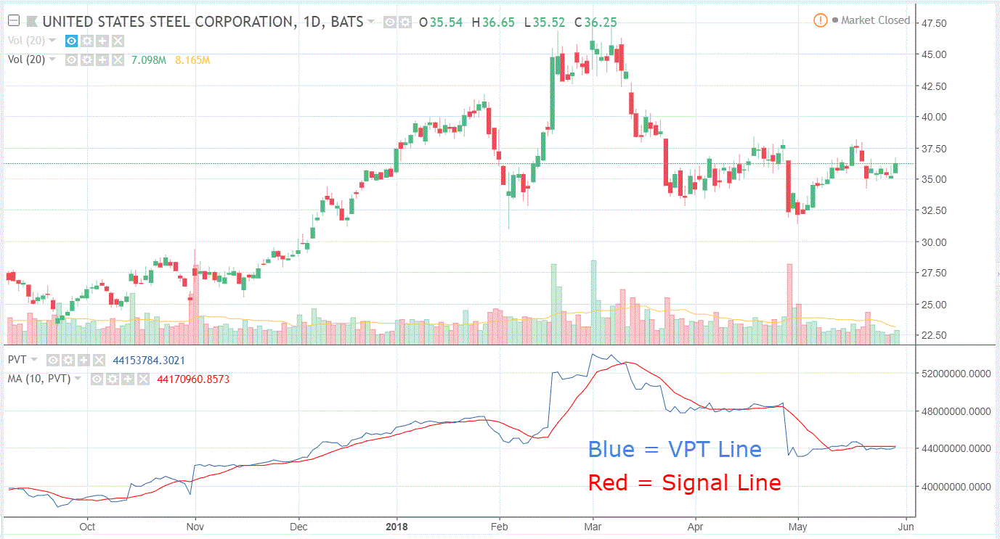

In the world of trading, indicators play a crucial role in helping traders make informed decisions. Among these, the Volume Price Trend (VPT) Indicator stands out by blending volume and price data to forecast market trends. The VPT Indicator is designed to provide traders with insights into the balance between a security's demand and supply. This balance is crucial for predicting potential price reversals and comprehending market dynamics.

The VPT Indicator's calculation involves using a simple formula to cumulatively assess buying and selling pressures in the market. This involves multiplying the change in price by the corresponding volume and adding it to the previous day's VPT value. This formula not only reveals the direction but also the strength of the price movement, offering a more comprehensive market analysis. 



Understanding and employing the VPT Indicator effectively can revolutionize algorithmic trading strategies by providing a deeper understanding of underlying market trends. Additionally, integrating the VPT with other technical tools can enhance its predictive power, thereby facilitating more precise trading decisions. This article will explore the VPT Indicator's calculation, applications, and how it can be integrated with other technical tools to optimize trading outcomes.

## Table of Contents

## Understanding the Volume Price Trend Indicator

The Volume Price Trend (VPT) Indicator is a crucial tool that merges price and volume data to analyze market buying and selling pressures. This indicator plays a vital role in helping traders determine the strength and direction of price movements in the market.

The VPT is calculated using a straightforward formula that involves a cumulative approach. The calculation begins with the previous day's VPT value. To this, a percentage change in price, multiplied by the current volume, is added. The formula is expressed as:

$$

\text{VPT} = \text{VPT}_{\text{previous}} + \left( \frac{\text{Close} - \text{Close}_{\text{previous}}}{\text{Close}_{\text{previous}}} \right) \times \text{Volume}
$$

This formula allows traders to evaluate not only the direction but also the strength of price movements. The change in price relative to the previous day is indicative of the market's trend, while the [volume](/wiki/volume-trading-strategy) component signals the intensity of the buying or selling pressure supporting this movement.

The advantage of the VPT Indicator lies in its ability to provide a comprehensive view of market dynamics by combining these two essential factors—price and volume. This combination assists traders in forecasting potential market behaviors more effectively than relying on price data alone. 

By understanding the intricacies of the VPT Indicator, traders can gain valuable insights into market trends. The VPT's ability to reflect the strength behind price movements makes it an indispensable tool for predicting future market behaviors and potential reversals.

## Applications of the VPT Indicator

The Volume Price Trend (VPT) Indicator is effectively used to identify market trends and potential reversal points, providing significant insights for traders. Its utilization primarily involves confirming existing trends, detecting divergences, and supporting volume analyses.

1. **Confirming Trends**: The VPT Indicator serves as a useful tool for trend confirmation. When the VPT line rises alongside an upward price movement, it reinforces the strength of an uptrend. Conversely, a declining VPT line during a downward price movement confirms a downtrend. This alignment between volume and price action helps traders validate the direction of the market, reducing the likelihood of acting on false signals.

2. **Detecting Divergences**: One of the most critical applications of the VPT is in recognizing divergences. A bullish divergence occurs when prices are declining while the VPT is rising, indicating a potential upward reversal. Conversely, a bearish divergence is identified when prices are rising, but the VPT begins to fall, signaling a possible downward reversal. These divergences highlight discrepancies between price movements and underlying trading volumes, offering an early warning system for potential reversals.

3. **Supporting Volume Analyses**: The VPT Indicator enhances volume analysis by providing a cumulative perspective of price changes multiplied by volume. This integration helps traders assess not just the direction but also the strength of price movements, factoring in the intensity of buying or selling pressure. Such analysis is crucial in understanding the depth of market moves and their likely sustainability.

Overall, the VPT Indicator equips traders with a robust analytical layer, complementing other technical indicators and strategies. By incorporating insights from the VPT, traders can better anticipate market dynamics and make informed trading decisions, leading to more precise and potentially profitable outcomes.

## Integrating VPT with Other Indicators

Integrating the Volume Price Trend (VPT) Indicator with additional technical indicators can enhance trading strategies by offering a more comprehensive analysis of market trends. A popular approach involves combining VPT with Moving Averages, the Moving Average Convergence Divergence (MACD), and the Relative Strength Index (RSI) to bolster decision-making and trade signal accuracy.

**Moving Averages** are widely used to smooth out price data, making it easier to identify ongoing trends by filtering out market noise. By applying a Moving Average to the VPT, traders can observe a smoothed VPT line, which helps in clarifying trend directions and attenuating short-term fluctuations. For instance, a simple moving average (SMA) or an exponential moving average (EMA) can be applied to the VPT line as follows:

```python
import pandas as pd

# Sample code to calculate SMA for VPT
def calculate_sma(vpt_series, window):
    return vpt_series.rolling(window=window).mean()
```

This smoothing technique allows traders to keep their focus on significant market movements, enhancing trend confirmation provided by the VPT.

The **Relative Strength Index (RSI)** is another valuable tool when combined with the VPT, as it helps to identify overbought or oversold conditions within a market. RSI values above 70 typically indicate overbought conditions, while values below 30 suggest oversold scenarios. By analyzing these conditions alongside VPT data, traders can derive more robust and precise trade signals. For example, when VPT points to a buying opportunity, and RSI confirms that the market is not overbought, it presents a more compelling case for entering a trade.

**Moving Average Convergence Divergence (MACD)**, another popular indicator, measures the relationship between two Moving Averages of a security's price. It further aids in identifying momentum changes, potential entry, and exit points by generating signals based on crossovers, divergence, and trends. Utilizing the MACD alongside the VPT can offer enriched insights into the market's momentum:

```python
# Sample code when using MACD indicators with VPT
def calculate_macd(price_series, short_window=12, long_window=26, signal_window=9):
    ema_short = price_series.ewm(span=short_window, adjust=False).mean()
    ema_long = price_series.ewm(span=long_window, adjust=False).mean()
    macd = ema_short - ema_long
    signal = macd.ewm(span=signal_window, adjust=False).mean()
    return macd, signal
```

When MACD shows a convergence or divergence a concurrent trend in the VPT can confirm a solid entry or [exit](/wiki/exit-strategy) point. The combination of these tools ensures a well-rounded approach to interpreting market dynamics.

Incorporating multiple indicators, such as VPT, Moving Averages, MACD, and RSI, into a single trading strategy enhances the broader understanding of market conditions, validating trading signals. This multi-layered analysis provides a robust framework for traders seeking to confirm underlying market dynamics and optimize decision-making.

## Trading with the VPT Indicator

Traders utilize the Volume Price Trend (VPT) Indicator primarily for identifying divergences and confirming price trends through signal line crossovers. A trading strategy using the VPT could involve purchasing a security when the VPT line crosses above a pre-established signal line and selling when it falls below. This approach helps traders to capitalize on the [momentum](/wiki/momentum) indicated by the volume and price dynamics.

Apart from leveraging crossovers, traders seek divergences between the VPT and the price action to spot potential entry points. A bullish divergence occurs when prices decline to a new low while the VPT does not hit a new low, suggesting weakening selling pressure. Conversely, a bearish divergence appears when prices reach a new high but the VPT fails to do so, indicating diminishing buying enthusiasm. Identifying these divergences can precede reversals, providing lucrative trading opportunities.

To mitigate risks associated with false signals, traders often employ adaptive trade management strategies such as setting stop-loss orders. These mechanisms serve as a protective measure against adverse market movements that might arise from unexpected conditions, ensuring that losses are contained.

Ultimately, the VPT reinforces informed trading decisions by confirming underlying market dynamics. By integrating the nuances of both volume and price changes, it provides a comprehensive view that aids traders in navigating complex market scenarios effectively, enhancing their ability to predict shifts and adjust their strategies accordingly.

## Pros and Cons of the VPT Indicator

The Volume Price Trend (VPT) Indicator combines price movements with volume data, allowing traders to gain deeper insights into market dynamics. By integrating these two important elements, VPT offers a comprehensive view of market behaviors, which is invaluable for confirming trends and recognizing potential reversals. 

### Advantages
One of the primary advantages of the VPT Indicator is its ability to validate trends. By correlating price changes with trading volume, the VPT can confirm the direction of a trend. For instance, an upward price movement accompanied by increasing VPT suggests strong buying pressure and a robust uptrend, whereas a downward trend with a declining VPT may indicate significant selling pressure.

Furthermore, the VPT is effective in identifying potential reversal points. Divergence between the security's price and the VPT line can serve as an early warning signal of a possible trend reversal. For example, if prices are rising but the VPT is decreasing, it may suggest weakening buying pressure and a potential bearish reversal.

### Disadvantages
Despite these advantages, the VPT Indicator is not without its limitations. Like all technical indicators, VPT can generate false signals. It may mislead traders during periods of low volume or erratic price movements, where the indicator's readings become less reliable.

The cumulative nature of the VPT can also lead to a lag effect. Since VPT adds changes in price weighted by volume cumulatively, it might react slower to recent market shifts, potentially delaying crucial trading signals.

Additionally, the VPT's reliance on historical data can limit its effectiveness in rapidly changing market environments where new information might disrupt established trends. In volatile markets, the VPT might not adapt quickly enough to provide timely insights.

### Strategic Integration
Despite these drawbacks, incorporating VPT into a broader trading strategy can enhance decision-making. By combining VPT with other indicators such as Moving Averages, MACD, or RSI, traders can offset the lag and false signals associated with VPT. This multi-indicator approach fortifies the analytical framework, thereby improving the accuracy of market predictions and contributing to more informed trading outcomes.

Ultimately, while not flawless, the VPT Indicator is a powerful tool that, when used judiciously as part of a comprehensive strategy, can yield significant benefits for traders seeking to understand market momentum and make strategic trading decisions.

## Conclusion

The Volume Price Trend (VPT) Indicator is a robust tool that offers a comprehensive perspective through the combination of volume and price data, making it immensely valuable for traders. This indicator is capable of providing insights into the intricate dynamics of supply and demand, thus aiding in the efficient prediction of market trends and potential reversals. By analyzing the relationship between volume and price movements, the VPT Indicator helps traders identify shifts in market momentum and sentiment.

To maximize its effectiveness, traders are encouraged to integrate the VPT with other technical tools, such as Moving Averages, the Moving Average Convergence Divergence (MACD), and the Relative Strength Index (RSI). This multi-faceted approach can bolster trading strategies by compensating for the individual limitations of each tool, thereby offering a more comprehensive view of market conditions and enhancing decision-making accuracy.

For both seasoned traders and individuals new to [algorithmic trading](/wiki/algorithmic-trading), a firm understanding of the VPT's mechanisms and applications can significantly contribute to trading success. The VPT equips traders with an analytical edge, empowering them to make data-driven decisions that align with underlying market dynamics.  

By incorporating the VPT into your trading strategy, you open the door to identifying opportunities that may not be immediately visible through other indicators alone. This indicator's unique blend of volume and price insights presents traders with an invaluable resource for navigating the complexities of financial markets and effectively managing trading risks.

## References & Further Reading

[1]: Achelis, S. B. (2001). ["Technical Analysis from A to Z."](https://archive.org/details/technicalanalysi00ache) McGraw-Hill Education.

[2]: Murphy, J. J. (1999). ["Technical Analysis of the Financial Markets: A Comprehensive Guide to Trading Methods and Applications."](https://archive.org/details/technicalanalysi0000murp) New York Institute of Finance.

[3]: Elder, A. (2002). ["Come Into My Trading Room: A Complete Guide to Trading."](https://www.amazon.com/Come-Into-My-Trading-Room/dp/0471225347) John Wiley & Sons.

[4]: Schwager, J. D. (1995). ["Getting Started in Technical Analysis."](https://www.amazon.com/Getting-Started-Technical-Analysis-Schwager/dp/0471295426) John Wiley & Sons.

[5]: Pring, M. J. (2002). ["Technical Analysis Explained: The Successful Investor's Guide to Spotting Investment Trends and Turning Points."](https://www.amazon.com/Technical-Analysis-Explained-Fifth-Successful/dp/0071825177) McGraw-Hill Education.