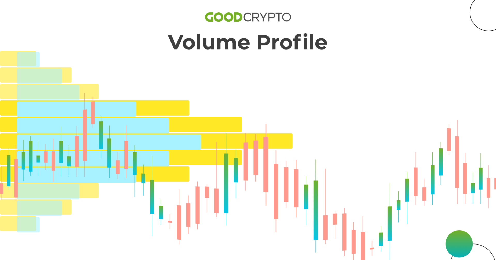

## Table of Contents

## What is volume profile analysis?

Volume profile analysis is a way to understand how much trading is happening at different price levels in the market. It shows where a lot of people are buying or selling a stock or other financial product. By looking at the volume profile, traders can see which prices are important to the market. This helps them make better decisions about when to buy or sell.

Traders use volume profile analysis to find areas where the price might stop or change direction. These areas are called support and resistance. If a lot of trading happens at a certain price, it might be hard for the price to move past that point. This information can help traders predict what the price might do next and plan their trades accordingly.

## How does volume profile analysis differ from traditional technical analysis?

Volume profile analysis and traditional technical analysis both help traders understand the market, but they focus on different things. Traditional technical analysis looks at price movements and patterns over time. It uses tools like moving averages, trend lines, and chart patterns to predict where the price might go next. This type of analysis is all about the price and how it changes, without paying much attention to the volume of trades.

On the other hand, volume profile analysis puts a lot of emphasis on the volume of trades at different price levels. It shows where a lot of buying or selling is happening, which can tell traders about important price levels that might act as support or resistance. Instead of just looking at the price, volume profile analysis helps traders see where the market's interest is concentrated. This can give them a better idea of where the price might stop or turn around.

In summary, while traditional technical analysis focuses mainly on price patterns and trends, volume profile analysis adds another layer by considering the volume of trades. This can provide a more complete picture of market behavior and help traders make more informed decisions.

## What are the key components of a volume profile chart?

A volume profile chart shows how much trading happens at different prices. The main part of the chart is the volume profile itself, which looks like a histogram on the side of the price chart. Each bar in the histogram represents the total volume of trades that happened at a specific price level. The taller the bar, the more trading happened at that price. This helps traders see where the market's interest is focused.

Another important part of a volume profile chart is the value area, which is the range of prices where most of the trading happened. It's usually shown as a shaded area on the chart. The value area can tell traders where the price is likely to stay most of the time. There's also a point of control, which is the price level with the highest volume. This is the most important price on the chart because it shows where the most trading activity happened.

These components together help traders understand the market better. By looking at the volume profile, value area, and point of control, traders can see which prices are important and where the price might stop or change direction. This information can help them make better trading decisions.

## How can volume profile analysis help in identifying support and resistance levels?

Volume profile analysis helps traders find support and resistance levels by showing where a lot of trading happens. When a lot of people buy or sell at a certain price, it creates a strong level that the price might have trouble moving past. These levels are called support if they are below the current price, and resistance if they are above it. By looking at the volume profile, traders can see where these important levels are because the volume bars will be taller at those prices.

For example, if the volume profile shows a tall bar at a certain price, it means a lot of trading happened there. This could be a sign that the price might stop or turn around when it reaches that level again. Traders can use this information to plan their trades. If the price is going down and it gets close to a strong support level shown by the volume profile, traders might decide to buy, expecting the price to bounce back up. On the other hand, if the price is going up and it gets close to a strong resistance level, traders might decide to sell, expecting the price to go back down.

## What is the significance of the Point of Control (POC) in volume profile analysis?

The Point of Control (POC) in volume profile analysis is the price level where the most trading happened. It's like the heart of the market's activity. When you look at a volume profile chart, the POC is the tallest bar in the histogram. This tells traders that this price is very important because a lot of people were interested in buying or selling at this level. It's a key piece of information because it shows where the market's attention is focused.

Traders use the POC to understand where the price might go next. If the price is near the POC, it might act as a magnet, pulling the price towards it. This can help traders decide when to buy or sell. For example, if the price is moving up and it gets close to the POC, traders might expect it to stop or slow down there. On the other hand, if the price is moving away from the POC, it might be a sign that the market is ready for a bigger move. By watching the POC, traders can make better decisions and plan their trades more effectively.

## How do traders use volume profile to determine market trends?

Traders use volume profile to understand market trends by looking at where most of the trading is happening. If the volume is high at higher prices, it might mean the market is trending up. This is because a lot of people are buying at those high prices, pushing the market higher. On the other hand, if the volume is high at lower prices, it might mean the market is trending down. This shows that many people are selling at those low prices, pulling the market down.

By looking at the volume profile over time, traders can also see if the market's interest is shifting. If the Point of Control (POC) is moving higher, it could be a sign that the market is getting stronger and the trend might continue upward. If the POC is moving lower, it might mean the market is getting weaker and the trend could keep going down. This helps traders decide when to get in or out of the market, based on where the most trading is happening and how it's changing.

## What are the different types of volume profiles and their uses?

There are a few different types of volume profiles that traders use, and each one helps them understand the market in a different way. The most common type is the standard volume profile, which shows the total volume of trades at each price level over a certain time period. Traders use this to find important support and resistance levels, and to see where the market's interest is focused. Another type is the developing volume profile, which updates in real-time as new trades happen. This helps traders see how the market is changing right now and make quick decisions based on the latest information.

Another useful type is the composite volume profile, which combines the volume data from different time periods into one chart. This can show traders the overall trend and important price levels over a longer time. Traders use this to understand the bigger picture and plan their trades based on long-term market behavior. Each type of volume profile gives traders a different view of the market, helping them make better decisions about when to buy or sell.

## How can volume profile analysis be integrated with other trading indicators?

Volume profile analysis can be used with other trading indicators to help traders make better decisions. For example, traders might use volume profile along with moving averages. Moving averages show the average price of a stock over time, and they can help traders see the overall trend. By looking at the volume profile, traders can see where a lot of trading is happening and if those levels match up with the moving averages. If the volume is high at a price that's also near a moving average, it might be a strong support or resistance level.

Another way to use volume profile with other indicators is with the Relative Strength Index (RSI). The RSI shows if a stock is overbought or oversold, which can help traders know when the price might change direction. If the RSI shows that a stock is overbought and the volume profile shows a lot of trading at a high price, it might mean the price is about to go down. By combining these two indicators, traders can get a better idea of what the market might do next and plan their trades accordingly.

## What are the common pitfalls and misconceptions about volume profile analysis?

One common pitfall with volume profile analysis is that traders might think it's a magic tool that can predict the market perfectly. But it's not. Volume profile is just one piece of the puzzle. It can help you see where a lot of trading is happening, but it doesn't tell you everything. You need to use it with other tools and your own judgment to make good trading decisions. If you rely too much on volume profile alone, you might miss important information from other parts of the market.

Another misconception is that volume profile works the same way for all types of markets and time frames. But that's not true. The way volume profile looks and what it means can change a lot depending on whether you're looking at stocks, forex, or futures, and whether you're looking at a short time frame like a few minutes or a long time frame like a few months. Traders need to understand how volume profile works in the specific market and time frame they're trading in. If they don't, they might get confused and make bad trades.

## How does volume profile analysis assist in setting stop-loss and take-profit levels?

Volume profile analysis helps traders set stop-loss and take-profit levels by showing where a lot of trading happens. If you're buying a stock, you might set your stop-loss just below a strong support level shown by the volume profile. This is because if the price drops below that level, it might keep going down. On the other hand, if you're selling a stock, you might set your stop-loss just above a strong resistance level. This way, if the price goes above that level, you can get out of your trade before it goes up even more.

For take-profit levels, volume profile can also be very useful. If you're buying a stock, you might set your take-profit near a resistance level where a lot of trading happened. This is because the price might stop or turn around at that level. If you're selling a stock, you might set your take-profit near a support level where a lot of trading happened. This way, you can take your profits before the price starts going back up. By using volume profile to set these levels, traders can manage their risk and make more informed decisions about when to get in and out of the market.

## Can volume profile analysis be applied to different time frames and markets?

Volume profile analysis can be used for different time frames and markets. It works the same way whether you're looking at a short time frame like a few minutes or a long time frame like a few months. The key is to understand how the volume profile looks and what it means in the specific time frame you're using. For example, if you're trading stocks on a daily chart, the volume profile will show you where a lot of trading happened during the day. If you're trading forex on a 5-minute chart, it will show you where a lot of trading happened in those 5 minutes.

Volume profile analysis also works well in different markets like stocks, forex, and futures. Each market has its own way of trading, but the basic idea of volume profile stays the same. In the stock market, volume profile can help you see where a lot of people are buying or selling a stock. In the forex market, it can show you where a lot of trading is happening for a currency pair. And in the futures market, it can help you understand where the most trading activity is for a futures contract. By using volume profile in different time frames and markets, traders can get a better understanding of where the market's interest is focused and make better trading decisions.

## What advanced techniques can be used to enhance the effectiveness of volume profile analysis?

One advanced technique to enhance the effectiveness of volume profile analysis is to use it with other types of charts, like market profile charts. Market profile charts show how the price moves over time and where it spends the most time. By combining volume profile with market profile, traders can see not just where a lot of trading happened, but also how the price moved around those levels. This can give them a better idea of where the price might go next and help them make more accurate predictions.

Another technique is to use volume profile to find areas where the price might change direction, called "volume nodes." These are places where a lot of trading happened in the past, and they can act as strong support or resistance levels. Traders can look for these volume nodes and use them to set their entry and exit points. For example, if the price is going up and it gets close to a high volume node, traders might expect it to stop or turn around there. By paying attention to these volume nodes, traders can improve their trading strategy and manage their risk better.

## References & Further Reading

[1]: Dalton, J., Dalton, E.T., & Jones, R.B. (2011). ["Mind Over Markets: Power Trading with Market Generated Information, Updated Edition."](https://onlinelibrary.wiley.com/doi/book/10.1002/9781118659724) Wiley.

[2]: Steidlmayer, J. & Hawkins, S. (2002). ["Steidlmayer on Markets: Trading with Market Profile, 2nd Edition."](https://www.amazon.com/Steidlmayer-Markets-Trading-Market-Profile/dp/0471215562) Wiley.

[3]: Kase, C. (1996). ["Trading with the Odds: Using the Power of Probability to Profit in the Futures Market."](https://www.amazon.com/Trading-Odds-Probability-Profit-Futures/dp/155738911X) McGraw-Hill.

[4]: Mercado, T. (2018). ["The PlayBook: An Inside Look at How to Think Like a Professional Trader."](https://www.amazon.com/PlayBook-Inside-Think-Professional-Trader/dp/0132937646) FT Press.

[5]: Moallemi, C.C. & Saglam, M. (2013). ["The Role of Volume in Algorithmic Trading"](https://moallemi.com/ciamac/papers/latency-2009.pdf) SSRN.