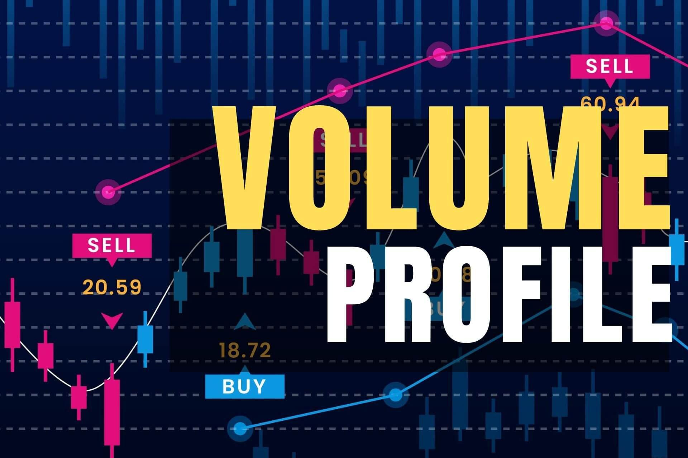

Understanding market behavior is a fundamental aspect of achieving success in trading. Among the various tools available to traders, Volume Profile Analysis stands out for its ability to provide insights into volume distribution across different price levels over a specified period. Unlike traditional volume indicators, which often focus on total volume over time, Volume Profile offers a detailed visualization that highlights how much volume is traded at specific price levels.

This article will explore the fundamental concepts of Volume Profile Analysis, particularly its use in algorithmic trading. By effectively leveraging volume data, traders can pinpoint key levels of support and resistance, which are crucial for making strategic trading decisions. Additionally, analyzing volume distribution enables traders to infer market sentiment, offering clues about the balance between buying and selling pressure at various price levels.



Volume Profile Analysis is not just about mapping volumes; it's about understanding the psychology of the market participants. By examining which price levels attracted significant trading interest, traders can anticipate potential price movements and react accordingly. This ability to infer market sentiment and recognize strategic trading zones provides a tactical edge.

In the context of algorithmic trading, integrating Volume Profile into trading strategies can lead to more informed decisions. Algorithms can be designed to utilize this data, executing trades at identified levels of support and resistance, while also adapting to changing market conditions dynamically. This approach enhances the precision and timing of trades, leading to potentially more successful outcomes.

In summary, Volume Profile Analysis is a powerful tool for traders seeking to understand and anticipate market movements, especially when used in conjunction with algorithmic trading strategies.

## Table of Contents

## What is Volume Profile Analysis?

Volume Profile Analysis is a sophisticated technical analysis tool used by traders to assess volume distribution across various price levels over a set time frame. Unlike traditional volume indicators that simply aggregate volume data over time, Volume Profile offers a detailed view by presenting a histogram on the y-axis. This visualization allows traders to see the specific prices at which trading volume is concentrated.

The key components of Volume Profile Analysis are essential to interpret market data effectively. The Point of Control (POC) is a central element and represents the price level at which the highest [volume](/wiki/volume-trading-strategy) of trades occurred. This area is particularly critical as it typically indicates a zone of high market interest where traders perceive value.

Additionally, the Value Area High (VAH) and Value Area Low (VAL) form a range that encloses the bulk of trading activity. Specifically, the Value Area is the range in which typically about 70% of the volume was traded and provides insight into the price levels where the market participants have shown significant interest over the period in question.

These elements of Volume Profile Analysis are leveraged to understand potential market reaction zones. Essentially, they help traders identify areas of potential support and resistance, which can offer insights into potential future price movements. Knowing where significant trading interest exists aids in anticipating market activity, making Volume Profile a powerful tool for traders seeking to refine their strategies.

## Applications in Trading

Volume Profile Analysis plays a pivotal role in the domain of trading by precisely defining key support and resistance levels. These levels are determined by high trading volumes at specific prices, indicating areas where significant buying and selling interest occurs. Consequently, price interactions at these levels often present lucrative trading opportunities, as traders anticipate potential reversals or breakouts.

When analyzing volume distribution, an equilibrium or balanced profile is characterized by a uniform distribution of volume around the Point of Control (POC). Such a profile suggests a stable market structure where prices are likely to hover around these levels due to balanced supply and demand. Conversely, an imbalanced profile, marked by uneven volume distribution across price levels, signals potential market transitions. Traders can anticipate directional movements as the market seeks equilibrium, making these profiles critical for forecasting price behavior.

Incorporating Volume Profile data into [algorithmic trading](/wiki/algorithmic-trading) offers numerous advantages. Algorithms can be programmed to identify significant levels such as the POC, Value Area High (VAH), and Value Area Low (VAL). By executing trades based on these critical points, traders can dynamically adapt to market conditions, optimizing entry and [exit](/wiki/exit-strategy) strategies with increased accuracy. This automation allows for real-time execution, ensuring that strategies respond with minimal latency during volatile market conditions.

Additionally, employing automated Volume Profile strategies enhances decision-making processes by providing precise market insights. Traders can harness these insights through data-driven approaches, eliminating subjective biases often associated with manual trading. This objective analysis can lead to more informed decisions and potentially higher profitability.

Overall, Volume Profile Analysis offers a structured approach to understanding market behavior. It allows traders to identify critical price levels and capitalize on market dynamics, making it an essential tool in modern trading strategies, especially when integrated within algorithmic frameworks.

## Advantages of Volume Profile Analysis

Volume Profile Analysis provides significant advantages for traders seeking enhanced insights into market dynamics. By charting the volume of trades executed at different price levels, this analysis offers a comprehensive view of market activity beyond the capabilities of traditional volume indicators.

Enhanced Market Insight is one of the primary benefits offered by Volume Profile Analysis. It reveals where the highest trading activities are concentrated, indicating the levels at which traders are most engaged. This insight helps in identifying zones of active trading interest which might serve as zones of consolidation or [breakout](/wiki/breakout-trading), providing strategic points for making trade decisions.

Strategic Trading is facilitated through the use of Volume Profile by enabling traders to develop strategies that align with overarching market trends and crucial trading zones. The visualization of volume data in relation to price levels makes it possible to discern trends more accurately, allowing traders to anticipate market movements and prepare accordingly. By understanding where volume clusters exist, traders can devise strategies that capitalize on anticipated price reactions in these zones.

Improved Precision in determining support and resistance levels is another advantage offered by Volume Profile Analysis. Unlike traditional methods, which often rely on historical price levels or arbitrary charts, Volume Profile provides data-driven insight into these critical levels. This allows traders to identify more precise levels based on trading volume, leading to more accurate and reliable trading strategies. With this precision, traders can set more effective stop-loss orders, entry points, and profit targets.

In summary, Volume Profile Analysis enhances market insight through a detailed understanding of trading volume at specific price levels. It supports strategic decision-making by allowing traders to align their strategies with volume trends and offers improved precision in identifying key support and resistance levels. These advantages collectively enable traders to execute informed and effective trades.

## Disadvantages and Limitations

Volume Profile Analysis, while a powerful tool for traders, does come with certain disadvantages and limitations that users must consider. One significant challenge is the complexity involved in accurately interpreting the data. This technique requires a deep understanding and considerable experience with interpreting volume data to effectively recognize patterns and draw actionable insights. Unlike traditional indicators, the Volume Profile displays a histogram of volume activity at different price levels, which can be intricate and necessitates a nuanced interpretation to avoid erroneous conclusions.

Moreover, Volume Profile Analysis lacks predictive power in forecasting future market movements. Although it provides valuable insights into past and present transaction volumes at varying price levels, it does not inherently predict how prices will behave in the future. This limitation is crucial to note, as traders might fall into the trap of expecting predictive accuracy and could potentially rely too heavily on Volume Profile Analysis without considering other indicators and information.

Additionally, the subjectivity inherent in interpreting Volume Profile data can result in different traders drawing different conclusions from the same data set. This subjectivity arises because there are often no definitive criteria for interpreting the significance of particular volume levels or the shape of the volume distribution. As such, the varied interpretations can lead to different trading strategies and decisions. Essentially, the data's interpretation is influenced by the trader's individual insights, biases, and strategies, making standardized analysis challenging.

In conclusion, while Volume Profile Analysis offers valuable insights for traders, acknowledging these disadvantages and limitations is essential for its effective application. Understanding its complexity, recognizing its non-predictive nature, and accounting for subjective interpretations can help traders make more balanced and informed decisions when incorporating this tool into their trading strategies.

## Volume Profile Strategies in Algorithmic Trading

Volume Profile strategies play a critical role in the development of robust algorithmic trading models. The implementation begins by collecting and preprocessing high-fidelity market data, which includes historical price and volume information at granular intervals. This data is essential for constructing precise Volume Profiles and identifying strategic market levels.

The first step in employing Volume Profile strategies is the identification of key components such as the Point of Control (POC), Value Area (VA), High Volume Nodes (HVNs), and Low Volume Nodes (LVNs). These components are used to formulate trading rules. For instance, the POC, which indicates the price level with the highest traded volume, serves as a potential pivot point for market reversals or continuations. Similarly, HVNs suggest areas with increased trading activity and potential consolidation, while LVNs highlight price levels where the market has shown less interest, possibly indicating breakout opportunities.

Algorithmic trading models incorporate these elements to generate trading signals. The precise nature of these signals depends on the rules defined around the identified Volume Profile levels. Back-testing and optimization form the backbone of this process, allowing traders to evaluate the effectiveness of their strategies by simulating them under historical market conditions. Through rigorous back-testing, traders can adjust their algorithm parameters to enhance performance metrics such as profit [factor](/wiki/factor-investing), Sharpe ratio, and drawdown.

Here is an example of how one might code a simple Volume Profile strategy in Python using a hypothetical data processing library:

```python
import hypothetical_market_data as hmd
import pandas as pd

# Fetch historical data
data = hmd.get_tick_data('S&P 500 E-mini', years=2)

# Calculate Volume Profile
vp = hmd.VolumeProfile(data)
poc, vah, val = vp.calculate_poc(), vp.calculate_vah(), vp.calculate_val()

# Define trading rules
def trading_signal(price):
    if price < val:
        return 'Buy'
    elif price > vah:
        return 'Sell'
    else:
        return 'Hold'

# Back-test the strategy
results = hmd.backtest(data, trading_signal)
performance_metrics = hmd.optimize_strategy(parameters={'thresholds': [vah, val]}, backtest_results=results)

# Output the performance results
print(performance_metrics)
```

The real-time deployment phase involves ensuring that algorithms react promptly to market conditions with minimal latency, which is vital in fast-moving markets. This involves integrating algorithms into trading platforms or direct market access (DMA) systems that can execute trades with high speed and reliability. By continually refining strategies through ongoing monitoring and adaptive learning, traders using Volume Profile in algorithmic trading can maintain an edge in decision-making accuracy and timing.

## Case Study: Algorithmic Trading Model

The primary objective of this case study is to develop an algorithmic trading model that employs Volume Profile Analysis for [day trading](/wiki/day-trading-spy) the S&P 500 E-mini futures. The strategy involves a systematic approach that encompasses data acquisition, Volume Profile calculation, strategy formulation, and back-testing.

Data acquisition is a critical first step, providing the foundation for accurate Volume Profile Analysis. In this model, tick-level data for the S&P 500 E-mini futures is collected over a period of the past two years. Tick-level data offers a granular view of market activity, allowing for precise calculation of volume distributions over varying price levels. This historical data serves as the basis for identifying patterns and key levels that can inform trading strategies.

Once the data is acquired, the next phase is the calculation of the Volume Profile. This involves determining the High Volume Nodes (HVNs), Low Volume Nodes (LVNs), Points of Control (POCs), and Value Areas on a daily basis. HVNs represent price levels where a significant amount of trading activity occurs, indicating strong areas of interest or support and resistance. Conversely, LVNs are price levels with relatively little trading activity, which may suggest potential breakout points. The POC is identified as the price level with the highest traded volume and serves as a pivotal reference point in strategy development. The Value Area defines the range where a substantial portion of the trading activity occurred, typically accounting for about 70% of the total volume.

Strategy formulation involves defining entry and exit rules based on the calculated Volume Profile metrics. Entry points can be strategically set around the POC and Value Area boundaries, taking advantage of the market's natural tendencies to oscillate around these significant levels. For instance, a typical rule might involve entering a long position when the price approaches the lower boundary of the Value Area and shows signs of reversal. Conversely, an exit may be triggered when the price reaches the POC or the upper boundary of the Value Area, depending on the prevailing market conditions.

Back-testing is an essential component of the model's development, allowing for the evaluation of the strategy's performance and efficacy. This process involves simulating the strategy on historical data to generate performance metrics such as return on investment, drawdown, and win/loss ratios. Back-testing not only assesses the initial strategy formulation but also aids in optimizing strategy parameters to enhance performance. Key considerations include adjusting entry and exit thresholds, stop-loss levels, and trade sizing based on historical success rates.

Incorporating these components effectively into an algorithmic trading model enables traders to execute day trades on the S&P 500 E-mini futures with a higher degree of precision and informed decision-making, leveraging the insights provided by Volume Profile Analysis.

## Tools and Platforms for Volume Profile

Several platforms provide essential tools for implementing Volume Profile strategies, catering to traders seeking advanced charting solutions and real-time data integration. Noteworthy platforms include TradingView, QuantConnect, Sierra Chart, and NinjaTrader. Each of these platforms offers unique features that assist in developing detailed trading strategies through customization and robust analytical capabilities.

TradingView is renowned for its user-friendly interface and comprehensive charting tools, making it ideal for traders at all levels. Its Volume Profile toolset allows users to visualize volume over specific price levels, aiding in the identification of support and resistance zones. TradingView also facilitates real-time collaboration and sharing of insights among a vast community of traders, enhancing decision-making processes.

QuantConnect offers a highly sophisticated platform geared towards algorithmic traders. It provides extensive data libraries and back-testing capabilities, allowing traders to develop, optimize, and deploy algorithms using Volume Profile data. With its integration of Python, QuantConnect enables users to write custom strategies incorporating Volume Profile metrics such as Point of Control (POC) and Value Areas, which are crucial for executing trades efficiently.

Sierra Chart is another powerful option, especially favored for its high-performance capabilities and precision. It caters to professional traders who require detailed market analysis and direct access to market data feeds. Sierra Chart’s Volume Profile tools are customizable, allowing traders to tailor their analysis according to specific trading objectives and optimize their strategies in real-time.

NinjaTrader is a versatile platform offering advanced charting and trading systems. Known for its reliability and innovative features, NinjaTrader supports the implementation of strategies based on Volume Profile analysis. Its comprehensive suite of tools includes real-time analytics and extensive historical data, helping traders refine their strategies with precision. Additionally, NinjaTrader supports automated trading systems, which can be crucial for utilizing Volume Profile in dynamic markets.

Together, these platforms equip traders with the necessary tools to harness Volume Profile effectively, enabling them to analyze market behavior, refine their strategies, and execute trades with greater precision. By leveraging the advanced capabilities these platforms provide, traders can gain a tactical advantage in the competitive landscape of financial markets.

## Conclusion

Volume Profile Analysis is a crucial tool for contemporary traders, offering detailed insights into market dynamics that go beyond the capabilities of traditional indicators. By visualizing the distribution of trading volume across different price levels, Volume Profile Analysis enables traders to identify critical support and resistance levels, making it an invaluable asset in the development of trading strategies.

Integrating Volume Profile into algorithmic trading can lead to more informed and strategic decision-making. The capability to analyze large quantities of data and act based on clearly defined volume patterns allows algorithmic systems to execute trades with increased accuracy. This integration ensures the alignment of trading decisions with market behavior, thereby enhancing the performance of trading models.

The key to successfully leveraging Volume Profile Analysis lies in continuous monitoring, back-testing, and refinement of trading strategies. By regularly evaluating the performance of trading algorithms against historical data and refining their parameters, traders can optimize their strategies to better adapt to evolving market conditions. This iterative process is essential to maintaining a competitive edge in the fast-paced world of trading.

Employing Volume Profile as a technical analysis tool enables traders to navigate market movements with a higher degree of precision and confidence. By harnessing its capabilities, traders can gain a more comprehensive understanding of market sentiment and price action, ultimately leading to greater success in the trading arena.

## References & Further Reading

[1]: Dalton, J., Dalton, E.T., & Jones, R.B. (2011). ["Mind Over Markets: Power Trading with Market Generated Information, Updated Edition."](https://onlinelibrary.wiley.com/doi/book/10.1002/9781118659724) Wiley.

[2]: Steidlmayer, J. & Hawkins, S. (2002). ["Steidlmayer on Markets: Trading with Market Profile, 2nd Edition."](https://www.amazon.com/Steidlmayer-Markets-Trading-Market-Profile/dp/0471215562) Wiley.

[3]: Kase, C. (1996). ["Trading with the Odds: Using the Power of Probability to Profit in the Futures Market."](https://www.amazon.com/Trading-Odds-Probability-Profit-Futures/dp/155738911X) McGraw-Hill.

[4]: Mercado, T. (2018). ["The PlayBook: An Inside Look at How to Think Like a Professional Trader."](https://www.amazon.com/PlayBook-Inside-Think-Professional-Trader/dp/0132937646) FT Press.

[5]: Moallemi, C.C. & Saglam, M. (2013). ["The Role of Volume in Algorithmic Trading"](https://moallemi.com/ciamac/papers/latency-2009.pdf) SSRN.