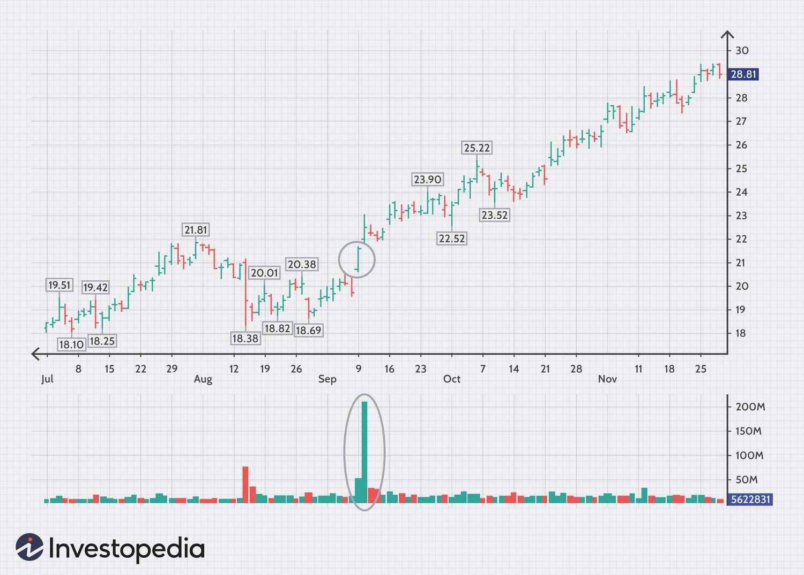

Volume Profile is a powerful trading indicator extensively utilized by algorithmic traders to assess the volume traded across various price levels. This tool provides a detailed visual representation of volume distribution by displaying a histogram along the vertical axis of a price chart. By highlighting areas of significant trading activity, Volume Profile allows traders to identify critical price levels known as volume nodes. The most crucial component of Volume Profile is the Point of Control (POC), which represents the price level with the highest volume traded during a specific period.

This article focuses on exploring various strategies that leverage Volume Profile to enhance algorithmic trading. Before delving into the strategies, we will first discuss the fundamentals of Volume Profile and its importance in trading. Understanding how volume interacts with price movements is essential for traders aspiring to gain insights into market dynamics and make informed decisions. Volume Profile provides crucial data points that help traders enhance their strategies by identifying optimal entry and exit points, setting targets, and managing risks effectively.



Furthermore, the article aims to offer actionable insights and detailed strategies for traders interested in incorporating Volume Profile into their algorithms. By analyzing Volume Profile data, traders can refine their trading methodologies and optimize their results across different market conditions. Through a comprehensive overview, this article serves as a guide for enriching trading strategies using Volume Profile, highlighting its significance as a tool for improved market analysis and decision-making.

## Table of Contents

## Understanding Volume Profile

Volume Profile offers a comprehensive visualization of how volume accumulates at various price levels over a specific period. This representation typically appears as a horizontal histogram on a price chart, detailing where most trading activity occurs. The main attributes of Volume Profile that traders examine are volume nodes, which highlight areas of significant trading activity. These nodes are crucial as they suggest potential support and resistance levels, aiding traders in decision-making.

One of the critical elements within Volume Profile is the Point of Control (POC). The POC represents the price level with the highest traded volume within the specified time frame. This price level often indicates a fair value or equilibrium point for the asset being traded because it reflects where buyers and sellers most actively engage.

The mechanics of understanding Volume Profile are straightforward yet profound in their implications. Traders apply Volume Profile to identify the POC and high volume nodes, also known as "value areas." These areas are the ranges within which a significant portion of the volume has occurred. Typically, traders consider areas where 70% of the volume has traded as the value area.

A crucial strategy implementation involves using these [volume](/wiki/volume-trading-strategy) concentrations to identify price levels that may act as barriers or support zones. The hypothesis is that high volume levels indicate strong investor interests and, hence, a potential pivot point for future price movements. Conversely, low volume areas, or volume gaps, suggest less activity, presenting potential price zones where the asset could move swiftly.

To apply these concepts algorithmically, one might code a trading bot in Python that automatically identifies the POC and value areas. Here's a simple example of how to highlight the POC and value areas in a Python script using pandas and matplotlib:

```python
import pandas as pd
import numpy as np
import matplotlib.pyplot as plt

# Example data: price and volume
data = {'price': [10, 12, 15, 18, 20, 22, 25], 
        'volume': [500, 600, 800, 200, 300, 400, 700]}

df = pd.DataFrame(data)

# Calculate the volume profile
df['volume_x_price'] = df['volume'] * df['price']
total_volume = df['volume'].sum()
POC = df.loc[df['volume'].idxmax(), 'price']

# Calculate value area
df['cum_volume'] = df['volume'].cumsum()
value_area = df.loc[df['cum_volume'] <= total_volume * 0.7, 'price']

# Plot
plt.figure(figsize=(10, 6))
plt.barh(df['price'], df['volume'], color='skyblue')
plt.axhline(y=POC, color='r', linestyle='-', label=f'Point of Control (POC): {POC}')
plt.axhspan(min(value_area), max(value_area), color='gray', alpha=0.3, label='Value Area')

plt.xlabel('Volume')
plt.ylabel('Price Level')
plt.title('Volume Profile')
plt.legend()
plt.show()
```

In conclusion, understanding Volume Profile involves recognizing how volume nodes and the POC provide insights into market sentiment and price equilibrium. This understanding is vital for implementing robust trading strategies that capitalize on these volume-based indicators.

## Incorporating Volume Profile in Algorithmic Trading Strategies

Volume Profile is an analytical tool that plays a significant role in [algorithmic trading](/wiki/algorithmic-trading) by providing insights into volume distribution across different price levels. By identifying these critical price points, traders can gain a deeper understanding of market dynamics, which aids in making informed trading decisions concerning entry, [exit](/wiki/exit-strategy), target setting, and risk management.

To integrate Volume Profile data into trading algorithms, traders need to focus on two primary tasks: automating the identification of high volume nodes and recognizing trading patterns derived from these nodes. High volume nodes, often referred to as areas of high trading activity or volume clusters, are crucial as they typically signify strong support or resistance levels.

### Automating High Volume Node Identification

Automated recognition of high volume nodes involves analyzing historical trade data to pinpoint price levels with substantial volume accumulation. This can be achieved through programming techniques that calculate volume at each price level within a specified timeframe. Python provides an efficient ecosystem for such analysis, leveraging libraries like Pandas and NumPy:

```python
import pandas as pd
import numpy as np

def calculate_volume_profile(data, price_interval):
    # Create a price range based on the data
    price_bins = np.arange(data['Low'].min(), data['High'].max(), price_interval)

    # Initialize volume profile as a dictionary
    volume_profile = {price: 0 for price in price_bins}

    # Populate volume profile
    for index, row in data.iterrows():
        # Calculate traded volume
        traded_volume = row['Volume']
        # Distribute volume across price range
        for price in price_bins:
            if row['Low'] <= price <= row['High']:
                volume_profile[price] += traded_volume

    return volume_profile

# Sample data
data = pd.DataFrame({
    'Low': [...],  # List of lows for each time interval
    'High': [...], # List of highs for each time interval
    'Volume': [...], # Corresponding traded volume
})

volume_profile = calculate_volume_profile(data, price_interval=1.0)
```

The function `calculate_volume_profile` calculates the total volume for each price level, helping identify potential high volume nodes. These nodes become candidates for setting entry and exit points within an algorithmic trading strategy.

### Incorporating Volume Profile Patterns

Recognizing trading patterns involves analyzing how price interacts with high volume nodes. Common strategies include trading signals generated when the price approaches or moves away from such nodes, indicating potential reversals or continuations.

For example, a strategy might involve entering a trade when the price revisits a high volume node after a [breakout](/wiki/breakout-trading). Algorithmic trading systems can be programmed to identify repeat behavioral patterns around these nodes and execute trades automatically, reducing the potential for human error.

Additionally, effective risk management can be accomplished by setting stop-loss and take-profit levels based on proximity to high volume nodes. If a trade moves against a node, it may indicate strong resistance, suggesting a reversal is more likely.

To summarize, leveraging Volume Profile data within algorithmic trading strategies enhances decision-making by offering a methodical approach to identifying key price levels, automating pattern recognition, and establishing robust risk management practices. These improvements are instrumental in refining trading methodologies that respond well to a range of market conditions.

## Popular Volume Profile Strategies

Volume Profile strategies are integral to successful trading as they provide insights into support and resistance levels, identify breakout opportunities, and help confirm trends through volume analysis. These strategies focus on analyzing volume nodes, consolidation zones, and volume clusters.

One of the primary strategies using Volume Profile is identifying support and resistance levels. This involves observing the volume nodes, which are price levels where significant trading activity has occurred. High volume nodes often act as strong support or resistance levels because they represent a consensus price where traders have historically shown interest. When the price approaches these levels, traders anticipate potential reversals or continuations, making these nodes pivotal for trade planning.

Another approach utilizes Volume Profile for trading range breakouts. In this strategy, traders focus on spotting consolidation zones where the price has previously oscillated within a relatively narrow range. These zones are characterized by high volume areas where significant trading has consolidated, representing a buildup in buying or selling pressure. When the price breaks out of these zones, it may signal a new trend direction, often leading to substantial price movements. Traders can automate these breakout signals in their algorithms by identifying deviations from typical volume patterns.

Traders also leverage Volume Profile to validate trend indicators. By analyzing whether a trend is supported by adequate volume, traders can assess its strength. For instance, an upward trend with increasing volume at higher price levels suggests strong buying interest, whereas decreasing volume might indicate a weakening trend. Confirming trend strength using volume data allows traders to make informed decisions about entering or exiting trades.

Volume clusters, which represent significant areas of support or resistance within the Volume Profile, offer additional trading opportunities. These clusters are identified by contiguous high volume nodes, indicating zones where the market has historically spent significant time and traded considerable volume. They act as a magnet for price action, influencing future movements. Traders strategically plan their entry and exit points around these areas, anticipating that price might react or consolidate when it approaches these clusters.

Incorporating these strategies into algorithmic trading systems can enhance efficiency and precision. For instance, a Python-based trading algorithm can utilize libraries such as `pandas` and `numpy` to analyze historical volume data and identify high volume nodes or clusters. Below is a simplified Python code snippet illustrating how a basic Volume Profile analysis might be conducted:

```python
import pandas as pd
import numpy as np

# Assume df is a DataFrame containing market data with columns 'price' and 'volume'
def calculate_volume_profile(df):
    # Create a volume profile as a dictionary {price_level: total_volume}
    volume_profile = df.groupby('price')['volume'].sum().to_dict()

    # Find high volume nodes
    high_volume_nodes = {price: vol for price, vol in volume_profile.items() if vol > np.percentile(list(volume_profile.values()), 90)}

    return high_volume_nodes

# Example usage with a sample DataFrame
df = pd.DataFrame({'price': [100, 101, 102, 100, 101, 103, 104], 
                   'volume': [200, 320, 150, 400, 600, 100, 50]})

high_volume_nodes = calculate_volume_profile(df)
print(high_volume_nodes)
```

This code calculates a basic volume profile from market data, highlighting price levels with significant traded volume. Strategies based on Volume Profile are diverse and adaptable, enabling traders to optimize their approach in various market conditions.

## Day Trading with Volume Profile

Volume Profile is a crucial tool in [day trading](/wiki/day-trading-spy) because it allows traders to analyze intraday volume data effectively, pinpointing potential price breakouts or reversals with greater accuracy. By presenting a histogram of volume at specific price levels, Volume Profile helps identify zones where significant trading activity has occurred. These high activity zones are essential for short-term traders as they provide insights into price levels that may act as support, resistance, or pivot points during the trading day.

To optimize Volume Profile setups for day trading, traders can use strategies focusing on two main elements: the Point of Control (POC) and high-volume nodes (HVNs). The POC represents the price level where the highest volume was traded and serves as a critical psychological level around which price may oscillate. High-volume nodes, on the other hand, signify areas with considerable trading interest and potential [liquidity](/wiki/liquidity-risk-premium), offering clues for potential price movement.

Day traders often monitor these levels to make more informed trading decisions. A typical application involves watching the POC. If the price approaches this level with increasing volume, it might indicate an impending breakout or reversal. Conversely, if the price moves away from the POC with significant volume decline, it could signal a continuation of the existing trend.

Python can be instrumental in setting up automated alerts for these scenarios. An example script might entail:

```python
import pandas as pd
import numpy as np

# Load intraday price and volume data
data = pd.read_csv('intraday_data.csv')

# Calculate volume at each price level
volume_profile = data.groupby('price')['volume'].sum()

# Determine POC
poc = volume_profile.idxmax()

# Identify high-volume nodes (arbitrary threshold for demonstration purposes)
hvns = volume_profile[volume_profile > (volume_profile.mean() + 2 * volume_profile.std())]

print(f"Point of Control (POC): {poc}")
print(f"High-volume Nodes: {hvns.index.tolist()}")
```

The above code helps identify key levels such as the POC and HVNs by aggregating the traded volume at each price point. It facilitates traders to automate monitoring and reacting to high activity zones.

Finally, day traders need to remain adaptable, continuously assessing volume changes throughout the day. By combining Volume Profile with real-time alerts and adjusting trading strategies to the evolving market landscape, traders can increase their chances of capitalizing on short-term opportunities while mitigating risk.

## Swing Trading with Volume Profile

Swing traders often employ Volume Profile as a tool to better understand medium-term price movements by focusing on key swing points. Volume spikes at these swing points can be indicative of potential reversals or continuations in the market, thus serving as valuable signals for traders.

Volume Profile provides a detailed visualization of how much volume has traded at each price level over a specified period. This information can be pivotal in identifying the key areas where significant buying or selling interest exists. The visual representation of volume as a histogram makes it possible for traders to spot areas of high and low activity and detect potential points of interest that might not be evident through price analysis alone.

In the context of swing trading, understanding how these volume levels interact with price movements can enhance the decision-making process. For instance, a sudden spike in volume at a particular price level could suggest an incoming trend reversal if the prior trend was exhausted. Conversely, if the trend is supported by high volume at different levels, it could imply continuation.

Swing traders can refine their strategies using Volume Profile in several ways. One approach is to look at Volume Profile in combination with traditional technical analysis tools such as moving averages and trendlines. This combined approach can confirm or contradict signals, offering a multi-faceted perspective on market dynamics. For instance, if a stock's price is approaching a key resistance level identified through Volume Profile and is also touching a downward-sloping trendline, traders might anticipate a possible reversal if there's a volume spike suggestive of strong selling pressure.

Swing traders may also use Volume Profile to identify volume clusters that correspond to significant areas of support and resistance. These clusters can act as price magnets where the trading activity naturally converges, offering potential entry and exit points. For example, a volume cluster that repeatedly wards off price advances might serve as a strong resistance level until it's breached with sufficient volume.

Here's a basic Python snippet to illustrate how swing traders might identify high-volume nodes (HVN) and low-volume nodes (LVN) using pandas, assuming that `df` is a DataFrame with columns ['price', 'volume']:

```python
import pandas as pd

# Assuming df has columns 'price' and 'volume'
price_levels = df.groupby('price')['volume'].sum()

# Assuming HVN and LVN are defined as the top and bottom 20% of volume extremes
high_volume_nodes = price_levels[price_levels > price_levels.quantile(0.80)].index
low_volume_nodes = price_levels[price_levels < price_levels.quantile(0.20)].index

print("High Volume Nodes (HVN):", high_volume_nodes)
print("Low Volume Nodes (LVN):", low_volume_nodes)
```

In essence, Volume Profile can significantly augment the swing trading arsenal, providing traders with deeper insights into volume dynamics that traditional price charts may not reveal. Understanding and applying these insights allows swing traders to optimize their strategies and improve the timing and profitability of their trades.

## Scalping Strategies with Volume Profile

Scalping is a trading strategy characterized by short holding periods and numerous trades throughout a trading session. The objective is to capitalize on small price movements, often in highly liquid markets, which necessitates precise entry and exit decisions. Volume Profile, an advanced volume analysis tool, assists scalpers in identifying critical liquidity zones and volume surges, essential for optimizing trades in fast-moving market conditions.

Volume Profile creates a detailed histogram displaying traded volumes at specific price levels, highlighting price zones with significant trading activity. This information is crucial for scalpers, as these areas of high volume, or liquidity zones, often represent strong potential for quick trades. In a [scalping](/wiki/gamma-scalping) context, these zones serve as benchmarks for entering and exiting trades with minimal slippage.

Accurate identification of volume surges is another fundamental aspect of scalping with Volume Profile. When a significant shift in volume occurs at a particular price level, it can indicate a potential breakout or reversal. Scalpers use these surges as signals to adjust their trading strategies promptly. For instance, a sudden increase in volume can suggest an impending breakout, offering scalpers an opportunity to enter trades aligned with the new market direction.

To implement scalping strategies effectively using Volume Profile, traders can automate the monitoring of volume changes and liquidity zones through algorithmic methods. Python, a preferred tool for algorithmic trading, offers libraries such as Pandas and NumPy to handle real-time data analysis. Here is a simplified example of how Python can be used to detect volume surges at specific price levels:

```python
import pandas as pd
import numpy as np

# Example data: price and volume at each timestamp
data = {'price': [100, 101, 102, 103, 104],
        'volume': [200, 250, 500, 300, 1000]}
df = pd.DataFrame(data)

# Calculate Volume Profile histogram
volume_profile = df.groupby('price')['volume'].sum()

# Function to detect volume surges
def detect_volume_surge(vp, threshold):
    surges = vp[vp > threshold].index.tolist()
    return surges

# Define a threshold for volume surges
volume_threshold = 400

# Identify price levels with significant volume surges
significant_levels = detect_volume_surge(volume_profile, volume_threshold)

print("Significant Volume Surges Detected at Prices: ", significant_levels)
```

By continuously adjusting strategies based on real-time Volume Profile data, scalpers can enhance their ability to exploit intraday [volatility](/wiki/volatility-trading-strategies). Furthermore, [backtesting](/wiki/backtesting) these strategies under various market conditions is essential to refining parameters and ensuring robustness.

Volume Profile's insights into liquidity distribution and volume dynamics make it a powerful tool for scalpers aiming to excel in volatile markets. Precision in execution, supported by a systematic approach to volume analysis, forms the cornerstone of successful scalping strategies.

## Backtesting and Optimization

Backtesting is an essential step when incorporating Volume Profile strategies into algorithmic trading. By testing strategies against historical market data, traders can evaluate their effectiveness and identify necessary adjustments. This process helps ascertain how well a strategy might perform under various market conditions and informs necessary refinements for optimization.

### Backtesting Techniques

To conduct efficient backtesting of Volume Profile strategies, traders should first ensure they have access to high-quality historical data. This data should include detailed price and volume information at different levels, as it is critical for analyzing Volume Profile distributions.

Traders typically follow these steps in backtesting:

1. **Define the Strategy**: Clearly outline the rules and parameters of the Volume Profile strategy, including specific volume nodes or clusters that will inform trading decisions.

2. **Select Data**: Use historical data relevant to the asset class being traded. Ensure the data's timeframe aligns with the strategy's intended use, whether for day trading, swing trading, or scalping.

3. **Implemented Performance Metrics**: Decide on key performance indicators (KPIs) to evaluate, such as profit and loss, win rate, drawdown, and risk-reward ratio.

4. **Automate the Process**: Use algorithmic tools to run the strategy against historical data. Python, with libraries such as Pandas and backtrader, can automate this efficiently. A typical backtest script might look like this, using Python:

   ```python
   import backtrader as bt

   class VolumeProfileStrategy(bt.Strategy):
       def __init__(self):
           self.poc = self.calculate_poc(...)

       def calculate_poc(self, data):
           # Implement Point of Control calculation
           pass

       def next(self):
           # Implement trading logic based on Volume Profile analysis
           pass

   cerebro = bt.Cerebro()
   cerebro.addstrategy(VolumeProfileStrategy)
   data = bt.feeds.YahooFinanceData(dataname='AAPL', fromdate=<start_date>, todate=<end_date>)
   cerebro.adddata(data)
   cerebro.run()
   ```

5. **Analyze Results**: Review the outputs to assess the strategy's robustness. Pay special attention to how it performs across different market conditions, like trending, ranging, or volatile markets.

### Optimization of Volume Profile Parameters

Optimizing Volume Profile parameters is an iterative process that can significantly enhance strategy performance. Parameters such as the lookback period for calculating the Volume Profile and the thresholds for defining significant volume nodes are crucial.

1. **Sensitivity Analysis**: Vary the parameters incrementally to observe changes in performance metrics. This process helps identify optimal values that maximize returns while maintaining acceptable risk levels.

2. **Parameter Exploration**: Use optimization algorithms, such as grid search or genetic algorithms, to efficiently explore a wide parameter space. Python packages such as SciPy can assist in running these algorithms.

3. **Robustness Testing**: After optimization, test the strategy with out-of-sample data to ensure it has not been overfitted to historical data. This step ensures the strategy remains effective under unseen market conditions.

### Adapting to Market Conditions

Market conditions can shift unpredictably, necessitating ongoing monitoring and adaptation of strategies. Volume Profile strategies, like other trading systems, should be re-evaluated periodically to ensure alignment with current market dynamics. Traders can employ [machine learning](/wiki/machine-learning) techniques to assist in dynamically adjusting strategy parameters, ensuring optimal performance in varied market environments.

In conclusion, backtesting and optimizing Volume Profile strategies enable traders to fine-tune their approach for better performance. By carefully evaluating historical data and continuously refining parameters, traders can enhance their algorithmic trading outcomes and remain agile in the face of changing markets.

## Conclusion

Volume Profile is a versatile tool that significantly enhances algorithmic trading by providing a detailed understanding of market dynamics through volume distribution analysis. By mapping out the volume traded at various price levels, it uncovers the price points that are of paramount interest to market participants, which in turn aids traders in making informed decisions. Through the integration of Volume Profile into trading algorithms, traders can refine their entry and exit strategies, improve risk management, and optimize overall trading outcomes.

Utilizing Volume Profile, traders gain the ability to pinpoint key support and resistance levels, identify potential breakout zones, and validate trend strength—all critical factors for successful trading strategies. The Point of Control (POC), high and low volume nodes, and volume clusters serve as essential indicators within the Volume Profile toolset, helping to interpret market conditions and anticipate movement patterns. These elements empower traders to adapt their strategies dynamically, ensuring their trading approach remains effective across varying market environments.

For those engaged in algorithmic trading, exploring Volume Profile strategies allows for an enhanced understanding of market psychology and its tangible impacts on price movements. The strategic application of this information enables traders to tailor their algorithms, enhancing precision and adaptability in responding to market shifts. Given the complexity and fluidity of financial markets, incorporating Volume Profile into trading strategies provides an edge that is increasingly vital for achieving optimized trading performance.

We urge traders to continue their engagement with these sophisticated methodologies, continuously refining and adjusting their strategies in tandem with the evolving market landscapes. Ultimately, the creativity and ingenuity applied in leveraging Volume Profile can be a decisive [factor](/wiki/factor-investing) in achieving sustainable trading success.

## Frequently Asked Questions (FAQ)

### Frequently Asked Questions (FAQ)

**How can Volume Profile be used for identifying support and resistance levels?**

Volume Profile is a valuable tool for identifying support and resistance levels in trading. It records the traded volume at specific price levels during a given period, representing these levels as a histogram on the y-axis next to the price chart. When combined with price data, Volume Profile highlights areas where high trading volume has occurred, marking strong support and resistance levels. These are often seen at nodes where the histogram protrudes significantly, indicating that the price has either struggled to move past (resistance) or has consistently found buyers or sellers (support). Traders utilize these levels to predict potential price reversals or continuation points, capitalizing on the historical behavior of price interaction at these levels.

**How does Volume Profile contribute to understanding market dynamics?**

Volume Profile contributes to understanding market dynamics by providing insight into the activity and intention of market participants at various price points. This visibility into the volume of trades at discrete price levels helps traders comprehend the supply and demand dynamics in the market. The Point of Control (POC), which represents the price level with the highest volume, is particularly significant. It often acts as a magnet for price action, as it reflects a consensus value among traders. By observing how the traded volume is distributed across price levels, traders can deduce whether a market is trending, ranging, or poised for a reversal, and make informed decisions based on these insights.

**What do Volume Profile patterns reveal in trading?**

Volume Profile patterns provide critical insights into potential trading opportunities by highlighting areas of market interest and inactivity. Common patterns include volume spikes, which indicate strong interest at specific price levels, often leading to breakouts or high volatility movements. Conversely, low volume areas, or volume gaps, may suggest resistance to price movement and potential for reversal if crossed. Additionally, the shape of the Volume Profile can facilitate the identification of market structures, such as accumulation and distribution phases. These patterns indicate ongoing market sentiment and can forecast potential shifts, guiding traders in strategy development and execution.

## References & Further Reading

[1]: ["Advances in Financial Machine Learning"](https://www.amazon.com/Advances-Financial-Machine-Learning-Marcos/dp/1119482089) by Marcos Lopez de Prado

[2]: ["Evidence-Based Technical Analysis: Applying the Scientific Method and Statistical Inference to Trading Signals"](https://www.amazon.com/Evidence-Based-Technical-Analysis-Scientific-Statistical/dp/0470008741) by David Aronson

[3]: ["Machine Learning for Algorithmic Trading"](https://github.com/stefan-jansen/machine-learning-for-trading) by Stefan Jansen

[4]: ["Quantitative Trading: How to Build Your Own Algorithmic Trading Business"](https://www.amazon.com/Quantitative-Trading-Build-Algorithmic-Business/dp/1119800064) by Ernest P. Chan