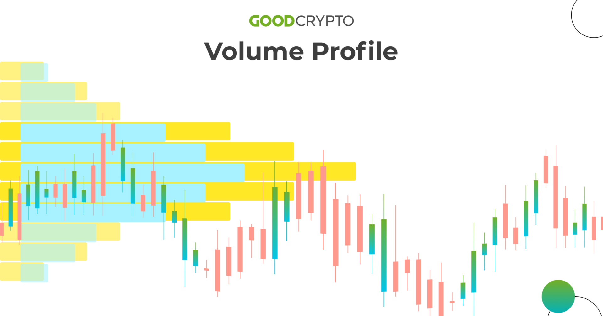

## Table of Contents

## What is a Volume Profile Indicator?

A Volume Profile Indicator is a tool used in trading to show how much trading activity, or volume, happens at different price levels over a period of time. It helps traders see where most of the trading is happening, which can tell them where the price might go next. The indicator creates a kind of graph that looks like a histogram, where the height of each bar shows the amount of volume at that price level.

Traders use the Volume Profile Indicator to find important price levels, like support and resistance. Support is a price level where the price tends to stop falling, and resistance is where it tends to stop rising. By looking at where the volume is highest, traders can guess where these levels might be. This can help them make better decisions about when to buy or sell.

## How does the Volume Profile Indicator work?

The Volume Profile Indicator works by showing how much trading happens at different prices over time. It makes a graph that looks like a bunch of bars, where each bar shows how much trading happened at a certain price. The taller the bar, the more trading happened at that price. This helps traders see where a lot of people are buying or selling, which can tell them important things about the market.

Traders use this graph to find special price levels called support and resistance. Support is a price where the price stops going down because a lot of people want to buy there. Resistance is a price where the price stops going up because a lot of people want to sell there. By looking at where the bars are tallest on the Volume Profile, traders can guess where these support and resistance levels might be. This helps them decide when it might be a good time to buy or sell.

## Why is the Volume Profile Indicator important in trading?

The Volume Profile Indicator is important in trading because it shows where a lot of trading is happening at different prices. This helps traders see where other people are buying and selling a lot, which can tell them where the price might go next. By looking at the Volume Profile, traders can find important price levels called support and resistance. Support is where the price might stop going down because many people want to buy there. Resistance is where the price might stop going up because many people want to sell there. Knowing these levels can help traders make better decisions about when to buy or sell.

Using the Volume Profile Indicator also helps traders understand the market better. It shows them where the most important trading is happening, which can tell them a lot about what other traders are thinking. This can help them guess if the price is likely to go up or down. By using this information, traders can plan their trades more carefully and maybe make more money. So, the Volume Profile Indicator is a useful tool that can help traders do better in the market.

## What are the basic components of a Volume Profile?

A Volume Profile has two main parts: the price levels and the [volume](/wiki/volume-trading-strategy) at each price level. The price levels are shown on one side of the graph, usually the vertical side. Each price level represents a different price where trading happened. The volume at each price level is shown by bars on the graph. The taller the bar, the more trading happened at that price. This helps traders see where a lot of buying and selling is happening.

The Volume Profile also shows something called the Point of Control (POC). The POC is the price level where the most trading happened. It's the tallest bar on the graph. Traders look at the POC to see where the market is most interested. Besides the POC, the Volume Profile can show other important areas where a lot of trading happened. These areas can help traders find support and resistance levels, which are prices where the market might stop moving up or down.

## How can beginners use the Volume Profile Indicator to identify support and resistance levels?

Beginners can use the Volume Profile Indicator to find support and resistance levels by looking at the graph it makes. The graph shows bars at different prices, and the taller the bar, the more trading happened at that price. To find support, beginners should look for the lowest price where there's a tall bar. This means a lot of people bought at that price, so it might be a good place for the price to stop going down. For resistance, they should look for the highest price with a tall bar. This means a lot of people sold at that price, so it might be a good place for the price to stop going up.

It's also helpful for beginners to find the Point of Control (POC) on the Volume Profile. The POC is the price with the tallest bar, where the most trading happened. This can be a strong support or resistance level because it shows where the market is most interested. By watching these levels, beginners can see if the price is likely to bounce back from support or get pushed back from resistance. This can help them decide when to buy or sell, making their trading decisions easier and more informed.

## What are some common Volume Profile trading strategies for intermediate traders?

Intermediate traders can use the Volume Profile Indicator to find good times to buy or sell by looking for areas where a lot of trading happens. One common strategy is to buy near the support levels shown by the Volume Profile. Support is where the price might stop going down because many people want to buy there. Traders look for the lowest price with a tall bar on the Volume Profile, which means a lot of trading happened there. If the price gets close to this level again, it might be a good time to buy because the price could bounce back up.

Another strategy is to sell near the resistance levels shown by the Volume Profile. Resistance is where the price might stop going up because many people want to sell there. Traders look for the highest price with a tall bar on the Volume Profile, which means a lot of trading happened there. If the price gets close to this level again, it might be a good time to sell because the price could start going down. By using these strategies, intermediate traders can make better decisions about when to enter or [exit](/wiki/exit-strategy) trades based on where a lot of trading is happening.

## How can the Volume Profile Indicator be combined with other technical indicators for better results?

Intermediate traders can combine the Volume Profile Indicator with other technical indicators to get better results. One common way is to use it with moving averages. A moving average is a line on a chart that shows the average price over a certain time. Traders can look at the Volume Profile to find support and resistance levels, and then use the moving average to see if the price is likely to bounce off these levels. If the price is near a support level shown by the Volume Profile and it's also near the moving average, it might be a good time to buy because the price could go up.

Another way to use the Volume Profile Indicator is with the Relative Strength Index (RSI). The RSI shows if a stock is overbought or oversold, which means if the price has gone up too much or down too much. Traders can look at the Volume Profile to find resistance levels, and then check the RSI. If the price is near a resistance level and the RSI shows the stock is overbought, it might be a good time to sell because the price could go down. By using the Volume Profile with other indicators like moving averages and RSI, traders can make better decisions about when to buy or sell.

## What are the key differences between Volume Profile and Volume Weighted Average Price (VWAP)?

Volume Profile and Volume Weighted Average Price (VWAP) are both tools that traders use to understand the market, but they show different things. Volume Profile shows how much trading happens at different prices over time. It makes a graph that looks like a bunch of bars, where each bar shows how much trading happened at a certain price. The taller the bar, the more trading happened there. This helps traders see where a lot of people are buying or selling, which can tell them where the price might go next. They can use this to find important price levels called support and resistance.

On the other hand, VWAP is a single line on a chart that shows the average price of a stock, taking into account both the price and the volume of trades. It's calculated by adding up the total value of all trades and dividing it by the total volume of trades. VWAP helps traders see if the current price is a good deal compared to the average price throughout the day. If the price is below the VWAP, it might be a good time to buy because the price is lower than average. If the price is above the VWAP, it might be a good time to sell because the price is higher than average. So, while Volume Profile shows where trading is happening at different prices, VWAP shows the average price considering the volume.

## How can advanced traders use Volume Profile to anticipate market trends and reversals?

Advanced traders can use Volume Profile to anticipate market trends by looking at where the most trading is happening. They pay close attention to the Point of Control (POC), which is the price level with the tallest bar on the Volume Profile. This shows where the most trading happened, and it can be a strong indicator of where the market might be heading. If the price keeps coming back to the POC, it might mean that the market is trending towards that price. Traders can use this information to guess if the price will keep going up or down, helping them decide when to buy or sell.

To anticipate market reversals, advanced traders look for changes in the Volume Profile over time. They watch for new areas of high volume that form away from the current POC. If a new area of high volume starts to form at a different price, it might mean that the market is getting ready to change direction. For example, if the price has been going up but a new high volume area forms at a lower price, it could be a sign that the price might start going down soon. By watching these changes, advanced traders can get ready for a market reversal and make trades that take advantage of the new trend.

## What are the limitations and potential pitfalls of using the Volume Profile Indicator?

Using the Volume Profile Indicator can be helpful, but it has some limitations. One big problem is that it looks at past trading data, so it can't predict the future perfectly. The market can change quickly because of news or other things that the Volume Profile can't see. Also, the Volume Profile might not work well for all types of trading. It's better for markets where a lot of trading happens, like stocks or futures. If there's not much trading, the Volume Profile might not show clear support and resistance levels.

Another potential pitfall is that traders might read the Volume Profile wrong. They might think a high volume area means the price will go up or down, but it's not always that simple. Sometimes, high volume can mean different things depending on what's happening in the market. Also, relying too much on the Volume Profile without looking at other things like news or other indicators can lead to bad trading decisions. It's important for traders to use the Volume Profile along with other tools to get a better picture of what's happening in the market.

## How can expert traders optimize their Volume Profile strategies using algorithmic trading?

Expert traders can use [algorithmic trading](/wiki/algorithmic-trading) to make their Volume Profile strategies better. They can write computer programs that look at the Volume Profile and make trades automatically. These programs can watch the market all the time and find the best times to buy or sell based on where the most trading is happening. For example, if the program sees that the price is near a support level with a lot of volume, it can buy the stock right away. This can help traders make decisions faster and not miss good chances to trade.

Another way expert traders can use algorithms with Volume Profile is to test different trading ideas. They can run the program many times with old market data to see how well their strategies would have worked in the past. This is called [backtesting](/wiki/backtesting). By doing this, traders can find out which Volume Profile strategies work best and make them even better. They can also set up the program to change the strategy a little bit over time, so it keeps working well even when the market changes. This can help traders make more money and do better in the market.

## What are some case studies or real-world examples of successful Volume Profile trading strategies?

One real-world example of a successful Volume Profile trading strategy comes from a trader who used it to find good times to buy and sell a stock. The trader looked at the Volume Profile and saw that there was a lot of trading happening at a certain price, which was the Point of Control (POC). The trader decided to buy the stock when the price got close to this POC because it showed that many people were interested in the stock at that price. Over time, the price kept coming back to the POC, and the trader made money by buying near the POC and selling when the price went up. This showed how the Volume Profile can help traders find strong support levels and make good trading decisions.

Another example is from a trader who used the Volume Profile to spot a market reversal. The trader noticed that the price had been going up, but a new area of high volume started to form at a lower price. This new high volume area was away from the current POC, which suggested that the market might be getting ready to change direction. The trader decided to sell the stock when the price got close to this new high volume area. Soon after, the price did start to go down, and the trader made a profit by selling before the price dropped. This case shows how the Volume Profile can help traders anticipate when the market might reverse and make trades that take advantage of the new trend.

## References & Further Reading

[1]: ["Advances in Financial Machine Learning"](https://www.amazon.com/Advances-Financial-Machine-Learning-Marcos/dp/1119482089) by Marcos Lopez de Prado

[2]: ["Evidence-Based Technical Analysis: Applying the Scientific Method and Statistical Inference to Trading Signals"](https://www.amazon.com/Evidence-Based-Technical-Analysis-Scientific-Statistical/dp/0470008741) by David Aronson

[3]: ["Machine Learning for Algorithmic Trading"](https://github.com/stefan-jansen/machine-learning-for-trading) by Stefan Jansen

[4]: ["Quantitative Trading: How to Build Your Own Algorithmic Trading Business"](https://www.amazon.com/Quantitative-Trading-Build-Algorithmic-Business/dp/1119800064) by Ernest P. Chan