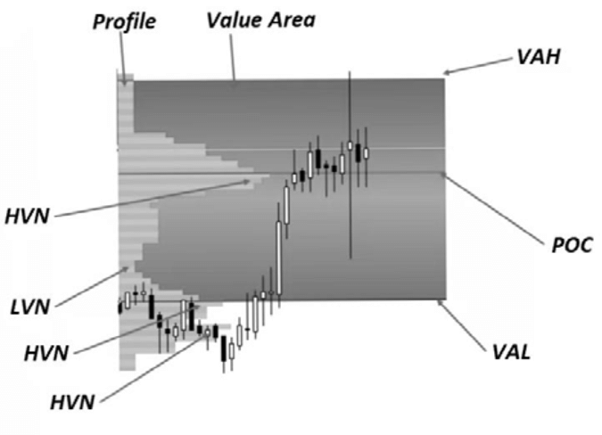

Volume Profile is a sophisticated trading analysis tool that represents trading activity over a specified time period at certain price levels. This tool charts the amount of volume traded at different price points, helping traders to understand market participants' behavior and identify key trading levels. Unlike traditional volume indicators that display volume traded over time, volume profile provides insights into volume traded at specific price levels, offering a more profound understanding of supply and demand dynamics in the market.

The concept of Volume Profile emerged from the field of Market Profile, a trading methodology developed by J. Peter Steidlmayer in the 1980s. Steidlmayer's work, initially intended for the agricultural markets, sought to [organize market data](https://paperswithbacktest.com/datasets) in a way that revealed patterns of trading activity. Over time, this evolved into the Volume Profile we know today, which has been adapted for various markets including stocks, futures, and forex. The evolution of Volume Profile analysis was significantly influenced by [the advent of electronic trading, which provided more data](https://blog.paperswithbacktest.com/p/how-to-collect-data-for-backtesting) and greater accessibility to traders.

Volume Profile's unique approach to analyzing market structure offers traders a visual representation of where and how much volume was traded within a given time frame. This information is pivotal in identifying high-volume nodes (HVN) where a significant amount of trading activity has occurred, and low-volume nodes (LVN), which are price levels with less trading activity. These nodes can provide critical insights into market direction and potential areas of support and resistance.

The application of Volume Profile extends beyond just identifying high and low volume areas. It also includes the analysis of the Value Area - the price range where a significant portion of trading volume has taken place, and the Point of Control - the price level with the highest trading volume in the specified range. [This comprehensive data](https://paperswithbacktest.com/datasets) helps traders make more informed decisions, predicting potential price movements based on past trading activity.

# Understanding Volume Profile

Volume Profile is a vital tool in the arsenal of modern traders, offering a nuanced view of the market that goes beyond traditional volume analysis. It represents a charting technique that displays the amount of traded volume at specific price levels over a given period. This method differs from traditional volume analysis, which simply shows the total volume traded during a particular time frame, without considering the price levels at which trades occurred.

The significance of Volume Profile lies in its ability to reveal key price levels where significant trading activity has taken place. This information is crucial for understanding market structure, identifying potential areas of support and resistance, and discerning the intentions of market participants. Traders can use this [data to make more informed decisions](https://paperswithbacktest.com/datasets), particularly in terms of entry and exit points, and to predict possible price movements based on past trading activity.

One of the primary advantages of Volume Profile over traditional volume analysis is its depth. While traditional volume analysis provides a one-dimensional view, showing how much trading occurred over a period, Volume Profile offers a two-dimensional perspective. It shows not only how much trading occurred, but also at which prices trading was most and least active. This distinction is critical for understanding market dynamics more thoroughly.

High Volume Nodes (HVN), or areas where a large amount of trading has occurred, can signify strong support or resistance levels, as these are prices at which a significant number of market participants have shown interest. Conversely, Low Volume Nodes (LVN) indicate price levels with relatively little trading activity, which can often lead to quick price movements through these areas.

The concept of Value Area, typically encompassing around 70% of the total volume, and the Point of Control, the price level with the most trading activity, are also pivotal. They can provide insights into market equilibrium and the balance between supply and demand at certain price levels.

In comparison to traditional volume analysis, Volume Profile offers a more detailed and nuanced view of the market. It aids traders in understanding not just how much was traded, but more importantly, where it was traded, offering a [clearer picture of market sentiment](https://paperswithbacktest.com/paper/market-sentiment-and-an-overnight-anomaly) and potential future movements.

For those seeking a deeper understanding of Volume Profile, "Trading with Market Profile" by Peter Steidlmayer and James Dalton serves as a foundational text. This book delves into the intricacies of market profile and volume analysis, providing valuable insights for traders looking to incorporate these concepts into their trading strategies[1].

# Components of Volume Profile

## High Volume Nodes (HVN)

High Volume Nodes (HVN) are pivotal components within Volume Profile analysis and hold significant importance in trading strategies. HVNs are areas on a volume profile chart where a substantial amount of trading activity has occurred. These zones are identified by a higher concentration of volume over a specific price range, indicating a price level at which a large number of shares, contracts, or lots were traded.

The significance of HVNs in trading stems from their ability to highlight key areas of market interest. Since a high volume of trades has occurred at these levels, they often represent prices at which a significant balance between buyers and sellers has been found. This can manifest as either strong support or resistance areas in the market, depending on the context of the prevailing trend and market conditions.

In a practical trading scenario, HVNs can be used to identify potential reversal or consolidation areas. For instance, in an [uptrend](https://paperswithbacktest.com/paper/does-trend-following-work-on-stocks), a HVN could indicate a level where buying pressure was previously strong, suggesting that the price might find support here on a pullback. Conversely, in a downtrend, a HVN might act as a resistance area where selling pressure was previously significant.

Moreover, HVNs can also be used to [gauge the strength of a trend](https://paperswithbacktest.com/paper/does-trend-following-work-on-stocks). A move away from a HVN may indicate the initiation of a strong trend, while a return to a HVN might suggest [weakening momentum](https://paperswithbacktest.com/paper/fact-fiction-and-momentum-investing) or a potential reversal. Traders often watch how the price behaves around these levels to make informed decisions about entry and exit points.

In addition to their role in identifying support and resistance, HVNs can also be useful in setting stop-loss orders. Traders might place stop-loss orders just beyond a HVN, as a move beyond [these levels could signify a change in market sentiment](https://paperswithbacktest.com/paper/market-sentiment-and-an-overnight-anomaly).

It is important to note that the interpretation of HVNs should be done in the context of the overall market conditions and in conjunction with other trading indicators and analysis methods. HVNs are not standalone signals but rather key elements in a broader analytical framework.

## Low Volume Nodes (LVN)

Low Volume Nodes (LVN) are a critical component of Volume Profile analysis and play a significant role in trading decisions. LVNs represent price levels within a chart where trading activity has been minimal. These are the areas where the volume is noticeably lower compared to surrounding price levels, indicating a lack of interest or consensus among traders at these prices.

The significance of LVNs in trading lies in their ability to act as potential areas of rapid price movement. Since these levels have seen relatively little trading activity, they typically offer less resistance or support. In practical terms, when a price reaches an LVN area, it is more likely to move quickly through this level, as there is little trading volume to absorb or resist the price movement.

For traders, LVNs can be used as strategic points for planning trades. For example, in a breakout strategy, an LVN can signal a potential entry or exit point. If the price breaks through an LVN area, it might continue to move rapidly in the direction of the breakout, as there is little volume to stop or slow down the movement. This makes LVNs particularly useful for traders looking for [momentum-based trades](https://paperswithbacktest.com/paper/fact-fiction-and-momentum-investing).

Moreover, LVNs can also serve as areas to place stop-loss orders. Since the price is expected to move quickly through these areas, placing a stop-loss order just beyond an LVN can help in minimizing potential losses if the market moves against a trader's position.

It's important to note that while LVNs can indicate areas of quick price movement, they should not be used in isolation. Successful traders combine LVN analysis with other trading tools and indicators, such as trend lines, moving averages, and other forms of technical analysis, to validate their trading decisions.

## Value Area (VA)

The Value Area (VA) is a fundamental concept in Volume Profile analysis that holds significant importance for traders. It is defined as the price range where a specified percentage, typically around 70%, of the trading volume has occurred. This area is bounded by the upper and lower value area limits, often referred to as Value Area High (VAH) and Value Area Low (VAL).

The importance of the Value Area in trading is manifold. Primarily, it represents the range of prices where the majority of trading activity took place, indicating a consensus of value among market participants. Prices within the Value Area are considered 'fair' by the market, and as such, they often act as strong levels of support and resistance. When prices are within the Value Area, the market is perceived to be in balance, and trading within these limits often indicates a less aggressive, more stable market environment.

When prices move outside the Value Area, it suggests a potential imbalance in the market. A breakout above the VAH or below the VAL can indicate a shift in market sentiment, potentially leading to the development of a new trend. Conversely, a rejection at these boundaries can signal a return to the established value range and the continuation of the existing market condition.

Traders utilize the Value Area to make strategic decisions. It can be used to identify potential entry and exit points, set stop-loss orders, and gauge market sentiment. For instance, a trader might look for buying opportunities near the VAL in an uptrend or selling opportunities near the VAH in a downtrend. Additionally, the width of the Value Area can provide insights into market volatility – a wide Value Area suggests a more volatile market, while a narrow Value Area indicates less volatility.

In terms of strategy, the concept of the Value Area is often used in conjunction with other Volume Profile components, like High Volume Nodes (HVN) and Low Volume Nodes (LVN), to create a comprehensive picture of market dynamics.

## Point of Control (POC)

The Point of Control (POC) in Volume Profile analysis is a critical concept that represents the price level with the highest traded volume over a specified period. It is essentially the focal point of market activity within a given volume profile, indicating where the most significant amount of trading has occurred.

The POC's role in trading is multifaceted. It serves as a key indicator of where the majority of market participants have agreed on value. This level is often considered a strong area of support or resistance; prices tend to gravitate towards the POC, as it reflects the price at which the most substantial amount of trading activity has taken place. In a stable market, the price often oscillates around the POC, indicating a balance between buyers and sellers.

In terms of strategy, the POC can be used in multiple ways:

1. **Reference Point for Trades**: Traders often use the POC as a reference point for establishing trade entries, exits, and stop-loss levels. For instance, in a ranging market, buying near the POC with a stop loss below the Value Area Low can be a strategy, expecting the price to return to this area of high volume.
2. **Trend Confirmation**: A move away from the POC can indicate strength in a particular direction. If the price moves and stays away from the POC, it may suggest a strong trend away from the previously agreed-upon value.
3. **Market Sentiment Indicator**: The location of the POC, relative to the current price, can indicate market sentiment. If the POC is below the current price in an uptrend, it can be seen as bullish, and vice versa in a downtrend.

It's important to note that the POC is dynamic and changes as new trading data comes in. Continuous adjustment of the POC can provide real-time insights into changing market sentiment and dynamics.

## Clearance

Clearance in the context of Volume Profile analysis is a concept that refers to the price areas on a chart where there is a significant drop in trading volume. It is characterized by a noticeable gap or reduction in volume between two areas of higher volume. These areas are often found between High Volume Nodes (HVN) and Low Volume Nodes (LVN) and are indicative of price levels where there is a relative consensus of value, causing the price to move quickly through these levels.

The relevance of clearance in trading is significant as it provides insights into potential price movement. When the price enters a clearance area, it tends to move through this area rapidly until it reaches a level with more substantial volume (HVN or LVN). This characteristic makes clearance areas particularly useful for identifying potential breakout or breakdown points. For example, if the price breaks through a resistance level and enters a clearance zone, it may continue to rise quickly until it reaches the next area of significant volume.

Moreover, clearance areas can be strategic for setting stop-loss orders. Placing stop-loss orders just beyond a clearance area can be effective as these areas are expected to see rapid price movements. If the price does move back into the clearance area, it could indicate a potential reversal or weakening of the current trend, thereby justifying the stop-loss.

Traders also use clearance areas to anticipate potential acceleration points. Understanding where these clearances are can help traders position themselves before the price makes a significant move, allowing them to capitalize on the [momentum](https://paperswithbacktest.com/paper/fact-fiction-and-momentum-investing).

Clearance areas, therefore, are not just gaps in volume but are strategic areas that can provide traders with opportunities to enter or exit trades based on expected rapid price movements. However, as with all trading strategies, it is crucial to use clearance analysis in conjunction with other indicators and methods for a comprehensive approach to trading.

# Types of Volume Profile

## Visible Range (VPVR)

The Visible Range Volume Profile (VPVR) is a type of volume profile that is particularly useful for traders in analyzing market depth and making informed decisions. VPVR displays the volume profile for the range of data visible on the chart, rather than for a fixed range or specific session. This dynamic nature allows traders to see how volume is distributed along the price axis for the specific price range they are viewing at any given time.

One of the key advantages of using the VPVR is its adaptability. As a trader zooms in or out of a chart, the VPVR adjusts to display the volume profile for the visible price range. This flexibility makes it a valuable tool for traders who need to analyze different time frames and price ranges frequently. Whether looking at a long-term overview or a short-term analysis, VPVR provides immediate and relevant volume data.

VPVR is particularly useful in identifying significant High Volume Nodes (HVN) and Low Volume Nodes (LVN) within the visible price range. This can be instrumental in pinpointing potential areas of support and resistance. For instance, HVNs within the VPVR may indicate strong support or resistance areas where price might consolidate, while LVNs could suggest levels where price might move quickly, due to the lack of significant volume.

Another practical application of VPVR is in the identification of shifts in market structure. When the visible range of the chart is adjusted, VPVR can help traders spot where major volume shifts have occurred over different periods. This can be crucial for understanding how recent events or market changes have impacted trader sentiment and market balance.

VPVR is particularly favored by day traders and swing traders, as it provides a dynamic and responsive view of volume distribution in relation to current market conditions. It helps in making more informed decisions about entry and exit points, stop loss placements, and identifying potential breakout or breakdown areas.

For those seeking to integrate VPVR into their trading strategies, "The Secret Science of Price and Volume: Techniques for Spotting Market Trends, Hot Sectors, and the Best Stocks" by Tim Ord offers a comprehensive guide. This resource covers various aspects of volume analysis, including the effective application of tools like VPVR, enhancing traders' ability to make well-informed decisions based on market depth and volume distribution[2].

## Fixed Range (VPFR)

The Fixed Range Volume Profile (VPFR) is a vital tool within Volume Profile analysis, offering a distinct approach compared to the Visible Range Volume Profile (VPVR). VPFR allows traders to analyze the volume profile within a specific, user-defined range. This range is fixed, meaning it doesn't change when the chart is zoomed in or out, providing a consistent view of volume distribution within the chosen period.

VPFR is particularly useful in several scenarios:

1. **Historical Analysis**: When traders need to examine volume distribution over a specific period, such as during a major market event or a significant price movement, VPFR provides a focused analysis on that particular timeframe.
2. **Comparison of Different Periods**: VPFR allows for the comparison of volume profiles across different fixed periods. This can be beneficial in understanding how market sentiment and volume distribution have shifted over time.
3. **Targeted Strategy Development**: For strategies that are based on historical volume patterns, like breakout or mean reversion strategies, VPFR enables traders to isolate and study these patterns within a fixed range.
4. **Concentration on Key Levels**: VPFR helps in focusing on specific price levels or ranges that are of interest to the trader. It allows for an in-depth analysis of how volume has behaved around these levels, which can be crucial for setting entry and exit points.

One of the key advantages of VPFR over VPVR is its ability to provide a more targeted and unchanging view of volume distribution, which can be essential for strategies that rely on historical volume data. However, unlike VPVR, it does not adjust to the visible range on the chart, which means traders need to manually define the range they want to analyze.

VPFR is especially favored by traders who rely on precise, historical volume data to make trading decisions. This can include swing traders analyzing volume patterns over weeks or months or day traders focusing on volume distribution during specific trading sessions.

## Session Volume (VPSV)

Session Volume Profile (VPSV) is a specific type of Volume Profile that is tailored for analyzing trading activity within a single trading session. Unlike the Visible Range (VPVR) and Fixed Range (VPFR) Volume Profiles, which provide a broader view of trading activity over a chosen period or visible chart range, VPSV focuses exclusively on the volume distribution for a particular session.

The primary use of VPSV is in day trading and short-term trading strategies. Traders utilize it to gain insights into how trading volume is distributed throughout a specific session. This is particularly useful in [understanding intraday market dynamics and can guide decisions on entry, exit, and risk management for trades](https://paperswithbacktest.com/course) that are opened and closed within the same trading day.

VPSV is especially valuable in identifying key areas of support and resistance within the day's trading range. By pinpointing areas where significant volume was traded, traders can determine price levels that might act as barriers or turning points for price movements within the session. For instance, a High Volume Node (HVN) within a session can indicate a potential area of strong support or resistance, while a Low Volume Node (LVN) might suggest a level where price could break through more easily.

Another important aspect of using VPSV is its ability to reveal the Point of Control (POC) for the session. The POC, being the price level with the most traded volume, can serve as a key reference point for traders. If prices move away from the POC, it may indicate a shift in market sentiment within the session, potentially leading to a new trend or range development.

For day traders and those focusing on short-term price movements, VPSV provides a detailed and relevant snapshot of market activity. It helps to understand where the majority of trading activity has occurred and where it has not, enabling traders to make more informed decisions based on the day's trading behavior.

# Volume Profile Strategies

## High Volume Node Retracements

High Volume Node (HVN) Retracements are a pivotal strategy within Volume Profile trading. HVNs are areas on a volume profile chart where a significant amount of trading has occurred, denoting heavy trading activity at specific price levels. These nodes are critical because they often act as strong support or resistance zones in the market.

In trading strategies, HVN retracements focus on the price action around these high volume nodes. The basic premise is that prices tend to gravitate back towards HVNs after moving away, as these areas represent fair value where the most trading has taken place. This makes HVNs ideal targets for retracement trades.

Here’s how HVN Retracements are typically used in trading:

1. **Identifying Trade Entries:** When the price moves away from an HVN and starts to retrace, traders look for entry opportunities near these high volume areas. For instance, in an uptrend, when the price retraces back to an HVN, it may provide a buying opportunity, anticipating that the price will bounce off this support area.
2. **Setting Stop Losses:** Traders often set stop-loss orders just beyond the HVN. If the price breaks through an HVN significantly, it might indicate a change in market sentiment, thus justifying the stop loss.
3. **Profit Targets:** In some strategies, HVNs are also used as profit target areas, especially in markets that show a tendency to oscillate between HVNs.
4. **Confirming Market Sentiment:** Consistent rejection of prices at an HVN can confirm the strength of the market sentiment, whether bullish or bearish, at that price level.

Effective use of HVN retracements requires understanding both the market context and how HVNs interact with other market factors. It is often combined with other technical analysis tools and indicators for more robust trading setups.

## Low Volume Node Breakouts

Low Volume Node (LVN) Breakouts are a crucial strategy in Volume Profile trading, focusing on areas in the market where trading activity has been minimal. LVNs are identified on a volume profile chart as price levels with significantly lower trading volume compared to surrounding areas. These nodes are key for traders because they often represent areas of little interest or agreement on price value, making them potential zones for rapid price movement.

Here’s the rationale and application of LVN Breakouts in trading:

1. **Rationale for LVN Breakouts:** Since LVNs indicate price levels where the market has spent little time and traded minimal volume, they typically offer less resistance to price movement. This characteristic of LVNs makes them potential breakout or breakdown points. If the price approaches an LVN, the expectation is that it will move through this area quickly until it reaches a more significant volume area.
2. **Identifying Breakout Opportunities:** Traders monitor price action near LVNs for breakout opportunities. A breakout through an LVN can indicate a strong move, as there is minimal volume to resist the price movement. This can be particularly effective in identifying strong trending moves or shifts in market sentiment.
3. **Setting Entry Points and Stop Losses:** Entry points for trades are often set just beyond the LVN, anticipating a breakout. Correspondingly, stop-loss orders are placed just before the LVN, as a return into the LVN could signify a false breakout and potential reversal.
4. **Combining with Other Indicators:** Successful application of LVN breakouts often involves combining them with other technical indicators and market analysis tools. This could include trend analysis, moving averages, or momentum indicators to validate the breakout and gauge its strength.

LVN Breakouts are especially popular among traders looking for swift price movements and who are comfortable with potentially high-risk, high-reward scenarios. They are commonly used in day trading and scalping, where quick, decisive moves are essential.

## Determining Trend with Distributions

Determining trends with distributions is a key strategy in Volume Profile trading, which involves analyzing how trading volume is distributed across various price levels over a period. This approach is crucial in understanding market trends and making informed trading decisions.

The essence of this strategy lies in identifying the shape and structure of the volume distribution on a chart. Volume Profile distributions can take various forms, each indicating different market conditions:

1. **Balanced Market:** A bell-shaped or normal distribution indicates a balanced market. In such scenarios, the market is in equilibrium, and the prices tend to revolve around the Value Area (VA) and the Point of Control (POC). These markets often lack a clear trend and might be range-bound.
2. **Trending Market:** A skewed distribution, where volume is elongated on one side, typically signifies a trending market. In such cases, the POC shifts towards the direction of the trend, and there is a noticeable volume build-up in that direction. Recognizing these patterns early can allow traders to align their strategies with the market trend.
3. **Developing Trends:** An emerging trend might be identified by a shift in volume from one price level to another over time. Traders monitor for significant changes in the POC and VA, which can indicate a shift in market sentiment and the beginning of a new trend.
4. **Volume Clusters and Gaps:** Clusters of high volume (HVN) and areas of low volume (LVN) provide insights into potential support and resistance levels. A breakaway from these clusters or gaps can indicate trend continuations or reversals.

Understanding these volume distribution patterns is crucial for identifying market trends and potential turning points. Traders use this information to determine entry and exit points, set stop-loss orders, and predict price movements.

## Identifying Key Support & Resistance Levels

Identifying key support and resistance levels is a fundamental aspect of trading using Volume Profile. These levels are crucial because they represent price points where the market has repeatedly shown interest, either in terms of buying (support) or selling (resistance). Volume Profile, with its focus on trading volume at various price levels, offers a unique and effective way to identify these critical areas.

1. **High Volume Nodes (HVN) as Support/Resistance:** HVNs, where a significant amount of trading activity has occurred, often act as natural support or resistance levels. These are prices where the market spent a considerable amount of time, indicating a consensus or comfort zone. In subsequent visits to these levels, the market is likely to show a reaction.
2. **Low Volume Nodes (LVN) for Breakouts/Breakdowns:** LVNs represent areas of relatively low trading activity. These levels can act as breakpoints where price may move swiftly due to the lack of historical interest. Breakouts or breakdowns through these levels can often lead to quick and significant price movements.
3. **Value Area High (VAH) and Low (VAL):** The Value Area, covering typically 70% of the total volume, provides key levels at its boundaries - VAH and VAL. These areas often act as resistance (VAH) and support (VAL), especially in a ranging market.
4. **Point of Control (POC):** The POC, being the price level with the most significant volume, can act as a strong support or resistance level. A move away from the POC may find support or resistance when retested.
5. **Clearance Areas:** These are zones between HVNs and LVNs. Price action in these areas is generally fast due to the lack of significant volume, but the transition points into HVNs or LVNs can act as support or resistance.

Incorporating these Volume Profile concepts into trading strategies enhances the ability to pinpoint key levels where the market might pause, reverse, or break through. This approach provides a more nuanced understanding of market dynamics compared to traditional support and resistance identification methods.

## Effective Stop Loss Management

Effective stop loss management is a critical aspect of trading with Volume Profile strategies. Stop losses are essential tools that help traders limit potential losses and protect profits. In the context of Volume Profile trading, setting stop losses based on volume data provides a strategic approach to managing risk.

1. **Stop Losses near High Volume Nodes (HVN):** HVNs are areas with significant trading activity, often acting as strong support or resistance levels. Placing stop losses just beyond these levels can be effective as a move past an HVN could signify a substantial shift in market sentiment.
2. **Using Low Volume Nodes (LVN) for Stop Loss Placement:** LVNs represent areas with minimal trading activity, which can act as breakpoints. Setting stop losses just before these LVNs can be strategic, especially in breakout trades, as a return into an LVN area could indicate a false breakout or a weakening trend.
3. **Value Area as a Guideline:** The Value Area, typically encompassing about 70% of the total volume, provides a range where most trading activity has occurred. Stop losses can be set outside the Value Area boundaries (Value Area High or Low) to protect against unexpected moves out of the value range.
4. **Point of Control (POC) for Trend Reversal Trades:** For trades based on a reversal from the POC, stop losses can be placed just beyond this level, as the POC represents the price level with the highest volume and can act as a significant support or resistance level.
5. **Clearance Areas for Fast Market Moves:** In trades based on rapid price movements through clearance areas (zones with minimal volume between HVNs and LVNs), stop losses can be positioned close to the entry point, as the expected rapid movement should not reverse back into the clearance area.

Incorporating these Volume Profile concepts into stop loss management allows traders to make more informed and strategic decisions about where to place their stop losses, based on market depth and volume data. This approach enhances risk management by aligning stop loss levels with key market structures identified through volume analysis.

## Enhancing R Multiple

Enhancing the R Multiple is a crucial concept in trading, especially in strategies that incorporate Volume Profile analysis. The R Multiple, essentially the risk-reward ratio, is calculated by dividing the potential profit of a trade by the potential loss. In the context of Volume Profile trading, this concept is used to maximize the efficiency of trades by optimizing entry and exit points based on volume data.

1. **Determining Optimal Entry Points:** Volume Profile can be used to identify high-probability entry points near significant volume areas like High Volume Nodes (HVN) or Low Volume Nodes (LVN). Entering trades near these levels can minimize the potential loss (risk) as these areas often act as strong support or resistance.
2. **Setting Strategic Stop Losses:** Volume Profile assists in placing stop losses at logical levels. For instance, a stop loss below an HVN in a long trade, as breaking below an HVN may invalidate the trade premise. This technique helps in keeping the risk small relative to potential reward.
3. **Identifying Profit Targets:** Profit targets are often set near key Volume Profile levels where the price might encounter resistance (in a long trade) or support (in a short trade). For instance, setting a target near an HVN or at the opposite end of the Value Area can enhance the reward component of the R Multiple.
4. **Adjusting Trade Size:** Based on the distance to the stop loss and target levels identified through Volume Profile, traders can adjust their trade size to manage risk effectively. This ensures that even if the stop loss is hit, the loss stays within a tolerable range of the trader's risk appetite.
5. **Backtesting for R Multiple Optimization:** Utilizing historical data and Volume Profile analysis, [traders can backtest different scenarios to find the optimal balance between risk and reward](https://blog.paperswithbacktest.com/p/backtesting-a-trading-strategy-on), enhancing the R Multiple of their trading strategy.

By leveraging Volume Profile for enhancing the R Multiple, traders can systematically manage risk while aiming for higher returns. This approach not only increases the potential profitability of trades but also contributes to a more disciplined trading methodology.

For an in-depth exploration of using Volume Profile for enhancing the R Multiple, "Trade Your Way to Financial Freedom" by Van K. Tharp is a highly recommended resource. This book offers detailed strategies on risk management and trade optimization, providing valuable insights into effectively balancing risk and reward in trading[3].

# Interpreting Volume Profile

## Distribution Theory & Patterns

Distribution theory in the context of Volume Profile is fundamental to understanding market dynamics and trader behavior. It focuses on how trading activity is distributed across various price levels, revealing patterns that can inform trading strategies. In Volume Profile analysis, distribution patterns provide insights into areas of market interest, potential support and resistance levels, and likely future market movements.

1. **Normal Distribution:** A normal, or bell-shaped, distribution in a Volume Profile typically indicates a balanced market where buying and selling forces are in equilibrium. The Point of Control (POC) is centrally located in this distribution, and prices are likely to revolve around this area. In such markets, mean reversion strategies are often effective.
2. **Skewed Distribution:** A skewed distribution occurs when the market shows a preference for either buying or selling, leading to a trend. The POC in a skewed distribution is located towards one end of the chart, indicating a directional bias. This pattern is significant for trend-following strategies.
3. **Double Distribution:** This pattern is characterized by two separate high volume areas (HVN) with a low volume area (LVN) in between. It often signifies a market that has undergone a shift in sentiment or value, such as after a significant news event. Traders might look for breakout or breakdown opportunities from these levels.
4. **P-shaped and b-shaped Distributions:** P-shaped distributions suggest short covering, where sellers quickly exit their positions, pushing the price up. Conversely, b-shaped distributions indicate long liquidation, where buyers close their positions, leading to a price drop. Both patterns can be indicative of temporary market imbalances.
5. **Composite Profiles:** Over longer periods, composite volume profiles can be constructed to understand market behavior over time. They often reveal broader support and resistance areas and can be used to identify major market shifts.

Understanding these distribution patterns within the Volume Profile framework allows traders to better interpret market sentiment and structure, leading to more informed decision-making in their trading strategies.

## Trend Analysis

Volume Profile is an invaluable tool for trend analysis in trading, as it provides deep insights into market dynamics and trader behavior at various price levels. By analyzing the distribution of trading volume across prices, traders can identify trends and make more informed decisions.

1. **Identifying Trend Direction with Volume Nodes:** The placement of High Volume Nodes (HVN) and Low Volume Nodes (LVN) can indicate the direction of a trend. In an uptrend, HVNs tend to form at higher price levels over time, whereas in a downtrend, they form at lower levels. This shifting of HVNs is a key indicator of the market's directional bias.
2. **Using the Point of Control (POC) for Trend Strength:** The Point of Control, being the price level with the most traded volume, is significant in trend analysis. A rising POC in an uptrend or a falling POC in a downtrend signifies strong trend strength. Conversely, a POC that remains static while prices move might indicate a weakening trend.
3. **Volume Distributions and Trend Phases:** The shape of the volume profile can indicate different phases of a market trend. For example, a bell-shaped curve suggests a consolidation phase, while a P-shaped or b-shaped profile could indicate accumulation or distribution phases, respectively, which often precede a trend reversal or continuation.
4. **Breakouts from Value Area:** The Value Area, where the bulk of trading activity occurs, can be used to gauge breakout strength. A strong trend is often accompanied by a breakout from the Value Area in the direction of the trend.
5. **Clearance Zones as Trend Accelerators:** Clearance zones, areas with minimal volume between HVNs and LVNs, often act as accelerators for price movement. A strong trend might swiftly move through these zones, confirming the trend's momentum.
6. **Session Volume Analysis in Short-Term Trends:** For short-term trend analysis, Session Volume (VPSV) profiles can be particularly useful. They allow traders to analyze how volume is distributed within a trading session, helping to identify intraday trends.

By integrating Volume Profile into trend analysis, traders can enhance their understanding of market trends and better align their strategies with market behavior. This approach offers a more nuanced view of trends compared to traditional trend analysis methods, which often rely solely on price action.

# Conclusion

The exploration of volume profile trading strategies reveals a comprehensive approach to market analysis, offering traders a deeper insight into market dynamics. The key takeaways include understanding the significance of volume profile components like High Volume Nodes (HVN), Low Volume Nodes (LVN), the Value Area (VA), Point of Control (POC), and Clearance. Each element plays a distinct role in identifying market trends and potential trading opportunities.

Comparing volume profile with traditional volume analysis highlights its unique advantages in pinpointing significant price levels and understanding market sentiment. The various types of volume profiles, such as Visible Range (VPVR), Fixed Range (VPFR), and Session Volume (VPSV), cater to different trading needs and styles, from day trading to swing trading and scalping.

Incorporating key volume profile indicators into trading strategies can enhance the ability to identify high probability trade setups. It's crucial to understand and apply these strategies within the context of market conditions and personal trading styles. [Backtesting and optimization are essential for refining these strategies](https://blog.paperswithbacktest.com/p/backtesting-a-trading-strategy-on), ensuring their effectiveness in real-market conditions.

💡 **Read more:**

- Trading strategies papers with code on [Equities](https://wiki.paperswithbacktest.com/trading-strategies/equities), [Cryptocurrencies](https://wiki.paperswithbacktest.com/trading-strategies/cryptocurrencies), [Commodities](https://wiki.paperswithbacktest.com/trading-strategies/commodities), [Currencies](https://wiki.paperswithbacktest.com/trading-strategies/currencies), [Bonds](https://wiki.paperswithbacktest.com/trading-strategies/bonds), [Options](https://wiki.paperswithbacktest.com/trading-strategies/options)
- [A curated list](https://github.com/paperswithbacktest/awesome-systematic-trading) of awesome libraries, packages, strategies, books, blogs, and tutorials for systematic trading
- [A bunch of datasets](https://huggingface.co/paperswithbacktest) for quantitative trading
- [A website to help you](https://paperswithbacktest.com/) become a quant trader and achieve financial independence

# References & Further Reading

[1]: ["Trading with Market Profile"](https://www.amazon.com/Steidlmayer-Markets-Trading-Market-Profile-ebook/dp/B000PY47U0) by Peter Steidlmayer and James Dalton

[2]: ["The Secret Science of Price and Volume: Techniques for Spotting Market Trends, Hot Sectors, and the Best Stocks"](https://www.amazon.in/Secret-Science-Price-Techniques-Spotting/dp/047013898X) by Tim Ord

[3]: ["Trade Your Way to Financial Freedom"](https://www.amazon.com/Trade-Your-Way-Financial-Freedom/dp/007147871X) by Van K. Tharp