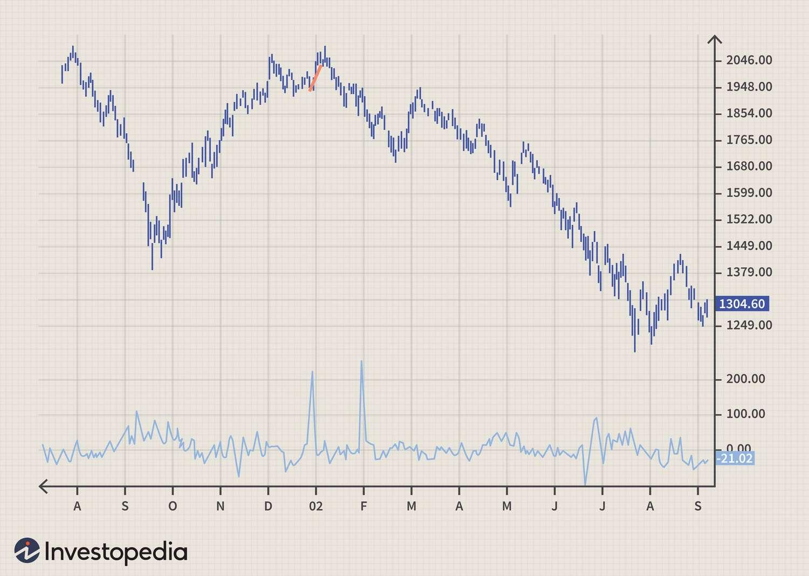

Understanding market trends is essential for successful trading as it enables traders to make informed decisions, maximize gains, and mitigate losses. Technical analysis serves as a crucial method for comprehending these trends and providing insights into market behavior and potential future movements. Within this framework, the Volume Rate of Change (V-ROC) emerges as a pivotal tool.

The Volume Rate of Change (V-ROC) is a technical indicator that measures the percentage change in trading volume over a specified period. It provides insight into the strength or weakness of a price movement. Unlike price-based indicators, V-ROC focuses on the volume of trades, which can serve as a precursor to price movements and offer clues regarding potential trend reversals or continuations.



Proper analysis of trading volume is integral to technical analysis because it reflects the intensity behind market moves. A significant change in volume can confirm trends and signal substantial market activity, acting as a validating factor for price movements. For example, a rising price accompanied by increasing volume suggests strong interest and potential for trend continuance, whereas a rising price on declining volume might indicate a weakening trend.

Incorporating V-ROC into a broader trading strategy can enhance trend confirmation and foresight in algorithmic trading systems. This article investigates into how V-ROC can be utilized to confirm market trends and inform algorithmic trading strategies. Additionally, it underscores the importance of understanding trading volume and its vital role in technical analysis, providing traders with a comprehensive toolkit to navigate diverse market conditions.

## Table of Contents

## Basics of Volume Rate Of Change (V-ROC)

The Volume Rate of Change (V-ROC) is a technical analysis metric used to measure the rate of change in volume over a specified period. It is designed to help traders assess the significance of volume movements relative to past data, thereby aiding in the confirmation of price trends and potential reversals. V-ROC is particularly useful because volume often precedes price movements, and understanding these dynamics can be critical for making informed trading decisions.

### Definition and Calculation

The V-ROC is defined as the percentage change in trading [volume](/wiki/volume-trading-strategy) from one period to the next. Its formula is expressed as:

$$

\text{V-ROC} = \left(\frac{\text{Volume}_{\text{current}} - \text{Volume}_{\text{previous}}}{\text{Volume}_{\text{previous}}}\right) \times 100 
$$

In this equation:
- $\text{Volume}_{\text{current}}$ represents the current period's trading volume.
- $\text{Volume}_{\text{previous}}$ represents the volume of the period from a specified time ago.

The resulting V-ROC value helps traders understand whether the current trading activity is stronger or weaker compared to the chosen past period. A positive V-ROC indicates an increase in volume, while a negative V-ROC suggests a decrease.

### Implications for Traders

A higher V-ROC suggests intensified investor interest in an asset, which might precede price movements. Conversely, a declining V-ROC may signal waning interest and potential price stagnation or reversal. Traders often look for significant changes in V-ROC to confirm ongoing trends or warn of emerging trend reversals.

### Comparison: Price Rate of Change vs. Volume Rate of Change

While both Price Rate of Change (P-ROC) and Volume Rate of Change (V-ROC) are important in technical analysis, they serve different purposes. P-ROC measures the rate at which the price changes over time, providing insights into the velocity of price movements. In contrast, V-ROC focuses on the change in trading volume, highlighting market activity levels irrespective of price movement.

Integrating both metrics can offer a more comprehensive view of market conditions. For instance, when both P-ROC and V-ROC indicate similar trends, the likelihood of the trend continuing is stronger. Divergence between the two, such as a rising price yet falling volume, may indicate weakening [momentum](/wiki/momentum).

### Significance of Timeframe Selections

The choice of timeframe for V-ROC analysis significantly affects its reliability and interpretation. Shorter timeframes tend to produce more volatile V-ROC readings, revealing rapid changes in market sentiment. These can be useful for short-term traders looking to exploit quick market shifts. Conversely, longer timeframes help identify overarching trends and smooth out short-term anomalies, making them better suited for strategic, long-term decision-making.

Understanding and selecting the appropriate timeframe is crucial for maximizing the effectiveness of V-ROC as it directly impacts the sensitivity and relevance of the insights obtained. The timeframe should align with the trader's overall strategy and risk tolerance, ensuring that it complements other indicators in a broader analysis framework.

## Using V-ROC for Trend Confirmation

Volume is a key metric in confirming price movements as it provides insights into the intensity and conviction behind a trend. The Volume Rate of Change (V-ROC) is instrumental in understanding these nuances by quantifying the change in volume over a specific period. It helps traders differentiate between genuine trend shifts and transient price movements with little support.

### V-ROC in Market Trend Analysis

The Volume Rate of Change is akin to the price Rate of Change but focuses on volume, allowing traders to observe the momentum and sustainability of trends. It is calculated as follows:

$$
\text{V-ROC} = \left(\frac{\text{Volume}_\text{current} - \text{Volume}_\text{previous}}{\text{Volume}_\text{previous}}\right) \times 100
$$

A positive V-ROC suggests increasing volume, often confirming a rising trend, while a negative V-ROC highlights decreasing volume, which may signal waning momentum or the beginning of a downtrend.

### Confirming Market Trends

The utility of V-ROC extends to confirming both rising and falling trends. For instance, in a bullish market, an increasing V-ROC that accompanies rising prices typically indicates robust market confirmation. Conversely, if prices rise but the V-ROC declines, it may suggest that the upward movement lacks volume support, potentially forecasting a correction.

In a bearish market scenario, a falling price paired with an increasing V-ROC corroborates the strength of the downtrend. A declining price with a decreasing V-ROC could, however, imply a weakening bearish trend, possibly foreshadowing a reversal or consolidation.

### Examples of Volume Trends and Market Movements

Consider a rally in a specific stock index. If alongside a price increase the V-ROC consistently shows strong positive values, it confirms that the rally is supported by volume. This pattern was observed during the 2020 market recovery post-March crash, where increased V-ROC confirmed sustainable upward movements in several indices.

In contrast, during the 2008 financial crisis, certain stocks experienced price recoveries with a declining V-ROC, suggesting that these recoveries were short-lived and not supported by substantial trading volumes. This served as a precursor to further declines.

### Divergence and Potential Reversals

A fundamental strength of using V-ROC is in identifying divergences which can signal potential reversals. Divergence occurs when the price moves in one direction while the V-ROC moves in another. For instance, if prices are rising but the V-ROC is falling, it may indicate a lack of volume support and the possibility of a bearish reversal.

Traders should pay close attention to such divergences, as they often prelude significant market shifts. By incorporating V-ROC into their analysis, traders are equipped to anticipate these reversals and adjust their strategies accordingly, either by profiting from the turnaround or by protecting against unexpected market swings.

In summary, the V-ROC is a powerful tool in the confirmation of market trends, offering clarity on volume strength behind price movements and highlighting divergences that might signal future reversals. Utilizing this indicator can significantly enhance a trader's ability to discern market realities and respond effectively.

## Algorithmic Trading and V-ROC

Algorithmic trading is an approach that relies heavily on technical indicators to automate and optimize trade execution in financial markets. These algorithms can process vast amounts of data more quickly and accurately than human traders, thereby increasing efficiency and minimizing emotional biases. Technical indicators are integral to [algorithmic trading](/wiki/algorithmic-trading), providing quantitative inputs that guide decision-making processes.

One such technical indicator, the Volume Rate of Change (V-ROC), plays a vital role in developing algorithmic trading strategies. V-ROC measures the rate of change in trading volume over a specified period, providing insights into the strength and potential direction of market movements. Mathematically, V-ROC is expressed as:

$$
\text{V-ROC}(n) = \left( \frac{\text{Volume}}{\text{Volume}_{n}} - 1 \right) \times 100
$$

where $\text{Volume}$ is the current volume, and $\text{Volume}_{n}$ is the volume $n$ periods ago. The result is a percentage that reflects the momentum of volume changes, which can be used to validate price trends and predict potential reversals.

In algorithmic trading systems, integrating V-ROC involves using it as an input parameter within trading algorithms. For instance, a Python-based system might periodically calculate V-ROC, and trigger buy or sell signals based on predefined thresholds. Here is a simple Python snippet that demonstrates how V-ROC can be incorporated:

```python
def calculate_vroc(volumes, n):
    return [(current / previous - 1) * 100 for current, previous in zip(volumes[n:], volumes[:-n])]

volumes = [1000, 1050, 1100, 1080, 1150]  # Example volume data
vroc_values = calculate_vroc(volumes, 2)  # Calculate V-ROC with a 2-period window
```

The advantage of using V-ROC in algorithmic trading lies in its ability to confirm or negate the strength of a price movement. When combined with other indicators like moving averages or the Relative Strength Index (RSI), V-ROC significantly enhances the robustness of trading strategies. For example, if a price surge is accompanied by a high V-ROC value, it may suggest strong bullish sentiment, justifying a buy signal. Conversely, a divergence between price movement and V-ROC might indicate a weakening trend, signaling caution.

Additionally, employing V-ROC alongside other technical indicators can diversify and mitigate risks. It reduces the likelihood of false signals that may arise when relying on a single metric. Furthermore, by providing a complementary perspective to price-based indicators, V-ROC contributes to a more comprehensive understanding of market dynamics. This layered approach is essential in algorithmic trading, where precision and adaptability are crucial in achieving optimal results.

In conclusion, V-ROC is a powerful tool for enhancing algorithmic trading strategies. By integrating V-ROC with other indicators, traders can develop sophisticated systems capable of navigating complex market environments, ultimately improving the accuracy and success rate of their trades.

## Challenges and Considerations

The Volume Rate of Change (V-ROC) is a valuable tool in technical analysis for tracking variations in trading volume, yet it comes with its own set of challenges and considerations. These challenges must be addressed to ensure the effective application of V-ROC in trend analysis and trading strategies.

One of the primary challenges with using V-ROC for trend analysis is its inherent noise and [volatility](/wiki/volatility-trading-strategies), especially in shorter timeframes. Volume data can be erratic and may frequently spike due to factors like high-frequency trading or sudden market news, which may not necessarily correlate with genuine market trends. This noise can lead to misleading signals, necessitating careful analysis and often requiring the use of smoothing techniques, such as moving averages, to filter out insignificant volume fluctuations.

The limitations of V-ROC highlight the importance of using complementary indicators. While V-ROC provides insights into volume dynamics, it does not account for price movements, which are crucial in understanding market trends. Integrating V-ROC with other indicators, such as Moving Average Convergence Divergence (MACD) or Relative Strength Index (RSI), can provide a more comprehensive picture and validate trends more reliably.

Market conditions significantly impact V-ROC's reliability. In volatile markets, V-ROC may produce frequent false signals due to abrupt volume changes. Conversely, during periods of low volatility, V-ROC might not adequately capture gradual changes in market sentiment. Traders need to adjust their V-ROC analysis based on current market conditions, using adaptive strategies that consider market volatility and [liquidity](/wiki/liquidity-risk-premium).

In automated setups, data accuracy and calculation are crucial for the effective implementation of V-ROC. Precise data feeds are essential, as any discrepancies can lead to incorrect V-ROC values and potentially flawed trading decisions. Regular calibration of trading algorithms and verification of data integrity are paramount. In Python, for example, while implementing V-ROC in an algorithmic setup, traders can use libraries such as NumPy or Pandas to ensure efficient and accurate calculations. A simplified calculation in Python might look as follows:

```python
import pandas as pd

def calculate_vroc(volume_series, period=14):
    return ((volume_series.diff(period) / volume_series.shift(period)) * 100).fillna(0)

# Example usage
data = pd.Series([1000, 1150, 1050, 1230, 1120, 1300])
vroc = calculate_vroc(data, period=2)
print(vroc)
```

In practice, it is critical for automated systems to be robust against data anomalies and ensure that computational logic aligns with real-world trading requirements.

Overall, the challenges of using V-ROC can be mitigated through the strategic use of complementary indicators, careful consideration of market conditions, and ensuring the integrity of automated calculation setups. These measures will help traders harness the full potential of V-ROC in their analytical arsenal.

## Conclusion

The Volume Rate of Change (V-ROC) proves to be a vital tool in the confirmation of market trends by providing insights into the dynamics of trading volume in relation to price movements. This technical indicator is especially useful for traders seeking to affirm trends, as it offers a quantitative measure of volume fluctuations that correspond with significant price changes. By analyzing V-ROC, traders can distinguish between genuine trends backed by solid volume and potentially false movements, thereby enhancing decision-making accuracy.

Incorporating V-ROC into trading strategies and algorithmic tools is not merely a technical enhancement but a strategic one. Algorithmic traders benefit from V-ROC by integrating it with automated systems, enabling them to react swiftly to changes in market conditions. The use of V-ROC in conjunction with other technical indicators, such as Moving Average Convergence Divergence (MACD) or Relative Strength Index (RSI), can further refine trading strategies and improve the robustness of models.

Traders are encouraged to leverage V-ROC as part of a broader toolkit for technical analysis. This holistic approach ensures a more comprehensive understanding of market conditions. As markets evolve and new trading scenarios emerge, the adaptability offered by V-ROC makes it a valuable component. The ability to detect volume-related divergences and potential reversals positions V-ROC as an indispensable tool for anticipating future market movements.

Looking forward, the significance of V-ROC in trend analysis is likely to grow as market conditions become increasingly complex. Continuous advancements in trading technology will allow for even more efficient and precise application of V-ROC, enabling traders to navigate volatility with greater confidence. In doing so, traders can achieve more informed decisions in rapidly changing market environments, maintaining a competitive edge.

As such, V-ROC stands out not just as an individual indicator but as an integral part of a dynamic strategy, capable of adapting to the evolving landscape of financial markets. Its incorporation into a trader's analytical arsenal is not just recommended, but essential for those aiming to thrive amidst the uncertainties of future trading conditions.

## References & Further Reading

[1]: Achelis, S. B. (2000). ["Technical Analysis from A to Z"](https://www.mhebooklibrary.com/doi/book/10.1036/9780071380119). McGraw-Hill Education.

[2]: Murphy, J. J. (1999). ["Technical Analysis of the Financial Markets: A Comprehensive Guide to Trading Methods and Applications"](https://archive.org/details/technicalanalysi0000murp). New York Institute of Finance.

[3]: Pring, M. J. (2002). ["Technical Analysis Explained: The Successful Investor's Guide to Spotting Investment Trends and Turning Points"](https://www.amazon.com/Technical-Analysis-Explained-Fifth-Successful/dp/0071825177). McGraw-Hill Education.

[4]: Kirkpatrick, C. D., & Dahlquist, J. R. (2010). ["Technical Analysis: The Complete Resource for Financial Market Technicians"](https://ptgmedia.pearsoncmg.com/images/9780134137049/samplepages/9780134137049.pdf). FT Press.

[5]: Schwager, J. D. (1996). ["Technical Analysis"](https://archive.org/details/technicalanalysi00schw). John Wiley & Sons.