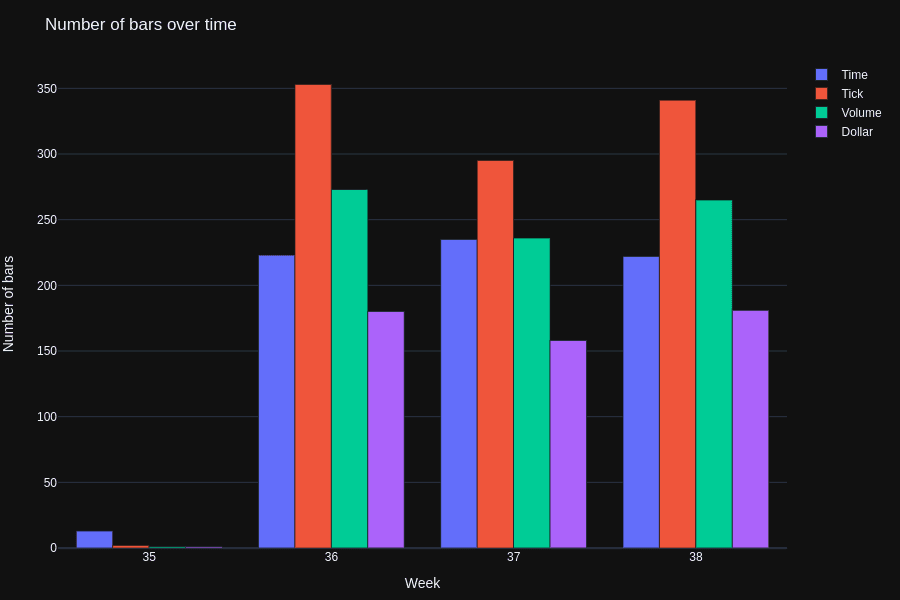

Understanding the nature of data in algorithmic trading is crucial for traders who aim to optimize their strategies and achieve consistent success in fluctuating markets. Algorithmic trading relies on sophisticated data analysis, where even slight advantages in data interpretation can lead to significant financial gains. Traditional time bars, which sample market data at predetermined intervals, are a staple in this domain. However, they present limitations that can inhibit trading accuracy and efficacy. 

One significant drawback of time bars is their tendency to equally weight periods of high and low market activity, potentially leading to data oversampling during inactive periods and undersampling when the market is particularly active. This often results in the loss of valuable information that could influence trading decisions. Moreover, the reliance on fixed time intervals can introduce statistical complications such as serial correlation and heteroscedasticity, which may distort the actual market dynamics and mislead trading algorithms.



Faced with these constraints, a shift towards Volume Run Bars (VRBs) is gaining traction among algorithmic traders as a strategy to overcome these challenges. VRBs redefine data sampling by focusing on the actual volume of trades rather than time. This method allows traders to better align their strategies with market realities, enhancing decision-making by providing a more precise representation of trading activity. By aggregating data based on trade volume instead of time, VRBs offer a refined approach to measuring market dynamics, potentially leading to improved trading outcomes.

In this article, we will examine the concept of Volume Run Bars, their benefits over traditional time bars, and how their implementation in algorithmic trading strategies could redefine the landscape for modern traders.

## Table of Contents

## The Drawbacks of Time Bars

Time bars, a traditional method for sampling financial market data, organize information based on fixed time intervals, which can lead to significant information loss during periods of heightened market activity. This limitation arises because time bars fail to account for the actual fluctuations in trading [volume](/wiki/volume-trading-strategy), often resulting in a misrepresentation of market dynamics.

During low-activity periods, time bars may lead to oversampling, accumulating excess data with minimal variance in trading activity and resulting in redundancy. Conversely, in high-activity periods, time bars tend to undersample, potentially missing out on crucial market movements and rapid price changes that occur between the predefined intervals. This misalignment with the actual market activity can distort analytical outcomes and hinder the effectiveness of trading strategies.

Furthermore, the use of time bars can introduce statistical challenges such as serial correlation and heteroscedasticity. Serial correlation, where historical prices are correlated with current prices, may lead to misleading signals in predicting future market movements. Heteroscedasticity, characterized by the variance of errors being non-constant across observations, complicates modeling and forecasting efforts, as it violates the assumption of homoscedasticity crucial for many statistical tests and models.

Overall, time bars may not capture the complexities of market dynamics efficiently, affecting the precision of trading analytics and potentially impacting the decision-making process adversely. As a result, traders and analysts are increasingly exploring alternative methods that better align data representation with actual trading conditions, such as volume-based metrics.

## The Concept of Volume Run Bars (VRBs)

Volume Run Bars (VRBs) provide an innovative alternative to traditional time bars by focusing on trading volume rather than fixed time intervals. Unlike time bars that capture data at regular intervals, such as every minute or hour, VRBs consolidate data based on a predefined volume threshold. This approach aligns data sampling more closely with market activity, offering a dynamic view that adjusts to varying trading intensities.

VRBs work by ensuring that each bar represents a consistent amount of trading volume, rather than a span of time. For example, a VRB might form every 1,000 shares traded, regardless of how long it takes to reach this volume. This method effectively compresses periods of low activity and expands periods of high activity, thus providing a more balanced representation of market conditions.

The advantages of VRBs are particularly evident in the improvement of statistical properties of trading data. By focusing on actual market transactions, VRBs reduce issues such as heteroscedasticity, where the variance of a variable is unequal across levels of another variable, and serial correlation, which is the relationship between a variable and a lagged version of itself over time. These statistical improvements make VRBs a valuable tool in enhancing the analysis and predictability of trading patterns.

Mathematically, the concept of a VRB can be expressed as follows. Suppose $V$ is the volume threshold for constructing each VRB. A new VRB is generated whenever the cumulative trading volume within a period reaches $V$. This can be formalized in Python as:

```python
def create_vrb(trade_data, volume_threshold):
    vrbs = []
    current_volume = 0
    current_bar = []

    for trade in trade_data:
        current_bar.append(trade)
        current_volume += trade['volume']

        if current_volume >= volume_threshold:
            vrbs.append(current_bar)
            current_bar = []
            current_volume = 0

    if current_bar:  # Add the last bar if any trades are left
        vrbs.append(current_bar)

    return vrbs
```

This adaptive method of data sampling allows traders to obtain bars that are more representative of true market conditions, enabling improved decision-making aligned with actual market moves. By aligning the creation of bars with trading activity, VRBs offer a more nuanced and accurate framework for analyzing and executing trades.

## Advantages of Using Volume Run Bars in Algo Trading

Volume Run Bars (VRBs) present a compelling alternative to traditional time bars in [algorithmic trading](/wiki/algorithmic-trading), particularly due to their ability to synchronize data sampling with actual market activity. This synchronization enables a more accurate representation of market dynamics. Traditional time-based methods can suffer from issues such as oversampling during periods of low activity and undersampling during high [volatility](/wiki/volatility-trading-strategies), leading to potentially misleading representations of market conditions. In contrast, VRBs aggregate data based on fixed trading volume intervals rather than time, addressing these issues directly.

One of the primary advantages of VRBs is their capacity to improve the statistical analysis of trading data. By aligning data collection with trading volume, VRBs mitigate noise and volatility-related problems common in high-frequency trading environments. This alignment ensures that each bar contains a consistent amount of trading activity, allowing analysts to capture market trends more reliably. Consequently, the data becomes less susceptible to heteroscedasticity and serial correlation issues often encountered in time-based bars.

The reduction of noise and volatility achieved through VRBs leads to cleaner datasets, which fosters enhanced insights and decision-making in trading strategies. Traders utilizing VRBs can more effectively discern patterns and signals from market data, which might be obscured in traditional methods. This clarity can result in more informed trading decisions, minimizing the risk associated with high-frequency trading and improving trade execution.

Moreover, VRBs allow traders to identify significant market events more readily due to their focus on volume rather than time. For example, price changes coupled with high volume are often more indicative of market-moving events than those observed in low-volume conditions. This focus can enhance a trader’s ability to react promptly to potential opportunities or threats in the market.

In summary, Volume Run Bars offer a robust framework for traders seeking to enhance the accuracy of their trading strategies. By reducing noise and aligning data collection with market activity, VRBs provide deeper insights into market behavior, facilitating superior decision-making processes in the fast-paced environment of algorithmic trading.

## Implementing VRBs in Trading Strategies

Implementing Volume Run Bars (VRBs) in trading strategies entails a strategic shift in how data is collected and utilized. Traditional time-based methods often require reevaluation, as VRBs focus on aligning data aggregation more closely with market activity. As VRBs aggregate data based on a predefined volume, rather than time, traders must adapt their algorithms to leverage this more dynamic and accurate representation of market conditions.

The first step in integrating VRBs into trading strategies involves redesigning data collection processes. This requires developing systems capable of real-time volume tracking, ensuring data is segmented into consistent volume units rather than time intervals. Doing so allows for the capture of market dynamics as they occur, providing a clearer representation of supply and demand fluctuations.

Once data collection is aligned with VRBs, algorithm tuning becomes pivotal. Traders can fine-tune their algorithms by considering volume-intensity patterns rather than relying solely on time-based metrics. For example, in periods of high trading volume, VRBs offer more frequent data updates than time bars, which can enhance the responsiveness of trading algorithms to sudden market movements.

Python's pandas library can facilitate implementing VRBs by aggregating tick data based on volume. Below is a simple code snippet illustrating how VRBs might be constructed using pandas:

```python
import pandas as pd

# Assume df is a DataFrame containing 'price' and 'volume' columns.
target_volume = 1000  # Set the target volume for a single VRB

def create_vrb(df, target_volume):
    df['cumulative_volume'] = df['volume'].cumsum()
    # Create VRB labels
    df['vrb_index'] = (df['cumulative_volume'] / target_volume).floor()
    # Group by VRB and aggregate data
    vrb_df = df.groupby('vrb_index').agg(
        open_price=('price', 'first'),
        close_price=('price', 'last'),
        high_price=('price', 'max'),
        low_price=('price', 'min'),
        volume_sum=('volume', 'sum')
    )
    return vrb_df

vrbs = create_vrb(df, target_volume)
```

This code helps generate a VRB DataFrame by aggregating prices based on a set volume threshold, which can be used in further analysis or trading strategies.

Integrating VRBs into existing algo-trading frameworks involves retooling strategies to [factor](/wiki/factor-investing) in these volume-based indicators. For instance, [momentum](/wiki/momentum) or trend-following strategies can be recalibrated to utilize VRBs, potentially reducing noise typical in low-volume periods. Additionally, VRBs can aid in identifying [breakout](/wiki/breakout-trading) points with greater accuracy, by representing high-activity market phases more distinctly.

Finally, the implementation of VRBs can be seen as an adaptive strategy that prepares traders for evolving market dynamics. By employing VRBs, traders can develop more nuanced models that are potentially less prone to false signals generated by erratic market volume. This proactive approach enables strategies to be not only more aligned with actual market conditions but also better equipped to maintain a competitive edge in fast-paced financial environments.

## Future Prospects of VRBs in the Financial Market

As algorithmic trading increasingly relies on data-driven decision-making, Volume Run Bars (VRBs) are emerging as a promising tool poised to become a standard in the industry. Unlike traditional time bars, which sample data at fixed time intervals, VRBs focus on the trading volume, offering a more dynamic and representative analysis of market activities. This advantage positions VRBs as a future norm in the rapidly evolving landscape of financial markets.

The adoption of VRBs in algorithmic trading is likely to accelerate with continued advancements in technology. As computational power increases and data processing capabilities become more refined, the integration of VRBs into trading platforms will become more seamless. The adaptation of existing trading algorithms to incorporate VRBs will also be facilitated by the growth of [machine learning](/wiki/machine-learning) and [artificial intelligence](/wiki/ai-artificial-intelligence). These technologies can leverage the enhanced data provided by VRBs to develop predictive models that are more resilient to market volatility.

Furthermore, VRBs have the potential to revolutionize how market data is perceived and utilized in trading strategies. By aligning data sampling with actual market activities, VRBs can minimize the noise created by time-based sampling, leading to clearer insights and more accurate predictions. This shift can empower traders to better identify market trends and react to significant trading events with greater precision.

As VRBs continue to gain traction, the financial industry could see a transformation in strategy development, portfolio management, and risk assessment. The adoption of VRBs would not only enhance the accuracy of trading algorithms but also promote a more nuanced understanding of market dynamics. This, in turn, could lead to more innovative trading strategies that capitalize on the detailed market insights provided by VRBs.

In conclusion, as the financial markets move towards more data-centric and technology-driven paradigms, VRBs stand out as a progressive advancement. The future of VRBs appears promising, with their potential to reshape the infrastructure of algorithmic trading, making it more adaptable to the ever-changing market conditions.

## Conclusion

Volume Run Bars (VRBs) represent a significant advancement in how data is employed in trading algorithms by addressing many of the constraints associated with traditional time-based bars. Unlike time bars, which operate on fixed intervals potentially leading to inaccuracies during periods of market volatility, VRBs dynamically adjust to actual trading activity, offering a more responsive and adaptive representation of market dynamics.

The shift away from time-based data sampling enables traders to achieve a competitive advantage. This advantage stems from the enhanced precision of VRBs, as their construction inherently reduces informational noise and minimizes errors associated with market volatility. By setting a predetermined volume threshold for data aggregation, VRBs create bars only when sufficient trading activity occurs, thereby aligning data representation more closely with the true market dynamics. This method can decrease the likelihood of overfitting models during development since VRBs inherently focus on significant market movements.

Adopting VRBs can result in more accurate data, ultimately leading to improved trading outcomes. With VRBs, algorithms can be better calibrated to the ebb and flow of market conditions, allowing for more robust predictions and trade executions. This precision not only optimizes the statistical properties of trading strategies but also enhances the probability of profitable trades by capturing key market signals that may go unnoticed with conventional time bars.

In summary, VRBs offer a paradigm shift from the limitations of time-based sampling, facilitating more accurate data interpretation. As algorithmic trading continues to evolve with technological advancements, incorporating VRBs can play a vital role in refining trading strategies and sustaining a competitive edge in the financial markets.

## References & Further Reading

[1]: Aldridge, Irene. ["High-Frequency Trading: A Practical Guide to Algorithmic Strategies and Trading Systems."](https://www.amazon.com/High-Frequency-Trading-Practical-Algorithmic-Strategies/dp/1118343506) Wiley.

[2]: de Prado, Marcos Lopez. ["Advances in Financial Machine Learning."](https://www.amazon.com/Advances-Financial-Machine-Learning-Marcos/dp/1119482089) Wiley.

[3]: Chan, Ernest P. ["Quantitative Trading: How to Build Your Own Algorithmic Trading Business."](https://github.com/ftvision/quant_trading_echan_book) Wiley.

[4]: Aronson, David R. ["Evidence-Based Technical Analysis: Applying the Scientific Method and Statistical Inference to Trading Signals."](https://www.amazon.com/Evidence-Based-Technical-Analysis-Scientific-Statistical/dp/0470008741) Wiley.

[5]: Jansen, Stefan. ["Machine Learning for Algorithmic Trading."](https://github.com/stefan-jansen/machine-learning-for-trading) Packt Publishing.

[6]: Degiro. ["Volume-Based Charts: An Alternative to Standard Charts in Trading."](https://stockhax.com/reviews/degiro/) Degiro.com.

[7]: Chincarini, Ludwig B., and Kim, Daehwan. ["Quantitative Equity Portfolio Management: Modern Techniques and Applications."](https://www.mhebooklibrary.com/doi/book/10.1036/9781264268931) McGraw-Hill Education.