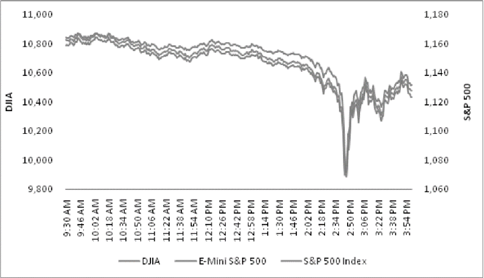

## Table of Contents

## What is Volume-synchronized Probability of Informed Trading (VPIN)?

Volume-synchronized Probability of Informed Trading (VPIN) is a measure used to detect how likely it is that traders are using inside information to make trades. It looks at the trading volume and the order imbalance, which is the difference between buy and sell orders, over specific time periods. By doing this, VPIN helps to spot if there's a higher chance that some traders know more than others, which could affect the market.

VPIN is important because it can help spot potential market manipulation or insider trading. It's used by financial regulators and market makers to keep an eye on the market and make sure it's fair for everyone. If VPIN is high, it might mean that some traders have an unfair advantage, and this could lead to actions to protect the market's integrity.

## Who developed the concept of VPIN and when was it introduced?

The concept of VPIN was developed by David Easley, Marcos López de Prado, and Maureen O'Hara. They introduced it in a paper they wrote together in 2011. These three people are experts in finance and wanted to find a way to see if some traders were using secret information to make trades.

VPIN is important because it helps watch the market to make sure it's fair. By looking at how much trading is happening and whether there are more buy or sell orders, VPIN can tell if some traders might know things others don't. This helps keep the market honest and protects everyone who is trading.

## How does VPIN differ from traditional measures of informed trading?

VPIN is different from traditional measures of informed trading because it looks at how much trading is happening and whether there are more buy or sell orders over short periods of time. Traditional measures often just look at the price changes or the size of trades to guess if traders are using secret information. But VPIN pays attention to the actual volume of trades and how balanced the buying and selling is, which can show if some traders know more than others.

Another way VPIN differs is that it updates its information more often. Traditional measures might only check for informed trading every day or every week. But VPIN can check every few minutes or even every trade. This makes it quicker at spotting if something unusual is happening in the market. By keeping a close watch on the trading volume and order imbalances, VPIN can help catch unfair trading before it causes big problems.

## What are the key components required to calculate VPIN?

To calculate VPIN, you need to know the trading volume and the order imbalance over specific time periods. Trading volume is how many shares or contracts are traded. Order imbalance is the difference between the number of buy orders and sell orders. By looking at these two things together, VPIN can tell if there's a higher chance that some traders are using inside information.

The process involves breaking down the trading day into smaller time periods called "buckets." Each bucket has a certain amount of trading volume. Then, you calculate the order imbalance for each bucket. After that, you use a formula to figure out VPIN by looking at the average order imbalance across all the buckets. This helps to see if the market might be influenced by people who know more than others.

## Can you explain the step-by-step process of calculating VPIN?

To calculate VPIN, you first need to divide the trading day into smaller time periods called "buckets." Each bucket should have the same amount of trading volume, which means you look at how many shares or contracts are traded and split the day up based on that. For each bucket, you then figure out the order imbalance, which is the difference between the number of buy orders and sell orders. If there are more buy orders, the order imbalance is positive; if there are more sell orders, it's negative.

After you've calculated the order imbalance for each bucket, you use a special formula to find the VPIN. This formula looks at the average order imbalance across all the buckets. It takes the absolute value of the order imbalances, which means it turns all the numbers positive, and then divides that by the total number of buckets. This average helps to show if there's a higher chance that some traders are using secret information to make trades. By doing this, you get a number that tells you how likely it is that informed trading is happening in the market.

## What role does volume synchronization play in VPIN?

Volume synchronization is really important for VPIN because it helps make sure that each time period, or bucket, has the same amount of trading happening. Instead of just looking at time, like every hour or every day, VPIN looks at how much trading is done. This way, it can see if there's a lot of buying or selling happening all at once, which might mean some traders know something others don't.

By using volume synchronization, VPIN can catch changes in the market faster. If a lot of trading happens in a short time, it might show that some people are using secret information. This helps keep the market fair by spotting these changes quickly and making sure everyone has the same chance to trade.

## How is VPIN used to predict market volatility and liquidity?

VPIN helps predict market volatility by looking at how much buying and selling is happening. If VPIN is high, it means there might be a lot of people using secret information to trade. This can make the market go up and down a lot, which is called volatility. By watching VPIN, people who study the market can guess if big changes are coming soon. This helps them be ready for when the market might get bumpy.

VPIN also tells us about market liquidity, which is how easy it is to buy or sell things without changing the price too much. If VPIN is high, it might mean that some traders are trying to move a lot of money quickly. This can make it harder for others to trade because there might not be enough buyers or sellers at the right price. By keeping an eye on VPIN, people can see if the market might become less liquid, which helps them plan their trades better.

## What are the practical applications of VPIN in financial markets?

VPIN is used by people who watch over the market to make sure it's fair. They look at VPIN to see if some traders might be using secret information to make trades. If VPIN is high, it means there's a good chance that this is happening. This helps them take action to stop unfair trading and keep the market honest for everyone. For example, if they see a high VPIN, they might start looking more closely at what's going on to make sure no one is cheating.

VPIN also helps traders and investors plan their moves. By knowing if VPIN is high, they can guess if the market might get more unpredictable or if it might be harder to buy and sell things. This helps them decide when to trade and how much risk to take. For example, if VPIN is high, a trader might decide to wait until things calm down before making a big trade, or they might choose to trade smaller amounts to avoid big price changes.

## What are the limitations and criticisms of using VPIN as a measure of informed trading?

One big problem with using VPIN to measure informed trading is that it can sometimes give false alarms. This means it might say there's a lot of informed trading happening when there isn't. This can happen because VPIN looks at how much trading is happening and if there are more buy or sell orders. But sometimes, big trades can happen for other reasons, like when a company announces good news or when a lot of people want to buy or sell at the same time. So, it can be hard to tell if high VPIN really means informed trading or something else.

Another issue with VPIN is that it's not always easy to figure out what the right amount of trading volume should be for each time period. If you make the time periods too short or too long, the VPIN numbers might not be accurate. This can make it hard to use VPIN to spot informed trading correctly. Also, some people think that VPIN might not work as well in markets where trading happens very quickly, like in high-frequency trading. They say that the fast pace of these markets can make it tricky to use VPIN to find informed trading.

## How has VPIN been adapted or improved since its introduction?

Since VPIN was introduced, people have been working to make it better and more useful. One way they've done this is by changing how the time periods, or "buckets," are set up. Instead of using the same amount of trading volume for each bucket, some people now use different ways to split up the trading day. This can help make VPIN more accurate because it fits better with how the market is working at that time. Another improvement is using more advanced math to figure out VPIN. This can help it spot informed trading more quickly and with less chance of getting it wrong.

Also, researchers have been looking at how VPIN works in different types of markets. For example, they've tried to see if VPIN can work well in markets where trading happens very fast, like with high-frequency trading. They've made changes to the VPIN formula to make it better at spotting informed trading in these quick markets. By doing all this, they hope to make VPIN a tool that can be used in more places and help keep more markets fair and honest.

## Can you discuss a case study where VPIN was effectively used to predict market events?

One good example of VPIN being used to predict market events happened during the Flash Crash of May 6, 2010. This was a day when the stock market suddenly dropped a lot and then quickly went back up. Researchers used VPIN to look at what was happening before the crash. They found that VPIN was very high just before the market dropped. This high VPIN showed that there might have been a lot of people trading with secret information, which could have helped cause the big drop in the market. By watching VPIN, people could have guessed that something big was about to happen and maybe been ready for it.

Another case where VPIN was useful was during the market events around the Brexit vote in June 2016. Before the vote, the market was pretty calm, but VPIN started to go up. This meant that more people might have been trading with inside information about how the vote would go. When the vote results came in and the UK decided to leave the EU, the market got very unpredictable. The high VPIN before the vote helped people see that the market might get shaky, and they could have used this information to be ready for the changes that happened after the vote.

## What future research directions are suggested for enhancing the VPIN model?

One important direction for future research on the VPIN model is to make it work better in fast markets, like those with high-frequency trading. Right now, VPIN can sometimes miss things in these quick markets because it's hard to set up the time periods right. Researchers could look into new ways to split up the trading day so that VPIN can catch informed trading more accurately, even when trades happen very fast. They might also try using different math to make VPIN better at spotting these quick trades without giving false alarms.

Another area for future research is to see if VPIN can be used in different types of markets, not just stocks. For example, researchers could test if VPIN works well in markets for things like bonds, commodities, or even cryptocurrencies. By doing this, they could find out if VPIN needs to be changed to fit these other markets. This would help make VPIN a tool that can be used in more places to keep all kinds of markets fair and honest.

## What are the practical use cases and advanced applications?

Real-time Volume-Synchronized Probability of Informed Trading (VPIN) has become an essential tool for portfolio managers and quantitative researchers, offering significant enhancements in risk management and strategy development. This utility is derived from VPIN's ability to provide a granular analysis of market conditions by tracking volume imbalances that may signal informed trading activities.

In the context of cryptocurrencies, VPIN has shown particular efficacy, providing insights during volatile market events such as rapid Bitcoin price movements. For instance, studies have demonstrated VPIN's capability to identify potential liquidity crises and shifts in market sentiment during events like the Bitcoin April crash. When traditional metrics might lag, VPIN can offer real-time signals that help in anticipating and mitigating risks associated with such extreme price movements.

Moreover, VPIN's adaptability to high-frequency trading ([HFT](/wiki/high-frequency-trading-strategies)) environments is a testament to its versatility. In these fast-paced settings, the metric offers timely insights that are crucial for strategy adjustments by capturing subtle changes in order flows before they are reflected in price. The metric focuses on the volume imbalance as a proxy for the probability of informed trading, defined as:

$$
\text{VPIN} = \left| \frac{V^B - V^S}{V^T} \right|
$$

Here, $V^B$ and $V^S$ represent the volume of buy and sell trades, respectively, within a fixed volume bucket $V^T$. This structure ensures that the analysis remains pertinent across various trading conditions, providing analysts with the necessary data to adapt their strategies promptly.

By integrating VPIN into quantitative frameworks, trading systems can enhance their predictive power and operational effectiveness. This becomes particularly crucial during volatile market phases, enabling firms to implement proactive and informed decisions while managing exposure to potential market disruptions. As financial markets continue to evolve, the strategic deployment of real-time VPIN offers compelling advantages for various market participants, from portfolio managers to high-frequency traders, seeking to stay ahead in the dynamic trading landscape.

## References & Further Reading

[1]: Easley, D., López de Prado, M. M., & O'Hara, M. (2011). ["The Microstructure of the ‘Flash Crash’: Flow Toxicity, Liquidity Crashes, and the Probability of Informed Trading."](https://papers.ssrn.com/sol3/papers.cfm?abstract_id=1695596) The Journal of Portfolio Management, Vol. 37, No. 2, pp. 118-128.

[2]: López de Prado, M. M. (2018). ["Advances in Financial Machine Learning."](https://www.amazon.com/Advances-Financial-Machine-Learning-Marcos/dp/1119482089) Wiley.

[3]: O'Hara, M. (1995). ["Market Microstructure Theory."](https://www.semanticscholar.org/paper/Market-Microstructure-Theory-O'Hara/2bd0833b023f3270a2a6bf301e86b8e02e2f28ed) Wiley.

[4]: Almgren, R., & Chriss, N. (2000). ["Optimal Execution of Portfolio Transactions."](https://smallake.kr/wp-content/uploads/2016/03/optliq.pdf) Journal of Risk, Vol. 3, No. 2, pp. 5-39.

[5]: Bouchaud, J.-P., Farmer, J. D., & Lillo, F. (2008). ["How Markets Slowly Digest Changes in Supply and Demand."](https://arxiv.org/abs/0809.0822) In Handbook of Financial Markets: Dynamics and Evolution.