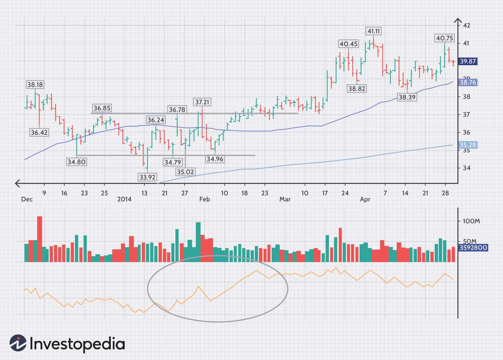

Volume Trading Strategy harnesses the market's transactional heartbeat, measuring the number of shares or contracts traded to gauge the intensity behind price movements. Unlike price action alone, volume provides a depth of information, revealing the strength or weakness of market trends and trader commitment to current prices.

While momentum strategies prioritize price changes, volume trading strategies consider the weight behind these changes. This approach enables traders to decipher whether a price movement is supported by substantial trading activity, which can indicate a stronger trend, or if it is driven by weaker trading volumes, suggesting a potential lack of conviction and a possible reversal.

Innovations in volume trading are continuously emerging, with advances in technology allowing for more sophisticated analysis. For instance, algorithmic trading now incorporates volume as a core variable, enhancing the accuracy of trade execution and strategy backtesting. Moreover, the development of volume-based indicators such as the Volume-weighted Average Price (VWAP) and the Money Flow Index (MFI) has equipped traders with more nuanced tools to interpret market dynamics. 

## Table of Contents

## The Essence of Trading Volume

Trading volume, the total number of shares or contracts traded within a given timeframe, is a powerful indicator that provides insights beyond mere price movements. It serves as a thermometer for the vibrancy of the market, offering clues about the strength of a price trend and the conviction behind market moves. High trading volumes can signal strong agreement among traders about the price at which they are willing to buy or sell, often reinforcing the current price trend. Conversely, low volume may indicate uncertainty or a lack of interest in the current price level, which could precede a reversal or consolidation in the market.

The psychological and market sentiment implications of volume are profound. Volume can act as a confirmation of market sentiment, providing a weight of evidence to bullish or bearish positions. For instance, an upward price movement on high volume typically indicates strong buying pressure and a bullish sentiment, suggesting that the upward trend may continue. This is predicated on the belief that a large number of traders contributing to a price increase is a sign of collective confidence in the asset’s appreciating value.

Volume also plays a crucial role in [liquidity](/wiki/liquidity-risk-premium) and price discovery. Liquidity refers to the ability to buy or sell an asset without causing a significant impact on its price. A market is considered liquid if it has high trading [volume](/wiki/volume-trading-strategy)s, implying that transactions can be executed quickly and at stable prices. Price discovery, the process of determining the price of an asset in the marketplace through the interactions of buyers and sellers, relies heavily on volume as well. Volume data helps traders determine the level of interest in a security at various price points and can indicate where the price is likely to settle.

## Delving into Volume Indicators

### Volume Oscillator

The Volume Oscillator is a [momentum](/wiki/momentum) indicator that tracks the difference between two moving averages of a security's volume. Typically, it involves a fast-moving average subtracted from a slow-moving average, and the result is plotted against a zero line to identify the volume's direction. The Volume Oscillator can be calculated using the following formula:

$VO = SMA(Volume, Short~Term) - SMA(Volume, Long~Term)$

Where $VO$ is the Volume Oscillator, $SMA$ is the Simple Moving Average, and 'Volume' is the trading volume.

### On-Balance Volume (OBV)

The On-Balance Volume (OBV) serves as a cumulative indicator, adding volume on days when the price increases and subtracting it on days when the price decreases. It reflects the buying and selling pressure. The formula for OBV is as follows:

$OBV_i = OBV_{i-1} +
\begin{cases}
Volume_i & \text{if } Close_i > Close_{i-1} \\
-Volume_i & \text{if } Close_i < Close_{i-1} \\
0 & \text{if } Close_i = Close_{i-1}
\end{cases}$

Where $OBV_i$ is the current OBV value, $OBV_{i-1}$ is the previous OBV value, and $Volume_i$ is the current trading volume.

### Accumulation/Distribution Line

The Accumulation/Distribution Line is an indicator that uses both price and volume to show the cumulative flow of money into or out of a security. It can be a useful tool to confirm trends or warn of potential reversals. The formula for the Accumulation/Distribution Line is:

$ADL = ADL_{prev} +
\begin{cases}
Volume \times \frac{(Close - Low) - (High - Close)}{(High - Low)} & \text{if } (High \neq Low) \\
0 & \text{if } (High = Low)
\end{cases}$

Where $ADL_{prev}$ is the previous value of the Accumulation/Distribution Line.

### Volume by Price

Volume by Price is a horizontal histogram that is plotted on the vertical axis of a price chart to showcase the amount of volume for each price level. This visual representation can help traders identify price levels with significant trading activity, which may act as support or resistance.

For further reading on volume indicators, "A Complete Guide to Volume Price Analysis" by Anna Coulling is a resource that explores the relationship between trading volume and price movements in depth. This guide can serve as a foundational text for understanding the complexities and applications of volume analysis in trading[1].

### Volume Rate of Change

The Volume Rate of Change (VROC) indicator measures the rate at which trading volume changes. It compares the current volume to the volume a certain number of periods ago and is expressed as a percentage. The VROC can be a signal of market sentiment shifts or confirm price trends. The formula for the VROC is:

$VROC = \left( \frac{Volume_{current} - Volume_{n-periods~ago}}{Volume_{n-periods~ago}} \right) \times 100$

This formula helps traders identify spikes or drops in volume over a specified period.

### Chaikin Money Flow (CMF)

The Chaikin Money Flow (CMF) is an oscillator that fluctuates between -1 and 1, gauging the buying and selling pressure over a set period, usually 20 or 21 days. The CMF adds buying pressure when the close is in the upper half of the daily range, and vice versa. The formula for the CMF is:

$CMF = \frac{\sum_{i=1}^{n} ((C_{i} - L_{i}) - (H_{i} - C_{i})) \times V_{i}}{\sum_{i=1}^{n} V_{i}}$

Where $C$ is the closing price, $L$ is the low, $H$ is the high, $V$ is the volume, and $n$ is the number of periods.

### Money Flow Index (MFI)

The Money Flow Index (MFI) combines price and volume to measure the buying and selling pressure. It's a bounded oscillator that moves between 0 and 100, and is often referred to as a volume-weighted RSI. The calculation of the MFI involves several steps, starting with the Typical Price and Raw Money Flow:

$\text{Typical Price} = \frac{(High + Low + Close)}{3}$

$\text{Raw Money Flow} = \text{Typical Price} \times Volume$

The MFI itself is then calculated using a ratio of positive and negative money flow, similar to the RSI calculation, over a specified period.

### Volume-Weighted Average Price (VWAP)

The Volume-Weighted Average Price (VWAP) gives the average price a security has traded throughout the day, based on both volume and price. It is often used as a trading benchmark, especially for institutional investors. The VWAP can be calculated as:

$VWAP = \frac{\sum (Price \times Volume)}{\sum Volume}$

For each period, multiply the price by the volume for that period, sum those values, and then divide by the total volume.

### Volume Profile

The Volume Profile is an advanced charting study that displays trading activity over a specified time period at certain price levels. This indicator is often used to identify support and resistance levels, based on the amount of volume that has traded at various prices. The Volume Profile is visualized as a histogram on the y-axis of a chart, which can provide insight into the market's structure and traders' commitment to certain price levels.

### Negative Volume Index (NVI)

The Negative Volume Index (NVI) focuses on the volume on days when the price decreases from the previous day. It is based on the premise that uninformed traders trade on "noisy" days when volume increases, while informed traders trade on "quiet" days with less volume. The NVI is calculated using the following formula:

$NVI =
\begin{cases}
NVI_{previous} + \frac{Price_{change}}{Price_{previous}} \times NVI_{previous} & \text{if Volume < Volume}_{previous} \\
NVI_{previous} & \text{otherwise}
\end{cases}$

Where $Price_{change}$ is the difference between the current and previous price, and $NVI_{previous}$ is the previous period's NVI value.

### Positive Volume Index (PVI)

Similarly, the Positive Volume Index (PVI) focuses on days where the volume has increased from the previous day, under the assumption that volume increases when the crowd follows the trend. The PVI is calculated in a manner opposite to the NVI:

$PVI =
\begin{cases}
PVI_{previous} + \frac{Price_{change}}{Price_{previous}} \times PVI_{previous} & \text{if Volume > Volume}_{previous} \\
PVI_{previous} & \text{otherwise}
\end{cases}$

### Klinger Oscillator

The Klinger Oscillator (KO) is designed to predict price reversals in the market by comparing the volume flowing in and out of securities with price movements. It is based on the principle that volume precedes price. The KO combines two moving averages: one that focuses on the volume of the trend (usually a 34-period moving average) and another that provides a signal line (usually a 55-period moving average). The formula for the KO can be complex, involving cumulative volume calculations and moving averages.

### Force Index

The Force Index is a powerful indicator that combines price movements and volume to measure the strength of bulls and bears in the market. It's calculated by subtracting yesterday’s close from today's close, then multiplying the result by today's volume. If the closing price is higher than yesterday's, the force is positive; if lower, it's negative. This gives traders an idea of the conviction behind a price move—high volume with little price change signifies strong force.

### Ease of Movement

Ease of Movement (EoM) is particularly insightful as it illustrates how effortlessly a stock is moving. The formula involves dividing the difference between the high and low price by the volume, which is then smoothed over a period. A high EoM value indicates that the stock is moving upward on low volume, suggesting less resistance to price increase, whereas a low value indicates the opposite.

### Volume Price Trend Indicator (VPT)

The Volume Price Trend Indicator (VPT) helps track the direction in which the market is moving, as well as the strength of price changes. This cumulative indicator integrates volume by multiplying the percentage change in price by volume, then adding it to a cumulative total. This continuous summing emphasizes the trend of volume changes in relation to price movements.

### Demand Index

Lastly, the Demand Index combines price and volume to ascertain buying or selling pressure. It's a complex calculation where price is adjusted according to the extent of the move from the previous close, and then that value is multiplied by volume. A rising Demand Index suggests buying pressure, while a falling index indicates selling pressure.

### Tick Volume

Tick Volume is a measure of trading activity that counts the number of transactions instead of the actual volume. This metric is particularly useful in Forex trading, where true volume data isn't available. Tick volume is seen as a proxy for volume, under the assumption that price movements are typically accompanied by a corresponding number of trades.

### Price and Volume Trend (PVT)

The Price and Volume Trend (PVT) functions as an accumulation line that adjusts daily based on the percentage change in price and the volume. The PVT accumulates volume based on significant price moves. The formula for PVT is:

$\text{PVT} = \text{Previous PVT} + (\text{Volume} \times \frac{\text{Today's Close} - \text{Previous Close}}{\text{Previous Close}})$

### Accumulation/Distribution Index

Accumulation/Distribution Index (A/D Index) tracks the relationship between price and volume and acts as a leading indicator of price movements. The divergence between the stock price and the A/D line indicates potential reversals. Its calculation is:

$\text{A/D} = (\frac{\text{Close} - \text{Low}}{\text{High} - \text{Low}}) - 1) \times \text{Volume} + \text{Previous A/D}$

### Market Facilitation Index (MFI)

The Market Facilitation Index (MFI) measures the efficiency of price movement by comparing the change in price to the volume. It is calculated as:

$\text{MFI} = \frac{\text{High} - \text{Low}}{\text{Volume}}$

Where high and low are the highest and lowest prices, respectively, and volume is the number of shares or contracts traded.

For a thorough explanation and additional context on these indicators, the book "Technical Analysis: The Complete Resource for Financial Market Technicians" by Charles D. Kirkpatrick II and Julie R. Dahlquist is an authoritative source[2].

## Volume in Market Analysis

Incorporating volume into market analysis is a multi-step process that can enhance the assessment of market trends and potential trade opportunities. Here is a guide for integrating volume analysis into market evaluation:

1. **Understand the Basics**: Recognize that volume represents the total number of shares or contracts traded during a given period. It's a measure of intensity or pressure behind a price trend. Higher volume associated with a price move signals greater conviction and is more likely to sustain the trend.
2. **Overlay Volume on Price Charts**: Begin by displaying volume bars beneath the price chart. This visual helps identify correlations between volume spikes and price movements.
3. **Analyze Volume Patterns**: Look for patterns like high volume on breakouts or low volume on pullbacks as confirmations of trend strength or weakness.
4. **Use Volume Indicators**: Implement volume indicators such as OBV, VWAP, or Volume Profile to provide additional context and insights into market sentiment.
5. **Identify Divergences**: Be vigilant for divergences between price and volume. If prices reach new highs or lows without corresponding volume, it might indicate a lack of support for the price move, signaling a potential reversal.
6. **Confirm Breakouts/Breakdowns**: Confirm breakouts or breakdowns with volume. An authentic breakout, for instance, should occur on higher-than-average volume.
7. **Volume during Consolidation**: Pay attention to volume during consolidation periods. A drop in volume during these times is normal, while a surge can signal a coming breakout.
8. **Seasonality and Volume**: Understand the seasonality of volume. For example, volume may be lighter during holiday periods, which can affect price movements.
9. **Incorporate into Trading Systems**: Integrate volume into algorithmic trading systems or use it to enhance discretionary trading decisions.
10. **Continuous Learning**: Keep abreast of new research and tools in volume analysis to refine your approach.

Case studies, such as the 1987 stock market crash and the 2020 market [volatility](/wiki/volatility-trading-strategies), demonstrate the predictive power of volume. Prior to the crash in 1987, there was a noticeable increase in volume, which was a precursor to the significant market downturn. In 2020, during the COVID-19 market volatility, volume spikes were instrumental in signaling the rapid changes in market sentiment, aiding traders in navigating the tumultuous markets.

## Advanced Volume Trading Concepts

Advanced volume trading concepts deep dive deeper into the technical aspects of market analysis, utilizing volume as a core element to enhance the precision of trading strategies.

The On-Balance Volume (OBV) indicator is a cornerstone of volume trading. It strategically uses volume flow to predict changes in stock price. The key is to observe the OBV line in relation to the price chart. If the OBV starts to move before the price, it can be a leading indicator. A rising OBV line indicates bullish sentiment, while a falling OBV suggests bearish outcomes.

Volume by Price is another sophisticated tool that offers a visual representation of how much volume has traded at particular price levels. It’s often displayed as a horizontal histogram alongside the price chart, with longer bars representing price levels with more substantial trading activity. These high-volume nodes can be pivotal areas that act as support or resistance.

The Volume Oscillator, which measures the difference between two volume moving averages, provides insights into market trends. A positive oscillator value indicates that the short-term volume trend is higher than the long-term volume trend, signaling increased buying pressure. Conversely, a negative value could indicate higher selling pressure. It’s the nuances within these movements – such as sudden peaks or troughs in the oscillator – that can potentially predict price reversals.

For instance, a trader might use the OBV to confirm a [breakout](/wiki/breakout-trading) signaled by the price. If the price of a stock breaks above a resistance level, a simultaneous increase in the OBV would reinforce the breakout signal. Similarly, a divergence between price and the Volume Oscillator might provide early signs of a trend reversal not immediately apparent in the price action alone.

## Quantitative Volume Trading Strategies

Quantitative volume trading strategies leverage mathematical models and algorithms to understand market behavior and identify trading opportunities. These strategies often incorporate historical and real-time data to forecast market movements based on volume changes.

Algorithmic approaches to volume trading might involve creating models that trigger buy or sell orders when volume reaches certain statistical thresholds. For instance, algorithms may be programmed to execute trades when volume deviates significantly from a moving average, suggesting a shift in market sentiment.

Backtesting is a critical step in the development of any [quantitative trading](/wiki/quantitative-trading) strategy. By applying the strategy to historical data, traders can evaluate its performance and adjust parameters before risking real capital. Backtesting provides insights into the strategy's risk and return profile and its potential efficacy in different market conditions.

The impact of quantitative trading on volume significance has been substantial. Algorithms can detect subtle changes in volume that may not be apparent to the human eye, enabling high-frequency trading strategies that can execute orders in milliseconds based on volume shifts. However, this has also led to increased market noise and complexity, as algorithms can generate significant volume that does not necessarily correlate with human trader activity.

For a deeper understanding, "Quantitative Trading: How to Build Your Own Algorithmic Trading Business" by Ernest P. Chan provides an excellent resource. Chan discusses various strategies, including those based on volume, and the importance of rigorous [backtesting](/wiki/backtesting) to validate their potential success in live trading[3].

## Volume Trading in Different Market Conditions

Volume trading strategies must be adaptable to different market conditions, each presenting unique challenges and opportunities.

In bull markets, rising volumes typically confirm the strength of the trend, as increasing investor participation suggests bullish sentiment. Traders might look for volume to expand on up days and contract on down days, indicating that pullbacks are likely to be short-lived.

Conversely, in bear markets, traders often expect higher volume on down days, which can signal panic or forced selling. Low volume rallies in bear markets may be suspect, as they can indicate a lack of conviction among buyers.

Sideways or range-bound markets present a different scenario where volume analysis can help identify the buildup of pressure before a breakout. In these conditions, traders watch for a significant increase in volume that breaks the stock out of its range, which can signal the start of a new trend.

High volatility environments require a nuanced approach to volume trading. Sharp price movements accompanied by high volume may indicate the start of a new trend or the climax of an existing one. Traders often use volume-based indicators such as the Volume Oscillator or the Chaikin Money Flow to distinguish between high-volume trends and volatility spikes that are likely to revert.

In low-liquidity markets, volume trading strategies must be executed with caution. Here, even small orders can lead to significant price changes, and volume analysis may not provide the same level of insight as in more liquid markets. Traders might rely more on absolute volume numbers rather than comparative analysis to gauge market sentiment.

For further insight into adapting strategies to different market conditions, the book "Trading with Market Statistics" by Neil Johnson provides a comprehensive guide on the use of volume in various market environments, emphasizing the importance of liquidity and volatility in interpreting volume data.

In summary, volume trading strategies are not one-size-fits-all and must be tailored to the specific characteristics of the market environment to be effective.

## Volume Analysis Across Asset Classes

Volume analysis plays a versatile role across various asset classes, each having unique characteristics that affect how volume data is interpreted and used.

In **equities**, volume is directly measurable and reported by exchanges, providing traders with clear indicators of trading activity. High volume in stocks often confirms trend direction, with rising volumes during uptrends indicating strong buying pressure, and increasing volumes during downtrends suggesting strong selling pressure.

**Forex** markets, however, present a challenge for volume analysis due to the decentralized nature of these markets. Instead of actual traded volume, traders use tick volume (the number of price changes) as a proxy to gauge market activity. While not a direct measure of traded quantity, tick volume can still provide useful insights into the intensity of price movements.

**Commodity** markets rely heavily on volume analysis, especially in futures trading. Large trade volumes can indicate the entry or exit of major market players and can precede significant price movements. For example, an unexpected increase in the trading volume of a commodity could signal the anticipation of a market event or a shift in supply and demand dynamics.

**Cryptocurrency** markets are known for their volatility and the volume plays a crucial role in confirming price trends. In a market with relatively less regulation and more speculation, volume can be a key indicator of the strength behind a move, particularly given the influence of large holders known as 'whales' whose transactions can have a substantial impact on the market.

The application of volume trading strategies differs across these markets. In equities and commodities, volume can validate price breakouts or signal reversals when there's a divergence between price and volume. In [forex](/wiki/forex-system), traders might use tick volume in combination with price action to confirm breakouts or trend continuations. In cryptocurrencies, due to the potential for manipulation, traders often look for sustained high volume to confirm that a price move is genuine rather than a result of 'pump and dump' schemes.

For an in-depth look at the application of volume analysis in different markets, "A Complete Guide to Volume Price Analysis" by Anna Coulling provides a comprehensive perspective. Coulling's work breaks down how volume analysis can be used to understand market dynamics and trader psychology across various asset classes, making it an invaluable resource for traders looking to leverage volume in their trading strategies.

## Conclusion

Understanding and applying volume trading strategies is essential for any trader looking to navigate the markets with an additional layer of depth. Volume provides a third dimension to the price and time focus of traditional analysis, offering insights into the strength of price moves and potential shifts in market trends.

The future of volume trading looks promising, with technological advancements providing traders with more sophisticated tools and analytics. As markets evolve, the granularity of volume data will enhance, allowing for more precise and nuanced analysis. Real-time volume analytics, combined with [artificial intelligence](/wiki/ai-artificial-intelligence) and [machine learning](/wiki/machine-learning), could lead to the development of predictive models that can adapt to changing market dynamics more efficiently.

## References & Further Reading

[1]: ["A Complete Guide to Volume Price Analysis"](https://www.amazon.com/Complete-Guide-Price-Analysis/dp/1491249390) by Anna Coulling

[2]: ["Technical Analysis: The Complete Resource for Financial Market Technicians"](https://www.goodreads.com/book/show/301016.Technical_Analysis) by Charles D. Kirkpatrick II and Julie R. Dahlquist

[3]: ["Quantitative Trading: How to Build Your Own Algorithmic Trading Business"](https://www.amazon.com/Quantitative-Trading-Build-Algorithmic-Business/dp/0470284889) by Ernest P. Chan