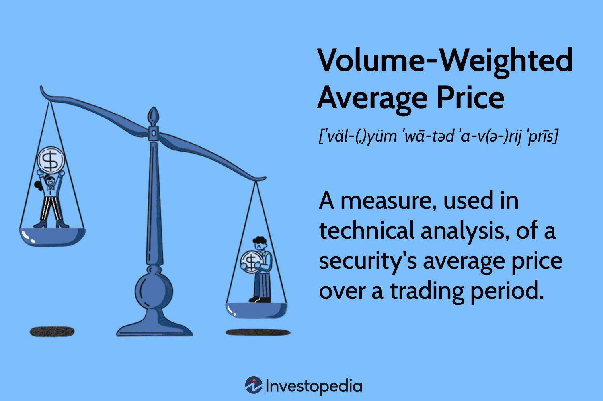

In the fast-paced world of trading, leveraging technical indicators is crucial for gaining a competitive edge. Among these tools, the Volume Weighted Average Price (VWAP) stands out as a powerful instrument employed extensively by both traders and analysts. VWAP offers valuable insights into the average price at which a security has traded during a specified time frame while taking into account the trading volume at each price point. By incorporating both price and volume data, VWAP provides a comprehensive snapshot of a security’s trading activity, enabling market participants to understand the dynamics of price movements throughout the trading session.

VWAP is particularly noteworthy for its application in optimizing trading strategies and execution. As traders aim to execute large orders, one of their primary concerns is minimizing the impact on market prices. VWAP facilitates this goal by serving as a benchmark that helps ensure trades are carried out at prices that closely align with prevailing market averages. This capability is especially advantageous for institutional investors seeking to execute substantial transactions without causing significant disruptions in the marketplace.



In this article, we explore VWAP's intricacies and its application in modern trading environments. We will also examine how algorithmic trading systems incorporate VWAP to enhance trading performance while maintaining market equilibrium. As the pursuit of efficient order execution continues to be a critical focus for traders, understanding and utilizing VWAP remains an invaluable skill. Through its effective integration, traders can not only enhance their decision-making processes but also achieve superior execution outcomes in today's dynamic financial markets.

## Table of Contents

## Understanding Volume Weighted Average Price (VWAP)

Volume Weighted Average Price (VWAP) is an essential technical indicator used in the analysis of security price movements during a trading session. It calculates the average price a security has traded at, weighted by the trading volume, providing a clear perspective of the trading activity and allowing market participants to assess current price trends against historical averages.

VWAP is predominantly used in intraday charts. It resets at the beginning of each trading session, making it a dynamic tool that reflects the daily trading rhythm. By offering a benchmark against which current price levels can be evaluated, VWAP aids traders in making informed decisions about entry and exit points in their trading strategies.

The calculation of VWAP incorporates two crucial data points: price and volume. Each transaction is weighted by its respective trading volume, allowing VWAP to serve as a reflection of the trading intensity throughout the session. The formula for VWAP is given by:

$$

\text{VWAP} = \frac{\sum (P_i \times V_i)}{\sum V_i} 
$$

where $P_i$ represents the transaction price for trade $i$ and $V_i$ is the volume of trade $i$. This comprehensive calculation enables a more accurate portrayal of the average transactional price, adjusted for volume.

VWAP’s inclusion of [volume](/wiki/volume-trading-strategy) in its computation makes it particularly valuable for large institutional investors, who generally require cognizance of trading intensity to mitigate the market impact of their significant orders. The reliance on VWAP by such entities stems from its ability to help execute trades that reflect the prevailing market prices accurately, thus optimizing the execution process and maintaining competitive price alignments. This attribute is particularly beneficial when executing sizeable transactions that could otherwise disrupt the market equilibrium.

## The Importance of VWAP in Trading

Volume Weighted Average Price (VWAP) is an integral tool in trading, serving as a vital benchmark for executing trades in line with market averages. Traders and institutional investors employ VWAP to ensure that their trade executions are reflective of average price levels, thus optimizing trading decisions and outcomes.

One of the primary roles of VWAP in trading is to assist traders in identifying optimal entry and [exit](/wiki/exit-strategy) points. By comparing the current price of a security with its VWAP, traders can ascertain whether the security is relatively overvalued or undervalued. When the price is below the VWAP, traders might interpret it as a buying opportunity, expecting the price to revert to the average. Conversely, when the price is above the VWAP, it could indicate a selling opportunity as the price may decrease towards the average. This approach allows traders to execute orders at more favorable prices compared to the overall day's trading activity.

VWAP also plays a crucial role in reducing market impact costs. Large orders, especially in less liquid securities, can significantly impact the market price if executed all at once. By using VWAP, traders can break down large orders and execute them in smaller, more manageable portions, aligning with the average price throughout the trading session. This strategy helps in minimizing the price variances that large trades might cause, effectively cushioning the market impact.

For institutional traders, VWAP is indispensable in trade benchmarking and performance measurement. Institutions often evaluate their trade execution quality against VWAP to determine the efficiency and effectiveness of their trading strategies. If trades are consistently executed at prices better than VWAP, it signals superior performance and successful trading strategies. This benchmarking ensures that trades are not only cost-effective but also align with broader market conditions, adding a layer of accountability and transparency in institutional trading practices. 

By serving as both a benchmark and a guide for trading decisions, VWAP underscores its importance in maintaining market stability and optimizing trade executions. Its widespread use among traders and analysts highlights its significance in contemporary financial markets.

## Calculating VWAP

The Volume Weighted Average Price (VWAP) is determined using a specific calculation that integrates both price and volume data to provide an accurate metric of a security's average trading price within a particular period. The formula for VWAP is given by:

$$
\text{VWAP} = \frac{\sum_{i=1}^{n} (P_i \times V_i)}{\sum_{i=1}^{n} V_i}
$$

In this formula, $P_i$ represents the price of each transaction, $V_i$ indicates the corresponding volume of each transaction, and $n$ is the total number of transactions in the time period being evaluated. This calculation method ensures that the VWAP accounts for both price and the trading intensity at each price level, resulting in a weighted average that reflects the true market conditions.

While VWAP can be calculated manually using the formula, the complexity and time consumption involved in handling large data sets can be significant. Consequently, most modern trading platforms automate this process, continually updating the VWAP throughout the trading day. This automation allows traders to concentrate on formulating and implementing trading strategies rather than on complex computational tasks.

Understanding the VWAP formula is beneficial for traders as it enhances their ability to analyze its influence on their trading decisions. The VWAP acts as a dynamic benchmark against which traders can gauge whether the current price levels are favorably aligned with the average market trends. This knowledge empowers traders to better navigate their entry and exit points, contributing to more informed and strategic decision-making.

## Applying VWAP in Trading Strategies

Volume Weighted Average Price (VWAP) is extensively employed as a crucial component in trading strategies, functioning as a trend confirmation tool by tracking price movements relative to the VWAP line. Traders often capitalize on the VWAP's ability to indicate mean reversion tendencies, which refer to the market's inclination to revert to the average price. Thus, a common strategy involves purchasing securities when their price falls below the VWAP, predicting a potential return to the average price level. Conversely, if the price surpasses the VWAP, it often serves as a signal to sell, capturing the anticipated deviation from the mean.

Short-term traders find VWAP particularly beneficial in identifying market pullbacks and breakouts. These are moments when security prices retract to a support level before potentially moving in the opposite direction, or when they surge past a resistance level, initiating a pronounced price movement. By observing these dynamics in relation to the VWAP line, traders can enhance the accuracy of their decision-making process, thus optimizing entry and exit points in fast-paced trading environments.

In the context of [algorithmic trading](/wiki/algorithmic-trading), VWAP is integrated to refine order execution strategies. Algorithms utilize the VWAP data to distribute large orders into smaller, manageable segments, thereby executing them at prices closer to the average market price. This method of execution not only minimizes market impact but also helps in preserving the equilibrium of prices within the trading venue. By employing VWAP, trading systems can maintain a delicate balance, executing trades with minimal disruption while aligning with current market trends.

The integration of VWAP in trading strategies offers a framework for disciplined trading, leveraging price and volume data to execute orders efficiently. As traders harness VWAP, they incorporate it alongside other indicators to construct robust trading models, adapting to market conditions with precision.

## Limitations of VWAP

Volume Weighted Average Price (VWAP) is an essential technical analysis tool, yet it is not without its limitations. As a lagging indicator, VWAP relies heavily on historical data, which inherently limits its ability to respond to real-time market fluctuations. This aspect can hinder a trader's ability to quickly adapt to sudden changes in trading conditions, particularly during periods of high [volatility](/wiki/volatility-trading-strategies) where price dynamics shift rapidly.

One significant challenge of using VWAP arises in low-volume markets. In these environments, a few large trades can disproportionately alter the calculated average price, leading to potential misinterpretation of market trends. This is because VWAP weights prices by volume, so when the volume is low, the impact of substantial individual trades is amplified compared to high-volume settings. This skewing effect can deceive traders into believing a trend continuation or reversal is occurring when it is merely an anomaly caused by isolated trades.

To mitigate these limitations, traders are advised not to rely solely on VWAP for their decision-making processes. Instead, it's beneficial to use VWAP in conjunction with other technical indicators, such as Moving Averages, Relative Strength Index (RSI), or the Moving Average Convergence Divergence (MACD), to provide a more comprehensive analysis of market conditions. This multi-indicator approach helps in validating trends and signals, thus reducing the risk of basing trading decisions on misleading data.

Understanding these limitations is crucial for traders as it allows them to utilize VWAP more effectively. By acknowledging its dependence on past data and its potential susceptibility in low-volume conditions, traders can employ VWAP judiciously, avoiding misinterpretations and enhancing the robustness of their trading strategies.

## The Integration of VWAP in Algorithmic Trading

Algorithmic trading has become a cornerstone in the financial industry, leveraging computer algorithms to execute trades at speeds and frequencies beyond human capability. One of the central tools within this framework is the Volume Weighted Average Price (VWAP), which plays a pivotal role in optimizing the execution of trading strategies.

VWAP serves as a benchmark for algorithms, ensuring that large orders are divided into smaller increments and executed at prices that closely reflect the market's average. This process is critical for maintaining the integrity and stability of the market, as it minimizes the market impact typically associated with substantial order flows. For instance, by breaking down a large order using VWAP, an algorithm can distribute trades throughout the trading day, thereby reducing the likelihood of significant price movements due to the sheer volume of a single order.

Mathematically, the simplification can be expressed as:

$$
\text{VWAP}_t = \frac{\sum_{i=1}^{n} P_i \times V_i}{\sum_{i=1}^{n} V_i}
$$

Where:
- $P_i$ represents the price of each trade
- $V_i$ represents the volume of each trade
- $n$ is the total number of trades up to time $t$

By continuously recalculating this metric, algorithms can make real-time decisions to align trades with the prevailing VWAP, thus meeting the desired execution standards.

Integrating VWAP into algorithmic trading systems involves the development of strategies that incorporate historical data and real-time analytics. Algorithms may use VWAP not only for order execution but also for signaling potential market entries and exits, establishing limit orders, or adjusting to sudden market shifts. This capability helps maintain market fairness by ensuring that prices remain stable and aligned with genuine supply and demand dynamics.

Furthermore, VWAP's utility in algorithmic trading underscores the importance of advanced data analysis and technology in modern trading landscapes. Using tools like Python or C++, developers can construct robust algorithms that efficiently compute VWAP and adapt strategies dynamically. Here's a simple Python snippet for VWAP computation:

```python
def calculate_vwap(prices, volumes):
    if not volumes or not prices or len(prices) != len(volumes):
        raise ValueError("Price and volume lists must have the same non-zero length.")

    total_volume = sum(volumes)
    weighted_price_sum = sum(price * volume for price, volume in zip(prices, volumes))
    return weighted_price_sum / total_volume

prices = [100, 102, 101, 103]  # Example prices
volumes = [200, 150, 300, 250]  # Corresponding volumes

vwap = calculate_vwap(prices, volumes)
print("Calculated VWAP:", vwap)
```

In summary, the integration of VWAP in algorithmic trading systems is integral to executing trades that reflect true market conditions, ensuring efficiencies that benefit both institutional and retail participants. This strategic implementation not only optimizes trade execution but also contributes to the overall health and fairness of financial markets.

## Conclusion

The Volume Weighted Average Price (VWAP) is a critical component of technical analysis, widely regarded for its ability to provide insights into market trends and to enhance the precision of trade executions. By integrating price and volume data, VWAP offers traders a coherent view of a security’s trading activity, making it an indispensable tool in the financial markets. Despite being a lagging indicator, its value lies in the ability to act as a benchmark that aligns with average market prices.

VWAP's integration into algorithmic trading highlights its continued relevance and utility. Algorithms can leverage VWAP to automate and optimize large order executions, ensuring that trades align with market trends without exerting unnecessary influence on security prices. This capability is especially important in modern financial markets where execution efficiency and cost-effectiveness are pivotal.

However, it is crucial to recognize VWAP's limitations. Since it relies on historical data, it may not fully capture real-time market fluctuations, especially in low-volume environments where large trades can skew results. Therefore, it is prudent for traders to use VWAP in conjunction with other technical indicators to create a more comprehensive trading strategy.

Understanding VWAP and its application provides traders with a significant advantage. As the financial landscape continues to evolve, mastering VWAP contributes to more informed trading decisions and improved execution strategies, making it a vital skill for traders aiming to enhance their performance in competitive markets.

## References & Further Reading

[1]: Madhavan, A. (2002). ["VWAP Strategies."](https://guides.pm-research.com/content/iijtrading/2002/1/32) The Journal of Portfolio Management, 28(2), 102-108.

[2]: Leung, T., Li, X., & Li, X. (2015). ["Optimal VWAP Trading Strategy Using a Model with Stochastic Volatilities and Order Flows."](https://arxiv.org/abs/1411.5062) The Journal of Trading, 10(4), 40-58.

[3]: Almgren, R., & Chriss, N. (2000). ["Optimal Execution of Portfolio Transactions."](https://smallake.kr/wp-content/uploads/2016/03/optliq.pdf) Journal of Risk, 3(2), 5-39.

[4]: Bhattacharyya, S. K., Konstantinidi, E., & Pruitt, R. (2014). ["Financial Modelling and Algorithmic Trading with Python."](https://www.sciencedirect.com/science/article/pii/S0888327018304837) Springer.

[5]: Ernie Chan (2009). ["Quantitative Trading: How to Build Your Own Algorithmic Trading Business."](https://www.amazon.com/Quantitative-Trading-Build-Algorithmic-Business/dp/0470284889) Wiley Trading.