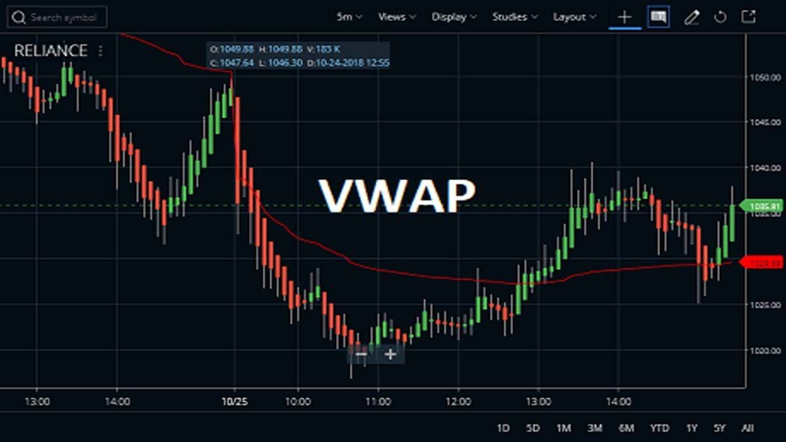

The Volume-Weighted Average Price (VWAP) is a critical algorithmic tool employed within the trading sphere to evaluate the average price at which a security is traded over a specified time frame. This average is calculated by weighing the price of the security by the volume of shares traded. The formula for VWAP is as follows:

$$
\text{VWAP} = \frac{\sum (P_i \times Q_i)}{\sum Q_i}
$$



where $P_i$ is the price at which each transaction is executed, and $Q_i$ is the volume of shares traded at each price level. This calculation gives traders a nuanced understanding of the day's trading activity, enabling them to compare the current trading price to the day’s average.

Institutional investors widely utilize VWAP as it aids in executing trades that align closely with the real-time market average, thereby enhancing execution quality and minimizing market impact. A key advantage of VWAP is its utility in large volume trades, where executing a block trade can significantly impact market prices. By aligning trades with VWAP, traders can disperse large orders across smaller trades, reducing their visibility and the resultant price changes.

Despite its effectiveness, VWAP is not a standalone solution. It serves best when complemented by additional trading strategies to bolster decision-making. This article will explore the significance and applications of VWAP in trading, highlighting its benefits, addressing its limitations, and suggesting alternative strategies to optimize its use.

## Table of Contents

## Understanding VWAP and Its Purpose in Trading

The Volume-Weighted Average Price (VWAP) serves as a critical metric for traders seeking to understand the average price at which a security has traded throughout a day, weighted by the total trading volume. The VWAP calculation is straightforward: for each trade, the price is multiplied by the trade's volume, these products are summed, and then divided by the total trading volume. The formula can be expressed as:

$$
\text{VWAP} = \frac{\sum (P_i \times Q_i)}{\sum Q_i}
$$

where $P_i$ is the price of the ith transaction, and $Q_i$ is the volume of the ith transaction.

This calculation allows VWAP to act as a benchmark against which current security prices can be evaluated, offering valuable insights into whether the market conditions are favorable or not. By aligning trade executions with a security's average trading price, VWAP helps in mitigating market impact costs, which is particularly significant for trades involving large volumes. For instance, executing a large order at a price close to the VWAP can minimize the adverse effects of the trade order on the market price, thus maintaining execution efficiency.

In essence, for institutional traders and portfolio managers, VWAP is a tool for ensuring that their trades are in line with the market's average, reflecting their performance against an industry-standard benchmark. This role as a benchmark is crucial, especially in large [volume](/wiki/volume-trading-strategy) trades, where deviations from VWAP might indicate suboptimal execution or contribute to market [volatility](/wiki/volatility-trading-strategies). By integrating VWAP into their trading strategies, traders can better navigate the complex landscape of market pricing, ensuring that they capitalize on strategic trading opportunities while conserving costs.

## Historical Context and Insights into VWAP

Volume-Weighted Average Price (VWAP) emerged as a critical financial tool during the 1980s when institutional investors prioritized evaluating trade performance in increasingly dynamic financial markets. This era marked the proliferation of electronic trading systems, and the need for sophisticated, yet comprehensible, indicators became apparent. VWAP quickly gained popularity due to its simplicity and effectiveness in serving as a benchmark for assessing the quality of trade executions.

The underpinning simplicity of VWAP lies in its formula, where the average number of securities traded at different prices throughout the trading day is calculated. Mathematically, VWAP is expressed as:
$$

VWAP = \frac{\sum (Price_i \times Volume_i)}{\sum Volume_i} 
$$
where $Price_i$ represents the price at which the security is traded, and $Volume_i$ is the corresponding number of traded shares.

By offering insight into the average price paid for securities during a specific time frame, VWAP provided institutional traders with a straightforward method to gauge how well their trades performed against the overall market activity for the day. This benchmarking capability was essential for minimizing the price impact of large trade orders, a common concern for institutional investors executing significant transactions. The use of VWAP helped in dispersing large orders across the day, thereby reducing scrutiny and potential adverse reactions from market participants.

As a result, VWAP has entrenched itself as a vital tool in optimizing trade performance, highlighting its enduring significance in advancing more efficient trading practices. Its introduction during the electronic trading boom of the 1980s set the stage for its sustained relevance in contemporary trading environments.

## Practical Applications of VWAP in Trading

Traders utilize the Volume-Weighted Average Price (VWAP) as a benchmark to ensure that trade executions align with prevailing market trends. This alignment is crucial for achieving fair trade executions, particularly in markets characterized by high volatility and trading volumes. The VWAP acts as a reference point by averaging the price of a security over a specific period, weighted by volume, thus representing the true average trading price over that time frame.

The relationship between the security's current price and the VWAP is instrumental in identifying market trends. When the current price is above the VWAP, it signals a bullish trend, suggesting that the security is trading higher than its average price, indicating buying pressure. Conversely, a price below the VWAP is indicative of a bearish trend, as it suggests the security is trading lower than its average, signaling selling pressure.

VWAP is also a valuable tool for timing entry and [exit](/wiki/exit-strategy) points in trades. Traders can use the VWAP to execute mean reversion strategies by entering trades when prices deviate significantly from the VWAP, with the expectation that prices will revert to the mean. For example, if a security's price falls well below the VWAP, traders might anticipate a bounce back (mean reversion) toward the VWAP, prompting a buy decision. Conversely, if prices are significantly above the VWAP, a sell action might be warranted with the expectation that prices will drop back toward the VWAP.

The VWAP can be calculated using the following formula:

$$
\text{VWAP} = \frac{\sum (P_i \times V_i)}{\sum V_i}
$$

Where $P_i$ is the price of the trade at time $i$, and $V_i$ is the volume of the trade at time $i$. This calculation method ensures that the VWAP reflects the true average price level for a security, accounting for the influence of high-volume trades which can significantly affect price movements.

Incorporating the VWAP into trading strategies enhances their effectiveness, particularly when traders are looking to minimize market impact and execute trades at prices close to the market average.

## VWAP in Action: A Hypothetical Trading Scenario

In this hypothetical trading scenario, a trader aims to purchase a sizable quantity of stock, intending to optimize the purchase by keeping the price close to the Volume-Weighted Average Price (VWAP) throughout the trading day. This strategy involves dissecting a large order into smaller, strategically timed trades, which are executed incrementally to align with the VWAP. 

The fundamental principle behind using VWAP in this manner is to minimize market impact costs and avoid distorting the stock price with a single, large order. By carefully monitoring the VWAP, the trader can make informed decisions about the timing and size of each order slice. If the stock price is below the VWAP, this signals a potential buying opportunity, suggesting the stock is under the average trading price, while a price above the VWAP might indicate an overvalued condition.

The trader can programmatically implement this strategy using Python to consistently monitor and adjust the trades according to real-time VWAP data. A simple algorithm to achieve this could involve the following steps:

1. **Monitor Current Price and VWAP**: Regularly acquire the current stock price and VWAP from a reliable data source.

   ```python
   import yfinance as yf
   import numpy as np

   def calculate_vwap(prices, volumes):
       return np.average(prices, weights=volumes)

   stock_data = yf.download('STOCK_SYMBOL', period='1d', interval='1m')
   prices = stock_data['Close'].values
   volumes = stock_data['Volume'].values
   vwap = calculate_vwap(prices, volumes)
   ```

2. **Determine Order Splits**: Break the total intended purchase into smaller portions. Each trade can be a fraction of the total order, for example, 10-20%, to avoid overwhelming the market.

3. **Execution Timing Based on VWAP**: Execute trades when the current price is at or below the VWAP to ensure the average buying price remains competitive.

4. **Adapt Orders According to Market Changes**: Continuously adjust the execution of trades based on real-time price movements and VWAP adjustments throughout the day.

By adopting this method, the trader effectively matches the stock's average performance over the [course](/wiki/best-algorithmic-trading-courses) of the trading day. This reduces the likelihood of overpaying, as trades are aligned with the average market price, leveraging VWAP as a real-time benchmark for execution quality. This strategic alignment not only aids in maintaining cost efficiency but also in achieving competitive trade execution consistency.

## Limitations of Using VWAP Solely

VWAP, as a lagging indicator, inherently provides delayed signals. This characteristic makes it less effective for navigating markets that are rapidly evolving, where timely decision-making is crucial. The calculation of VWAP takes into account the price and volume of trades executed over a specific time frame, which can lead to a lag in reflecting the most current market conditions. When markets change quickly, traders relying solely on VWAP may find themselves acting on outdated information, potentially resulting in suboptimal trading outcomes.

Another limitation arises in markets with low trading volumes. In such environments, individual trades can have a disproportionate impact on VWAP calculations due to the reduced overall volume. For instance, a single large transaction might skew the VWAP, thus not representing the actual market sentiment or trend accurately. This can lead to misleading signals and may cause traders to make decisions based on a VWAP that does not truly reflect current market conditions.

Furthermore, the exclusive reliance on VWAP, without taking into account other critical external factors, can lead to inferior trading decisions. Market dynamics are influenced by a myriad of factors, including geopolitical events, macroeconomic data releases, and sudden shifts in investor sentiment. Focusing on VWAP alone means overlooking these important elements, which can result in missing significant market movements.

To illustrate the concept programmatically, consider a Python snippet that calculates VWAP:

```python
def calculate_vwap(prices, volumes):
    if len(prices) != len(volumes):
        raise ValueError("Prices and volumes must have the same length.")

    total_volume_weighted_price = 0
    total_volume = 0

    for price, volume in zip(prices, volumes):
        total_volume_weighted_price += price * volume
        total_volume += volume

    return total_volume_weighted_price / total_volume if total_volume > 0 else 0

# Example usage
prices = [100, 102, 101, 105]
volumes = [200, 240, 180, 160]
vwap_value = calculate_vwap(prices, volumes)
```

This function highlights how VWAP is derived by weighting prices by their corresponding volumes and then averaging them. However, this approach does not account for the rapid changes or external factors discussed, underscoring the importance of broader strategic integration when utilizing VWAP.

## Incorporating a News Trading Strategy

Incorporating a news trading strategy alongside the Volume-Weighted Average Price (VWAP) can enhance a trader's ability to capitalize on market movements driven by significant economic releases. News trading is a strategy that focuses on the swift execution of trades in response to economic reports such as employment data, central bank announcements, or GDP figures. These reports can cause immediate market volatility, presenting opportunities to enter or exit positions favorably.

The primary goal of news trading is to exploit the rapid price changes that occur when market participants respond to new information. This approach requires a detailed understanding of both the timing and the potential impact of economic data releases. Traders who employ this strategy must be adept at processing information quickly and making decisions in a fast-paced environment.

Integrating news trading with VWAP can provide a comprehensive approach to trading. While VWAP offers a measure of the average price of a security over a certain period, news trading allows traders to anticipate and react to news-driven spikes or drops in price. For instance, if an economic report indicates stronger-than-expected employment numbers, a trader using VWAP might observe the impact on the security's price related to this sudden influx of new information. By examining the VWAP in conjunction with market reactions to news, traders can better gauge whether current prices are likely to trend upwards or downwards.

To effectively implement a news trading strategy, a trader should have access to real-time news feeds and economic calendars. This allows them to stay informed of upcoming releases and be prepared to act immediately. Furthermore, employing algorithms can automate the execution of trades once specific criteria are met, minimizing delays and ensuring trades are executed at optimal prices.

In summary, by combining VWAP with a strategic approach to news trading, traders are better positioned to navigate the complexities of financial markets effectively. This integration not only provides insights into average price movements but also maximizes the benefits of timely responses to economic reports, ultimately enhancing trading outcomes.

## News Trading Strategy: Execution Steps

Analyzing central bank priorities and focus areas is crucial in forecasting trade potential within a news trading strategy. Central banks often set monetary policy directions that significantly influence market dynamics. By examining policy statements, meeting minutes, and economic projections, traders can anticipate potential market movements. Key areas of focus typically include inflation targets, [interest rate](/wiki/interest-rate-trading-strategies) decisions, and employment figures. Understanding these priorities allows traders to make informed predictions about market reactions.

Utilizing high-low expectation forecasts is essential for determining trade opportunities that arise from deviations between actual economic data and analyst expectations. This approach involves monitoring key economic indicators, such as GDP growth rates, unemployment figures, and consumer price indexes. When actual data is released, traders assess the difference between the forecasts and the actual results. Significant deviations can lead to rapid market adjustments, providing lucrative trading opportunities. For instance, if unemployment figures are lower than expected, it may signal economic strength, leading to currency appreciation.

Monitoring revisions and confirming signals allow traders to capitalize on market reactions swiftly after news releases. Revisions to previous data can often have a substantial impact on market perceptions and subsequent movements. Traders should stay alert to revised figures, as these can either amplify or mitigate the initial market response. Once a news release occurs, confirming signals through technical indicators or price action analysis helps traders enter the market promptly, capturing the price movement before stabilization. This swift action is vital in securing an advantageous position during volatile periods following significant news events.

## Conclusion

While the Volume-Weighted Average Price (VWAP) is a powerful tool for evaluating average trade prices and understanding market trends, its effectiveness is enhanced when used in conjunction with news trading strategies. By integrating VWAP with news trading, traders can achieve a more comprehensive approach to decision-making, allowing them to better navigate significant market events and capitalize on emerging opportunities. This combinatory strategy empowers traders to prepare for sudden market movements triggered by announcements and economic data, thereby maximizing their profitability potential. Embracing both VWAP and news trading ensures that traders are equipped with a holistic understanding of price movements, leading to well-informed and timely trading decisions.

## References & Further Reading

[1]: ["VWAP: The Financial “Average” Even Non-Finance Types Can Understand"](https://thevwap.com/vwap/) by Jonathan Clements, HumbleDollar.

[2]: Chan, E. P. (2009). ["Quantitative Trading: How to Build Your Own Algorithmic Trading Business"](https://github.com/egorpe/EPChan-QuantitativeTrading/blob/master/example7_6.m). John Wiley & Sons.

[3]: Aldridge, I. (2013). ["High-Frequency Trading: A Practical Guide to Algorithmic Strategies and Trading Systems"](https://www.amazon.com/High-Frequency-Trading-Practical-Algorithmic-Strategies/dp/1118343506). John Wiley & Sons.

[4]: ["Programming for Algorithmic Trading Strategies in Python"](https://www.freecodecamp.org/news/how-to-get-started-with-algorithmic-trading-in-python/). DataCamp. 

[5]: Kissell, R. (2014). ["The Science of Algorithmic Trading and Portfolio Management"](https://www.sciencedirect.com/book/9780124016897/the-science-of-algorithmic-trading-and-portfolio-management). Academic Press.