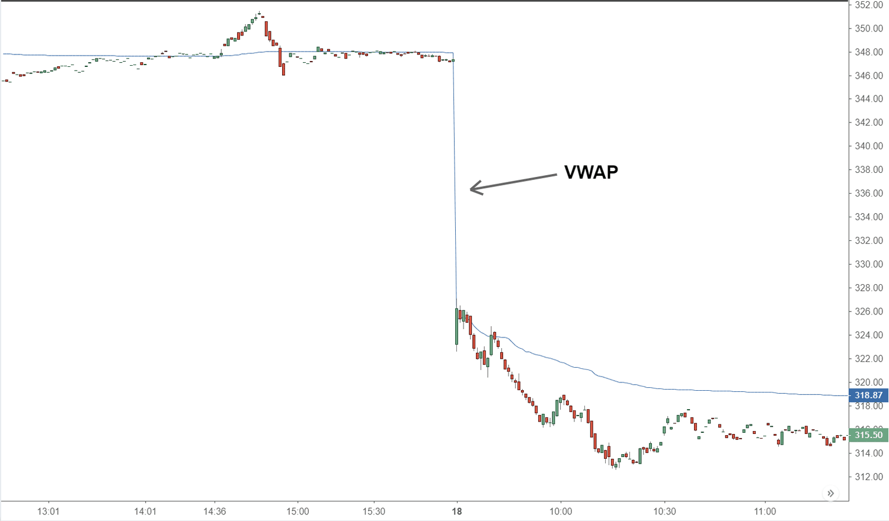

## Table of Contents

## What is Volume-Weighted Average Price (VWAP)?

Volume-Weighted Average Price (VWAP) is a trading benchmark that traders use to know if they bought or sold a stock at a good price. It is calculated by taking the total dollar amount of a stock traded for the day and dividing it by the total number of shares traded. This gives traders a kind of average price that takes into account both the price and the volume of trades.

VWAP is useful because it helps traders see how their trades stack up against the market. If a trader buys a stock below the VWAP, it means they got a better price than the average for that day. On the other hand, if they buy above the VWAP, they paid more than the average. Many traders use VWAP to make decisions about when to buy or sell, trying to get the best possible price for their trades.

## How is VWAP calculated?

VWAP is calculated by adding up the total dollar amount of all trades for a stock and then dividing that by the total number of shares traded. To do this, you take the price of each trade, multiply it by the number of shares in that trade, and add all those amounts together. Then, you add up all the shares traded during the period. Finally, you divide the total dollar amount by the total number of shares.

For example, if a stock was traded at $10 for 100 shares, $11 for 200 shares, and $12 for 300 shares during a day, you would calculate the VWAP like this: First, you find the total dollar amount: ($10 * 100) + ($11 * 200) + ($12 * 300) = $1,000 + $2,200 + $3,600 = $6,800. Then, you find the total number of shares: 100 + 200 + 300 = 600. Finally, you divide the total dollar amount by the total number of shares: $6,800 / 600 = $11.33. So, the VWAP for that day would be $11.33.

## Why is VWAP important in trading?

VWAP is important in trading because it helps traders understand if they are getting a good price for a stock. It acts like a benchmark that shows the average price at which a stock was traded, taking into account both the price and the volume of each trade. If a trader buys a stock below the VWAP, it means they got a better deal than the average trader that day. On the other hand, if they buy above the VWAP, they paid more than the average. This information is crucial for traders who want to make smart decisions about when to buy or sell.

Traders often use VWAP to guide their trading strategies. For example, some might use it to time their trades, trying to buy when the price is below the VWAP and sell when it's above. Others might use it to assess the performance of their trades over time. By comparing their trade prices to the VWAP, they can see if they are consistently getting good prices or if they need to adjust their strategies. Overall, VWAP is a valuable tool that helps traders navigate the market more effectively.

## Can VWAP be used for any type of security?

VWAP can be used for many types of securities, like stocks, ETFs, and futures. It works best with securities that trade a lot, because it needs a good amount of trading data to be accurate. If a security doesn't trade often, the VWAP might not be very useful because there won't be enough trades to make a reliable average.

Even though VWAP is most commonly used for stocks, it can also be applied to other securities. For example, traders in the [forex](/wiki/forex-system) market or those trading commodities might use VWAP to help them make decisions. However, the effectiveness of VWAP in these markets depends on the trading volume and how often the security changes hands.

## How does VWAP differ from other average price indicators?

VWAP is different from other average price indicators like the simple moving average (SMA) and the exponential moving average (EMA) because it takes into account both the price and the volume of each trade. For example, the SMA just adds up the closing prices over a certain time and divides by the number of periods. It treats each price the same, no matter how many shares were traded at that price. On the other hand, VWAP gives more weight to prices where more shares were traded, making it a better reflection of what's really happening in the market.

Another difference is that VWAP is usually calculated for a single trading day, while other indicators like SMA and EMA can be calculated over any time period, like 50 days or 200 days. This makes VWAP more useful for short-term trading decisions because it shows the average price for the day, helping traders know if they're getting a good deal right now. SMA and EMA are more helpful for seeing longer-term trends because they smooth out price changes over time.

## What are the limitations of using VWAP?

One limitation of using VWAP is that it works best with a lot of trading data. If a stock doesn't trade often, the VWAP might not be very accurate. This is because VWAP needs many trades to make a good average price. If there are only a few trades, the VWAP might not show what's really happening in the market.

Another problem is that VWAP is usually calculated for just one day. This means it's not as useful for looking at longer-term trends. If you want to see how a stock is doing over weeks or months, VWAP might not be the best tool. Other indicators like moving averages might be better for that because they can be set to look at longer periods of time.

## How can traders use VWAP to make trading decisions?

Traders can use VWAP to decide when to buy or sell a stock. They look at the stock's price compared to the VWAP. If the price is below the VWAP, it means the stock is cheaper than the average price for the day. This might be a good time to buy. On the other hand, if the price is above the VWAP, it's more expensive than the average. This might be a good time to sell or wait for a better price.

Another way traders use VWAP is to check if their trades are doing well. If they often buy below the VWAP and sell above it, they are probably getting good prices. But if they keep buying above the VWAP and selling below it, they might need to change their strategy. VWAP helps them see if they are making smart trades or if they need to adjust their approach to get better deals.

## What time frames are typically used for VWAP calculations?

VWAP is usually calculated for just one trading day. This means it shows the average price of a stock for that day, taking into account both the price and the number of shares traded. Traders often use the daily VWAP to make quick decisions about buying or selling. It helps them see if they are getting a good price compared to what other people paid that day.

Sometimes, traders might use VWAP over longer periods, like a week or a month, but this is less common. When used over longer times, VWAP can give a broader view of the stock's price trends. However, because VWAP works best with a lot of trading data, using it for longer periods might not be as accurate if the stock doesn't trade often enough.

## How does intraday VWAP differ from daily VWAP?

Intraday VWAP and daily VWAP are both ways to figure out the average price of a stock, but they look at different time frames. Intraday VWAP is calculated over shorter periods within a single trading day, like every hour or every few minutes. This helps traders see how the stock's price is doing throughout the day and can help them make quick decisions about buying or selling.

Daily VWAP, on the other hand, is calculated for the whole trading day. It shows the average price of the stock from the opening of the market to the close. Traders use daily VWAP to see if they got a good price compared to what other people paid that day. While intraday VWAP is useful for short-term trading, daily VWAP gives a broader view of the stock's price for the entire day.

## Can VWAP be used in algorithmic trading strategies?

Yes, VWAP can be used in [algorithmic trading](/wiki/algorithmic-trading) strategies. Traders use VWAP to set up automatic trading systems that buy or sell stocks based on how the current price compares to the VWAP. If the price is below the VWAP, the algorithm might decide to buy the stock because it's cheaper than the average price for the day. If the price is above the VWAP, the algorithm might choose to sell or wait for a better price. This helps the algorithm try to get the best possible price for trades.

VWAP is especially useful in algorithmic trading because it can be updated in real-time. This means the algorithm can quickly change its trading decisions as new trades happen throughout the day. Many big investors and trading firms use VWAP algorithms to spread out their trades and minimize the impact on the stock's price. By breaking up large orders into smaller ones and trading them at different times, they can try to buy or sell at prices that are close to the VWAP, which helps them get better overall prices for their trades.

## What are some advanced techniques for using VWAP?

One advanced technique for using VWAP is to combine it with other indicators to make better trading decisions. For example, a trader might use VWAP along with the Relative Strength Index (RSI) or Moving Average Convergence Divergence (MACD). If the stock price is below the VWAP and the RSI shows the stock is oversold, it might be a good time to buy. This way, the trader can use VWAP to find good prices and other indicators to confirm the trade.

Another technique is to use multiple time frames of VWAP. Traders might look at the intraday VWAP to make quick trades during the day and also keep an eye on the daily VWAP to see the bigger picture. By comparing the two, they can get a better sense of whether the stock is a good buy or sell at that moment. This can help them make more informed decisions and possibly get better prices for their trades.

Lastly, some traders use VWAP to set up more complex trading algorithms. These algorithms can automatically buy or sell based on how the current price compares to the VWAP, and they can also adjust the size of the trades based on how far the price is from the VWAP. This helps the algorithm spread out large orders over time to minimize the impact on the stock's price and try to get the best possible prices.

## How does VWAP interact with other technical indicators?

VWAP can work together with other technical indicators to help traders make better choices. For example, if a trader sees that a stock's price is below the VWAP and the Relative Strength Index (RSI) shows that the stock is oversold, it might be a good time to buy. The VWAP tells the trader that the price is cheaper than the average for the day, and the RSI adds more confidence by showing that the stock might be ready to go up. This way, using VWAP with other indicators can help traders find the best times to buy or sell.

Another way VWAP can be used with other indicators is by looking at moving averages. If the price of a stock is below the VWAP but above a long-term moving average like the 200-day moving average, it might mean that the stock is a good buy for the short term but still part of a bigger upward trend. By combining VWAP with moving averages, traders can see both short-term and long-term trends and make smarter trading decisions. This can help them get better prices and improve their overall trading strategy.

## What is VWAP and what is its purpose in trading?

The Volume-Weighted Average Price (VWAP) serves as a critical metric for traders seeking to understand the average price at which a security has traded throughout a day, weighted by the total trading volume. The VWAP calculation is straightforward: for each trade, the price is multiplied by the trade's volume, these products are summed, and then divided by the total trading volume. The formula can be expressed as:

$$
\text{VWAP} = \frac{\sum (P_i \times Q_i)}{\sum Q_i}
$$

where $P_i$ is the price of the ith transaction, and $Q_i$ is the volume of the ith transaction.

This calculation allows VWAP to act as a benchmark against which current security prices can be evaluated, offering valuable insights into whether the market conditions are favorable or not. By aligning trade executions with a security's average trading price, VWAP helps in mitigating market impact costs, which is particularly significant for trades involving large volumes. For instance, executing a large order at a price close to the VWAP can minimize the adverse effects of the trade order on the market price, thus maintaining execution efficiency.

In essence, for institutional traders and portfolio managers, VWAP is a tool for ensuring that their trades are in line with the market's average, reflecting their performance against an industry-standard benchmark. This role as a benchmark is crucial, especially in large [volume](/wiki/volume-trading-strategy) trades, where deviations from VWAP might indicate suboptimal execution or contribute to market [volatility](/wiki/volatility-trading-strategies). By integrating VWAP into their trading strategies, traders can better navigate the complex landscape of market pricing, ensuring that they capitalize on strategic trading opportunities while conserving costs.

## What are the practical applications of VWAP in trading?

Traders utilize the Volume-Weighted Average Price (VWAP) as a benchmark to ensure that trade executions align with prevailing market trends. This alignment is crucial for achieving fair trade executions, particularly in markets characterized by high volatility and trading volumes. The VWAP acts as a reference point by averaging the price of a security over a specific period, weighted by volume, thus representing the true average trading price over that time frame.

The relationship between the security's current price and the VWAP is instrumental in identifying market trends. When the current price is above the VWAP, it signals a bullish trend, suggesting that the security is trading higher than its average price, indicating buying pressure. Conversely, a price below the VWAP is indicative of a bearish trend, as it suggests the security is trading lower than its average, signaling selling pressure.

VWAP is also a valuable tool for timing entry and [exit](/wiki/exit-strategy) points in trades. Traders can use the VWAP to execute mean reversion strategies by entering trades when prices deviate significantly from the VWAP, with the expectation that prices will revert to the mean. For example, if a security's price falls well below the VWAP, traders might anticipate a bounce back (mean reversion) toward the VWAP, prompting a buy decision. Conversely, if prices are significantly above the VWAP, a sell action might be warranted with the expectation that prices will drop back toward the VWAP.

The VWAP can be calculated using the following formula:

$$
\text{VWAP} = \frac{\sum (P_i \times V_i)}{\sum V_i}
$$

Where $P_i$ is the price of the trade at time $i$, and $V_i$ is the volume of the trade at time $i$. This calculation method ensures that the VWAP reflects the true average price level for a security, accounting for the influence of high-volume trades which can significantly affect price movements.

Incorporating the VWAP into trading strategies enhances their effectiveness, particularly when traders are looking to minimize market impact and execute trades at prices close to the market average.

## References & Further Reading

[1]: ["VWAP: The Financial “Average” Even Non-Finance Types Can Understand"](https://thevwap.com/vwap/) by Jonathan Clements, HumbleDollar.

[2]: Chan, E. P. (2009). ["Quantitative Trading: How to Build Your Own Algorithmic Trading Business"](https://github.com/egorpe/EPChan-QuantitativeTrading/blob/master/example7_6.m). John Wiley & Sons.

[3]: Aldridge, I. (2013). ["High-Frequency Trading: A Practical Guide to Algorithmic Strategies and Trading Systems"](https://www.amazon.com/High-Frequency-Trading-Practical-Algorithmic-Strategies/dp/1118343506). John Wiley & Sons.

[4]: ["Programming for Algorithmic Trading Strategies in Python"](https://www.freecodecamp.org/news/how-to-get-started-with-algorithmic-trading-in-python/). DataCamp. 

[5]: Kissell, R. (2014). ["The Science of Algorithmic Trading and Portfolio Management"](https://www.sciencedirect.com/book/9780124016897/the-science-of-algorithmic-trading-and-portfolio-management). Academic Press.