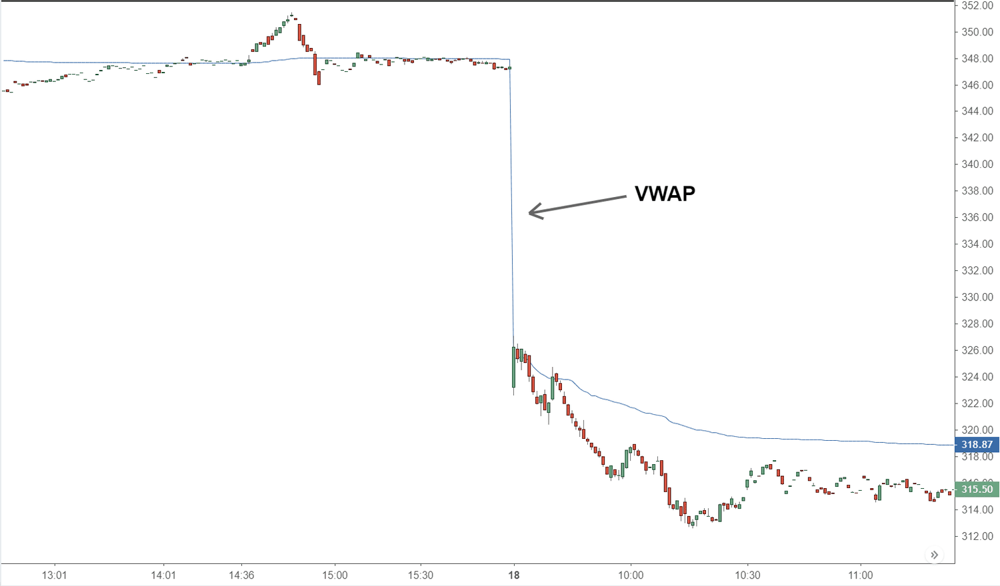

## Table of Contents

## What is the volume-weighted average price (VWAP)?

The volume-weighted average price (VWAP) is a trading measure used to show the average price at which a stock has traded throughout the day, based on both volume and price. It is calculated by adding up the dollars traded for every transaction (price multiplied by volume) and then dividing by the total shares traded. This gives traders an idea of the average price most investors are paying for the stock.

VWAP is often used by investors to decide when to buy or sell a stock. If the current price is below the VWAP, it might be seen as a good time to buy, as the stock is trading at a lower price than the average. On the other hand, if the price is above the VWAP, it might be a good time to sell, as the stock is trading at a higher price than the average. This helps traders make more informed decisions based on the stock's trading activity.

## How is VWAP calculated?

VWAP, or volume-weighted average price, is a way to find out the average price of a stock during a trading day. To calculate it, you take the total dollar amount of all trades and divide it by the total number of shares traded. The total dollar amount is found by multiplying the price of each trade by the number of shares in that trade, and then adding all these amounts together. The total number of shares is just the sum of all shares traded during the day.

For example, if a stock had three trades in a day: the first trade was 100 shares at $10 each, the second was 200 shares at $11 each, and the third was 300 shares at $12 each, you would calculate the VWAP like this: First, find the total dollar amount: (100 * $10) + (200 * $11) + (300 * $12) = $1000 + $2200 + $3600 = $6800. Then, find the total number of shares: 100 + 200 + 300 = 600. Finally, divide the total dollar amount by the total number of shares: $6800 / 600 = $11.33. So, the VWAP for this stock on this day would be $11.33.

## Why is VWAP important in trading?

VWAP is important in trading because it gives traders a good idea of the average price at which a stock is being bought and sold during the day. This helps traders see if the current price is higher or lower than what most people are paying. If the current price is lower than the VWAP, traders might think it's a good time to buy because the stock is cheaper than average. If the price is higher, they might think it's a good time to sell because the stock is more expensive than average.

Using VWAP can also help traders make better decisions. For example, big investors often use VWAP to make sure they are getting a fair price when they buy or sell a lot of shares. If they buy at a price lower than the VWAP, they know they are getting a good deal. VWAP can also show traders how the market is feeling about a stock. If the price stays above the VWAP, it might mean that people are feeling good about the stock and are willing to pay more for it.

## Can you explain the difference between VWAP and a simple moving average?

VWAP and a simple moving average both help traders understand price trends, but they do it in different ways. VWAP takes into account both the price and the volume of trades. It tells you the average price people paid for a stock throughout the day, weighted by how many shares were traded at each price. This makes VWAP very useful for knowing if you're getting a good deal compared to what others are paying.

A simple moving average, on the other hand, just looks at the price of a stock over a certain period of time. It doesn't care about how many shares were traded at each price. It simply averages the closing prices over that time. For example, a 10-day simple moving average would add up the closing prices of the last 10 days and divide by 10. This can help you see the overall trend of the stock's price, but it doesn't tell you anything about the volume of trades.

## How can traders use VWAP to make trading decisions?

Traders can use VWAP to decide when to buy or sell a stock. If the current price of the stock is lower than the VWAP, it might be a good time to buy. This is because the stock is cheaper than the average price most people are paying. For example, if the VWAP is $50 and the stock is now at $48, buying at $48 could be a good deal. On the other hand, if the current price is higher than the VWAP, it might be a good time to sell. If the VWAP is $50 and the stock is at $52, selling at $52 could be smart because the stock is more expensive than average.

VWAP can also help big investors who need to buy or sell a lot of shares. They can use VWAP to make sure they get a fair price. If they can buy below the VWAP or sell above it, they know they are getting a good deal. For example, if a big investor needs to buy 10,000 shares, they might try to buy them when the price is lower than the VWAP to save money. VWAP gives traders a clear benchmark to compare the current price against, helping them make better trading decisions.

## What are the limitations of using VWAP as a trading indicator?

One big problem with using VWAP is that it only works well for the day it's calculated. VWAP starts over every day, so you can't use it to see what happened over a longer time. This means it's not good for figuring out long-term trends. Also, VWAP can be affected a lot by big trades. If someone buys or sells a lot of shares at once, it can change the VWAP a lot, even if the price doesn't change much.

Another issue is that VWAP can be hard to use in markets that aren't very busy. If not many people are trading, the VWAP might not be a good measure of the average price. It's better to use VWAP in markets where lots of trades happen. Also, VWAP is based on past trades, so it can't predict what will happen in the future. Traders need to be careful and use other tools along with VWAP to make smart choices.

## How does VWAP help in assessing the market trend?

VWAP helps traders see the market trend by showing them the average price that people are paying for a stock during the day. If the current price of the stock is higher than the VWAP, it might mean that the market is feeling good about the stock and people are willing to pay more for it. This could be a sign that the stock's price might keep going up. On the other hand, if the current price is lower than the VWAP, it might mean that people are not as interested in the stock and are buying it for less than average. This could be a sign that the stock's price might go down.

Traders can use VWAP to get a quick idea of whether the market is moving in a positive or negative direction for a stock. For example, if the price stays above the VWAP for a long time, it might mean that the market trend is up. But if the price stays below the VWAP, it could mean that the market trend is down. While VWAP is helpful, it's important to remember that it only shows what's happening in one day and doesn't tell you about long-term trends. So, traders often use VWAP along with other tools to get a full picture of the market trend.

## In what types of markets is VWAP most effective?

VWAP works best in markets where a lot of trading happens every day. This is because VWAP needs a lot of trades to give a good average price. If there are many buyers and sellers, the VWAP can show a true picture of what people are paying for the stock. For example, big stock markets like the New York Stock Exchange or the NASDAQ are good places to use VWAP because they have lots of trades happening all the time.

In markets that are not very busy, VWAP might not be as helpful. If there are only a few trades, the VWAP can be easily changed by just one big trade. This means it might not show a good average price. So, in smaller or less active markets, it's better to use other tools along with VWAP to understand the market better.

## How can VWAP be used in algorithmic trading strategies?

In algorithmic trading, VWAP can be used to make sure trades are done at a fair price. Traders can set up their computer programs to buy or sell stocks when the price is better than the VWAP. For example, if a trader wants to buy a lot of shares, they can use a VWAP algorithm to spread out their buying over the day. The algorithm will try to buy the shares when the price is lower than the VWAP, so the trader gets a better deal. This is helpful for big investors who need to trade a lot of shares without changing the market price too much.

VWAP can also be used to check how well a trading strategy is doing. If a trader is using an algorithm to buy and sell stocks, they can compare their trading prices to the VWAP. If they are buying below the VWAP and selling above it, they know they are doing well. This helps traders see if their strategy is working and if they need to make any changes. Using VWAP in this way can make trading more efficient and help traders get the best prices.

## What are some common misconceptions about VWAP?

One common misconception about VWAP is that it can predict future prices. VWAP only shows the average price of a stock for the day it's calculated. It doesn't tell you what will happen tomorrow or next week. It's based on past trades, so it can't see into the future. Traders need to remember this and use other tools to guess what might happen next.

Another misconception is that VWAP works the same in all markets. VWAP is most useful in busy markets where lots of trades happen. In quiet markets, where there are not many trades, VWAP can be easily changed by just one big trade. This means it might not show a good average price. Traders need to be careful and think about how busy the market is before they use VWAP.

## How does VWAP compare to other volume-based indicators like OBV?

VWAP and On-Balance Volume (OBV) are both volume-based indicators, but they work in different ways. VWAP shows the average price of a stock during the day, taking into account both the price and the volume of trades. It helps traders see if the current price is a good deal compared to what most people are paying. On the other hand, OBV looks at whether the volume is going up or down to guess if the price might go up or down in the future. It adds the volume on days when the price goes up and subtracts it on days when the price goes down. This helps traders see the overall trend of the stock.

While VWAP is good for knowing if you're getting a fair price right now, OBV is better for guessing what might happen next. VWAP is reset every day, so it only shows what's happening today. OBV keeps going from one day to the next, so it can show you the trend over a longer time. Both indicators can be helpful, but they give different kinds of information. Traders often use them together to get a full picture of what's happening with a stock.

## Can VWAP be applied to different time frames, and if so, how does its effectiveness change?

VWAP is usually calculated for one trading day, but you can also use it for different time frames like hours or even weeks. When you use VWAP for shorter times, like an hour, it helps you see the average price for just that hour. This can be good for traders who want to make quick trades based on what's happening right now. But remember, the shorter the time frame, the more the VWAP can change quickly because it's based on fewer trades.

Using VWAP over longer times, like a week, can be trickier. Since VWAP starts over every day, you have to add up the VWAPs for each day to get a weekly VWAP. This can give you an idea of the average price over the week, but it's not as exact as the daily VWAP. Longer time frames can be useful for traders who are looking at bigger trends, but they need to be careful because the VWAP might not show the full picture of what's happening over those days.

## What is VWAP and how can it be understood?

Volume-weighted Average Price (VWAP) is a crucial metric in the financial industry, serving as a benchmark for evaluating the average trading price of a security over a specific period, adjusted for [volume](/wiki/volume-trading-strategy). Unlike simple averages, VWAP provides a more nuanced view by incorporating the volume of trades, offering insights into the price at which most trading occurred.

The calculation of VWAP involves a straightforward mathematical approach. It is determined by dividing the total value of traded shares (price times traded quantity) by the total volume of shares traded. Mathematically, this is represented as:

$$
\text{VWAP} = \frac{\sum (\text{Price}_i \times \text{Volume}_i)}{\sum \text{Volume}_i}
$$

Where:
- $\text{Price}_i$ is the trade price at the i-th transaction
- $\text{Volume}_i$ is the number of shares traded in the i-th transaction

This measure provides a clear picture of the average trading price throughout the day and is recalculated with each transaction, making it highly dynamic and reflective of real-time market conditions.

The distinction between VWAP and other pricing benchmarks, such as moving averages, lies in their computation and application. Moving averages, including simple and exponential moving averages, are calculated using only the price data across a specified period and do not account for the volume of trading. For instance, a 10-day simple moving average adds up the closing prices over ten days and divides by ten, giving equal weight to each price point irrespective of trading volume.

In contrast, VWAP's integration of trade volume into its calculation makes it a preferred tool for traders who are interested in the [liquidity](/wiki/liquidity-risk-premium) and actual transaction prices, especially institutional traders keen on minimizing market impact during large volume trades. This makes VWAP an invaluable tool in trading strategies to assess whether current prices are higher or lower than the average trading price for the day, providing an indication of possible price movements.

## What is VWAP in Algorithmic Trading?

Volume-weighted Average Price (VWAP) plays a significant role in [algorithmic trading](/wiki/algorithmic-trading) by serving as a crucial benchmark. It is chiefly used to gauge the efficiency of trading algorithms that aim to execute large orders without incurring significant market impact. VWAP offers a reference price that traders and algorithms seek to outperform by executing buy orders below the VWAP or sell orders above it within a trading day. 

**Volume Participation Algorithms Using VWAP**

Volume participation algorithms utilize VWAP by aligning the trading activity with the market volume to minimize market disruption. These algorithms aim to match the execution of trades with the market’s natural volume, thereby achieving an average execution price close to the VWAP. This approach often involves the use of *time-weighted* strategies where trades are partitioned over time, proportionate to the trading volume. The basic formula for VWAP is given by:

$$
VWAP = \frac{\sum (P_i \times Q_i)}{\sum Q_i}
$$

where $P_i$ represents the price of each trade, and $Q_i$ the corresponding quantity. This formula highlights the emphasis on both transaction price and volume, ensuring larger trades exert an appropriate influence on the price measure.

**Guaranteed VWAP Execution vs. VWAP Target Execution**

The differentiation between guaranteed VWAP execution and VWAP target execution is crucial in understanding how VWAP benchmarks are utilized in practice. 

1. **Guaranteed VWAP Execution**:
   - The broker or algorithm guarantees that the entire order will be executed at the day's VWAP. This approach involves the financial intermediary taking on the risk of market movement by executing the trades in such a way that they cumulatively align with the daily VWAP. This service often comes with a premium because the broker assumes substantial market risk to provide such a guarantee.

2. **VWAP Target Execution**:
   - This strategy aims to achieve a price close to the daily VWAP without any explicit guarantees. The algorithm tries to minimize the variance of the execution price from the VWAP by dynamically adjusting its participation rate and timing its trades based on real-time market volume and price. VWAP target execution focuses on optimizing execution costs by adapting to market conditions, offering flexibility compared to the guaranteed method.

These methodologies demonstrate how VWAP serves as a key metric in algorithmic strategies, enabling traders to efficiently manage large volume trades while pursuing optimal pricing outcomes. By using VWAP as a benchmark, traders can effectively evaluate the performance of their algorithms, ensuring that orders are executed with minimal market impact and aligning with desired pricing strategies.

## What are the advantages and challenges?

Volume-weighted Average Price (VWAP) is a vital tool for traders due to its ability to manage transaction costs effectively and minimize market impact. By serving as a weighted average, VWAP smooths out price fluctuations throughout the trading day, helping traders execute large orders with reduced slippage and market impact. This benefit stems from VWAP's ability to take into account both the price and the volume of trades, providing a more comprehensive view of market behavior.

Calculating VWAP involves the cumulative intraday total of the product of volume and price, divided by the cumulative intraday volume:

$$

VWAP_t = \frac{\sum_{i=1}^t (P_i \times Q_i)}{\sum_{i=1}^t Q_i} 
$$

Where $P_i$ is the price of the trade and $Q_i$ is the quantity of the trade at time $i$. This formula underscores the importance of volume in the pricing dynamics, making VWAP a powerful indicator for cost management.

Despite its advantages, VWAP does face challenges, such as execution risk and slippage. Execution risk arises when a trader attempts to match the VWAP but faces difficulty due to rapid market changes or insufficient liquidity. Slippage, the difference between the expected transaction price and the actual price, can occur when large orders are difficult to fill at the prevailing VWAP, particularly in volatile markets or for illiquid stocks.

VWAP must be compared to other pricing measures to fully understand its unique position. Unlike simple moving averages (SMAs), which calculate the mean of prices over a set period without considering volume, VWAP provides a volume-weighted perspective. This makes it particularly useful for tracking the price during a specific trading session, unlike SMAs, which are better for long-term trend analysis. Another alternative is the Time-weighted Average Price (TWAP), which is a measure that emphasizes time, not volume. TWAP breaks orders into smaller chunks executed over regular intervals, which might not always reflect market liquidity as VWAP does.

In summary, while VWAP offers clear benefits in reducing transaction costs and market impact, traders must be mindful of its limitations, such as execution risks and slippage. Proper understanding and strategic usage of VWAP can help optimize trade execution, though its effectiveness compared to other benchmarks like SMAs or TWAP depends on the context of the trading strategy.

## References & Further Reading

[1]: ["Volume-weighted Average Price (VWAP)"](https://chartschool.stockcharts.com/table-of-contents/technical-indicators-and-overlays/technical-overlays/volume-weighted-average-price-vwap#:~:text=Volume%2DWeighted%20Average%20Price%20(VWAP)%20is%20exactly%20what%20it,and%20ends%20when%20it%20closes.) on Investopedia

[2]: Chan, E. (2009). ["Quantitative Trading: How to Build Your Own Algorithmic Trading Business"](https://www.amazon.com/Quantitative-Trading-Build-Algorithmic-Business/dp/0470284889) by Ernest P. Chan

[3]: Kissell, R. (2013). ["The Science of Algorithmic Trading and Portfolio Management"](https://www.sciencedirect.com/book/9780124016897/the-science-of-algorithmic-trading-and-portfolio-management)

[4]: Aldridge, I. (2013). ["High-Frequency Trading: A Practical Guide to Algorithmic Strategies and Trading Systems"](https://www.amazon.com/High-Frequency-Trading-Practical-Algorithmic-Strategies/dp/1118343506)

[5]: Jalali, S. K., & Kearney, C. (2019). ["Algorithmic and High-Frequency Trading"](https://www.amazon.fr/Algorithmic-High-Frequency-Trading-%C3%81lvaro-Cartea/dp/1107091144) in The Journal of Financial Research