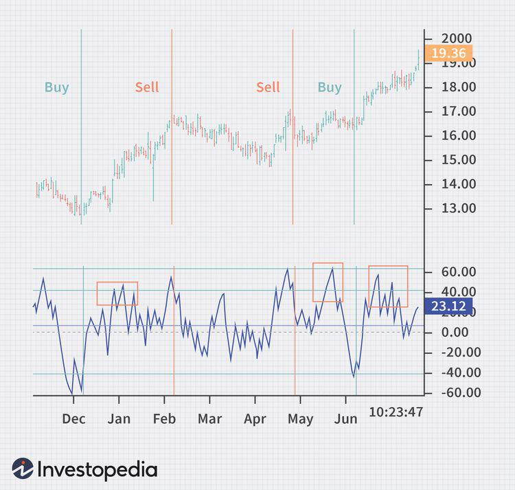

## Table of Contents

## What is the Volume Zone Oscillator (VZO) and its basic purpose?

The Volume Zone Oscillator (VZO) is a technical indicator used in stock market analysis. It helps traders understand the relationship between a stock's price and its trading volume. The VZO measures how much volume is flowing into or out of a stock at different price levels. This can give traders insights into whether a stock is likely to go up or down in the future.

The basic purpose of the VZO is to spot trends and potential reversals in the market. By looking at the VZO, traders can see if the volume is supporting the current price movement. If the VZO is high, it means there is strong volume backing the price, which could mean the trend will continue. If the VZO is low, it might suggest that the current trend is weak and could reverse soon. This helps traders make better decisions about when to buy or sell a stock.

## How does the VZO differ from other volume-based indicators?

The Volume Zone Oscillator (VZO) is different from other volume-based indicators because it focuses on the relationship between price and volume at different price levels. Many other volume indicators, like the On-Balance Volume (OBV) or the Volume Rate of Change (VROC), simply look at the total volume traded over time. The VZO, on the other hand, breaks down the volume into zones based on where the price is, giving a more detailed picture of how volume is distributed across different price points.

Another key difference is that the VZO can help identify potential trend reversals more clearly. While indicators like the Accumulation/Distribution Line (A/D Line) show whether volume is flowing into or out of a stock, they don't provide the same level of detail about volume at specific price levels. The VZO's ability to show volume zones makes it easier for traders to see if the volume is supporting the current price trend or if it might be weakening, which can signal a possible change in direction.

## What are the key components of the VZO calculation?

The Volume Zone Oscillator (VZO) calculation involves a few important parts. First, it looks at the closing price of a stock and compares it to a moving average of past closing prices. This helps find out if the stock is trading above or below its usual price. Then, the VZO looks at the volume traded on days when the stock's price is above this moving average and the volume traded on days when the price is below it.

Next, the VZO calculates the difference between the volume on up days and the volume on down days. This difference is then smoothed out using another moving average to make the VZO line less jumpy. The final VZO value is a percentage that shows if more volume is happening when the price is above or below the average. A positive VZO means more volume is happening on up days, suggesting the price might keep going up. A negative VZO means more volume on down days, which could mean the price might go down.

## How can beginners interpret the basic signals from the VZO?

For beginners, understanding the Volume Zone Oscillator (VZO) can be pretty straightforward. When the VZO line is above zero, it means there's more volume happening when the stock's price is going up. This is a good sign because it shows that people are buying the stock more when it's going up, which might mean the price will keep rising. On the other hand, if the VZO line is below zero, it means there's more volume when the price is going down. This could be a warning sign that the price might keep falling because more people are selling when the price drops.

Another simple way to use the VZO is to look at when it crosses the zero line. If the VZO moves from below zero to above zero, it's like a signal that the trend might be changing from down to up. This could be a good time to think about buying the stock. If it moves from above zero to below zero, it might mean the trend is changing from up to down, and it could be a time to sell or be careful. By keeping an eye on these basic signals, beginners can start to make better decisions about when to buy or sell a stock.

## What are the common settings for the VZO and how can they be adjusted?

The common settings for the VZO are usually a 14-day period for the moving average of the price and a 14-day period for smoothing the VZO line. These settings help show the relationship between price and volume over a short time. Traders often start with these settings because they give a good balance of being responsive to changes in the market but not too jumpy.

You can change these settings to fit your trading style. If you want to see trends over a longer time, you might use a 20-day or even a 50-day period for the moving average and smoothing. This makes the VZO line smoother and less likely to show quick changes. If you want to catch quick changes in the market, you could use a shorter period like a 10-day or 7-day setting. This makes the VZO line more sensitive to what's happening right now, but it might also show more ups and downs.

## How does the VZO help in identifying overbought and oversold conditions?

The VZO can help traders spot when a stock might be overbought or oversold. When the VZO line goes really high, it means there's a lot more volume when the stock's price is going up. This can be a sign that the stock is overbought, and it might be time to think about selling or at least being careful. It's like everyone is buying the stock so much that it might be too expensive and due for a price drop.

On the other hand, when the VZO line drops really low, it means there's a lot more volume when the stock's price is going down. This can be a sign that the stock is oversold, and it might be a good time to think about buying. It's like everyone is selling the stock so much that it might be too cheap and due for a price bounce back. By watching these high and low points on the VZO, traders can make better choices about when to buy or sell.

## Can the VZO be used effectively in conjunction with other technical indicators?

Yes, the VZO can be used effectively with other technical indicators to make better trading decisions. One common way is to use it with trend indicators like the Moving Average Convergence Divergence (MACD). The VZO can show if the volume is supporting the trend that the MACD is showing. If both the VZO and MACD are moving in the same direction, it can give you more confidence that the trend will continue. But if they start to disagree, it might be a sign that the trend is about to change.

Another useful combination is using the VZO with [momentum](/wiki/momentum) indicators like the Relative Strength Index (RSI). The RSI can tell you if a stock is overbought or oversold, and the VZO can add more information about the volume behind those conditions. If the RSI shows a stock is overbought and the VZO is also very high, it might be a strong signal to sell. On the flip side, if the RSI shows a stock is oversold and the VZO is very low, it could be a good time to buy. By combining these indicators, you get a fuller picture of what's happening in the market.

## What are some advanced strategies for using the VZO to confirm trends?

One advanced strategy for using the VZO to confirm trends is to watch for divergences between the VZO and the stock's price. If the stock's price is going up but the VZO is going down, it means the volume is not supporting the price increase. This can be a warning sign that the upward trend might not last long. On the other hand, if the stock's price is going down but the VZO is going up, it means the volume is not supporting the price decrease. This could be a sign that the downward trend might be about to reverse. By looking for these divergences, traders can get early signals about when a trend might change.

Another strategy is to use the VZO in combination with moving averages to confirm trends. For example, a trader might look at the 50-day and 200-day moving averages of a stock's price. If the stock's price is above both moving averages and the VZO is also positive, it's a strong sign that the upward trend is solid. Conversely, if the stock's price is below both moving averages and the VZO is negative, it suggests a strong downward trend. By using the VZO alongside these moving averages, traders can have more confidence in the trend they are seeing and make more informed trading decisions.

## How can traders use the VZO to predict potential reversals in the market?

Traders can use the VZO to spot when the market might be about to change direction by looking at something called divergences. A divergence happens when the stock's price is going one way, but the VZO is going the other way. For example, if the stock's price is going up but the VZO is going down, it means that even though the price is rising, there isn't a lot of volume behind it. This can be a warning sign that the price might soon start to fall because the upward trend isn't strong. On the flip side, if the stock's price is going down but the VZO is going up, it means the volume isn't supporting the price drop. This could be a sign that the price might start to go up soon because the downward trend is weak.

Another way to predict potential reversals is to watch for when the VZO crosses the zero line. If the VZO moves from below zero to above zero, it's like a signal that the trend might be changing from down to up. This could be a good time for traders to think about buying the stock because it might start to rise. If the VZO moves from above zero to below zero, it might mean the trend is changing from up to down. This could be a time for traders to sell or at least be careful because the price might start to fall. By keeping an eye on these signals, traders can get a heads-up about when the market might turn around.

## What are the limitations of the VZO and how can they be mitigated?

The Volume Zone Oscillator (VZO) has some limitations that traders should know about. One big problem is that the VZO can give false signals. Sometimes it might look like the trend is about to change, but the price keeps going the same way. This can trick traders into making bad decisions. Another issue is that the VZO works best in markets with a lot of trading activity. In quieter markets, the VZO might not give clear signals because there's not enough volume to make a difference.

To deal with these problems, traders can use the VZO along with other tools. For example, they can use it with trend indicators like the Moving Average Convergence Divergence (MACD) or momentum indicators like the Relative Strength Index (RSI). By looking at several indicators, traders can get a better idea of what's really happening in the market. They can also wait for stronger signals, like when the VZO crosses the zero line and other indicators agree. This way, they can be more sure about their decisions and avoid getting tricked by false signals.

## How does the VZO perform in different market conditions, such as high volatility?

The VZO can be really helpful in high [volatility](/wiki/volatility-trading-strategies) markets because it shows the relationship between price and volume. When the market is moving up and down a lot, the VZO helps traders see if the volume is supporting these big moves. If the VZO is high when the price is going up, it means there's a lot of buying happening, and the upward trend might keep going. If the VZO is low when the price is going down, it means there's a lot of selling, and the downward trend might continue. This can give traders more confidence in their decisions during wild market swings.

However, in high volatility, the VZO can also give false signals more often. The big price swings can make the VZO jump around a lot, which might look like the trend is changing when it's not. Traders need to be careful and not just rely on the VZO alone. Using it with other indicators, like the MACD or RSI, can help. These other tools can confirm what the VZO is showing, making it easier to tell if a signal is real or just a trick caused by the high volatility.

## What are some case studies or real-world examples where the VZO was effectively used for trading decisions?

One real-world example where the VZO was used effectively is in the trading of Apple Inc. (AAPL) stock. In early 2020, Apple's stock was on an upward trend, but the VZO started to show a divergence. Even though the stock price kept going up, the VZO was going down, suggesting that the volume wasn't supporting the price increase. Traders who noticed this divergence used it as a signal to sell their shares before the stock price started to drop. By paying attention to the VZO, they were able to make a smart trading decision and avoid losses.

Another example is with Tesla Inc. (TSLA) stock in late 2021. The stock had been very volatile, and the VZO helped traders navigate the ups and downs. When the VZO moved from below zero to above zero, it signaled a potential trend reversal from down to up. Traders who saw this signal and also noticed that other indicators like the RSI were showing that the stock was oversold, decided to buy Tesla stock. This turned out to be a good move because the stock price did start to rise again, and those traders made profits. The VZO, combined with other indicators, helped them make a well-timed trading decision in a high-volatility market.

## What is the Volume Zone Oscillator and how does it work?

The Volume Zone Oscillator (VZO) is a momentum indicator designed to discern market trends by analyzing volume in relation to price fluctuations. This tool classifies volume into positive or negative categories based on the directional movement of prices. When the price closes above the previous close, the volume is considered positive, whereas it is deemed negative if the price closes below the previous close. This distinction allows traders to gauge the strength or weakness of a trend through volume dynamics.

The VZO operates by employing exponential moving averages (EMAs), which are utilized to smooth the volume data and mitigate the noise inherent in short-term market fluctuations. The smooth data is then scaled into a percentage range, providing a clear visual representation of volume pressure exerted on the price.

### Calculation

The VZO calculation is based on the ratio of exponentially smoothed positive [volume](/wiki/volume-trading-strategy) to negative volume over a specified period. This calculation can be expressed as:

$$
\text{VZO} = 100 \times \frac{\text{EMA}(V^{+}) - \text{EMA}(V^{-})}{\text{EMA}(V^{+}) + \text{EMA}(V^{-})}
$$

Here:
- $V^{+}$ and $V^{-}$ refer to the positive and negative volume components, respectively.
- $\text{EMA}$ denotes the exponential moving average applied to these components over a chosen period.

### Key Levels

The transformed percentage scale of the VZO indicates specific threshold levels which mark the overbought and oversold conditions in the market. The typical zones are:
- Overbought Zone: When the VZO rises above certain threshold levels, such as +40%, it signals that the market may be overbought, indicating potential upcoming reversals.
- Oversold Zone: A VZO reading below -40% suggests the market may be oversold, permitting opportunities for price corrections.

These key levels serve traders as a guide to identify market conditions ripe for reversals, allowing strategic planning in anticipation of these movements. By quantifying volume through VZO, traders gain insightful data points essential for predicting potential price reversals and market trends.

## References & Further Reading

[1]: Khalil, Walid, and Steckler, David. ["The Volume Zone Oscillator."](http://traders.com/Documentation/FEEDbk_docs/2011/05/Khalil.html) Technical Analysis.

[2]: ["Technical Analysis of the Financial Markets"](https://drive.google.com/file/d/1OcDrGakDhaejT7J7xGEE3HHKy7xmrafy/preview) by John J. Murphy

[3]: Achelis, Steven B. ["Technical Analysis from A to Z."](https://archive.org/details/technicalanalysi00ache) McGraw-Hill, 2000.

[4]: Murphy, John J. ["Intermarket Analysis: Profiting from Global Market Relationships."](https://www.amazon.com/Intermarket-Analysis-Profiting-Relationships-Trading/dp/0471023299) Wiley, 2004.

[5]: Kirkpatrick, Charles D., and Dahlquist, Julie R. ["Technical Analysis: The Complete Resource for Financial Market Technicians,"](https://www.amazon.com/Technical-Analysis-Complete-Financial-Technicians/dp/0134137043) FT Press, 2010.