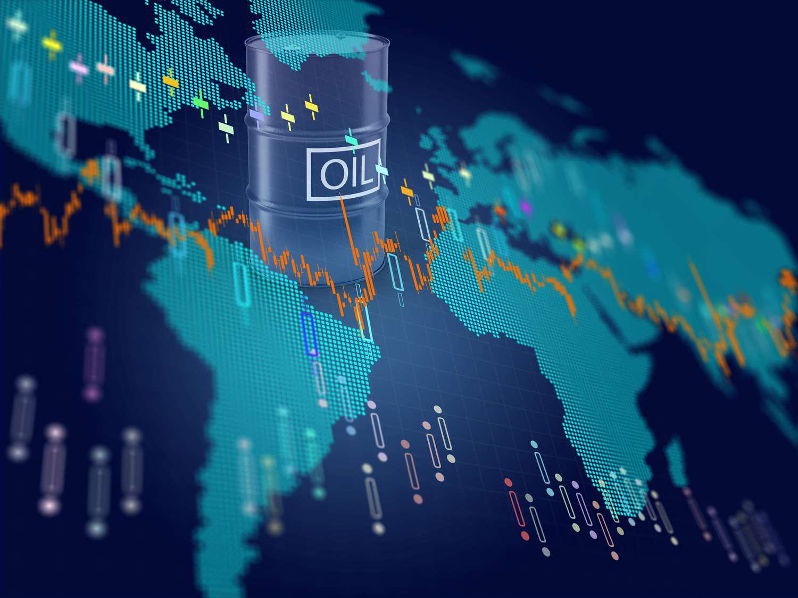

In oil and gas, innovative financial strategies are essential for navigation and growth. One such innovation is the Volumetric Production Payment (VPP), a unique form of finance that converts future production into immediate capital. A VPP allows resource owners to monetize their reserves without incurring additional debt, providing crucial liquidity while maintaining balance sheet health. Unlike traditional loans, where repayment is required regardless of production outcomes, VPPs transfer a predefined volume of produced resources to the buyer, thereby aligning financial outcomes with operational performance.

The integration of advanced technologies, particularly algorithmic trading, adds a new dimension to the role of VPPs in the energy market. Algorithmic trading's ability to analyze vast datasets swiftly and execute trades with precision enhances market transparency and efficiency, thereby optimizing the execution and management of VPP transactions. This capability is increasingly valuable in the oil and gas sector, where price volatility and complex market dynamics are prevalent.



By leveraging algorithmic trading, oil and gas companies can forecast market trends more accurately and adjust their strategies to optimize VPP deals. This convergence of advanced financial mechanisms and technology-driven trading methods is reshaping how energy markets operate, promoting more efficient capital allocation and potentially greater profitability. Through these converging domains, modern finance techniques facilitate enhanced operational flexibility, enabling firms to adapt swiftly to market changes and ultimately drive efficiency and profitability in energy markets.

## Table of Contents

## Understanding Volumetric Production Payments

Volumetric Production Payments (VPPs) represent a strategic financial instrument within the oil and gas industry, allowing producers to generate upfront capital by selling the rights to a specified volume of future production. This strategy is particularly appealing to companies looking to capitalize on their reserves without incurring additional debt liabilities on their balance sheets. 

In a typical VPP transaction, a producer receives an immediate cash payment in exchange for a commitment to deliver a predetermined amount of oil or gas to the buyer over a specified period. The buyer receives these volumes free from production costs, which are absorbed by the seller. This structure is designed to ensure the buyer's return on investment primarily depends on the actual delivery of hydrocarbons rather than fluctuating market prices, thereby providing a predictable revenue stream.

The primary advantage of VPPs lies in their ability to provide non-dilutive capital solutions. Unlike equity financing, where a company might issue new shares and dilute existing equity, VPPs enable companies to leverage their future production capacity without changing their equity structure. This aspect is particularly beneficial in times of price volatility, as it allows companies to secure necessary funding without the constraint of traditional financing mechanisms.

For both investors and energy producers, understanding VPPs is essential due to their significant impact on company [liquidity](/wiki/liquidity-risk-premium) and operational flexibility. VPPs can enhance liquidity by securing cash flow early in the production process, which can then be reinvested into further exploration and development projects. This financial tool also provides flexibility in managing operational risks, as the commitment to deliver specific volumes transfers the production risk partly to the buyer.

Overall, VPPs serve as a critical mechanism for monetizing assets effectively, offering a viable path for companies seeking financial stability and growth amid market uncertainties.

## The Benefits and Risks of VPPs

Volumetric Production Payments (VPPs) offer a compelling financing mechanism within the oil and gas sector. They enable sellers—typically oil and gas producers—to obtain immediate capital by selling the future volumes of their production without the need to increase debt liabilities. This approach provides financial flexibility, allowing companies to reinvest in exploration and production activities or address other capital needs. 

For buyers, who are often institutional investors or specialized finance entities, VPPs offer a secure investment opportunity. The return on investment is backed by a physical commodity such as oil or gas, which often leads to predictable income streams given the structured nature of these transactions. This reliability makes VPPs an attractive proposition in volatile markets where traditional securities might fluctuate.

However, VPPs are not without their risks. They can potentially diminish future revenue streams for sellers. By committing future production volumes, companies lock in a portion of their revenue, which could otherwise benefit from potential price increases. Furthermore, delivery risks exist if the actual production falls short of the forecasted volumes. Such shortfalls could stem from operational challenges, natural disasters, or market fluctuations, impacting the ability of the seller to meet their contractual obligations.

The structured nature of VPPs can often be more appealing than traditional debt, especially in contexts where maintaining balance sheet integrity is paramount. Unlike typical debt instruments, VPPs do not impose interest payments or capital repayment schedules, thus preserving cash flow and liquidity for sellers.

A thorough assessment of the benefits and risks associated with VPPs is crucial for strategic decision-making within the oil and gas finance sector. By understanding these dynamics, stakeholders can make informed decisions that optimize financial performance and mitigate potential liabilities. This underscores the critical role VPPs play in modern energy finance strategies.

## Algorithmic Trading in Oil and Gas Markets

Algorithmic trading employs sophisticated algorithms to automate trading decisions and executions, offering substantial improvements in speed and efficiency compared to traditional trading methods. In the oil and gas sector, [algorithmic trading](/wiki/algorithmic-trading) significantly enhances the liquidity and transparency of Volumetric Production Payments (VPPs), a financial instrument that converts future resource production into capital.

Algorithmic trading enables traders to leverage real-time market data, allowing them to optimize market positions effectively. By using real-time data streams, algorithms can execute trades at high frequencies, responding instantaneously to market changes and minimizing the latency associated with manual trading. This automation supports more efficient market operations, reducing friction and enhancing overall liquidity.

Through predictive capabilities, algorithms can also forecast price movements with notable accuracy. By analyzing historical data and identifying patterns, these algorithms can provide insights into future price trends, thus facilitating informed decision-making in VPP transactions. For instance, [machine learning](/wiki/machine-learning) models might be employed to detect correlations and causality in factors affecting oil and gas prices, enhancing the precision of VPP deal valuations.

As technology continues to evolve, the role of algorithmic trading in shaping oil and gas market dynamics is projected to expand. The integration of advanced data analytics and machine learning techniques allows for a sophisticated assessment and reaction to market variables. Future developments may incorporate [artificial intelligence](/wiki/ai-artificial-intelligence) to further refine trading strategies, thereby increasing market efficiency and reducing operational risks.

Python, a popular programming language in algorithmic trading, provides a robust environment for implementing such systems. Libraries like Pandas and NumPy facilitate data manipulation and analysis, while packages such as Scikit-learn support machine learning applications. An example of a simple moving average crossover strategy in Python, which might be employed to automate buying and selling based on short-term and long-term trends, is as follows:

```python
import pandas as pd
import numpy as np

def moving_average_crossover(data, short_window=40, long_window=100):
    signals = pd.DataFrame(index=data.index)
    signals['price'] = data['price']
    signals['short_mavg'] = data['price'].rolling(window=short_window, min_periods=1).mean()
    signals['long_mavg'] = data['price'].rolling(window=long_window, min_periods=1).mean()
    signals['signal'] = 0.0
    signals['signal'][short_window:] = np.where(signals['short_mavg'][short_window:] > signals['long_mavg'][short_window:], 1.0, 0.0)
    signals['positions'] = signals['signal'].diff()
    return signals

# Assuming 'data' is a DataFrame with a 'price' column
# data = ...

signals = moving_average_crossover(data)
```

This code outlines an algorithm that monitors short-term and long-term moving averages to generate trade signals, thereby automating the execution of trades based on predefined criteria.

Through advancements in algorithmic trading, the oil and gas industry can expect increased transparency, more precise pricing, and efficient resource allocation across VPP transactions, ultimately fostering a more resilient and agile energy market.

## Integrating VPPs with Algorithmic Trading

Integrating Volumetric Production Payments (VPPs) with algorithmic trading introduces a new dimension to financial management in the energy sector, optimizing both investment strategies and operational practices. The synergy between these two elements is poised to dramatically alter how transactions are executed, priced, and managed.

Algorithmic trading, characterized by its use of complex algorithms and high-speed data processing, enables real-time analysis of vast datasets. This capability is particularly useful in predicting market trends and making data-driven decisions about the pricing and timing of VPP transactions. By utilizing historical data, machine learning models, and predictive analytics, firms can more accurately forecast oil and gas price fluctuations, enhancing the profitability of VPP deals.

For example, algorithms can be designed to identify patterns and correlations in market data that human analysts might miss. In Python, a simple machine learning model using libraries such as `pandas` for data manipulation, `scikit-learn` for model creation, and `numpy` for numerical operations can forecast price movements based on historical trading volumes and external variables. A script might look like this:

```python
import pandas as pd
from sklearn.model_selection import train_test_split
from sklearn.ensemble import RandomForestRegressor
import numpy as np

# Load the dataset
data = pd.read_csv('oil_gas_prices.csv')

# Features and target
X = data[['historical_volume', 'external_factors']]
y = data['price']

# Split the data
X_train, X_test, y_train, y_test = train_test_split(X, y, test_size=0.2, random_state=42)

# Model training
model = RandomForestRegressor(n_estimators=100, random_state=42)
model.fit(X_train, y_train)

# Price prediction
predictions = model.predict(X_test)
```

Such models improve transaction efficiency by enabling firms to seize opportune pricing moments and mitigate timing risks. By integrating these predictive capabilities with traditional VPP agreements, firms gain a competitive edge, reducing operational risks associated with volatile market conditions.

Furthermore, big data analytics facilitates the customization of VPP agreements. Firms can use this information to align their deals with specific market forecasts and organizational strategies. By incorporating variables like geopolitical events, weather patterns, and macroeconomic indicators into their algorithms, companies can enhance their market positioning and financial resilience.

Beyond immediate transaction benefits, the integration of VPPs and algorithmic trading fosters innovation in energy finance models. It facilitates more resilient frameworks for capitalizing on market opportunities, ensuring that investments are always optimized against current market data. This approach not only enhances growth but also assures stability and sustainability amid fluctuating energy markets. 

In conclusion, the intersection of VPPs and algorithmic trading represents an evolving paradigm in energy finance, providing the tools necessary for improved strategic decision-making and capital efficiency. By leveraging the technology at their disposal, energy firms can ensure they remain competitive in an increasingly complex and volatile market landscape.

## Future Trends in VPP Finance and Algo Trading

The rise of digital finance tools is significantly reshaping volumetric production payment (VPP) arrangements. Technological advances are providing new opportunities and efficiencies, particularly through the integration of automation and artificial intelligence (AI). Automation streamlines processes, reducing manual intervention and increasing accuracy in risk assessment and management within the VPP context. AI facilitates the prediction and analysis of risk factors by processing large datasets to identify patterns, leading to more precise risk mitigation strategies.

In parallel, blockchain technology is being explored for its potential to enhance transparency and efficiency in contract management. Blockchain's distributed ledger system offers a secure, immutable platform for recording transactions, which can be valuable for verifying VPP agreements and ensuring all parties have a consistent view of contract terms and execution status. This level of transparency can reduce disputes and enhance trust between parties.

Innovation in data analytics is also playing a crucial role in refining algorithmic trading strategies. Advanced analytics provides deeper insights into market dynamics, making algorithmic trading models more responsive to real-time changes. This adaptability is essential for optimizing VPP pricing and execution timing, aligning transactions more closely with market conditions.

Together, these technological trends signify a transformative period in which finance and technology converge. This evolution is reshaping oil and gas agreements, and stakeholders who adapt to these changes can expect to improve operational efficiencies and capital management. As energy markets continue to evolve, staying ahead of these technological advancements will be critical for maintaining a competitive edge.

## Conclusion

The convergence of Volumetric Production Payment (VPP) finance and algorithmic trading signifies a transformative shift in energy markets. By leveraging this synergy, stakeholders in the oil and gas industry can enhance capital efficiency and strengthen their market positioning. This integration enables the monetization of future production volumes, thus providing immediate liquidity without incurring additional debt, while algorithmic trading offers the tools necessary for navigating price [volatility](/wiki/volatility-trading-strategies) and optimizing transaction timing.

As the oil and gas sector grapples with uncertain market conditions, adopting advanced trading algorithms becomes imperative. These algorithms allow for real-time data analysis and predictive modeling, facilitating more informed decision-making processes. Incorporating these technological advancements can reduce operational risks and improve the precision of financial arrangements, ultimately leading to more robust and adaptable financial models.

Moving forward, strategic collaboration between technology providers and energy firms is essential to fully exploit the benefits of VPPs combined with algorithmic trading. This partnership can foster the development of customized solutions that align with specific market needs and operational goals. As automation and artificial intelligence continue to evolve, the potential for improving risk assessment and contract management processes expands, paving the way for more transparent and efficient market operations.

Keeping pace with these innovations is crucial for the sustainable growth of the oil and gas sector. Stakeholders must remain vigilant, continuously adapting to the rapidly changing technological landscape. By embracing this convergence, the industry can position itself to meet future challenges and opportunities, ensuring resilience and profitability in a dynamic global market.

## References & Further Reading

[1]: Thomsett, M. C. (2014). ["The Options Trading Body of Knowledge: The Definitive Source for Information About the Options Industry."](https://www.amazon.com/Options-Trading-Body-Knowledge-Information/dp/0137142935) FT Press.

[2]: Hull, J. C. (2018). ["Options, Futures, and Other Derivatives."](https://www.semanticscholar.org/paper/Options%2C-Futures%2C-and-Other-Derivatives-Hull/89bdee500c8623864fc9eb7a471546aa713acc44) Pearson.

[3]: Silvennoinen, A., & Thorp, S. (2013). ["Financialization, Crisis and Commodity Correlation Dynamics."](https://www.sciencedirect.com/science/article/pii/S1042443112001059) Journal of International Financial Markets, Institutions & Money.

[4]: Narang, R. K. (2013). ["Inside the Black Box: A Simple Guide to Quantitative and High Frequency Trading."](https://onlinelibrary.wiley.com/doi/book/10.1002/9781118662717) Wiley.

[5]: Pompian, M. M. (2012). ["Behavioral Finance and Investor Types: Managing Behavior to Make Better Investment Decisions."](https://onlinelibrary.wiley.com/doi/book/10.1002/9781119202417) Wiley.