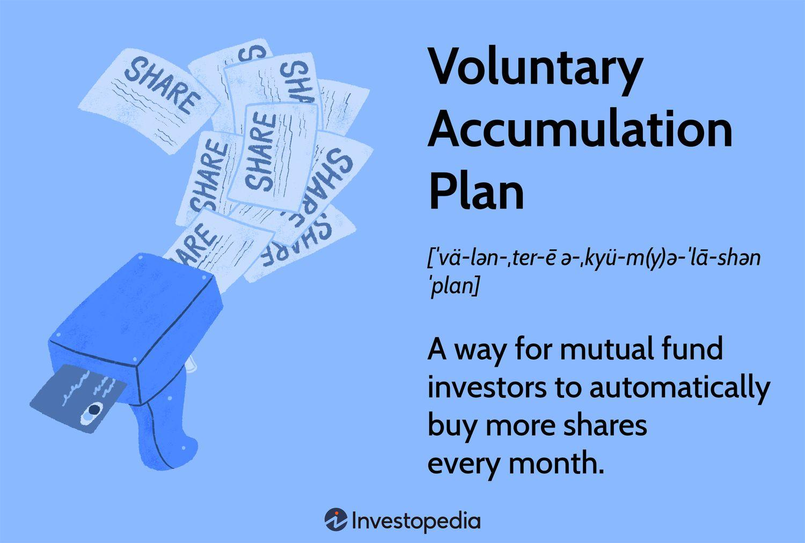

## Table of Contents

## What is a Voluntary Accumulation Plan (VAP)?

A Voluntary Accumulation Plan (VAP) is a type of savings plan that employees can join to save money for the future. It is often offered by employers as a way to help their workers save for retirement or other long-term goals. Employees can choose to put some of their salary into the plan, and the money is usually invested in things like stocks or bonds. This can help the savings grow over time.

VAPs are different from regular savings accounts because they are designed for long-term saving and investing. They often come with tax benefits, which means that the money you save might not be taxed until you take it out, or it might be taxed at a lower rate. This can make VAPs a good choice for people who want to save for retirement or other big goals in the future.

## How does a Voluntary Accumulation Plan differ from a mandatory retirement plan?

A Voluntary Accumulation Plan (VAP) is different from a mandatory retirement plan because, as the name suggests, it's up to you if you want to join or not. With a mandatory plan, you have to join if you work at a certain place. This means that everyone at your job might be saving for retirement in the same way, but with a VAP, you can choose if you want to save this way or not.

Another difference is how you and your employer put money into the plan. In a mandatory plan, both you and your employer might have to put in money, and there are rules about how much. With a VAP, you decide how much money to put in, and your employer might not have to add any money at all. This gives you more control over your savings, but it also means you might need to save more on your own if you want to have enough for retirement.

## Who is eligible to participate in a Voluntary Accumulation Plan?

Anyone who works at a company that offers a Voluntary Accumulation Plan can usually join it. It's up to the company to decide if they want to offer this kind of plan to their workers. If your job has a VAP, you can choose to put some of your salary into it to save for the future.

Sometimes, there might be rules about who can join the plan. For example, you might need to have worked at the company for a certain amount of time before you can start saving in the VAP. But usually, as long as you're an employee and the plan is available, you can decide if you want to join or not.

## What are the typical investment options available in a VAP?

In a Voluntary Accumulation Plan, you usually have a few different places where you can put your money to help it grow. These places are called investment options. Common ones include mutual funds, which are like big baskets of different stocks or bonds that a lot of people invest in together. Another option is target-date funds, which change how they invest based on when you plan to retire, making them easier to manage over time. You might also see options like individual stocks, where you pick specific companies to invest in, or bonds, which are like loans you give to companies or the government that they pay back with interest.

Some VAPs might also let you invest in real estate investment trusts (REITs), which are companies that own and operate properties like apartments or shopping centers. Another option could be money market funds, which are safer investments that focus on keeping your money secure while earning a small amount of interest. The exact options can vary depending on the plan your employer offers, so it's a good idea to look at what's available and choose the ones that match your saving goals and how much risk you're comfortable taking.

## How can contributions to a VAP be made, and are there any limits?

Contributions to a Voluntary Accumulation Plan are usually made through payroll deductions. This means that every time you get paid, a part of your salary goes straight into your VAP. You decide how much you want to contribute, and you can often change this amount if your situation changes. Some plans might let you make extra contributions at other times, like bonuses or special contributions, but this depends on the rules of your specific plan.

There might be limits on how much you can contribute to a VAP. These limits can come from the government or from the plan itself. For example, the government might set a maximum amount you can put in each year to get certain tax benefits. Your employer might also have their own rules about how much you can contribute. It's a good idea to check with your plan administrator to understand any limits that apply to you.

## What are the tax benefits associated with contributing to a VAP?

When you put money into a Voluntary Accumulation Plan, you can get some tax benefits. One big benefit is that the money you contribute might not be taxed right away. Instead of paying taxes on that money now, you can wait until you take it out of the plan, usually when you retire. This can be helpful because you might be in a lower tax bracket when you retire, so you could end up paying less in taxes overall.

Another tax benefit is that any money your investments earn while they're in the VAP might not be taxed until you withdraw it. This means your savings can grow faster because you're not losing money to taxes every year. However, keep in mind that when you do take the money out, you'll have to pay taxes on it. The exact tax rules can vary depending on where you live and the specific rules of your VAP, so it's a good idea to talk to a tax professional to understand how these benefits apply to you.

## Can funds in a VAP be withdrawn before retirement, and what are the implications?

Yes, you can take money out of a Voluntary Accumulation Plan before you retire, but there are some things to think about. Most VAPs have rules about when you can take money out early. Sometimes, you can take money out if you really need it, like if you have a big emergency. But usually, you have to pay a penalty for taking money out early, on top of the taxes you'll owe on the money you withdraw.

The penalty and taxes can make taking money out early a costly choice. For example, if you take out money before you're a certain age, like 59½ in some places, you might have to pay an extra 10% penalty on top of the regular taxes. This means you'll get less money than you expected. It's important to think carefully about whether you really need the money now, or if it's better to leave it in the plan to grow for your future.

## How does the performance of a VAP impact long-term savings?

The performance of a Voluntary Accumulation Plan can make a big difference in how much money you have saved for the long term. If the investments in your VAP do well, your savings can grow a lot over time. This is because the money you put in can earn more money through things like stocks or bonds. The better the investments do, the more your savings can grow, which means you might have more money when you retire.

On the other hand, if the investments don't do well, your savings might not grow as much as you hoped. This can happen if the stock market goes down or if the investments you chose don't perform well. It's important to pick investments that match how much risk you're okay with and to check on your VAP from time to time to make sure it's doing what you want it to do for your long-term savings.

## What fees and costs should be considered when enrolling in a VAP?

When you join a Voluntary Accumulation Plan, you need to think about the fees and costs that come with it. There are usually different kinds of fees. One common fee is the management fee, which is what you pay for someone to manage your investments. This fee can be a small percentage of the money you have in the plan. Another fee might be for the plan itself, called an administrative fee, which covers the cost of running the plan. Sometimes, there are also fees for buying or selling investments, called transaction fees.

These fees can add up over time and affect how much money you have when you retire. It's a good idea to look at all the fees before you decide to join a VAP. The lower the fees, the more of your money can stay in the plan and grow. You might want to ask your plan administrator about all the fees and how they work. Understanding these costs can help you make a better choice about saving for your future.

## How does employer matching work within a Voluntary Accumulation Plan?

In a Voluntary Accumulation Plan, sometimes your employer will match the money you put into the plan. This means if you save some of your salary in the VAP, your employer might add some money too. For example, if you put in $100, and your employer matches 50%, they will add $50 to your plan. This is like getting free money to help you save for the future. Not all VAPs have this, so you need to check if your plan does.

The rules about how much your employer will match can be different for each plan. Sometimes, they might match a certain percentage of what you put in, up to a limit. Other times, they might match a fixed amount. It's important to know these rules because the employer's match can really help your savings grow faster. If your VAP has a matching program, try to put in enough money to get the full match, because it's a good way to make your retirement savings bigger.

## What strategies can maximize the benefits of a VAP?

To get the most out of a Voluntary Accumulation Plan, start by putting in enough money to get the full employer match if your plan offers it. This is like getting free money because your employer will add more to your savings. Also, try to save as much as you can, even if it's a little bit each time you get paid. The more you save, the more it can grow over time. And don't forget to look at the fees. Plans with lower fees can help your money grow faster because you keep more of it.

Another good strategy is to pick the right investments for your VAP. Think about how much risk you're okay with and when you'll need the money. If you're young and won't retire for a long time, you might choose investments that could grow more but are riskier. If you're closer to retiring, you might want safer investments. It's also smart to check your plan now and then to make sure it's still a good fit for your goals. Adjusting your investments can help make sure your savings keep growing in the best way possible.

## How should one evaluate and compare different VAPs offered by various financial institutions?

When you're looking at different Voluntary Accumulation Plans from various financial institutions, start by checking if there's an employer match. Some plans offer this, which means your employer adds money to your savings, and getting the full match can really help your savings grow. Next, look at the fees. Plans with lower fees let you keep more of your money, so it can grow faster over time. It's also important to see what investment options each plan offers. You want a plan that has choices that fit your comfort with risk and your retirement timeline.

Then, think about how easy it is to use the plan. Some plans have simple websites or apps that make it easy to check on your savings and change your investments. Others might be harder to use. Also, consider any rules about taking money out early. Some plans might let you take money out if you need it, but you might have to pay a penalty or taxes. Understanding these rules can help you pick a plan that fits your needs. By looking at all these things, you can find a VAP that helps you save the most for your future.

## What are Voluntary Accumulation Plans and how do they work?

Voluntary Accumulation Plans (VAPs) are investment strategies that allow individuals to invest a set amount of money at regular intervals, typically on a monthly basis. These plans are designed to accumulate wealth gradually by committing to invest a predetermined sum of money, without the necessity of making lump-sum entries into financial markets. VAPs offer an effective approach for individuals looking to build up their savings through steady, disciplined investment practices.

A fundamental component of VAPs is the principle of dollar-cost averaging (DCA). This investment strategy involves purchasing a fixed dollar amount of a particular investment on a regular schedule, regardless of the asset's price. One of the main benefits of DCA is its potential to mitigate the risks associated with market volatility. By spreading out investment purchases over time, investors are less exposed to the impact of market fluctuations that might adversely affect returns if they were to invest a large sum at a single point in time. This systematic approach allows for the purchase of more units when prices are low and fewer units when prices are high, leading to a lower average cost per unit over the long term.

Mathematically, the average cost per share using DCA can be expressed as:

$$
\text{Average Cost} = \frac{\text{Total Invested Amount}}{\text{Total Number of Shares Purchased}}
$$

VAPs encourage disciplined investing by committing investors to regular contributions, thus instilling good financial habits. This concept ensures that investors consistently save and invest over time rather than relying on timing the market with larger, sporadic investments. The regular investment structure can help overcome inertia and the tendency to delay investing, as well as alleviate the emotional decision-making often associated with market unpredictability.

In practice, VAPs can be automated through financial institutions or investment platforms, allowing investors to set up automatic transfers from their bank accounts to their investment accounts. This setup further promotes the habit of regular investing by reducing the chance of missing contributions.

Overall, Voluntary Accumulation Plans provide a structured, methodical way to grow investments over time, leveraging the benefits of dollar-cost averaging and encouraging consistent saving habits. These qualities make VAPs a practical choice for many individuals aiming to achieve their long-term financial goals.

## What are the benefits of using voluntary accumulation plans?

Voluntary Accumulation Plans (VAPs) are structured to provide a systematic investment framework that brings several advantages to investors looking to mitigate the impact of market [volatility](/wiki/volatility-trading-strategies) and cultivate robust saving habits. By allowing investors to make regular contributions over time, VAPs employ a strategy known as dollar-cost averaging, which reduces the influence of short-term market fluctuations on the investment. This principle ensures that investors purchase more shares when prices are low and fewer shares when prices are high, thus lowering the average cost of investment over time. Mathematically, dollar-cost averaging is expressed as:

$$
\text{Average cost per share} = \frac{\text{Total amount invested}}{\text{Total number of shares purchased}}
$$

In addition to providing a buffer against volatility, VAPs are highly flexible and convenient. Investors can adjust their contribution amounts according to their financial circumstances, making VAPs suitable for a wide range of investment capacities. This adaptability is crucial for maintaining consistent investment progress, especially in the face of unforeseen financial challenges.

The potential for compounding returns further enhances the appeal of VAPs as a long-term investment strategy. Compounding occurs when investment earnings are reinvested to generate additional earnings, leading to exponential growth over time. The formula for compound interest, which is applicable in scenarios where returns are reinvested, is given by:

$$
A = P \left(1 + \frac{r}{n}\right)^{nt}
$$

where $A$ is the amount of money accumulated after n years, including interest, $P$ is the principal amount, $r$ is the annual interest rate, $n$ is the number of times that interest is compounded per year, and $t$ is the time the money is invested for in years. By investing systematically through a VAP, investors potentially benefit from this compounding effect, resulting in significant wealth accumulation over long periods.

In summary, Voluntary Accumulation Plans offer significant benefits by providing an effective hedge against market volatility and fostering disciplined investment habits. Their flexibility in accommodating various investment amounts and the power of compounding returns make them an attractive choice for investors with a long-term financial outlook.

## References & Further Reading

[1]: Bergstra, J., Bardenet, R., Bengio, Y., & Kégl, B. (2011). ["Algorithms for Hyper-Parameter Optimization."](https://dl.acm.org/doi/10.5555/2986459.2986743) Advances in Neural Information Processing Systems 24.

[2]: ["Advances in Financial Machine Learning"](https://www.amazon.com/Advances-Financial-Machine-Learning-Marcos/dp/1119482089) by Marcos Lopez de Prado

[3]: ["Evidence-Based Technical Analysis: Applying the Scientific Method and Statistical Inference to Trading Signals"](https://www.amazon.com/Evidence-Based-Technical-Analysis-Scientific-Statistical/dp/0470008741) by David Aronson

[4]: ["Machine Learning for Algorithmic Trading"](https://github.com/stefan-jansen/machine-learning-for-trading) by Stefan Jansen

[5]: ["Quantitative Trading: How to Build Your Own Algorithmic Trading Business"](https://www.amazon.com/Quantitative-Trading-Build-Algorithmic-Business/dp/1119800064) by Ernest P. Chan