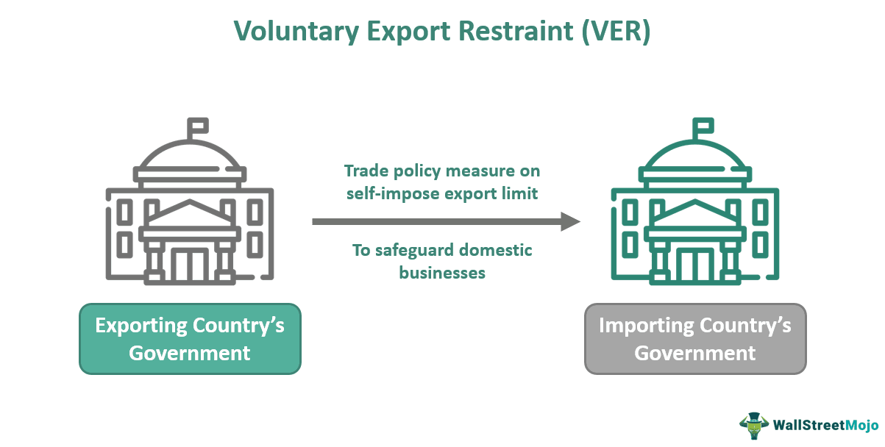

International trade has undergone substantial transformation in the digital era, characterized by the intricate interplay of trade policies, export controls, and algorithmic trading. These elements, once disparate facets of economic policy and market strategy, now converge in a networked global economy, shaping trade flows, national security, economic performance, and competitive positioning.

Trade policies today encompass a wide range of regulatory frameworks and agreements that are instrumental in directing the flow of goods and services across borders. These policies are designed to protect local industries while facilitating international commerce and investment. Meanwhile, export controls have emerged as critical tools in the regulatory arsenal, implemented by governments to regulate the dissemination of goods and technologies that may affect national security or economic interests. These measures aim to prevent sensitive technologies and products from falling into the hands of adversaries or being misused in ways that could threaten global stability.



The integration of algorithmic trading into financial markets marks another paradigm shift. By employing sophisticated algorithms and high-speed computational power, financial institutions can execute trades at unprecedented speeds, enhancing liquidity and market efficiency. Algorithmic trading's ability to analyze vast datasets and identify trading opportunities has redefined strategic decision-making processes across global markets.

The intersection of these components has profound implications for global markets and business strategies. Adaptive trade policies must account for the repercussions of algorithmic trading and the strategic deployment of export controls. Companies participating in international trade are compelled to navigate these complex dynamics, leveraging technological advancements while remaining compliant with an evolving regulatory landscape.

As we examine international trade within this modern context, understanding the interplay of trade policies, export controls, and algorithmic trading is essential for crafting strategies that harness opportunities while mitigating risks. Embracing innovation and technological development while balancing stringent regulatory norms is critical for achieving sustained success in the globally competitive market.

## Table of Contents

## Understanding Trade Policy and Export Controls

Trade policy and export controls are central to the regulation of international trade, shaping the way goods and services cross borders. Trade policy encompasses the spectrum of laws, regulations, and agreements set forth by nations to govern trade relationships. These policies determine tariffs, trade agreements, import quotas, and other regulatory measures that can influence trade dynamics and economic growth. Through trade policy, governments aim to protect domestic industries, secure essential goods, and foster mutual economic partnerships.

Export controls, on the other hand, are specific regulatory measures focused on the oversight of goods and technologies that [exit](/wiki/exit-strategy) a country. These controls are enacted primarily for national security, foreign policy, and economic considerations. Export controls aim to prevent the transfer of dual-use goods—items that have both civilian and military applications—that could endanger national security if acquired by adversarial entities.

The complexities of trade policy and export controls significantly affect international trade flows. They can enhance or restrict the ability to engage in cross-border commerce, depending on the policies and controls in place. For instance, stringent export controls on high-tech products can limit trade in technology sectors, impacting both the exporting country's industries and global market dynamics.

Furthermore, trade policy and export controls can influence market dynamics by altering competitive conditions. They can create trade barriers or open new opportunities based on the agreements nations reach or the level of restrictions enforced. These regulations require businesses and policymakers to stay informed and adaptable to ensure compliance and strategic alignment with global trade standards.

In conclusion, understanding trade policy and export controls is essential for navigating the complexities of international trade. These components form the backbone of regulatory frameworks that define trade practices and are instrumental in sustaining global market activity.

## The Impact of Export Controls on International Trade

Export controls are critical measures that governments implement to regulate the export of goods and technologies, specifically focusing on dual-use items that have both civilian and military applications. These controls are designed to protect national security and economic interests by preventing the proliferation of technologies that could be used inappropriately. Dual-use goods, for instance, encompass a wide range of items, from advanced software and electronics to specific chemical substances.

The application of export controls can significantly influence international trade relationships. On one hand, they can foster cooperation between countries by establishing mutual agreements on the transfer of sensitive technologies, potentially leading to increased trust and stronger diplomatic ties. For instance, agreements on information technology and telecommunications can enable countries to share technological advancements while ensuring mutual security.

On the other hand, export controls can ignite tensions, particularly if one country perceives the measures as overly restrictive or politically motivated. Trade disputes may arise, leading to retaliatory measures and a potential escalation into broader economic conflicts. This is particularly evident in sectors such as technology and defense, where countries compete for strategic advantages.

The impact of export controls is profoundly felt in technology sectors, where rapid advancements necessitate a complex regulatory oversight. In the defense sector, stringent controls are applied to ensure that military technologies do not fall into adversarial hands, thereby maintaining a nation’s strategic advantage. Telecommunications, another critical sector, is heavily scrutinized due to concerns over data security and privacy.

Overall, while export controls aim to safeguard national interests, they must be carefully balanced to avoid disruptive effects on international trade. Effective implementation requires international cooperation and a clear understanding of the dynamic global market landscape.

## Algorithmic Trading in the Global Market

Algorithmic trading has emerged as a pivotal element in contemporary financial markets, transforming the landscape through the use of intricate algorithms and high-speed computational power. This innovative approach enables the rapid execution of trades, often within microseconds, which significantly enhances market [liquidity](/wiki/liquidity-risk-premium) and efficiency. The liquidity provision by [algorithmic trading](/wiki/algorithmic-trading) ensures tighter bid-ask spreads and contributes to the price discovery process, making markets more efficient.

Algorithmic trading systems employ a myriad of strategies driven by their ability to process vast amounts of data instantly. These systems contribute to risk management by identifying potential market risks through historical data analysis and predictive modeling. Pattern recognition is another vital application, where algorithms discern emergent trends and patterns that can signal potential market movements, thereby aiding traders in making informed decisions.

In strategic decision-making, the flexibility and precision of algorithmic models enable traders to execute complex strategies that incorporate multiple variables and constraints. These strategies often include [arbitrage](/wiki/arbitrage) opportunities, market-making, and [statistical arbitrage](/wiki/statistical-arbitrage). The use of [machine learning](/wiki/machine-learning) and [artificial intelligence](/wiki/ai-artificial-intelligence) further enhances the capabilities of algorithmic trading, allowing for continuous improvements and adaptation to changing market conditions.

A simple illustration of an algorithm used in such trading processes is the Moving Average Crossover strategy, where the algorithm identifies buy or sell signals based on short-term and long-term moving averages. In Python, such an algorithm can be implemented as follows:

```python
import pandas as pd

# Fetching historical market data
data = pd.read_csv('market_data.csv')

# Calculating moving averages
data['Short_MA'] = data['close'].rolling(window=40, min_periods=1).mean()
data['Long_MA'] = data['close'].rolling(window=100, min_periods=1).mean()

# Identifying buy/sell signals
data['Signal'] = 0
data['Signal'][40:] = np.where(data['Short_MA'][40:] > data['Long_MA'][40:], 1, 0)

# Generating trading orders
data['Position'] = data['Signal'].diff()

print(data[['close', 'Short_MA', 'Long_MA', 'Signal', 'Position']])
```

Incorporating algorithmic trading strategies into the global market framework not only improves transaction efficiency but also provides sophisticated tools for risk assessment and mitigation. With increasing adoption of such technologies, market participants are better equipped to navigate the complexities and volatilities of modern financial ecosystems.

## Challenges and Regulatory Considerations

Algorithmic trading has revolutionized financial markets by facilitating rapid execution and enhancing liquidity. However, it also introduces several challenges and regulatory considerations. One primary risk associated with algorithmic trading is market manipulation, which may occur when algorithms exploit market inefficiencies or engage in predatory trading strategies. Such manipulations can disrupt market integrity and fairness.

Another significant concern is systemic risk, which refers to the potential for a single failure within the trading system to trigger broader market disruptions. The interconnectedness of global financial systems means that the ripple effects of one malfunctioning algorithm can propagate rapidly, leading to widespread financial instability.

Flash crashes represent a third risk. These are sudden, severe price drops in financial markets that can occur within seconds, often driven by automated trading systems. The infamous flash crash of May 6, 2010, where the Dow Jones Industrial Average plummeted by around 1,000 points in just minutes, highlights the potentially devastating impact of poorly regulated algorithmic trading strategies.

To mitigate these risks, global regulatory bodies are actively developing guidelines and frameworks. The European Securities and Markets Authority (ESMA), for instance, has been instrumental in implementing pre-trade controls. These controls are designed to prevent erroneous trades and ensure that trading activities stay within prescribed limits. Pre-trade risk checks might include the verification of order sizes and price limits before execution.

Balancing technological innovation with regulatory oversight remains a continuous challenge for policymakers. As trading technologies evolve, so too must the frameworks governing them to prevent stifling progress while safeguarding market stability. Policymakers must consider a variety of factors, including the speed at which algorithms operate, their ability to adapt to market changes, and the transparency of their operations.

In conclusion, the effective regulation of algorithmic trading involves navigating a complex landscape where technological advancement and market security must coexist. Ensuring this balance is essential for upholding the integrity and efficiency of global financial markets.

## The Future of International Trade and Algorithmic Trading

The future of international trade is set to be defined by an increasingly interconnected global trading system. This development is largely driven by advancements in technology and data analytics, which stand to create new paradigms in how trade is conducted, monitored, and regulated. Algorithmic trading, characterized by its use of complex algorithms and vast computational power, is poised to play an integral role in this evolution. 

Algorithmic trading brings the potential for enhanced market efficiency and liquidity. By integrating algorithmic trading with finely-tuned trade policies, there are opportunities to unlock improved efficiencies within international markets. This integration allows for immediate and adaptive responses to market changes, reducing transactional frictions and optimizing the flow of goods and capital globally. For example, algorithms can be developed to predict currency fluctuations or supply chain disruptions, thus enabling more strategic decision-making.

Stakeholders in international trade, including policymakers, traders, and regulatory bodies, must navigate a complex landscape of policy, regulation, and technology to capitalize on these advancements. This involves understanding the implications of technological innovation on trade dynamics and developing frameworks that promote fair competition and prevent abuses. The successful implementation of algorithmic trading requires robust regulatory oversight to address inherent risks such as market manipulation and systemic stability issues.

Adopting technologies like blockchain for transparent transaction recording, alongside advancements in machine learning for predictive analytics, can further enhance the reliability and security of international trade. As trade policies evolve, the coordination between countries on regulatory standards will be essential, ensuring that the benefits of technology-driven trading do not come at the cost of market integrity.

In conclusion, embracing the synergies between algorithmic trading and trade policy will necessitate a strategic approach from all stakeholders. As global markets become increasingly digital and data-driven, the ability to effectively leverage technology while maintaining strict regulatory compliance will be a critical success [factor](/wiki/factor-investing) in the next phase of international trade development.

## Conclusion

Trade policy, export controls, and algorithmic trading are integral components shaping the modern international trading system. These elements work in concert to influence the flow of goods, services, and capital across borders, introducing both opportunities and challenges for businesses and policymakers alike.

Understanding the nuances of trade policy is crucial as governments formulate regulations and agreements that define the landscape of international trade. Policies such as tariffs, quotas, and trade agreements have substantial impacts on how goods are exchanged globally, affecting everything from pricing to market accessibility.

Export controls, on the other hand, serve as regulatory mechanisms aimed at protecting national security and economic interests. By controlling the dissemination of dual-use technologies and sensitive goods, governments can mitigate risks associated with proliferation. However, these controls can also alter international relations, potentially fostering cooperation or exacerbating tensions between trading partners.

Algorithmic trading represents a technological evolution in financial markets, characterized by its reliance on sophisticated algorithms and fast computation to execute trades. This technological advancement enhances market efficiency and liquidity, providing traders with tools for risk management and decision-making. However, the rapid evolution of trading technology also raises regulatory concerns, necessitating careful oversight to prevent market manipulation and minimize systemic risks.

For businesses and policymakers, a comprehensive understanding of these interconnected components is essential. Navigating the global market requires a strategic grasp of trade policies and an agile response to export control measures. Meanwhile, the innovation brought by algorithmic trading must be balanced with robust regulatory frameworks to ensure market stability.

As we move towards a more interconnected global economy, the future will likely be defined by the fusion of technology with nuanced trade policies. This presents opportunities for increased efficiencies and market expansion, but also demands careful consideration of regulatory implications. Embracing technological advancements while implementing effective regulations will be fundamental to success in this dynamic landscape, enabling stakeholders to capitalize on the potential of an evolving global trading environment.

## References & Further Reading

[1]: Mastanduno, M. (1988). "Trade As a Strategic Weapon: American and Alliance Export Control Policy in the Early Postwar Period." International Organization, 42(1), 121-150. [doi:10.1017/S0020818300032656](https://www.jstor.org/stable/2706772)

[2]: Hull, J. (2018). ["Options, Futures, and Other Derivatives"](https://books.google.com/books/about/Options_Futures_and_Other_Derivatives.html?id=vpIYvgAACAAJ), 10th Edition. Pearson.

[3]: Gomber, P., Arndt, B., Lutat, M., & Uhle, T. (2011). "High-Frequency Trading." [Zeitschrift für Betriebswirtschaft](https://papers.ssrn.com/sol3/papers.cfm?abstract_id=1858626), 81(1), 7-22.

[4]: "The Microstructure of Stock Markets" by Maureen O'Hara. [Journal of Finance](https://www.semanticscholar.org/paper/The-Microstructure-of-Stock-Markets-Biais-Glosten/8607f8adfa4302d7257e9a1069d32c5e3f3c1627)

[5]: "The Impact of High Frequency Trading on Stock Market Liquidity" by Jonathan A. Brogaard. [Working Paper](https://www.semanticscholar.org/paper/The-Impact-of-High-Frequency-Trading-on-Stock-Kim-Murphy/c98ac6fcd0d2d35f0bb50c00125082deab1c2ad1)

[6]: Committee on Foreign Investment in the United States (CFIUS). "Annual Report to Congress" (2018). [U.S. Department of the Treasury](https://home.treasury.gov/policy-issues/international/the-committee-on-foreign-investment-in-the-united-states-cfius/cfius-reports-and-tables)

[7]: Sarkar, A., & Harwood, B. (2019). "Flash Crashes: The Role of Market Microstructure." [Federal Reserve Bank of New York](https://www.frbsf.org/economic-research/wp-content/uploads/sites/4/2020-01-02-Sarkar-paper.pdf)

[8]: Goodhart, C., & O'Hara, M. (1997). "High Frequency Data in Financial Markets: Issues and Applications." [Journal of Empirical Finance](https://www.sciencedirect.com/science/article/pii/S0927539897000030), 4(2-3), 121-120.

[9]: Bowen, H., & Feinberg, R. M. (2007). "International Trade and National Security: The Strategic Trade Controls Perspective." American Economic Review, 97(2), 608-617. [doi:10.1257/aer.97.2.608](https://doi.org/10.1257/aer.97.2.608)