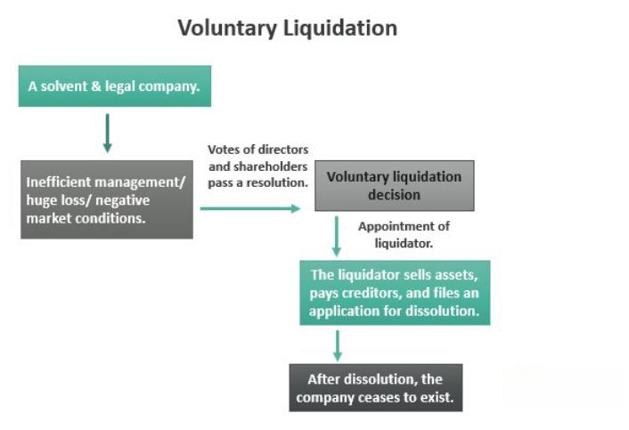

In this article, we explore the complex nature of voluntary liquidation, business closure, winding up, and algorithmic trading, highlighting the impact of these processes on the financial landscape. These topics are significant for business owners and investors as they reflect various scenarios where companies transition or end their operations. Recognizing the intricacies involved in each process is crucial for making informed decisions that affect financial health and strategic planning.

Voluntary liquidation involves a company's decision to cease operations voluntarily, often in cases where the business remains solvent but is no longer viable. This process includes liquidating assets, settling debts, and distributing any remaining funds to shareholders. On the other hand, business closure and winding up are comprehensive procedures that finalize financial obligations, sell assets, and address liabilities. These processes demand strict adherence to legal and regulatory frameworks to ensure orderly and lawful closure.

In the context of algorithmic trading, the closure presents unique challenges due to the automated and technical nature of operations. Such businesses require meticulous planning to safely dispose of digital assets and manage risks during the winding-up phase. Evaluating tax implications and regulatory requirements is also essential, as they influence the liquidation strategy and the duties of stakeholders involved.

Overall, this article aims to provide a detailed understanding of these processes and their interrelations, enabling stakeholders to navigate transitions smoothly while optimizing outcomes.

## Table of Contents

## What is Voluntary Liquidation?

Voluntary liquidation is a self-initiated process by which a company's directors or shareholders elect to dissolve the company, usually due to issues with viability despite the company being solvent. Unlike compulsory liquidation, where creditors or courts mandate the cessation of business, voluntary liquidation provides a structured, controlled [exit](/wiki/exit-strategy). The primary objective during voluntary liquidation is to systematically liquidate company assets, satisfy outstanding debts, and distribute any residual funds to shareholders.

Several motivations might prompt stakeholders to opt for voluntary liquidation. Primarily, the decision may arise from strategic considerations such as moving resources to more profitable ventures or recognizing diminishing returns on investments. Voluntary liquidation allows companies to conclude operations tidily, maintaining control over the liquidation timeline, asset disbursement, and stakeholder communication.

One substantial advantage of voluntary liquidation over forced liquidation is that it enables the company to minimize reputational damage and maintain shareholder relationships. The orderly process often results in a more favorable outcome financially and reputationally, compared to the potential chaos of forced liquidation proceedings.

There are principally two types of voluntary liquidation: Members' Voluntary Liquidation (MVL) and Creditors' Voluntary Liquidation (CVL).

1. **Members' Voluntary Liquidation (MVL):** This process is applicable when a company is solvent. A declaration of solvency is made by the company directors, indicating the company's ability to repay debts in full, typically within 12 months. An MVL is pursued when stakeholders decide to cease operations without financial distress.

2. **Creditors' Voluntary Liquidation (CVL):** Used when a company is insolvent, meaning it cannot meet its financial obligations. In a CVL, after acknowledging insolvency, directors call a meeting of creditors. Creditors play an active role and may appoint a liquidator to oversee asset distribution and debt settlement.

Ultimately, understanding the distinctions and implications of voluntary liquidation guides stakeholders in making strategic decisions that align with their financial and operational expectations.

## The Process of Business Closure and Winding Up

Business closure is a multifaceted process that requires careful planning and execution to ensure that all aspects of a company's operations are systematically wound down. This includes the sale of assets, settlement of liabilities, and resolution of any legal obligations. The legal procedure known as "winding up" is integral to this process, serving as the final act in dissolving the business entity. Here, we outline the essential steps involved in winding up a business along with crucial legal considerations.

### Steps in Winding Up a Business

1. **Board Resolution and Shareholder Approval**: The process begins with a formal decision by the company's board of directors to close the business. This decision is typically subject to shareholder approval, particularly in cases of voluntary liquidation.

2. **Appointment of a Liquidator**: The next step involves appointing a liquidator, who is tasked with overseeing the winding-up process. The liquidator's responsibilities include gathering all company assets, liquidating them into cash, paying off creditors, and distributing any remaining funds to shareholders.

3. **Notifying Creditors**: Effective communication with stakeholders, including creditors, is essential. The appointed liquidator must inform all creditors, allowing them to submit their claims against the company.

4. **Asset Liquidation**: The liquidator will proceed to sell the company’s assets. This may involve auctioning real estate, equipment, and inventory, and requires an accurate valuation to maximize return.

5. **Debt and Liability Settlement**: The proceeds from asset liquidation are used to settle outstanding debts and liabilities. Creditors are typically paid in a specific order of priority, which can vary based on jurisdictional laws.

6. **Final Accounting and Distribution**: After debts are settled, the liquidator prepares a final accounting statement. Any surplus funds are distributed to shareholders according to their shareholding ratio.

7. **Deregistration and Legal Formalities**: The final step includes informing regulatory bodies, such as company registries, of the business closure to officially deregister the company. Compliance with local dissolution laws is critical at this stage to avoid future legal repercussions.

### Legal Implications and Considerations

The winding-up process is governed by a framework of laws and regulations that vary by jurisdiction. Adherence to these laws is paramount to safeguard against potential legal liabilities. Companies must ensure they fulfill all statutory requirements, which may include filing specific documentation with regulatory authorities. For example, in many jurisdictions, a declaration of solvency must be filed if the company is deemed solvent at the time of winding up.

Furthermore, directors and liquidators can face serious penalties if they fail to adhere to legal duties, including the mishandling of creditor claims or misdistribution of assets. Legal advice from professionals familiar with regional business laws is often recommended to navigate these complexities effectively.

In summary, the business closure and winding-up process is a structured sequence of steps that require meticulous attention to financial, legal, and regulatory obligations. This ensures that the company is dissolved in compliance with the law, minimizing risks for those involved.

## Algorithmic Trading and Business Closure

Algorithmic trading, or algo trading, employs automated and high-speed platforms to execute trading strategies within the financial markets. This form of trading is characterized by its reliance on sophisticated algorithms and computer systems to make decisions based on market data at speeds beyond human capability. When businesses involved in [algorithmic trading](/wiki/algorithmic-trading) consider closure, they encounter specific challenges unique to the technical nature of their operations.

One primary challenge is managing the disposition of digital assets and software licenses, which are critical components of an algorithmic trading operation. These assets include algorithms, trading platforms, data feeds, and various financial models. Properly valuing and transferring these assets can be complex due to their intangible nature and the proprietary technologies involved.

Another consideration is risk management during the closure process. Algorithmic trading firms must ensure that active trades are closed and that exposure to market risks is minimized. This can involve unwinding positions, which requires precise timing and execution to avoid market impact costs or adverse price movements. Effective risk management is essential to protect both the firm and its stakeholders during this transition.

Moreover, the technical infrastructure, including servers, network systems, and storage facilities, needs to be decommissioned smoothly. This involves terminating data subscriptions, closing down trading accounts, and ensuring that no residual automated processes continue to operate, which could lead to unintended market activities.

The regulatory landscape also poses challenges. Algorithmic trading firms must comply with various financial regulations pertaining to data security, reporting, and market conduct. During closure, these businesses need to maintain proper records, conduct audits, and possibly notify regulatory bodies to ensure compliance and prevent any legal issues.

These considerations highlight the complexity and technical demands associated with the closure of algorithmic trading operations. Addressing these challenges effectively requires a comprehensive strategy that includes asset appraisal, risk assessment, regulatory compliance, and strategic planning to achieve an orderly wind-up of business activities.

## Tax Implications and Regulatory Considerations

When closing a business through voluntary liquidation, it is crucial to understand the tax and regulatory implications, given their impact on stakeholders, including shareholders and creditors. Proper management of these aspects ensures compliance with legal obligations and optimizes financial outcomes.

One of the primary tax considerations is the filing of final tax returns, which involves declaring the final income, expenses, and capital transactions of the company up to the cessation of trading. In the United States, businesses must file IRS Form 966 when they decide to dissolve or liquidate. Form 966, "Corporate Dissolution or Liquidation," notifies the IRS that the corporation is ceasing operations and outlines the basic details of the liquidation plan. Additionally, a final corporate income tax return must be filed using Form 1120 or Form 1120-S, marking the end of the company's tax reporting duties.

For shareholders, there may be taxable events resulting from the distribution of remaining assets. In a Members' Voluntary Liquidation (MVL), shareholders may receive distributions that can be categorized as capital gains or dividends, depending on the jurisdiction and specific circumstances. In the U.S., distributions in excess of the shareholder's basis in the stock may be treated as a capital gain. It is advisable for shareholders to consult tax advisors to understand the implications and take advantage of any favorable tax treatments available under the law.

Creditors may also experience tax implications during the liquidation process. Amounts written off as uncollectible debts could potentially be claimed as bad debt deductions, reducing taxable income. The ability to claim such deductions depends on specific legal and tax regulations governing debt recovery and write-offs in the relevant jurisdiction.

Both domestic and international regulations impose specific compliance requirements during the liquidation process. Every step of the liquidation must adhere to local, state, and national financial laws to avoid legal liabilities. Companies operating internationally must also ensure that their liquidation process adheres to the regulations of each country in which they conduct business. This includes understanding cross-border tax implications and withholding obligations which may arise from the transfer of assets or distribution of cash to foreign stakeholders.

Avoiding potential legal entanglement necessitates a solid understanding of financial regulations, which vary by country. For instance, in the UK, voluntary liquidations must be conducted under the provisions of the Insolvency Act 1986, while in Australia, regulations are guided by the Corporations Act 2001. Engaging with legal experts specializing in corporate liquidations is prudent to ensure all regulatory and statutory requirements are met. 

In summary, the tax and regulatory considerations involved in voluntary liquidation require meticulous attention to detail and thorough planning. Proper execution of tax filings, coupled with adherence to regulatory protocols, not only ensures compliance but also maximizes the financial outcomes for the involved parties, thereby safeguarding against potential liabilities and penalties.

## Conclusion

Voluntary liquidation, business closure, winding up, and algorithmic trading intersect significantly in the sphere of financial and business operations. These processes demand meticulous coordination to ensure that businesses conclude their operations smoothly while safeguarding the interests of shareholders and creditors. Successful navigation of these processes is crucial for maximizing returns and mitigating potential losses during the closure of a business.

In this article, we have outlined the essential components of each process, emphasizing the critical stages, industry standards, and relevant legal frameworks. The multifaceted nature of these subjects requires an understanding of various factors, including asset liquidation, debt settlement, regulatory compliance, and the management of digital assets and software in algorithmic trading scenarios.

Informed decision-making stands at the core of efficiently managing these processes. Business owners and stakeholders are advised to seek professional guidance to navigate the complexities inherent in voluntary liquidation and winding up procedures. This professional insight ensures adherence to legal requirements and optimizes the outcome for all parties involved. 

As these areas become increasingly intertwined, particularly with technological advancements in algorithmic trading, staying abreast of the latest developments and regulations will be essential. The strategic planning and execution of business closure activities not only contribute to a systematic winding up but also promote fair and transparent processes in the business ecosystem.

## FAQs

### FAQs

**What are the first steps in initiating voluntary liquidation?**

The initial step in initiating voluntary liquidation is passing a resolution for winding up the company. This involves convening a board meeting where directors agree and recommend the resolution to shareholders. If the company is solvent, a Members' Voluntary Liquidation can be initiated, requiring a declaration of solvency from the directors. Shareholders then vote on the resolution, and if approved, the company appoints a liquidator to begin the process of asset liquidation and debt settlement.

**Can a company still trade while in liquidation?**

Generally, a company cannot [carry](/wiki/carry-trading) out its regular trading activities once it enters liquidation. The appointed liquidator takes control of the company’s operations to sell assets and distribute the proceeds to creditors and shareholders. However, in some cases, a liquidator may continue limited trading operations to maximize asset realization, such as fulfilling existing orders. Any trading must aim to benefit creditors and be in line with the company's liquidation strategy.

**What are the differences between Members' and Creditors' Voluntary Liquidation?**

Members' Voluntary Liquidation (MVL) occurs when a solvent company’s shareholders decide to cease operations and liquidate assets. The process begins with directors making a solvency declaration, confirming that debts can be repaid in full within a specified period, typically 12 months. In contrast, Creditors' Voluntary Liquidation (CVL) is initiated when a company is insolvent and unable to meet its financial obligations. Unlike MVL, CVL focuses on settling outstanding debts with creditors having a significant role in appointing the liquidator.

**How does algorithmic trading impact the liquidation process?**

Algorithmic trading presents unique challenges during liquidation due to its reliance on complex software and digital assets. The winding-up process must ensure the secure management and transfer of proprietary trading algorithms, server infrastructures, and valuable data. Additionally, algorithmic trading firms may need to navigate contractual obligations related to software licenses and data provider agreements, complicating the liquidation process. Risk management strategies must be carefully assessed, as the malfunction of trading algorithms during unwinding could lead to substantial financial exposure.

**What are the tax obligations for a business in winding up?**

During the winding-up process, companies must address several tax obligations to ensure compliance with tax regulations. This includes filing final tax returns and settling any outstanding tax liabilities. In the United States, for instance, companies are required to submit IRS Form 966, Corporate Dissolution or Liquidation. They must also address potential capital gains taxes if assets sold during liquidation exceed their book value. Internationally, similar procedures must be followed, and it is crucial to consult with tax professionals to understand specific requirements in different jurisdictions and mitigate any legal liabilities.

## References & Further Reading

[1]: ["A Guide to Corporate Liquidations"](https://www.thetaxadviser.com/issues/2020/oct/tax-rules-liquidating-corporations.html) by U.S. Internal Revenue Service (Publication 542 - Corporations)

[2]: ["UK Insolvency Act 1986"](https://www.legislation.gov.uk/ukpga/1986/45/contents) - Legislation.gov.uk

[3]: ["Corporate Insolvency and Governance Act 2020"](https://www.legislation.gov.uk/ukpga/2020/12/contents/enacted) - UK legislation impacting liquidation processes

[4]: ["Voluntary Liquidation: A Practical Guide"](https://archive.org/details/voluntaryliquida0000grie) by Law Insider

[5]: Chartier, C. V., & Dorsaz, F. (2020). ["Algorithmic Management in Voluntary Liquidation Processes"](https://journals.sagepub.com/doi/10.1177/2631787720964216) - arXiv Preprint

[6]: NASDAQ. ["Introduction to Algorithmic Trading"](https://www.amazon.com/Introduction-Algorithmic-Trading-Advanced-Strategies/dp/0470689544) - Overview on NASDAQ's website

[7]: ["Tax Considerations for Companies in Liquidation"](https://www.thetaxadviser.com/issues/2020/oct/tax-rules-liquidating-corporations.html) by KPMG - Professional insights on tax issues relevant to liquidation processes

[8]: [Insolvency Practitioners Association (IPA)](https://insolvency-practitioners.org.uk/) - Resources and regulatory guidance for insolvency and liquidation professionals

[9]: ["Algorithmic Trading & DMA: An Introduction to Direct Access Trading Strategies"](https://archive.org/details/algorithmictradi0000john) by Barry Johnson

[10]: Securities and Exchange Commission (SEC). ["Regulations for High-Frequency and Algorithmic Trading"](https://www.sec.gov/files/rules/sro/icc/2024/34-101871.pdf) - Overview of regulatory framework regarding algorithmic trading. 