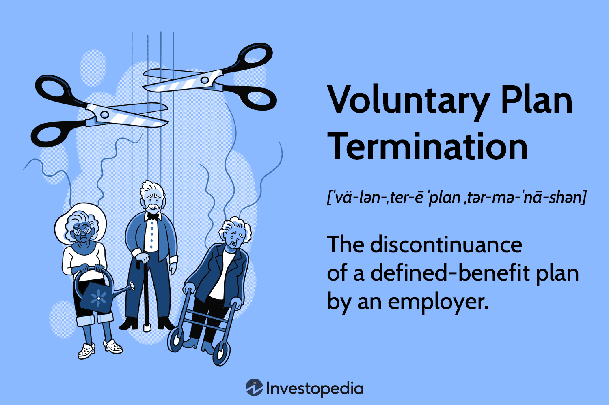

In today's fast-paced financial environment, individuals and businesses must remain aware of the various factors affecting their financial planning and investment strategies. Among these factors, retirement planning has emerged as a fundamental aspect of personal finance management. With an increasing focus on securing financial stability during post-employment years, comprehending the potential implications of retirement plan shutdowns and terminations is crucial.

Retirement planning traditionally involves establishing a structured savings and investment strategy to provide income after leaving the workforce. These plans are not just savings vehicles; they also reflect broader economic conditions and regulatory frameworks that can impact both individuals and organizations. The importance of maintaining robust retirement plans is underscored by the need for reliable income streams in later life, which can mitigate risks associated with health issues, inflation, and market volatility.

Simultaneously, the rise of algorithmic trading is altering investment landscapes. Algorithmic trading utilizes advanced mathematical models and high-speed data processing to execute trades more efficiently. It has become a dominant force in financial markets, providing both opportunities and challenges for investors worldwide. The integration of algorithmic trading strategies into personal and institutional investment portfolios is becoming increasingly prevalent, necessitating a nuanced understanding of its impact on financial planning.

This article aims to unpack the complex interplay between retirement plans, their potential voluntary shutdowns, and the role of algorithmic trading in managing financial portfolios. By examining the factors that drive changes in retirement planning strategies and the technological advancements shaping investment decisions, we can better understand how individuals and businesses can navigate these evolving financial landscapes.

## Table of Contents

## Understanding Retirement Plans and Their Components

Retirement plans are crucial for ensuring financial security during post-employment years. They are generally categorized into two main types: defined-benefit plans and defined contribution plans. 

### Defined-Benefit Plans

Defined-benefit (DB) plans promise a specified monthly benefit upon retirement, which is often determined by a formula considering the employee's salary and years of service. Typically, this formula can be represented as:

$$

\text{Annual Benefit} = \text{Average Salary} \times \text{Years of Service} \times \text{Benefit Multiplier} 
$$

These plans provide a predictable income stream, which can significantly enhance financial stability after retirement. Employers primarily bear investment risks and are responsible for ensuring sufficient fund allocation to meet future obligations.

### Defined Contribution Plans

Defined contribution (DC) plans, such as 401(k) and 403(b) plans, differ from DB plans in that they do not promise a specific benefit amount at retirement. Instead, employees and/or employers contribute to individual accounts for each participant. The retirement benefit is determined by the amount contributed and the performance of these investments over time. The investment risk in DC plans lies mostly on the employees.

### Importance of Retirement Plans

Retirement plans serve as a financial cornerstone for individuals transitioning out of their working years, providing them with necessary income to maintain a desired standard of living. They help mitigate risks of outliving savings, offering both security and peace of mind.

### Employer Role and Responsibilities

Employers play a vital role in establishing, maintaining, and managing these retirement plans. They are responsible for complying with regulatory standards, making requisite contributions, and ensuring clear communication with employees regarding plan features and benefits. Sound management of these plans aids in recruiting, retaining, and motivating employees while also fulfilling fiduciary duties.

### Federal Regulations

Retirement plans in the United States are subject to federal regulations to ensure fairness, financial integrity, and accountability. Key legislative frameworks include the Employee Retirement Income Security Act of 1974 (ERISA) and various guidelines from the Internal Revenue Service (IRS).

**ERISA** sets minimum standards for plan participation, funding, vesting, and benefit accruals. It mandates fiduciary responsibilities to protect participants and beneficiaries, requiring that plan assets are managed prudently and in the best interest of participants.

The **IRS** regulates tax implications associated with retirement plans, such as tax-deferred growth in DC plans and tax treatment of contributions. It sets limits on contributions and benefits, ensuring tax advantages are used within set boundaries to promote equitable treatment.

In summary, retirement plans, both DB and DC, are integral to financial stability in retirement. Employers have significant responsibilities to manage these plans effectively while adhering to regulations that ensure the security and fairness of retirement benefits.

## Voluntary Termination of Retirement Plans

A voluntary termination of a retirement plan occurs when an employer decides to discontinue the plan, notwithstanding the absence of a statutory obligation to do so. Such a decision is typically driven by several factors, including financial sustainability challenges or corporate restructuring efforts. Financial sustainability issues may arise if maintaining the plan becomes economically burdensome, particularly for defined-benefit plans where employers bear the investment risk and are required to guarantee specific retirement benefits. Conversely, in scenarios of corporate restructuring, an employer might evaluate and decide to streamline operations by reducing or eliminating retirement plan obligations to improve financial health or align with new business objectives.

The regulatory framework surrounding the voluntary termination of retirement plans is intricately governed by federal guidelines to protect the interests of employees. Specifically, Section 4041 of the U.S. Code of Federal Regulations outlines the procedural requirements for terminating defined-benefit pension plans. Employers intending to voluntarily terminate a plan must provide adequate notice to plan participants, the Pension Benefit Guaranty Corporation (PBGC) which oversees pension plan terminations, and other relevant stakeholders. This notification must be issued at least 60 days before the proposed termination date. Additionally, the employer must ensure that all owed benefits are fully vested and funded up to the plan termination date.

For employees, the implications of a plan's voluntary termination are multifaceted. Once a plan has been terminated, the assets must be distributed among the participants. The distribution of these assets might occur through lump-sum payments or the purchase of annuities that equate to the benefits accrued under the plan. Employees must therefore decide how to manage these distributed assets to sustain their retirement savings. Options include rolling over lump-sum distributions into individual retirement accounts (IRAs) or other qualified retirement plans to defer tax liabilities and continue benefitting from tax-deferred growth.

Employers must carefully manage the termination process to mitigate adverse impacts on employees and ensure compliance with regulatory obligations. Effective communication and offering financial counseling services can aid employees in making informed decisions post-termination, thereby preserving their financial security into retirement.

## Algorithmic Trading and Its Impact on Financial Planning

Algorithmic trading, often referred to as algo trading, has fundamentally altered the landscape of modern financial markets. It involves the use of complex algorithms to automate the process of trading financial instruments, thus allowing for efficient and rapid execution of trades. With the exponential growth of computational power and the availability of vast amounts of data, [algorithmic trading](/wiki/algorithmic-trading) has increasingly become a dominant force in the financial sector.

One of the primary advantages of algorithmic trading is its ability to process and analyze vast amounts of market data at speeds unattainable by human traders. This leads to increased efficiency in the execution of trades, minimizing the time between identifying trading opportunities and acting on them. Algorithms can be programmed to follow specific strategies, such as [trend following](/wiki/trend-following), [arbitrage](/wiki/arbitrage), or [market making](/wiki/market-making), and can adjust to changing market conditions far more swiftly than manual trading processes.

Algorithmic trading also enhances understanding of market dynamics. By analyzing patterns and trends within historical and real-time data, algorithms can identify inefficiencies and opportunities that may not be apparent to human traders. This capability helps in crafting strategies that optimize returns while managing risks.

The integration of algorithmic trading into retirement planning presents several potential benefits. For one, it can assist in the automated rebalancing of investment portfolios, ensuring that asset allocations remain aligned with an investor's risk tolerance and retirement goals. It can also be used to implement strategies that protect portfolios from market [volatility](/wiki/volatility-trading-strategies)—a crucial [factor](/wiki/factor-investing) for retirement savings where preserving capital is often as important as growth.

However, algorithmic trading is not without risks, particularly when integrated into retirement savings plans. One significant risk is the potential for increased volatility; algorithmic trading can contribute to rapid price swings if strategies based on similar signals are employed simultaneously by many market participants. Additionally, the complexity of these trading systems can occasionally lead to unforeseen technical glitches or market disruptions.

To mitigate these risks, robust monitoring systems and risk management protocols are essential. For instance, implementing safeguards such as 'circuit breakers' can help pause trading during extreme market movements, providing an opportunity to assess and adjust trading strategies. Moreover, ensuring transparency and understanding of the algorithm's logic among stakeholders can aid in aligning its operation with the broader financial goals of retirement planning.

In conclusion, while the advantages of algorithmic trading in terms of efficiency and market insight are substantial, careful consideration must be given to its integration within retirement planning. Balancing the pursuit of higher returns with the imperative of safeguarding retirement assets necessitates a comprehensive approach to risk management and strategic planning.

## Strategic Considerations for Retirement Plan Shutdowns

When considering the voluntary shutdown of retirement plans, employers need to examine various strategic options to mitigate potential negative outcomes for both the business and its employees. A successful approach typically involves a blend of careful planning, compliance with regulatory frameworks, and transparent communication with stakeholders.

One strategy is initiating a phased termination, allowing both the company and its employees to gradually transition away from the current retirement plan. This approach can help employees better prepare for changes by exploring alternative savings options and allow the company to manage fiscal reallocations more effectively. 

Ensuring compliance with legal standards is paramount when shutting down a retirement plan. Employers must adhere to regulations such as the Employee Retirement Income Security Act (ERISA) and specific IRS guidelines, which mandate the protection of employees' interests. Section 4041 of the U.S. Code of Federal Regulations outlines the regulatory requirements for plan termination, including filing notices with the Pension Benefit Guaranty Corporation (PBGC) and properly informing employees about the termination process and benefits distribution. Failure to adhere to these can result in legal and financial penalties.

Transparency is another critical component for a successful shutdown. Employers are advised to maintain open and honest communication with their employees. This includes providing clear timelines, detailed explanations of the reasons for the plan termination, and the impact on employees' retirement savings. Transparency helps maintain trust and can also minimize confusion and anxiety among employees.

Several companies have effectively managed retirement plan shutdowns by adopting comprehensive communication strategies and coaching programs to assist employees in understanding and managing their retirement options. A notable case is IBM’s managed transition from its traditional pension plan to a 401(k) system in the mid-2000s, where the company implemented a robust communication campaign and financial literacy workshops to aid employees in optimizing their retirement planning within the new framework.

Financial literacy is essential during this transition. Employers can offer workshops and resources to improve employees' understanding of investment options and personal financial management. Empowering employees with knowledge can facilitate informed decision-making, thereby enhancing their capacity to actively manage their financial futures despite changes in retirement benefits.

In conclusion, navigating the shutdown of a retirement plan demands a strategic approach that balances legal compliance, effective communication, and a commitment to enhancing financial literacy. Employers that adhere to these practices can successfully manage the complexities of plan shutdowns while safeguarding the financial well-being of their workforce.

## Conclusion

In this article, we have explored the intricacies of retirement plan shutdowns and the transformative impact of algorithmic trading on financial portfolios. Understanding the voluntary termination of retirement plans is crucial for both employers and employees, as it involves navigating regulatory requirements and assessing financial sustainability. Employers contemplating such a shutdown must rigorously follow mandates such as those outlined in Section 4041 of the U.S. Code of Federal Regulations, demonstrating the complexity and necessity of strategic planning. This ensures that distributed assets are managed effectively, safeguarding the financial future of employees concerned.

Algorithmic trading, with its rise in modern markets, offers both opportunities and challenges. Its integration into retirement planning provides potential advantages, such as enhanced efficiency and deeper market insights. However, as the role of technology in finance grows, so does the need for risk management strategies to shield retirement savings from potential volatility and market upheavals.

The dual themes discussed highlight the importance of proactive financial planning and adaptability. Regulatory environments and market dynamics are ever-evolving, emphasizing the need for individuals and businesses to continuously educate themselves about their options and the factors influencing investment decisions. Staying informed is vital for developing robust retirement strategies that can withstand both current and future economic fluctuations. As the landscape of finance continues to shift, leveraging technology wisely and understanding legal obligations will be pivotal in ensuring long-term financial health and stability.

## References & Further Reading

[1]: Nerd’s Eye View. ["Defined Benefit vs. Defined Contribution Plans: Understanding the Differences."](https://canpension.ca/articles/understanding-the-differences-between-defined-benefit-and-defined-contribution-pension-plans) Kitces.com.

[2]: ["Retirement Plans: Benefits, Concepts, and Issues"](https://www.wolterskluwer.com/en/expert-insights/the-pros-and-cons-of-offering-employees-retirement-benefits) by James W. Russell

[3]: Easley, D., López de Prado, M. M., & O'Hara, M. (2012). ["The Volume Clock: Insights into the High Frequency Paradigm."](https://papers.ssrn.com/sol3/papers.cfm?abstract_id=2034858) The Journal of Financial Economics.

[4]: Pension Benefit Guaranty Corporation. ["Understanding Section 4041 of ERISA - Standard Termination"](https://www.pbgc.gov/prac/terminations)

[5]: Hurst, B., Ooi, Y. H., & Pedersen, L. H. (2013). ["Demystifying Managed Futures."](https://www.semanticscholar.org/paper/Demystifying-Managed-Futures-Hurst-Ooi/a1026efc95189963512956cffa99692fe0f40524) The Journal of Investment Management.

[6]: ["High-Frequency Trading: A Practical Guide to Algorithmic Strategies and Trading Systems"](https://www.ahmetbeyefendi.com/wp-content/uploads/2020/07/High-Frequency-Trading-Irene-Aldridge.pdf) by Irene Aldridge and Steve Krawciw

[7]: Malkiel, B. G. (2015). ["A Random Walk Down Wall Street: The Time-tested Strategy for Successful Investing."](https://yourknowledgedigest.org/wp-content/uploads/2020/04/a-random-walk-down-wall-street.pdf) W. W. Norton & Company. 

[8]: Federal Register. ["Code of Federal Regulations – Title 29: Labor."](https://www.ecfr.gov/current/title-29)