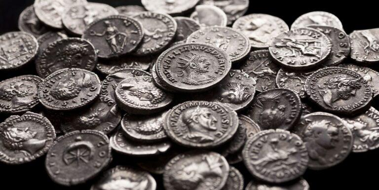

## Table of Contents

## What is the Vomiting Camel Pattern?

The Vomiting Camel Pattern is a funny name for a way to trade in the stock market. It's not a real pattern that people use a lot, but it's a made-up one that some people talk about for fun. The idea is that the pattern looks like a camel that is sick and throwing up. It's supposed to show when the price of a stock might go down a lot, and then maybe go back up a little bit.

Even though the Vomiting Camel Pattern isn't used seriously, it helps show how traders can come up with funny names for things. These names can make trading seem less boring and more fun. But, it's important for traders to use real patterns and not just funny ones when they are making decisions about buying or selling stocks.

## Where did the Vomiting Camel Pattern originate?

The Vomiting Camel Pattern is a made-up term that people in the stock market use for fun. It started as a joke among traders who wanted to make their work more interesting. They came up with this funny name because the pattern on a stock chart looked like a camel that was sick and throwing up. It's not a real pattern that traders use to make decisions about buying or selling stocks.

Even though the Vomiting Camel Pattern isn't used seriously, it shows how traders can use humor to talk about their work. It's a way for them to have a laugh and make the sometimes boring world of stock trading more fun. But, when it comes to actually trading, it's important for people to use real patterns and not just funny ones to make their decisions.

## How is the Vomiting Camel Pattern identified in trading charts?

The Vomiting Camel Pattern is a funny name that traders made up for a pretend pattern on a stock chart. It's not a real pattern that traders use to make decisions about buying or selling stocks. Instead, it's a joke among traders who thought the pattern looked like a camel that was sick and throwing up. The idea is that the pattern shows when a stock's price might drop a lot and then maybe go back up a little bit.

Even though the Vomiting Camel Pattern isn't used seriously, it shows how traders can use humor to make their work more fun. They come up with funny names for things to make the sometimes boring world of stock trading more interesting. But, when it comes to actually trading, it's important for people to use real patterns and not just funny ones to make their decisions.

## What are the key components of the Vomiting Camel Pattern?

The Vomiting Camel Pattern is a funny name that traders made up for a pretend pattern on a stock chart. It's not a real pattern that traders use to make decisions about buying or selling stocks. Instead, it's a joke among traders who thought the pattern looked like a camel that was sick and throwing up. The idea is that the pattern shows when a stock's price might drop a lot and then maybe go back up a little bit.

Even though the Vomiting Camel Pattern isn't used seriously, it shows how traders can use humor to make their work more fun. They come up with funny names for things to make the sometimes boring world of stock trading more interesting. But, when it comes to actually trading, it's important for people to use real patterns and not just funny ones to make their decisions.

## Can you explain the psychology behind the Vomiting Camel Pattern?

The Vomiting Camel Pattern is a funny name that traders made up for a pretend pattern on a stock chart. It's not a real pattern that traders use to make decisions about buying or selling stocks. Instead, it's a joke among traders who thought the pattern looked like a camel that was sick and throwing up. The idea is that the pattern shows when a stock's price might drop a lot and then maybe go back up a little bit. This funny name helps traders remember the pattern and makes their work more interesting.

Even though the Vomiting Camel Pattern isn't used seriously, it shows how traders can use humor to make their work more fun. They come up with funny names for things to make the sometimes boring world of stock trading more interesting. But, when it comes to actually trading, it's important for people to use real patterns and not just funny ones to make their decisions. The psychology behind this is that humor can help traders stay focused and enjoy their work, even when the market is stressful.

## What are the common entry points when trading the Vomiting Camel Pattern?

The Vomiting Camel Pattern is a funny name that traders made up for a pretend pattern on a stock chart. It's not a real pattern that traders use to make decisions about buying or selling stocks. Instead, it's a joke among traders who thought the pattern looked like a camel that was sick and throwing up. The idea is that the pattern shows when a stock's price might drop a lot and then maybe go back up a little bit. Because it's not a real pattern, there are no common entry points for trading it.

Even though the Vomiting Camel Pattern isn't used seriously, it shows how traders can use humor to make their work more fun. They come up with funny names for things to make the sometimes boring world of stock trading more interesting. But, when it comes to actually trading, it's important for people to use real patterns and not just funny ones to make their decisions. The psychology behind this is that humor can help traders stay focused and enjoy their work, even when the market is stressful.

## How do you set stop-losses and take-profit levels with the Vomiting Camel Pattern?

The Vomiting Camel Pattern is a funny name that traders made up for a pretend pattern on a stock chart. It's not a real pattern that traders use to make decisions about buying or selling stocks. Instead, it's a joke among traders who thought the pattern looked like a camel that was sick and throwing up. Because it's not a real pattern, there are no specific ways to set stop-losses or take-profit levels for it. If traders were to use it for fun, they might just guess where to put these levels, but it wouldn't be based on any real trading strategy.

Even though the Vomiting Camel Pattern isn't used seriously, it shows how traders can use humor to make their work more fun. They come up with funny names for things to make the sometimes boring world of stock trading more interesting. But, when it comes to actually trading, it's important for people to use real patterns and not just funny ones to make their decisions. Real patterns have clear rules for setting stop-losses and take-profit levels, which help traders manage their risk and make profits based on actual market movements.

## What are the success rates of the Vomiting Camel Pattern in different market conditions?

The Vomiting Camel Pattern is a funny name that traders made up for a pretend pattern on a stock chart. It's not a real pattern that traders use to make decisions about buying or selling stocks. Because it's not a real pattern, there are no actual success rates for it in different market conditions. If traders were to use it for fun, any success they might have would be just by chance, not because the pattern actually works.

Even though the Vomiting Camel Pattern isn't used seriously, it shows how traders can use humor to make their work more fun. They come up with funny names for things to make the sometimes boring world of stock trading more interesting. But, when it comes to actually trading, it's important for people to use real patterns and not just funny ones to make their decisions. Real patterns have been tested and have success rates that traders can rely on in different market conditions.

## How does the Vomiting Camel Pattern perform compared to other reversal patterns?

The Vomiting Camel Pattern is a funny name that traders made up for a pretend pattern on a stock chart. It's not a real pattern that traders use to make decisions about buying or selling stocks. Because it's not real, we can't compare it to other reversal patterns like the head and shoulders or the double bottom. Those patterns have been studied a lot and people know how well they work in different situations. But the Vomiting Camel Pattern is just a joke, so it doesn't have any real performance data.

Even though the Vomiting Camel Pattern isn't used seriously, it shows how traders can use humor to make their work more fun. They come up with funny names for things to make the sometimes boring world of stock trading more interesting. But, when it comes to actually trading, it's important for people to use real patterns and not just funny ones to make their decisions. Real patterns like the head and shoulders or the double bottom have clear rules and have been proven to work in different market conditions.

## What are some real-world examples of the Vomiting Camel Pattern in action?

The Vomiting Camel Pattern is a funny name that traders made up for a pretend pattern on a stock chart. It's not a real pattern that traders use to make decisions about buying or selling stocks. Because it's not real, there are no actual examples of it happening in the stock market. If someone says they saw the Vomiting Camel Pattern, they're probably just joking around or making up a story for fun.

Even though the Vomiting Camel Pattern isn't used seriously, it shows how traders can use humor to make their work more fun. They come up with funny names for things to make the sometimes boring world of stock trading more interesting. But, when it comes to actually trading, it's important for people to use real patterns and not just funny ones to make their decisions. Real patterns like the head and shoulders or the double bottom have clear rules and have been proven to work in different market conditions.

## How can the Vomiting Camel Pattern be integrated into a broader trading strategy?

The Vomiting Camel Pattern is a funny name that traders made up for a pretend pattern on a stock chart. It's not a real pattern that traders use to make decisions about buying or selling stocks. Because it's not real, you can't actually use it in a trading strategy. If someone tries to use it, they're probably just having fun or making up a story. The Vomiting Camel Pattern is a joke that helps traders remember a funny image, but it doesn't help them make money in the stock market.

Even though the Vomiting Camel Pattern isn't used seriously, it shows how traders can use humor to make their work more fun. They come up with funny names for things to make the sometimes boring world of stock trading more interesting. But, when it comes to actually trading, it's important for people to use real patterns and not just funny ones to make their decisions. Real patterns like the head and shoulders or the double bottom have clear rules and have been proven to work in different market conditions. These patterns can be part of a broader trading strategy that helps traders manage their risk and make profits based on actual market movements.

## What advanced techniques can be used to enhance the effectiveness of the Vomiting Camel Pattern?

The Vomiting Camel Pattern is a funny name that traders made up for a pretend pattern on a stock chart. It's not a real pattern that traders use to make decisions about buying or selling stocks. Because it's not real, there are no advanced techniques that can make it work better. If someone says they have a way to make the Vomiting Camel Pattern more effective, they're probably just joking around or making up a story for fun. The Vomiting Camel Pattern is a funny idea that helps traders remember a silly image, but it doesn't help them make money in the stock market.

Even though the Vomiting Camel Pattern isn't used seriously, it shows how traders can use humor to make their work more fun. They come up with funny names for things to make the sometimes boring world of stock trading more interesting. But, when it comes to actually trading, it's important for people to use real patterns and not just funny ones to make their decisions. Real patterns like the head and shoulders or the double bottom have clear rules and have been proven to work in different market conditions. These patterns can be used with advanced techniques like technical analysis, risk management, and [backtesting](/wiki/backtesting) to help traders make better decisions and increase their chances of making profits.

## References & Further Reading

[1]: ["Advances in Financial Machine Learning"](https://www.amazon.com/Advances-Financial-Machine-Learning-Marcos/dp/1119482089) by Marcos Lopez de Prado

[2]: Aronson, D. R. (2006). ["Evidence-Based Technical Analysis: Applying the Scientific Method and Statistical Inference to Trading Signals."](https://www.amazon.com/Evidence-Based-Technical-Analysis-Scientific-Statistical/dp/0470008741) Wiley.

[3]: Jansen, S. (2018). ["Machine Learning for Algorithmic Trading: Predictive models to extract signals from market and alternative data for systematic trading strategies with Python."](https://www.amazon.com/Machine-Learning-Algorithmic-Trading-alternative/dp/1839217715) Packt Publishing.

[4]: Chan, E. P. (2008). ["Quantitative Trading: How to Build Your Own Algorithmic Trading Business."](https://github.com/ftvision/quant_trading_echan_book) Wiley.