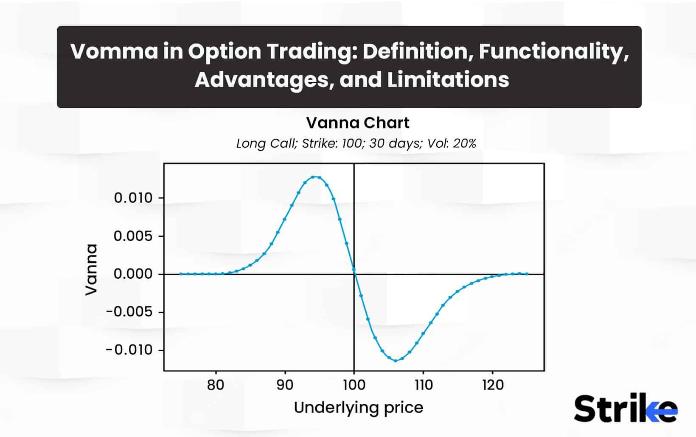

## Table of Contents

## What is Vomma in the context of financial options?

Vomma is a measure used in the world of financial options to understand how the value of an option changes when the volatility of the underlying asset changes. It's a bit like a sensitivity gauge. If you think of the option's price as being affected by the volatility of the asset it's based on, vomma tells you how much that price will shift if the volatility itself changes. This is important for traders because it helps them predict how their options will behave in different market conditions.

In simpler terms, vomma is the second-order sensitivity of an option's price to volatility. While the first-order sensitivity is known as vega, which shows how an option's price changes with a change in volatility, vomma goes a step further. It measures how vega itself changes when volatility changes. This can be crucial for traders who need to manage their risk more precisely, especially in markets where volatility can swing widely.

## How does Vomma differ from other Greek metrics like Delta and Gamma?

Vomma is different from Delta and Gamma because it focuses on how an option's price changes when the volatility of the underlying asset changes, not the price of the asset itself. Delta tells you how much the price of an option will change if the price of the underlying asset changes by a small amount. For example, if you have a Delta of 0.5, the option's price will go up by $0.50 if the stock price goes up by $1.00. On the other hand, Gamma measures how Delta changes when the price of the underlying asset changes. It's like a measure of how sensitive Delta is to price movements.

Vomma, however, is all about [volatility](/wiki/volatility-trading-strategies). It tells you how the option's sensitivity to volatility (which is measured by Vega) changes when the volatility itself changes. So while Delta and Gamma are concerned with the direct price movements of the underlying asset, Vomma is concerned with how changes in the market's expected volatility affect the option's price. This makes Vomma a useful tool for traders who need to understand and manage their options in volatile markets, where the level of expected volatility can shift dramatically.

## Why is Vomma important for options traders?

Vomma is important for options traders because it helps them understand how the price of their options will change when the market's expected volatility changes. Options traders often use strategies that depend a lot on how volatile the market is. If the market suddenly becomes more or less volatile, the value of their options can change a lot. By knowing the Vomma, traders can predict these changes better and adjust their strategies accordingly.

For example, if a trader sees that Vomma is high, it means that even small changes in volatility can cause big swings in the option's price. This can be both an opportunity and a risk. Traders can use this information to either protect themselves against sudden volatility changes or to take advantage of them. Understanding Vomma helps traders manage their risk better and make more informed decisions, especially in markets where volatility is hard to predict.

## What factors influence the Vomma of an option?

The Vomma of an option is influenced by several key factors. One main [factor](/wiki/factor-investing) is the time left until the option expires. Options that are far from their expiration date tend to have higher Vomma because they have more time for volatility to affect their price. Another factor is the strike price of the option compared to the current price of the underlying asset. If the strike price is close to the current price, the option is said to be "at-the-money," and these options usually have higher Vomma than options that are far out-of-the-money or deep in-the-money.

The level of volatility in the market also plays a big role in determining Vomma. When the market is very volatile, even small changes in volatility can have a big impact on the option's price, leading to higher Vomma. On the other hand, in a stable market with low volatility, Vomma tends to be lower because changes in volatility don't affect the option's price as much. Understanding these factors helps traders predict how their options will react to changes in market conditions and manage their investments more effectively.

## How can Vomma be used to manage risk in an options portfolio?

Vomma can help manage risk in an options portfolio by showing how sensitive the options are to changes in market volatility. If a trader knows the Vomma of their options, they can predict how the value of their portfolio might change if the market gets more or less volatile. This is important because sudden changes in volatility can really shake up an options portfolio. By understanding Vomma, traders can take steps to protect their investments from these changes, like adjusting their positions or using different strategies to balance out the risk.

For example, if a trader sees that the Vomma of their options is high, it means that even small changes in volatility could lead to big swings in the value of their portfolio. In this case, the trader might decide to reduce their exposure to options with high Vomma or hedge their portfolio by buying options that would gain value if volatility increases. This way, they can manage the risk better and keep their portfolio stable even when the market is unpredictable.

## What is the mathematical formula used to calculate Vomma?

Vomma is a measure of how much the price of an option changes when the volatility of the underlying asset changes. To calculate Vomma, you need to know the option's vega, which tells you how much the option's price changes with a change in volatility. The formula for Vomma is: Vomma = d(Vega) / d(Volatility). This means Vomma is the rate of change of vega with respect to volatility.

To express this in a more detailed formula, you can use: Vomma = Vega * (Volatility * T^0.5 - d1 / (2 * Volatility * T^0.5)), where Vega is the option's sensitivity to volatility, Volatility is the standard deviation of the asset's returns, T is the time to expiration in years, and d1 is a component from the Black-Scholes model calculated as: d1 = [ln(S/K) + (r + Volatility^2/2) * T] / (Volatility * T^0.5), where S is the current price of the underlying asset, K is the strike price, and r is the risk-free [interest rate](/wiki/interest-rate-trading-strategies). This formula helps traders understand how their options will react to changes in market volatility and manage their risk accordingly.

## Can you explain the concept of volatility smile and its relation to Vomma?

The volatility smile is a pattern seen in the options market where the implied volatility of options changes with their strike prices. If you plot the implied volatility against the strike prices, you'll see a curve that looks like a smile. This happens because options that are far away from the current price of the stock (either much higher or much lower) often have higher implied volatility than options that are close to the current price. This pattern shows that traders expect more volatility in extreme market conditions.

Vomma is related to the volatility smile because it measures how sensitive an option's price is to changes in volatility. When the volatility smile changes, it means the market's expectations about future volatility are shifting. If Vomma is high, even small changes in the volatility smile can cause big swings in the option's price. So, understanding Vomma helps traders predict how their options will react when the volatility smile shifts, helping them manage their risk better in a changing market.

## How does the time to expiration affect the Vomma of an option?

The time left until an option expires plays a big role in how sensitive it is to changes in volatility, which is what Vomma measures. When an option has a long time before it expires, it has more time for the market to move around and change its volatility. This means that options with a lot of time left are usually more sensitive to changes in volatility, so they have a higher Vomma. Traders need to pay close attention to Vomma for these options because even small changes in how volatile the market is can make a big difference in the option's price.

On the other hand, when an option is close to expiring, it doesn't have much time left for the market to change its volatility. This means that options near their expiration date are less sensitive to changes in volatility, so they tend to have a lower Vomma. For traders, this means that the impact of volatility changes on the option's price will be smaller, and they might not need to worry as much about Vomma for these options. Understanding how time to expiration affects Vomma helps traders manage their options strategies more effectively.

## What are some practical examples of Vomma in trading scenarios?

Imagine a trader has bought a call option on a stock that's currently trading at $100. The option has a strike price of $105 and expires in six months. The market is expecting a lot of ups and downs, so the volatility is high. The trader knows that the Vomma of this option is high because it has a long time until it expires and is close to the current stock price. If the market suddenly becomes even more volatile, the price of the option could jump a lot. The trader might decide to keep the option because they think the stock could go up even more with all the volatility. But they also know they need to watch the market closely because the option's price could drop just as quickly if the volatility goes down.

Another example is a trader who sells a put option on a stock trading at $50, with a strike price of $45 and an expiration in one month. The market is pretty calm right now, so the volatility is low. The Vomma of this option is low because it's close to expiring and the strike price is far from the current stock price. If the market stays calm, the trader might not worry too much about the option's price changing a lot. But if there's a sudden news event that makes the market more volatile, the option's price could still change. The trader might use this information to decide whether to keep the option or close it out to manage their risk.

## How does Vomma interact with Vega, and why is this interaction significant?

Vomma and Vega are closely related because they both have to do with how an option's price changes when the market gets more or less bumpy. Vega tells you how much an option's price will go up or down if the market's expected ups and downs (volatility) change a little bit. Vomma, on the other hand, tells you how much that Vega will change if the market's expected ups and downs change again. So, if you know the Vega of your option, Vomma helps you understand how sensitive that Vega is to changes in the market's expected volatility.

This interaction between Vomma and Vega is really important for traders because it helps them see how their options will react when the market gets unpredictable. If the Vomma is high, it means even small changes in how bumpy the market is can cause big changes in the option's price through Vega. This can help traders decide if they need to adjust their options to manage their risk better, especially in markets where things can change quickly. Understanding how Vomma and Vega work together lets traders make smarter choices and keep their investments safer.

## What are the limitations and potential pitfalls of relying on Vomma for trading decisions?

Using Vomma to make trading decisions can be tricky because it's just one piece of the puzzle. Vomma tells you how sensitive an option's price is to changes in the market's expected volatility, but it doesn't tell you everything. Other things like the stock's price, interest rates, and how long until the option expires also affect the option's value. If you focus too much on Vomma, you might miss out on other important factors that could change your option's price. Plus, Vomma can be hard to calculate accurately, especially if the market is moving quickly or if there's not enough data to go on.

Another problem with relying too much on Vomma is that it can be risky if the market does something unexpected. Vomma is based on what traders expect the market's volatility to be, but those expectations can be wrong. If the market turns out to be more or less volatile than expected, the Vomma you calculated might not be right anymore. This can lead to surprises in the option's price that you weren't ready for. So, while Vomma can be a helpful tool, it's important to use it along with other information and to be ready for the market to do unexpected things.

## How can advanced trading strategies incorporate Vomma to optimize performance?

Advanced trading strategies can use Vomma to make better choices about when to buy or sell options. If a trader knows that the Vomma of an option is high, it means that even small changes in how volatile the market is can cause big changes in the option's price. So, the trader might decide to buy options with high Vomma when they think the market is going to get more unpredictable. This way, they can make more money if the market does get more volatile. On the other hand, if the Vomma is low, the trader might choose options that are less affected by changes in volatility, which can be a safer choice if the market stays calm.

Another way to use Vomma is to balance out risk in a trading portfolio. If a trader has a lot of options with high Vomma, their portfolio can be very sensitive to changes in the market's volatility. To protect themselves, they might sell some of those options or buy other options that would gain value if the market becomes less volatile. This can help keep their portfolio stable even if the market does something unexpected. By understanding Vomma and using it to adjust their strategies, traders can make smarter decisions and manage their risks better.

## What is Vomma?

Vomma, also referred to as Volga, is a sophisticated measure in options trading known as a second-order derivative of the option's price. It specifically quantifies how the sensitivity of an option's price to changes in volatility, known as Vega, is expected to vary when the implied volatility of the underlying asset changes. This characteristic makes Vomma a valuable metric for traders, particularly in the context of volatility trading strategies.

Mathematically, Vomma can be represented as:

$$
\text{Vomma} = \frac{\partial^2 C}{\partial \sigma^2}
$$

where $C$ represents the option's price and $\sigma$ is the volatility of the asset. This formula shows that Vomma is essentially the second derivative of the option's price concerning its volatility.

A positive Vomma indicates that as implied volatility increases, the Vega and the option's sensitivity to volatility changes also rise. This characteristic becomes especially critical in situations involving large volatility movements, as it enables traders to assess potential changes in their positions with greater accuracy.

For options traders, Vomma is instrumental when crafting advanced strategies, such as those involving multiple options where large volatility movements are a significant concern. By incorporating Vomma into their analytical toolkit, traders can better understand and anticipate how their positions will perform under changing market conditions, thus optimizing their trading strategies for potentially higher returns in high-volatility environments.

## How can Vomma be implemented in algorithmic trading?

Algorithmic trading systems offer an adept method of integrating complex mathematical models into trading strategies to enhance decision-making processes. By incorporating Vomma, traders can dynamically adjust Vega exposure in response to changes in market volatility, optimizing their strategy to align with fluctuating conditions. Vomma, or Volga, is particularly effective in refining the risk management aspect by accounting for second-order changes in volatility. 

To automate Vomma adjustments, traders can develop algorithms that continuously monitor options' volatility metrics and update positions accordingly. This ensures that a portfolio is consistently balanced, with volatility risks being effectively mitigated. For example, by utilizing real-time data, an algorithm can calculate the expected change in Vega (ΔVega) given a change in implied volatility (ΔIV) using Vomma. This can be expressed mathematically as:

$$
\Delta \text{Vega} = \text{Vomma} \times \Delta \text{IV}
$$

Python is a preferred language for implementing such dynamic algorithms due to its robust libraries like NumPy and Pandas for efficient data processing, and libraries like PyAlgoTrade or Zipline that provide a framework for [algorithmic trading](/wiki/algorithmic-trading). A sample implementation could involve writing a function that calculates Vomma and adjusts the position's volatility exposure:

```python
import numpy as np

def calculate_vomma(vega, implied_volatility, underlying_price, d_iv):
    """Calculate Vomma given vega, implied volatility, and a change in implied volatility."""
    return vega * (implied_volatility * d_iv / underlying_price)

def adjust_vega_position(initial_vega, vomma, change_iv):
    """Adjust the Vega position considering Vomma and the change in implied volatility."""
    delta_vega = vomma * change_iv
    return initial_vega + delta_vega

# Example usage
vega = 0.25                          # Hypothetical Vega value
implied_volatility = 0.20            # Hypothetical implied volatility
underlying_price = 100               # Price of the underlying asset
change_iv = 0.02                     # Assumed change in implied volatility

vomma = calculate_vomma(vega, implied_volatility, underlying_price, change_iv)
new_vega = adjust_vega_position(vega, vomma, change_iv)

print(f"Updated Vega position: {new_vega}")
```

Such automated systems enhance the precision of risk management strategies by ensuring that adjustments are made based on real-time market data, minimizing response time to volatility shifts. This leads to a trading environment where the integration of Vomma alongside other Greeks helps traders maintain portfolio resilience against market uncertainties, ultimately optimizing trading outcomes.

## References & Further Reading

[1]: ["Option Volatility and Pricing: Advanced Trading Strategies and Techniques"](https://www.amazon.com/Option-Volatility-Pricing-Strategies-Techniques/dp/0071818774) by Sheldon Natenberg

[2]: Taleb, N. N. (1997). ["Dynamic Hedging: Managing Vanilla and Exotic Options."](https://archive.org/details/dynamichedgingma0000tale) Wiley.

[3]: Hull, J. C. (2018). ["Options, Futures, and Other Derivatives."](https://www.semanticscholar.org/paper/Options%2C-Futures%2C-and-Other-Derivatives-Hull/89bdee500c8623864fc9eb7a471546aa713acc44) Pearson.

[4]: ["Volatility Trading"](https://www.investopedia.com/articles/investing/021716/strategies-trading-volatility-options-nflx.asp) by Euan Sinclair

[5]: Black, F., & Scholes, M. (1973). ["The Pricing of Options and Corporate Liabilities."](https://www.cs.princeton.edu/courses/archive/fall09/cos323/papers/black_scholes73.pdf) Journal of Political Economy, 81(3), 637-654.