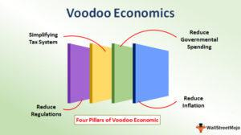

## Table of Contents

## What is Voodoo Economics?

Voodoo Economics is a term used to describe the economic policies of the Reagan administration in the 1980s. It was first used by George H.W. Bush when he was running against Reagan in the 1980 Republican primaries. Bush used the term to criticize Reagan's plan to cut taxes for the wealthy, arguing that it was based on unrealistic ideas and wouldn't work.

The main idea behind Voodoo Economics was "trickle-down economics." This theory says that if you give tax breaks to rich people and businesses, they will invest more money in the economy. This investment is supposed to create new jobs and help everyone. Critics of Voodoo Economics, however, argued that it mainly helped the rich and increased the national debt, without significantly improving the economy for most people.

## Who coined the term 'Voodoo Economics' and in what context?

The term 'Voodoo Economics' was first used by George H.W. Bush during the 1980 Republican primaries. At that time, Bush was running against Ronald Reagan for the Republican nomination for president. Bush used the term to criticize Reagan's economic plan, which involved big tax cuts for the rich. Bush thought these ideas were unrealistic and wouldn't actually help the economy.

Reagan's plan was based on the idea of 'trickle-down economics.' This meant that if rich people and businesses got tax breaks, they would spend more money. This spending was supposed to create jobs and help the whole economy. But critics, like Bush, called it 'Voodoo Economics' because they thought it was based on wishful thinking and wouldn't really work.

## What are the main principles of Voodoo Economics?

Voodoo Economics, also known as Reaganomics, is based on the idea of trickle-down economics. This means that if you give tax breaks to rich people and big businesses, they will have more money to spend and invest. The idea is that this spending and investment will create new jobs and help the economy grow. The main principle is that cutting taxes for the wealthy will lead to more economic activity that benefits everyone.

Critics of Voodoo Economics say it doesn't work as well as promised. They argue that giving tax cuts to the rich mostly helps the rich get richer, without much benefit for everyone else. They also point out that these tax cuts can increase the national debt, because the government loses money it could have collected in taxes. So, while the theory sounds good, many people think it's based on wishful thinking and doesn't solve the real problems of the economy.

## How does Voodoo Economics relate to supply-side economics?

Voodoo Economics and supply-side economics are closely related because they both focus on helping the economy by giving tax breaks to rich people and businesses. Supply-side economics says that if you lower taxes for these groups, they will have more money to invest in things like factories and new businesses. This investment is supposed to create more jobs and make the economy grow. Voodoo Economics is basically the same idea, but it got its nickname because some people thought it was based on wishful thinking and wouldn't really work.

Critics of Voodoo Economics, like those who called it that, thought it was just another name for supply-side economics but sounded even less believable. They argued that giving tax cuts to the rich mostly helped the rich get richer, without doing much for everyone else. They also said that these tax cuts could lead to a bigger national debt because the government would lose money it could have collected in taxes. So, while supply-side economics and Voodoo Economics share the same basic ideas, the term "Voodoo Economics" shows how some people doubted that these ideas would really help the economy.

## What were the key policies associated with Voodoo Economics during the Reagan administration?

During the Reagan administration, Voodoo Economics, also known as Reaganomics, was put into action through several key policies. One of the main policies was cutting taxes for rich people and businesses. Reagan believed that if these groups had more money, they would invest it in the economy, leading to more jobs and growth. Another important policy was reducing government spending on social programs. Reagan thought that by cutting these costs, the government could save money and reduce the national debt.

However, not everyone agreed with these policies. Critics said that cutting taxes for the rich mostly helped the rich get richer, without doing much for everyone else. They also argued that reducing government spending on social programs hurt people who needed help. Another policy was deregulation, which meant the government stepped back from controlling businesses. Reagan thought this would let businesses grow and create more jobs, but critics worried it could lead to problems if businesses were not watched closely.

Overall, Voodoo Economics during the Reagan years focused on tax cuts, spending reductions, and deregulation. These policies aimed to boost the economy by helping the rich and businesses, but they were controversial and had mixed results. Some people saw growth and job creation, while others felt left behind and worried about the growing national debt.

## What was the economic impact of Voodoo Economics in the 1980s?

During the 1980s, Voodoo Economics, also known as Reaganomics, had a big impact on the U.S. economy. One of the main effects was that the economy grew. The GDP, which is like a big picture of all the money made in the country, went up. Also, the unemployment rate, which shows how many people couldn't find jobs, went down. This happened because businesses had more money to spend and invest after the tax cuts. Many people got new jobs and felt better about the economy.

However, not everything was good. The national debt got a lot bigger because the government was collecting less money from taxes. Critics said that the tax cuts mostly helped rich people get richer, and didn't do much for everyone else. Some people also felt that cutting spending on social programs hurt those who needed help the most. So, while some saw growth and more jobs, others felt left behind and worried about the growing debt.

## How did Voodoo Economics affect income inequality in the United States?

Voodoo Economics, or Reaganomics, had a big effect on income inequality in the United States during the 1980s. The main idea of these policies was to cut taxes for rich people and businesses. The hope was that these groups would spend and invest more money, which would help the whole economy grow. But what happened was that the rich got a lot richer. They had more money to keep for themselves, and this made the gap between rich and poor people even bigger. Studies show that the top earners saw their incomes go up a lot more than everyone else.

This growing income inequality became a big problem. While some people got new jobs and the economy did grow, a lot of people felt left behind. The tax cuts didn't help them as much, and cutting spending on social programs made life harder for those who needed help. So, even though the economy got better in some ways, the difference between rich and poor people got worse. This made many people feel that Voodoo Economics was not fair and did not help everyone equally.

## What criticisms have been leveled against Voodoo Economics?

Many people criticized Voodoo Economics because they thought it mainly helped rich people get richer. The idea was to cut taxes for the wealthy and big businesses, hoping they would spend and invest more money. But instead of helping everyone, these tax cuts made the gap between rich and poor people bigger. Critics said that the rich just kept more money for themselves, and the benefits did not "trickle down" to others as promised. They also pointed out that these tax cuts led to a bigger national debt because the government was collecting less money.

Another big criticism was that cutting government spending on social programs hurt people who needed help the most. Programs like welfare and healthcare were reduced, making life harder for poor and middle-class families. Critics argued that this went against the idea of helping everyone in the economy. They also worried about deregulation, which meant less government control over businesses. They thought this could lead to problems if businesses were not watched closely enough. Overall, many people felt that Voodoo Economics was not fair and did not solve the real problems facing the country.

## Can you compare the outcomes of Voodoo Economics with other economic policies of the time?

During the 1980s, Voodoo Economics, or Reaganomics, was one of the main economic policies in the United States. It focused on cutting taxes for rich people and businesses, hoping they would spend and invest more money. This led to some good things like a growing economy and lower unemployment rates. But it also made the national debt bigger because the government was collecting less money. Critics said that it mostly helped the rich get richer and made the gap between rich and poor people bigger. They also worried that cutting spending on social programs hurt those who needed help the most.

At the same time, other countries were trying different economic policies. For example, many European countries focused on keeping strong social programs and having higher taxes to pay for them. These countries, like Sweden and Germany, saw less income inequality because they helped everyone more equally. But they sometimes had slower economic growth compared to the United States. In contrast, Japan used a mix of policies that included investing a lot in technology and industry. This helped Japan's economy grow very fast in the 1980s, but it also led to a big economic bubble that burst later. So, while Voodoo Economics had some successes, it also had big problems, and other countries had different results with their own policies.

## What are the long-term effects of Voodoo Economics on U.S. fiscal policy?

The long-term effects of Voodoo Economics on U.S. fiscal policy have been significant. One of the biggest changes was how tax policy worked. Voodoo Economics, or Reaganomics, focused on cutting taxes for rich people and businesses. This idea stuck around and influenced later tax policies. Even today, many people argue about whether to cut taxes for the rich to help the economy. This has made it harder for the government to collect enough money to pay for important things like schools and roads.

Another effect was the growing national debt. When taxes were cut in the 1980s, the government had less money coming in. But it still had to spend money on things like defense and social programs. This led to a bigger national debt, and it has kept growing ever since. Today, the national debt is a big problem that policymakers have to deal with. They have to figure out how to balance cutting taxes, spending money, and keeping the debt under control. So, Voodoo Economics changed how the U.S. thinks about taxes and debt in the long run.

## How have subsequent administrations adapted or reacted to the principles of Voodoo Economics?

After Reagan left office, different presidents had different ideas about Voodoo Economics. Some, like George H.W. Bush, who first called it "Voodoo Economics," ended up using some of its ideas when he was president. He raised taxes a little bit, but he also kept some of the tax cuts for the rich. Later, Presidents like Bill Clinton and Barack Obama focused more on helping the middle class and poor people. They raised taxes on the rich to pay for things like healthcare and education. They thought that giving more help to everyone, not just the rich, would make the economy better.

Other presidents, like George W. Bush and Donald Trump, liked the idea of cutting taxes for the rich. George W. Bush cut taxes a lot, hoping it would help the economy grow. Donald Trump did the same thing, thinking that if businesses and rich people had more money, they would invest it and create jobs. But both times, the national debt got bigger because the government was collecting less money. So, while some presidents followed the Voodoo Economics idea of cutting taxes for the rich, others tried to balance it by helping more people and raising taxes on the wealthy.

## What is the current academic consensus on the effectiveness of Voodoo Economics?

The current academic consensus on the effectiveness of Voodoo Economics, also known as Reaganomics, is mixed. Many economists agree that the tax cuts for the rich and businesses during the 1980s did help the economy grow and created more jobs. The GDP went up, and unemployment went down, which made some people feel better about the economy. But, not everyone thinks these tax cuts were the best way to help the economy. Some economists say that the growth was not just because of the tax cuts, but also because of other things like new technology and changes in the world economy.

A big problem that many economists point out is that Voodoo Economics made the gap between rich and poor people bigger. The rich got a lot richer because of the tax cuts, but the benefits did not "trickle down" to everyone else as much as promised. This made income inequality worse, and many people felt left behind. Also, the national debt got a lot bigger because the government was collecting less money from taxes. So, while some people see the growth and job creation as good things, others think the costs, like more debt and inequality, were too high.

## What is the key to understanding economic theory?

Economic theory is a foundational element of financial systems, serving as a framework for comprehending market behaviors and guiding decision-making processes. At its core, economic theory seeks to explain how individuals, businesses, and governments make choices regarding resource allocation, production, and consumption. These theories offer insights that help shape fiscal policies and economic strategies.

**Classical Economic Theory** emerged in the 18th and 19th centuries, primarily associated with economists such as Adam Smith, David Ricardo, and John Stuart Mill. This theory emphasizes the idea of a self-regulating market driven by individuals' pursuit of their self-interest. The classical view posits that markets, when left to operate freely, tend toward equilibrium where supply equals demand. It advocates minimal government intervention, believing that free markets maximize efficiency and growth. The formula for demand and supply can be represented as:

$$
Q_d = Q_s
$$

where $Q_d$ is the quantity demanded, and $Q_s$ is the quantity supplied.

**Keynesian Economic Theory**, introduced by John Maynard Keynes during the Great Depression, challenged the classical perspective by highlighting the potential for markets to fail to reach full employment naturally. Keynesians argue that active government intervention is necessary to manage demand, especially during economic downturns. Fiscal policy tools—such as government spending and taxation—are seen as vital to mitigating the adverse effects of recessions and promoting sustainable economic growth. The Keynesian consumption function can be represented as:

$$
C = a + bY_d
$$

where $C$ is consumption, $a$ is autonomous consumption, $b$ is the marginal propensity to consume, and $Y_d$ is disposable income.

**Modern Economic Adaptations** incorporate elements from both classical and Keynesian theories and address the complexities of contemporary economic environments. The New Classical approach, for instance, emphasizes rational expectations and market-clearing equilibria, while the New Keynesian perspective focuses on price and wage stickiness and the role of monetary policy. These adaptations help refine fiscal and monetary policies to address inflation, unemployment, and economic growth challenges.

Economic theory's relevance extends to tackling real-world issues. For example, understanding inflationary pressures can guide monetary policy-makers in setting interest rates. Equally, insights into consumer behavior and market dynamics inform fiscal strategies, such as targeted tax incentives or public investment projects designed to spur economic activity and enhance welfare.

By comprehending these foundational concepts, stakeholders—from policymakers to business leaders—can better anticipate and respond to market changes. This understanding illuminates the interactions between economic [agents](/wiki/agents) and informs the design of policies aimed at fostering stable and prosperous economies globally.

## References & Further Reading

[1]: Lucas, R. E. (1976). ["Econometric Policy Evaluation: A Critique."](https://www.sciencedirect.com/science/article/pii/S0167223176800036) In The Phillips Curve and Labor Markets. Carnegie-Rochester Conference Series on Public Policy, North-Holland Publishing Company.

[2]: Feldstein, M. (1982). ["Government Deficits and Aggregate Demand."](https://www.sciencedirect.com/science/article/pii/0304393282900472) Journal of Monetary Economics, 9(1), 1-20.

[3]: Sornette, D. (2003). ["Why Stock Markets Crash: Critical Events in Complex Financial Systems."](https://www.jstor.org/stable/j.ctt1h1htkg) Princeton University Press.

[4]: ["Algorithmic Trading and DMA: An Introduction to Direct Access Trading Strategies"](https://archive.org/details/algorithmictradi0000john) by Barry Johnson

[5]: Krugman, P. R. (2009). ["The Return of Depression Economics and the Crisis of 2008."](https://archive.org/details/returnofdepressi0000krug) W.W. Norton & Company.