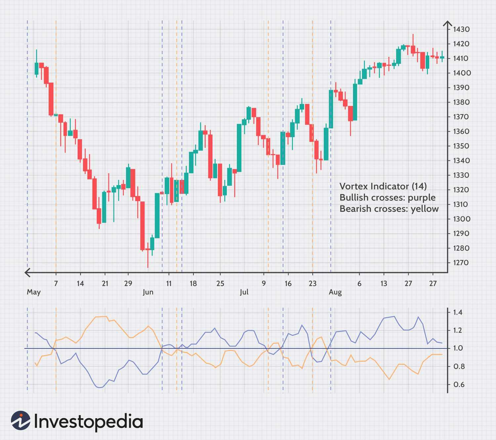

## Table of Contents

## What is the Vortex Indicator and what is its purpose in technical analysis?

The Vortex Indicator is a technical analysis tool used to identify the start of a new trend and to determine the direction of that trend. It was developed by Etienne Botes and Douglas Siepman, and it works by measuring the positive and negative movement of price over a given period. The indicator uses two lines, the Positive Vortex line (VI+) and the Negative Vortex line (VI-), to track these movements. When the VI+ line crosses above the VI- line, it suggests that an uptrend is starting, and when the VI- line crosses above the VI+ line, it indicates the beginning of a downtrend.

The purpose of the Vortex Indicator in technical analysis is to help traders make better decisions about when to enter or exit trades. By identifying the start of new trends, traders can take advantage of these movements early on. The indicator is particularly useful in markets that are prone to sudden shifts in direction, as it can help traders spot these changes more quickly than other indicators. Overall, the Vortex Indicator is a valuable tool for traders looking to improve their timing and increase their chances of making profitable trades.

## Who developed the Vortex Indicator and when was it introduced?

The Vortex Indicator was developed by Etienne Botes and Douglas Siepman. They created this tool to help traders spot the beginning of new trends in the market.

It was introduced to the trading community in 2010. Since then, many traders have used the Vortex Indicator to make better decisions about when to buy or sell.

## How does the Vortex Indicator differ from other technical indicators?

The Vortex Indicator is different from other technical indicators because it focuses on both the direction and strength of a trend. Many other indicators, like moving averages, only show the direction of a trend but not how strong it is. The Vortex Indicator uses two lines, the Positive Vortex line and the Negative Vortex line, to show both the direction and the strength of a trend. This can help traders see when a trend is starting to get stronger or weaker.

Another way the Vortex Indicator is different is that it is good at spotting the start of new trends. Some indicators, like the Relative Strength Index (RSI), are better at showing if a market is overbought or oversold. The Vortex Indicator, on the other hand, can help traders see when a new trend is beginning. This can be very useful for traders who want to get into a trade early and take advantage of the new trend.

## What are the components of the Vortex Indicator and how are they calculated?

The Vortex Indicator has two main parts: the Positive Vortex Movement (VM+) and the Negative Vortex Movement (VM-). These parts help measure how strong a trend is and which way it is going. The Positive Vortex Movement looks at how much the price goes up and how far it moves from the previous low to the current high. The Negative Vortex Movement looks at how much the price goes down and how far it moves from the previous high to the current low. 

To calculate these movements, you first find the True Range (TR), which is the biggest of three values: the current high minus the current low, the absolute value of the current high minus the previous close, or the absolute value of the current low minus the previous close. Then, you calculate VM+ as the absolute value of the current high minus the previous low, and VM- as the absolute value of the current low minus the previous high. After that, you use these values to find the Positive Vortex Indicator (VI+) and the Negative Vortex Indicator (VI-). You do this by taking the sum of VM+ or VM- over a certain number of periods and dividing it by the sum of TR over the same number of periods.

## How can the Vortex Indicator be used to identify bullish and bearish trends?

The Vortex Indicator can help you see if a trend is going up or down. It uses two lines: the Positive Vortex line (VI+) and the Negative Vortex line (VI-). When the VI+ line crosses above the VI- line, it means a bullish trend might be starting. This is a good sign for traders because it shows that prices are likely to go up. By watching these lines, you can catch the start of an uptrend and maybe make some money.

On the other hand, when the VI- line crosses above the VI+ line, it could mean a bearish trend is beginning. This tells traders that prices might start to go down. By paying attention to this signal, you can get ready for a downtrend and decide if you should sell or wait. The Vortex Indicator helps you spot these changes early so you can make better trading choices.

## What are the typical settings for the Vortex Indicator and how can they be adjusted?

The typical setting for the Vortex Indicator is 14 periods. This means it looks back at the last 14 periods of price data to calculate the Positive and Negative Vortex lines. Traders often use this setting because it gives a good balance between seeing short-term changes and longer-term trends. You can find this setting in most trading platforms that have the Vortex Indicator.

You can change the number of periods to suit your trading style. If you want to see quicker changes in the market, you might use a smaller number like 7 or 10 periods. This can help you catch trends faster but might also give you more false signals. If you want to see bigger trends that last longer, you could use a larger number like 20 or 30 periods. This might help you avoid false signals but could make you miss out on short-term moves. Adjusting the settings lets you use the Vortex Indicator in a way that fits your trading goals.

## Can the Vortex Indicator be used effectively in conjunction with other indicators?

Yes, the Vortex Indicator can be used effectively with other indicators to make better trading decisions. For example, you can use it with the Moving Average Convergence Divergence (MACD) to confirm trends. If the Vortex Indicator shows a bullish trend and the MACD line crosses above its signal line, it can give you more confidence that prices will go up. This way, you can use the strengths of both indicators to spot good trading opportunities.

Another useful combination is the Vortex Indicator with the Relative Strength Index (RSI). The RSI can help you see if a market is overbought or oversold, which can add more information to what the Vortex Indicator shows. If the Vortex Indicator signals a new trend and the RSI is not in an overbought or oversold state, it might be a good time to enter a trade. By using these indicators together, you can get a clearer picture of the market and make smarter choices.

## What are some common trading strategies that incorporate the Vortex Indicator?

One common trading strategy that uses the Vortex Indicator is called the crossover strategy. In this strategy, traders watch for when the Positive Vortex line (VI+) crosses above the Negative Vortex line (VI-). This crossover signals the start of a bullish trend, which means prices might go up. Traders can then buy the asset, hoping to sell it later at a higher price. On the other hand, if the Negative Vortex line (VI-) crosses above the Positive Vortex line (VI+), it signals a bearish trend, meaning prices might go down. Traders can then sell the asset or short it, expecting to buy it back later at a lower price.

Another strategy is to use the Vortex Indicator along with other indicators like the Moving Average Convergence Divergence (MACD) or the Relative Strength Index (RSI). For example, a trader might wait for the Vortex Indicator to signal a bullish trend and then check if the MACD line has crossed above its signal line. If both indicators agree, it gives a stronger signal to buy. Similarly, a trader might use the RSI to see if the market is overbought or oversold. If the Vortex Indicator signals a new trend and the RSI is not in an extreme state, it could be a good time to enter a trade. This way, traders can use the Vortex Indicator to spot trends and other indicators to confirm those trends.

## How reliable is the Vortex Indicator in predicting market movements?

The Vortex Indicator is pretty good at predicting market movements, but it's not perfect. It can help traders see when a new trend might be starting by looking at the Positive and Negative Vortex lines. When the Positive line crosses above the Negative line, it often means prices will go up. When the Negative line crosses above the Positive line, it often means prices will go down. Many traders find this helpful because it gives them a clear signal to buy or sell. But like all indicators, it can sometimes give false signals, so it's best to use it with other tools to make sure.

Using the Vortex Indicator with other indicators can make it more reliable. For example, if the Vortex Indicator says a trend is starting and another tool like the MACD agrees, you can feel more confident in your decision. The Vortex Indicator works well in markets that change direction a lot, but it might not be as useful in markets that move slowly. So, while it's a good tool for spotting trends, it's always smart to use it along with other indicators and to keep an eye on the market yourself.

## What are the limitations and potential pitfalls of using the Vortex Indicator?

The Vortex Indicator can sometimes give wrong signals, which is a big problem. It might say a new trend is starting when it's not, or it might miss a real trend. This can make traders lose money if they buy or sell based on these signals. The indicator works by looking at how much prices move up or down, but sometimes these moves can be random and not part of a real trend. That's why it's important to use the Vortex Indicator with other tools to check if the signals are right.

Another issue is that the Vortex Indicator might not work well in all types of markets. It's good at spotting quick changes in markets that move a lot, but it might not be as helpful in markets that move slowly. Also, the settings you use for the indicator can change how it works. If you use too few periods, you might get more wrong signals. If you use too many periods, you might miss out on short-term trends. So, traders need to be careful about how they set up the Vortex Indicator and use it along with other indicators to make better trading choices.

## How does the Vortex Indicator perform in different market conditions, such as trending vs. ranging markets?

The Vortex Indicator works well in trending markets. It's good at spotting when a new trend starts because it looks at how much prices move up or down. When the Positive Vortex line crosses above the Negative Vortex line, it means prices might go up, which is a bullish trend. When the Negative Vortex line crosses above the Positive Vortex line, it means prices might go down, which is a bearish trend. Traders can use these signals to buy or sell at the right time and make money from the trend. But, the Vortex Indicator can sometimes give wrong signals, so it's best to use it with other tools to make sure the trend is real.

In ranging markets, the Vortex Indicator can be less helpful. Ranging markets move sideways and don't have clear trends, which makes it hard for the Vortex Indicator to give good signals. The indicator might show a lot of false signals because the price movements are not strong enough to start a real trend. Traders might get confused and make bad choices if they rely only on the Vortex Indicator in these markets. It's a good idea to use other indicators that work better in ranging markets, like the Relative Strength Index (RSI), to get a clearer picture of what's happening.

## Are there any advanced techniques or modifications to the Vortex Indicator that expert traders use?

Expert traders sometimes use a technique called the Vortex Indicator with multiple time frames. This means they look at the Vortex Indicator on different charts, like a daily chart and an hourly chart. If both charts show the same signal, like a bullish trend, it gives them more confidence that the trend is strong. This can help them make better trading decisions because they are using more information from different time frames. It's like getting a second opinion before making a big choice.

Another advanced technique is to modify the standard settings of the Vortex Indicator. Some traders might change the number of periods from the usual 14 to something like 7 or 20. Using fewer periods can help catch trends faster but might also give more false signals. Using more periods can help avoid false signals but might make them miss out on short-term trends. By tweaking these settings, traders can make the Vortex Indicator fit their own trading style and the specific market they are trading in.

## How do you calculate the Vortex Indicator?

Calculating the vortex indicator involves several key steps essential for its effective implementation in trading strategies. Initially, the True Range (TR) must be determined. The TR is derived as the greatest value between: 

1. The current high minus the current low
2. The current high minus the previous close
3. The current low minus the previous close

Mathematically, it can be expressed as:

$$
\text{TR} = \max(\text{Current High} - \text{Current Low}, |\text{Current High} - \text{Previous Close}|, |\text{Current Low} - \text{Previous Close}|)
$$

Next, the positive (VM+) and negative (VM-) movements are calculated. VM+ is the absolute difference between the current high and the previous low, while VM- is the absolute difference between the current low and the previous high:

$$
\text{VM+} = |\text{Current High} - \text{Previous Low}|
$$

$$
\text{VM-} = |\text{Current Low} - \text{Previous High}|
$$

With a selected parameter length $n$, the sums of the TR, VM+, and VM- over the past $n$ periods are computed. These sums are utilized to form the VI+ and VI- trendlines, where:

$$
\text{VI+} = \frac{\sum_{i=1}^{n} \text{VM+}_i}{\sum_{i=1}^{n} \text{TR}_i}
$$

$$
\text{VI-} = \frac{\sum_{i=1}^{n} \text{VM-}_i}{\sum_{i=1}^{n} \text{TR}_i}
$$

Precision in these calculations is crucial for accurate trend identification, assisting traders in discerning potential market trends. Incorrect computations can lead to false signals, undermining trading strategies. Therefore, rigorous attention to detail during calculation and consistent parameter review can improve the reliability of the vortex indicator in various market conditions.

## References & Further Reading

[1]: Botes, E., & Siepman, D. (2010). ["The Vortex Indicator"](http://technical.traders.com/free/v28c01005BOTE.pdf). Journal of Technical Analysis.

[2]: Aronson, D. (2006). ["Evidence-Based Technical Analysis: Applying the Scientific Method and Statistical Inference to Trading Signals"](https://www.amazon.com/Evidence-Based-Technical-Analysis-Scientific-Statistical/dp/0470008741). Wiley.

[3]: Jansen, S. (2018). ["Machine Learning for Algorithmic Trading: Predictive Models to Extract Signals from Market and Alternative Data for Systematic Trading Strategies with Python"](https://www.amazon.com/Machine-Learning-Algorithmic-Trading-alternative/dp/1839217715). Packt Publishing.

[4]: Chan, E. P. (2008). ["Quantitative Trading: How to Build Your Own Algorithmic Trading Business"](https://github.com/egorpe/EPChan-QuantitativeTrading/blob/master/example7_6.m). Wiley.

[5]: Lopez de Prado, M. (2018). ["Advances in Financial Machine Learning"](https://www.amazon.com/Advances-Financial-Machine-Learning-Marcos/dp/1119482089). Wiley.