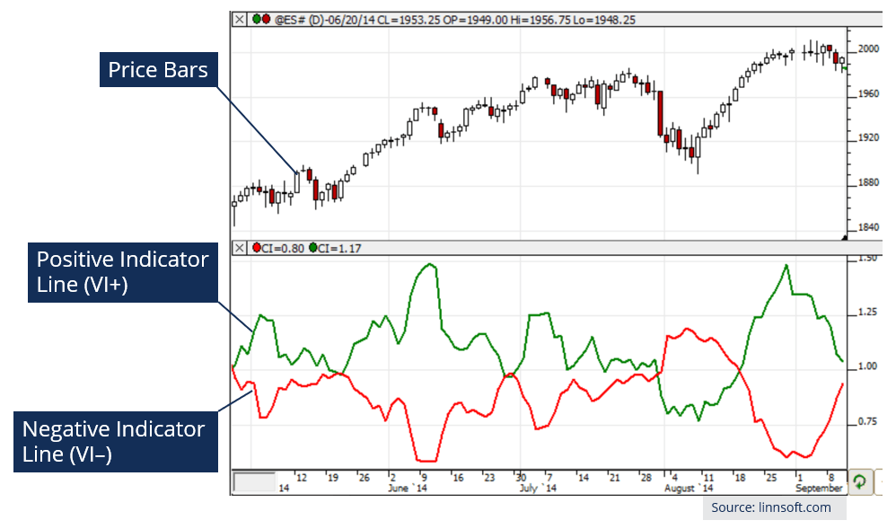

## Table of Contents

## What is the Vortex Indicator and how does it work?

The Vortex Indicator is a technical analysis tool used by traders to identify the direction of a trend and potential reversal points in the market. It was developed by Etienne Botes and Douglas Siepman, and it aims to capture the movement of a security's price by considering both positive and negative trend movements. The indicator uses two lines, the Positive Vortex line (VI+) and the Negative Vortex line (VI-), to help traders determine whether the market is in an uptrend or a downtrend. When the VI+ line is above the VI- line, it suggests a bullish trend, and when the VI- line is above the VI+ line, it indicates a bearish trend.

The Vortex Indicator works by calculating the difference between the highest and lowest prices of the current period and the previous period, and then comparing these differences to the absolute price movement over the same periods. The VI+ is calculated by taking the absolute value of the current high minus the previous low, while the VI- is calculated by taking the absolute value of the current low minus the previous high. Both values are then divided by the True Range, which is the greatest of the current high minus the current low, the absolute value of the current high minus the previous close, or the absolute value of the current low minus the previous close. By comparing the VI+ and VI- lines, traders can gain insights into the strength and direction of the current trend, helping them make more informed trading decisions.

## How can beginners use the Vortex Indicator to identify trends?

Beginners can use the Vortex Indicator to identify trends by looking at the two lines it shows: the Positive Vortex line (VI+) and the Negative Vortex line (VI-). When the VI+ line is above the VI- line, it means the market is in an uptrend. This is a good sign for beginners to consider buying or holding onto their investments. On the other hand, when the VI- line is above the VI+ line, it shows a downtrend. This might be a signal for beginners to sell or avoid buying new investments.

To use the Vortex Indicator effectively, beginners should also watch for crossovers between the two lines. When the VI+ line crosses above the VI- line, it can be seen as a buy signal because it suggests the start of an uptrend. Conversely, when the VI- line crosses above the VI+ line, it can be seen as a sell signal, indicating the beginning of a downtrend. By paying attention to these crossovers and the relative positions of the VI+ and VI- lines, beginners can get a clearer picture of the market's direction and make better trading decisions.

## What are the key components of the Vortex Indicator?

The Vortex Indicator has two main parts: the Positive Vortex line (VI+) and the Negative Vortex line (VI-). These lines help traders see if the market is going up or down. The VI+ line shows positive trend movements, and when it's higher than the VI- line, it means the market is in an uptrend. The VI- line, on the other hand, shows negative trend movements. If the VI- line is higher than the VI+ line, it means the market is in a downtrend.

These lines are calculated using the high, low, and close prices of a security. The VI+ is figured out by taking the difference between the current high and the previous low, and then dividing it by the True Range. The True Range is the biggest of three values: the current high minus the current low, the current high minus the previous close, or the current low minus the previous close. The VI- is calculated similarly but uses the difference between the current low and the previous high. By comparing these two lines, traders can understand the market's direction and make better trading choices.

## Can you explain how to calculate the Vortex Indicator?

To calculate the Vortex Indicator, you need to look at the high, low, and close prices of a security over a certain number of periods, usually 14 days. First, you figure out the True Range for each day. The True Range is the biggest of three values: the current day's high minus the current day's low, the current day's high minus the previous day's close, or the current day's low minus the previous day's close. Then, you calculate the Positive Vortex Movement (VM+) by taking the absolute value of the current day's high minus the previous day's low. Next, you calculate the Negative Vortex Movement (VM-) by taking the absolute value of the current day's low minus the previous day's high.

After you have the True Range, VM+, and VM- for each day, you can calculate the Positive Vortex Indicator (VI+) and the Negative Vortex Indicator (VI-). To find VI+, you add up the VM+ values over the 14-day period and divide by the sum of the True Range values over the same period. To find VI-, you add up the VM- values over the 14-day period and divide by the sum of the True Range values over the same period. Once you have these values, you can plot them on a chart to see if the VI+ line is above the VI- line, which means an uptrend, or if the VI- line is above the VI+ line, which means a downtrend.

## What are the best settings for the Vortex Indicator for different timeframes?

The best settings for the Vortex Indicator can change depending on the timeframe you're using. For short-term trading, like day trading, many traders find that using a 14-period setting works well. This setting is quick to react to price changes, which is what you want when you're looking to make fast trades. If you're using a shorter timeframe, like a 5-minute or 15-minute chart, sticking with the 14-period setting can help you catch trends early.

For longer-term trading, like swing trading or investing, you might want to use a longer period setting, such as 21 or 30 periods. These longer settings can smooth out the indicator's lines, making it easier to see the bigger trends over days or weeks. If you're looking at daily or weekly charts, using these longer settings can help you make decisions that are less influenced by short-term price swings and more focused on the overall direction of the market.

## How does the Vortex Indicator compare to other trend indicators like the ADX?

The Vortex Indicator and the Average Directional Index (ADX) are both used to identify trends in the market, but they work in slightly different ways. The Vortex Indicator uses two lines, the Positive Vortex line (VI+) and the Negative Vortex line (VI-), to show if the market is going up or down. When the VI+ line is above the VI- line, it means the market is in an uptrend, and when the VI- line is above the VI+, it's in a downtrend. The Vortex Indicator is good at spotting trend reversals quickly because it looks at both positive and negative price movements.

On the other hand, the ADX measures the strength of a trend without telling you if it's up or down. The ADX has one main line, and when it's above 25, it means the trend is strong, whether it's up or down. To know the direction, you need to use the ADX along with the Positive Directional Indicator (+DI) and the Negative Directional Indicator (-DI). If the +DI is above the -DI, it means an uptrend, and if the -DI is above the +DI, it means a downtrend. The ADX can help traders understand how strong a trend is, which the Vortex Indicator doesn't show as clearly. So, while the Vortex Indicator is great for spotting trend changes, the ADX is better for understanding trend strength.

## What are some common Vortex Indicator trading strategies for beginners?

One common Vortex Indicator trading strategy for beginners is to watch for crossovers between the Positive Vortex line (VI+) and the Negative Vortex line (VI-). When the VI+ line crosses above the VI- line, it's a sign that the market might be starting an uptrend. This can be a good time for beginners to buy or go long on a security. On the other hand, when the VI- line crosses above the VI+ line, it suggests the start of a downtrend. This could be a signal for beginners to sell or go short. By paying attention to these crossovers, beginners can get a clear idea of when to enter or exit trades based on the direction of the trend.

Another simple strategy is to use the Vortex Indicator along with other indicators, like moving averages, to confirm trends. For example, if the VI+ line is above the VI- line and the price is also above a moving average, it can give beginners more confidence that the uptrend is strong. This can help them avoid false signals and make more reliable trading decisions. By combining the Vortex Indicator with other tools, beginners can build a more robust trading strategy that helps them stay on the right side of the market.

## How can intermediate traders use the Vortex Indicator to confirm breakouts?

Intermediate traders can use the Vortex Indicator to confirm breakouts by watching for the Positive Vortex line (VI+) and the Negative Vortex line (VI-) to support the price action. When the price of a security breaks out above a resistance level, intermediate traders can look for the VI+ line to be above the VI- line. This crossover suggests that the upward momentum is strong, confirming the breakout. If the VI+ line stays above the VI- line after the breakout, it adds more confidence that the uptrend will continue, helping traders decide to enter or stay in the trade.

On the flip side, when the price breaks out below a support level, intermediate traders should check if the VI- line is above the VI+ line. This indicates that the downward momentum is strong, confirming the breakout to the downside. If the VI- line continues to be above the VI+ line after the breakout, it supports the idea that the downtrend will persist. By using the Vortex Indicator in this way, intermediate traders can better time their entries and exits, improving their chances of making successful trades during breakouts.

## What are the potential pitfalls and false signals when using the Vortex Indicator?

One potential pitfall of using the Vortex Indicator is that it can give false signals during choppy or sideways markets. When the market is not trending clearly, the Positive Vortex line (VI+) and the Negative Vortex line (VI-) can cross over each other a lot, making it hard to tell if there's a real trend starting or if it's just random noise. This can lead traders to enter trades based on these false signals, which might result in losses if the market doesn't move in the expected direction.

Another issue is that the Vortex Indicator might lag behind sudden market moves. Because it uses a set number of periods to calculate its values, it can take some time to catch up with quick changes in price. This means that by the time the indicator shows a clear trend, the market might already have moved significantly, and traders might miss out on the best entry points or get into trades too late. It's important for traders to use the Vortex Indicator along with other tools to help confirm signals and avoid these pitfalls.

## How can advanced traders combine the Vortex Indicator with other technical indicators for better results?

Advanced traders can combine the Vortex Indicator with other technical indicators to get a better picture of the market and make smarter trading choices. One common way is to use it with the Moving Average Convergence Divergence (MACD). The Vortex Indicator can show when a trend is starting or changing direction, but it doesn't tell you about the trend's strength. The MACD can help with that. If the Vortex Indicator shows a bullish trend with the VI+ line above the VI- line, and the MACD line crosses above its signal line, it gives traders more confidence that the uptrend is strong and likely to continue. This combination can help traders avoid false signals and make better entry and exit decisions.

Another useful combination is using the Vortex Indicator with the Relative Strength Index (RSI). The Vortex Indicator can help identify the direction of the trend, but it might give false signals in choppy markets. The RSI can help confirm if the trend is strong or if the market is overbought or oversold. If the Vortex Indicator shows an uptrend with the VI+ line above the VI- line, and the RSI is not in overbought territory, it can be a good sign to enter a long trade. On the other hand, if the RSI is showing overbought conditions, it might be a warning to wait or look for a better entry point. By using these two indicators together, advanced traders can get a more complete view of the market and improve their trading results.

## What are some expert-level Vortex Indicator trading strategies for volatile markets?

In volatile markets, expert traders can use the Vortex Indicator along with Bollinger Bands to spot good trading chances. Bollinger Bands show how much the price is moving around its average. When the price goes outside the upper band, it might mean the market is too high and could come back down. When it goes below the lower band, it might mean the market is too low and could go back up. If the Vortex Indicator's VI+ line is above the VI- line and the price is below the lower Bollinger Band, it could be a good time to buy because the market might start going up. On the other hand, if the VI- line is above the VI+ line and the price is above the upper Bollinger Band, it could be a good time to sell because the market might start going down. By using these two tools together, traders can make better choices in fast-changing markets.

Another expert-level strategy involves combining the Vortex Indicator with the Average True Range (ATR) to manage risk in volatile markets. The ATR shows how much the price is moving on average, which helps traders set their stop-loss levels. If the Vortex Indicator shows an uptrend with the VI+ line above the VI- line, and the ATR is high, it means the market is moving a lot. Traders can use the high ATR to set wider stop-loss levels to avoid getting stopped out by normal market swings. If the Vortex Indicator shows a downtrend with the VI- line above the VI+ line and the ATR is high, traders can also set wider stop-loss levels to protect their trades. By using the Vortex Indicator to spot trends and the ATR to manage risk, expert traders can trade more confidently in volatile markets.

## How can traders backtest and optimize Vortex Indicator strategies for different market conditions?

Traders can backtest and optimize Vortex Indicator strategies by using historical data to see how well the strategy would have worked in the past. They can use trading software or platforms that let them go back in time and see what would have happened if they used the Vortex Indicator with certain settings. For example, they might try different numbers of periods for the Vortex Indicator, like 14, 21, or 30, to see which one works best in different market conditions. They can also test the strategy in different markets, like stocks, forex, or commodities, to see if it works better in some places than others. By looking at the results, traders can figure out if their strategy makes money or loses money, and they can change the settings to make it better.

To optimize the strategy for different market conditions, traders should test it in both trending and choppy markets. In a trending market, the Vortex Indicator might work well with shorter periods to catch the trend quickly. But in a choppy market, using a longer period might help smooth out the noise and give fewer false signals. Traders can also combine the Vortex Indicator with other indicators, like the Moving Average or the Relative Strength Index, to see if that makes the strategy more reliable. By trying different combinations and settings, traders can find the best way to use the Vortex Indicator that fits the current market conditions and helps them make more money.

## What is the Vortex Indicator and how does it work?

The Vortex Indicator (VI) is a relatively modern tool in technical analysis, developed by Etienne Botes and Douglas Siepman in 2010. It was inspired by the natural phenomenon of vortices observed in water and air currents, adding a unique perspective to market trend identification. The idea was to create a technical indicator that captures and reflects the directional strength effectively, assisting traders in making informed decisions.

The Vortex Indicator consists of two oscillating lines, known as the positive trend indicator (+VI) and the negative trend indicator (-VI). These lines help traders identify the start of a new trend and the possible end of an existing one. The calculation involves three main steps:

1. **True Range (TR):** The true range is the greatest of the following:
$$
   TR_t = \max(\text{High}_t - \text{Low}_t, |\text{High}_t - \text{Close}_{t-1}|, |\text{Low}_t - \text{Close}_{t-1}|)

$$

2. **Vortex Movement:** Calculate the positive and negative vortex movement (VM+ and VM-) over a specified period:
$$
   VM^+_t = |\text{High}_t - \text{Low}_{t-1}|

$$
$$
   VM^-_t = |\text{Low}_t - \text{High}_{t-1}|

$$

3. **Vortex Indicator Lines:** Finally, the VI lines are obtained by summing the VM values across a specific period $n$ and dividing by the sum of the TR over the same period:
$$
   +VI_t = \frac{\sum_{i=1}^n VM^+_i}{\sum_{i=1}^n TR_i}

$$
$$
   -VI_t = \frac{\sum_{i=1}^n VM^-_i}{\sum_{i=1}^n TR_i}

$$

Traders interpret the Vortex Indicator by observing the interaction between the +VI and -VI lines. A bullish signal occurs when the +VI line crosses above the -VI line, suggesting a potential upward trend. Conversely, a bearish signal is generated when the -VI line crosses above the +VI line, indicating a possible downward trend.

Compared to other technical indicators, the Vortex Indicator provides a more nuanced view of market movements by focusing on [momentum](/wiki/momentum) shifts rather than just price changes like moving averages or Relative Strength Index (RSI). It is particularly valued for its ability to identify trend direction early, making it a useful complementary tool in a trader's toolkit alongside other indicators to confirm signals and reduce false positives.

Python can be used for implementing the Vortex Indicator. Here's a basic outline of a Python function to calculate the Vortex Indicator using pandas:

```python
import pandas as pd

def vortex_indicator(data, n):
    high = data['High']
    low = data['Low']
    close = data['Close']

    tr = pd.concat([
        high - low,
        (high - close.shift(1)).abs(),
        (low - close.shift(1)).abs()
    ], axis=1).max(axis=1)

    vm_plus = (high - low.shift(1)).abs()
    vm_minus = (low - high.shift(1)).abs()

    tr_sum = tr.rolling(window=n, min_periods=1).sum()
    vm_plus_sum = vm_plus.rolling(window=n, min_periods=1).sum()
    vm_minus_sum = vm_minus.rolling(window=n, min_periods=1).sum()

    vi_plus = vm_plus_sum / tr_sum
    vi_minus = vm_minus_sum / tr_sum

    return vi_plus, vi_minus
```

This function allows traders to automate the calculation of the VI using historical price data, enhancing the efficiency and effectiveness of their technical analysis.

## Can you explain Algorithmic Trading with the Vortex Indicator?

Algorithmic trading, commonly referred to as algo trading, utilizes computer algorithms to execute a set of pre-defined instructions for trading. This method of trading offers significant advantages in the modern financial market, including speed, precision, and the ability to efficiently process vast amounts of market data. One such technical tool that can be integrated into [algorithmic trading](/wiki/algorithmic-trading) systems is the Vortex Indicator, a mechanism designed to identify trends and potential reversals by analyzing market data.

To automate trading strategies using the Vortex Indicator, one should first comprehend the indicator's mathematical framework. The Vortex Indicator (VI) is derived from two lines, the Positive Vortex Indicator (+VI) and the Negative Vortex Indicator (-VI), calculated over a specified period:

$$
+VI_t = \frac{SUM(|VM+|)}{TR}
$$
$$
-VI_t = \frac{SUM(|VM-|)}{TR}
$$

where $VM+_t = high_t - low_{t-1}$, $VM-_t = low_t - high_{t-1}$, and $TR$ is the true range for the period. Successful integration in an algorithm involves writing scripts to compute these values, compare +VI and -VI, and execute trades based on the crossovers indicative of potential market movements.

To build an algo trading system that incorporates the Vortex Indicator, several technical requirements are necessary. A robust infrastructure is needed, comprising accurate market data feeds, a reliable trading platform capable of executing trades based on algorithmic signals, and a programming environment to process the Vortex calculations. Python, with libraries such as Pandas for data manipulation and TA-Lib for technical analysis, is often used to build such systems. Below is an example snippet for calculating the Vortex Indicator in Python:

```python
import pandas as pd
import numpy as np

def calculate_vortex(data, n=14):
    high = data['High']
    low = data['Low']
    close = data['Close']

    # Calculate True Range
    tr = np.maximum(high - low, np.maximum(abs(high - close.shift(1)), abs(low - close.shift(1))))
    atr = tr.rolling(window=n).sum()

    # Calculate VM+ and VM-
    vm_plus = abs(high - low.shift(1))
    vm_minus = abs(low - high.shift(1))

    vmp_sum = vm_plus.rolling(window=n).sum()
    vmm_sum = vm_minus.rolling(window=n).sum()

    # Calculate +VI and -VI
    plus_vi = vmp_sum / atr
    minus_vi = vmm_sum / atr

    return plus_vi, minus_vi

data = pd.read_csv('your_market_data.csv')
data['+VI'], data['-VI'] = calculate_vortex(data)
```

Implementing the Vortex Indicator within algorithms does present challenges. Ensuring data quality and latency can affect the performance of algo strategies. Addressing these challenges involves securing high-frequency data providers and optimizing code for minimal lag. Additionally, [backtesting](/wiki/backtesting) strategies to gauge historical effectiveness and calibrating the parameters to suit different market conditions are critical.

Real-world examples showcase the practicality of the Vortex Indicator in algorithmic systems. Some trading firms employ it in combination with other indicators to enhance the accuracy of their predictions. For example, integrating moving averages with the Vortex Indicator can aid in confirming trends and avoiding false signals, thus refining entry and exit points.

In conclusion, the VI's integration into algorithmic trading offers traders a systematic approach to harnessing its analytical power. However, it necessitates a comprehensive understanding of both its mathematical logic and the technological setup required for its successful deployment.

## References & Further Reading

[1]: Botes, E., & Siepman, D. (2010). ["The Vortex Indicator."](http://technical.traders.com/free/v28c01005BOTE.pdf) Technical Analysis of Stocks & Commodities Magazine, 28(6), 7-16.

[2]: Chande, T. S., & Kroll, S. (1994). ["The New Technical Trader: Boost Your Profit by Plugging into the Latest Indicators"](https://www.amazon.com/New-Technical-Trader-Plugging-Indicators/dp/0471597805). Wiley.

[3]: Kaufman, P. J. (2013). ["Trading Systems and Methods, + Website (5th ed.)."](https://onlinelibrary.wiley.com/doi/book/10.1002/9781119202561) Wiley.

[4]: Lopez de Prado, M. (2018). ["Advances in Financial Machine Learning."](https://books.google.com/books/about/Advances_in_Financial_Machine_Learning.html?id=oU9KDwAAQBAJ) Wiley.

[5]: Jansen, S. (2020). ["Machine Learning for Algorithmic Trading: Second Edition."](https://www.amazon.com/Machine-Learning-Algorithmic-Trading-alternative/dp/1839217715) Packt Publishing.