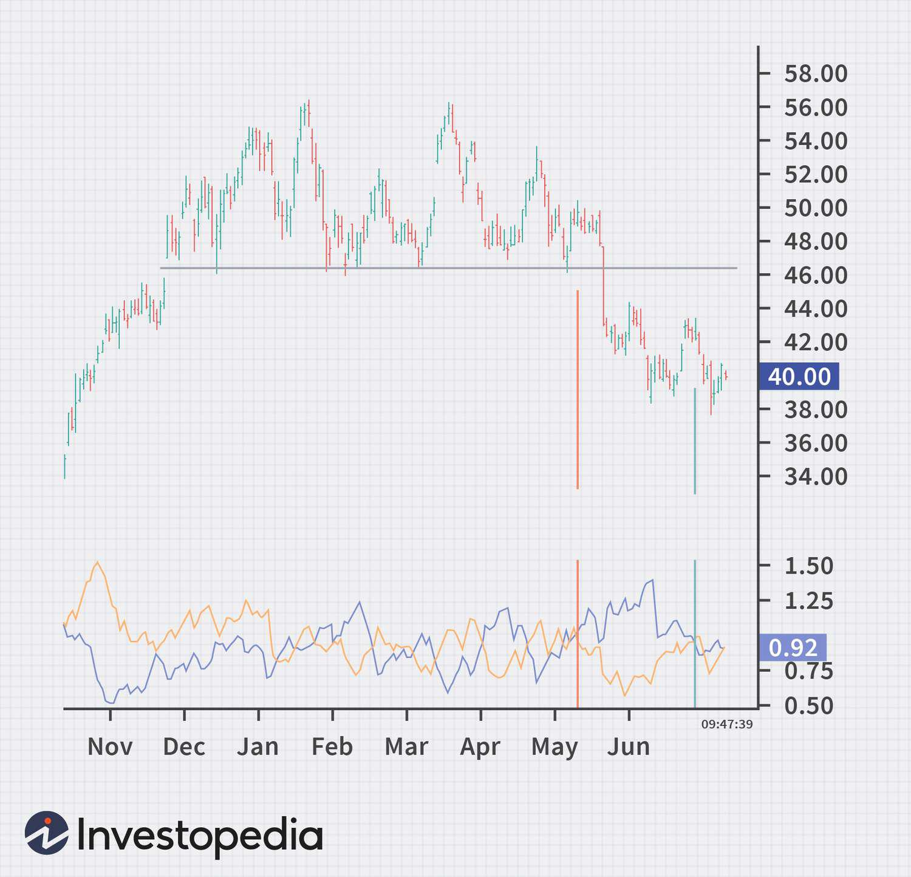

The Vortex Indicator, introduced by Etienne Botes and Douglas Siepman in 2010, is a popular tool in technical analysis used to identify the beginning of a new trend or the continuation of an existing trend. This indicator is based on the concept of a vortex in motion, which is analogous to the directional movement of prices. Technical indicators like the Vortex Indicator play a crucial role in forming robust trading strategies by providing insights into market trends and price movements.

Technical indicators collectively serve as the backbone of trading strategies by quantifying price patterns and trends that are not immediately evident to the naked eye. The Vortex Indicator, in particular, assists traders in identifying trading opportunities by signaling potential trend reversals or trend continuations. It does this by plotting two lines: the positive vortex movement (VI+) and the negative vortex movement (VI-). An upward crossing of VI+ over VI- suggests a bullish trend, whereas a crossing of VI- over VI+ indicates a bearish trend.



Algorithmic trading, or algo trading, leverages computer algorithms to execute trades at speeds and frequencies that humans cannot manage. This method offers several advantages, such as reducing human error, increasing execution speed, and improving market liquidity. The introduction of technical indicators like the Vortex Indicator into algorithmic trading systems can enhance their efficiency by automating the process of detecting potential trading signals and executing trades based on pre-defined criteria.

Integrating the Vortex Indicator into algorithmic trading involves setting trading algorithms to recognize the indicator's signals and respond accordingly. This integration can help traders capitalize on market trends more rapidly and with greater accuracy. As we explore the use of the Vortex Indicator in algo trading, the anticipation of systematic trading strategies that adapt in real-time to the Vortex Indicator's signals represents a significant leap forward in strategic market engagement.

## Table of Contents

## Understanding the Vortex Indicator

The Vortex Indicator (VI) is a relatively modern tool in technical analysis, developed by Etienne Botes and Douglas Siepman in 2010. It was inspired by the natural phenomenon of vortices observed in water and air currents, adding a unique perspective to market trend identification. The idea was to create a technical indicator that captures and reflects the directional strength effectively, assisting traders in making informed decisions.

The Vortex Indicator consists of two oscillating lines, known as the positive trend indicator (+VI) and the negative trend indicator (-VI). These lines help traders identify the start of a new trend and the possible end of an existing one. The calculation involves three main steps:

1. **True Range (TR):** The true range is the greatest of the following:
$$
   TR_t = \max(\text{High}_t - \text{Low}_t, |\text{High}_t - \text{Close}_{t-1}|, |\text{Low}_t - \text{Close}_{t-1}|)

$$

2. **Vortex Movement:** Calculate the positive and negative vortex movement (VM+ and VM-) over a specified period:
$$
   VM^+_t = |\text{High}_t - \text{Low}_{t-1}|

$$
$$
   VM^-_t = |\text{Low}_t - \text{High}_{t-1}|

$$

3. **Vortex Indicator Lines:** Finally, the VI lines are obtained by summing the VM values across a specific period $n$ and dividing by the sum of the TR over the same period:
$$
   +VI_t = \frac{\sum_{i=1}^n VM^+_i}{\sum_{i=1}^n TR_i}

$$
$$
   -VI_t = \frac{\sum_{i=1}^n VM^-_i}{\sum_{i=1}^n TR_i}

$$

Traders interpret the Vortex Indicator by observing the interaction between the +VI and -VI lines. A bullish signal occurs when the +VI line crosses above the -VI line, suggesting a potential upward trend. Conversely, a bearish signal is generated when the -VI line crosses above the +VI line, indicating a possible downward trend.

Compared to other technical indicators, the Vortex Indicator provides a more nuanced view of market movements by focusing on [momentum](/wiki/momentum) shifts rather than just price changes like moving averages or Relative Strength Index (RSI). It is particularly valued for its ability to identify trend direction early, making it a useful complementary tool in a trader's toolkit alongside other indicators to confirm signals and reduce false positives.

Python can be used for implementing the Vortex Indicator. Here's a basic outline of a Python function to calculate the Vortex Indicator using pandas:

```python
import pandas as pd

def vortex_indicator(data, n):
    high = data['High']
    low = data['Low']
    close = data['Close']

    tr = pd.concat([
        high - low,
        (high - close.shift(1)).abs(),
        (low - close.shift(1)).abs()
    ], axis=1).max(axis=1)

    vm_plus = (high - low.shift(1)).abs()
    vm_minus = (low - high.shift(1)).abs()

    tr_sum = tr.rolling(window=n, min_periods=1).sum()
    vm_plus_sum = vm_plus.rolling(window=n, min_periods=1).sum()
    vm_minus_sum = vm_minus.rolling(window=n, min_periods=1).sum()

    vi_plus = vm_plus_sum / tr_sum
    vi_minus = vm_minus_sum / tr_sum

    return vi_plus, vi_minus
```

This function allows traders to automate the calculation of the VI using historical price data, enhancing the efficiency and effectiveness of their technical analysis.

## Implementing Vortex Indicator in Technical Analysis

The Vortex Indicator, introduced in 2010 by Etienne Botes and Douglas Siepman, is a technical analysis tool used for identifying potential changes in market trends. By examining price movements, the indicator provides insights into the strength and direction of trends, aiding traders in formulating informed strategies.

### Steps to Add the Vortex Indicator to Trading Charts

To implement the Vortex Indicator on trading charts, follow these general steps:

1. **Select a Charting Platform**: Choose a trading platform that supports the Vortex Indicator, such as TradingView, MetaTrader, or Thinkorswim.

2. **Open the Chart**: Browse through your desired financial asset and open its price chart.

3. **Access the Indicator Menu**: On your charting interface, locate the indicators menu, typically found in the toolbar.

4. **Add the Vortex Indicator**: Search for "Vortex Indicator" within the indicators list and select it to overlay on the chart.

5. **Customize Settings**: Adjust the parameters, usually the period (commonly set to 14 days), to fit your trading strategy.

### Using the Vortex Indicator for Identifying Market Trends

The Vortex Indicator consists of two lines: the positive vortex line (VI+) and the negative vortex line (VI-). These lines are calculated based on the highs, lows, and closes of recent price bars. Here's how to use it for trend identification:

- **Bullish Trend**: When VI+ crosses above VI-, it signifies a potential bullish trend, suggesting buying opportunities.

- **Bearish Trend**: Conversely, if VI- surpasses VI+, a bearish trend might be emerging, indicating potential selling points.

The dynamic between these lines helps traders detect the onset of trends by revealing changes in momentum and direction.

### Integrating Vortex Indicator with Other Technical Indicators

To enhance its predictive capacity, the Vortex Indicator is often combined with other technical indicators:

- **Moving Averages**: By integrating moving averages with the Vortex Indicator, traders can confirm trends. For instance, a VI+ crossover combined with moving average convergence may reinforce a bullish signal.

- **Relative Strength Index (RSI)**: Combining RSI with Vortex can help assess overbought or oversold conditions, refining entry and exit strategies.

Such integrations boost the reliability of signals by cross-verifying trend strength through multiple metrics.

### Case Studies of Successful Trading Strategies Using the Vortex Indicator

Empirical studies have shown the efficacy of using the Vortex Indicator in real-world trading scenarios. For example:

- **Case Study 1**: A trader successfully employed the Vortex Indicator with a 14-day period setting to navigate forex markets. By correlating Vortex signals with moving averages, the trader significantly enhanced the accuracy of entry and exit points, consistently gaining profits.

- **Case Study 2**: In the stock market, a trading strategy that combined Vortex signals with support and resistance levels led to optimized transaction timing, reducing drawdowns and increasing overall returns.

The adaptability of the Vortex Indicator makes it a popular tool in various market contexts, underscoring its practical value.

### Addressing Common Misconceptions About the Vortex Indicator

Despite its utility, there are misconceptions surrounding the Vortex Indicator:

- **Myth 1: It Predicts Future Prices**: Some believe the Vortex Indicator predicts future prices. In reality, it only signals potential trend changes based on past price movements.

- **Myth 2: It Is Always Accurate**: Like all indicators, it is subject to false signals, particularly in sideways markets. Traders should complement it with other analytical tools to improve decision-making accuracy.

By clarifying these misconceptions, traders can better harness the Vortex Indicator for informed market analysis.

## Designing Trading Strategies with Vortex Indicator

Developing robust trading strategies with the Vortex Indicator involves a comprehensive understanding of its functionality and synergistic interactions with other technical tools. The Vortex Indicator (VI), a creation by Etienne Botes and Douglas Siepman, is designed to identify the initiation and continuation of trends in financial markets by calculating two oscillating lines: VI+ and VI-. Successful application of the Vortex Indicator requires careful integration with proven trading principles and strategies.

**Criteria for Creating Robust Trading Strategies**

To create effective trading strategies using the Vortex Indicator, traders should establish a comprehensive plan based on:

1. **Clear Objectives**: Define what you aim to achieve—whether it's maximizing profit, reducing risk, or optimizing entry and exit points.

2. **Backtesting**: Use historical data to test how the Vortex Indicator would have performed in different market conditions. This helps in understanding its efficacy and refining strategy parameters.

3. **Combining Indicators**: Integrate VI with complementary indicators to enhance signal accuracy. Moving averages are particularly effective for trend confirmation.

**Combining Vortex Indicator with Moving Averages**

Moving averages (MAs) serve as a fundamental tool in trend confirmation. Combining MA with the Vortex Indicator involves:

- **Trend Confirmation**: Incorporate a simple or exponential moving average. For example, if a fast-moving average like a 20-day crosses above a slow one like a 50-day, and the VI+ line is above the VI- line, it signals a strong uptrend.

- **Filtering Signals**: Use the moving average to filter out false signals. For instance, consider only the Vortex Indicator signals that align with the current MA trend direction.

**Entry and Exit Signal Generation**

The Vortex Indicator offers potential entry and [exit](/wiki/exit-strategy) signals as follows:

- **Entry Signals**: A bullish signal emerges when the VI+ line crosses above the VI- line, suggesting the beginning of an upward trend. Conversely, a bearish entry signal occurs when the VI- crosses over the VI+.

- **Exit Signals**: Traders can use the reverse cross to exit a trade. For instance, in a long position, an exit is considered when the VI- crosses above the VI+.

**Benefits and Limitations**

Benefits of using the Vortex Indicator include its ability to clearly identify trend directions and reversals, which is beneficial for traders wanting to capitalize on momentum. However, limitations exist such as potential lag in signaling and susceptibility to false signals in non-trending markets. The indicator's effectiveness diminishes in sideways or choppy markets where trends are not clearly defined.

**Addressing Trader Psychology and Risk Management**

Understanding trader psychology is essential as it influences decision-making and risk-taking behavior. When deploying the Vortex Indicator:

- **Maintain Discipline**: Adhere strictly to your predefined strategy without succumbing to emotional bias.

- **Risk Management**: Implement stop-loss orders to mitigate potential losses. Position sizing should also be considered to prevent exposure that exceeds acceptable risk levels.

By addressing these psychological and analytical components, traders can better manage their strategies' vulnerability to market unpredictability, thereby enhancing overall trading performance with the Vortex Indicator integrated framework.

## Algorithmic Trading with Vortex Indicator

Algorithmic trading, commonly referred to as algo trading, utilizes computer algorithms to execute a set of pre-defined instructions for trading. This method of trading offers significant advantages in the modern financial market, including speed, precision, and the ability to efficiently process vast amounts of market data. One such technical tool that can be integrated into [algorithmic trading](/wiki/algorithmic-trading) systems is the Vortex Indicator, a mechanism designed to identify trends and potential reversals by analyzing market data.

To automate trading strategies using the Vortex Indicator, one should first comprehend the indicator's mathematical framework. The Vortex Indicator (VI) is derived from two lines, the Positive Vortex Indicator (+VI) and the Negative Vortex Indicator (-VI), calculated over a specified period:

$$
+VI_t = \frac{SUM(|VM+|)}{TR}
$$
$$
-VI_t = \frac{SUM(|VM-|)}{TR}
$$

where $VM+_t = high_t - low_{t-1}$, $VM-_t = low_t - high_{t-1}$, and $TR$ is the true range for the period. Successful integration in an algorithm involves writing scripts to compute these values, compare +VI and -VI, and execute trades based on the crossovers indicative of potential market movements.

To build an algo trading system that incorporates the Vortex Indicator, several technical requirements are necessary. A robust infrastructure is needed, comprising accurate market data feeds, a reliable trading platform capable of executing trades based on algorithmic signals, and a programming environment to process the Vortex calculations. Python, with libraries such as Pandas for data manipulation and TA-Lib for technical analysis, is often used to build such systems. Below is an example snippet for calculating the Vortex Indicator in Python:

```python
import pandas as pd
import numpy as np

def calculate_vortex(data, n=14):
    high = data['High']
    low = data['Low']
    close = data['Close']

    # Calculate True Range
    tr = np.maximum(high - low, np.maximum(abs(high - close.shift(1)), abs(low - close.shift(1))))
    atr = tr.rolling(window=n).sum()

    # Calculate VM+ and VM-
    vm_plus = abs(high - low.shift(1))
    vm_minus = abs(low - high.shift(1))

    vmp_sum = vm_plus.rolling(window=n).sum()
    vmm_sum = vm_minus.rolling(window=n).sum()

    # Calculate +VI and -VI
    plus_vi = vmp_sum / atr
    minus_vi = vmm_sum / atr

    return plus_vi, minus_vi

data = pd.read_csv('your_market_data.csv')
data['+VI'], data['-VI'] = calculate_vortex(data)
```

Implementing the Vortex Indicator within algorithms does present challenges. Ensuring data quality and latency can affect the performance of algo strategies. Addressing these challenges involves securing high-frequency data providers and optimizing code for minimal lag. Additionally, [backtesting](/wiki/backtesting) strategies to gauge historical effectiveness and calibrating the parameters to suit different market conditions are critical.

Real-world examples showcase the practicality of the Vortex Indicator in algorithmic systems. Some trading firms employ it in combination with other indicators to enhance the accuracy of their predictions. For example, integrating moving averages with the Vortex Indicator can aid in confirming trends and avoiding false signals, thus refining entry and exit points.

In conclusion, the VI's integration into algorithmic trading offers traders a systematic approach to harnessing its analytical power. However, it necessitates a comprehensive understanding of both its mathematical logic and the technological setup required for its successful deployment.

## Advanced Techniques and Future Trends

Exploring advanced trading strategies often involves leveraging sophisticated tools and methodologies to gain a competitive edge. One such approach is integrating [machine learning](/wiki/machine-learning) (ML) with the Vortex Indicator (VI) to enhance the predictive accuracy and execution efficiency of trading algorithms. Machine learning models, such as neural networks and support vector machines, can be trained to identify complex patterns and relationships in vast datasets that traditional indicators alone might miss. By feeding these models Vortex Indicator data, along with other relevant market data, traders can forecast market movements and refine strategy execution more accurately.

Algorithmic trading continues to evolve rapidly, with [artificial intelligence](/wiki/ai-artificial-intelligence) (AI) playing a crucial role in its advancement. The incorporation of AI allows for quicker processing and analysis of data, improving decision-making speed. AI-driven algorithms can adapt and optimize over time, automatically adjusting to changing market conditions. This adaptability can be particularly beneficial when utilizing the Vortex Indicator, as its signals can be contextualized with other dynamic market factors that AI models are capable of considering.

Future developments in the use of the Vortex Indicator may include enhanced integration with AI systems and more sophisticated algorithms that better capture market volatilities. New AI methodologies, such as [reinforcement learning](/wiki/reinforcement-learning), where algorithms learn optimal trading strategies by interacting with the market environment, could revolutionize how the Vortex Indicator is employed. By simulating numerous trading scenarios, reinforcement learning can evaluate the effectiveness of various indicator settings, optimizing them for specific market conditions.

Preparing for future trends in technical analysis trading strategies necessitates staying abreast of technological advancements and cultivating a strong understanding of both traditional and modern tools. As AI and machine learning technologies advance, traders should focus on continuous learning and adaptation, implementing these tools to enhance their trading frameworks' robustness. By doing so, they can maintain a strategic advantage, leveraging the Vortex Indicator and emerging technologies to anticipate and respond effectively to market trends and opportunities.

## Conclusion

The Vortex Indicator stands out as a significant tool in the repertoire of technical analysis for traders seeking to enhance their decision-making processes. This indicator's effectiveness in identifying potential trend reversals and confirming trend direction has been underscored through its systematic application in trading strategies. Its unique structure, based on true range movement and vortex lines, sets it apart from other technical indicators and provides traders with an additional layer of market insight. When integrated into algorithmic trading, the Vortex Indicator empowers traders to automate strategies that are both robust and adaptive to dynamic market conditions.

The integration of the Vortex Indicator into algorithmic trading strategies has demonstrated notable impacts. By leveraging its precise signals for trend identification, traders can construct algorithms that efficiently enter and exit trades, thus optimizing performance. The mathematical basis of the Vortex Indicator, which computes the directional movement of price through V+ and V- components derived from high and low price ranges, provides a clear and computable criterion for algorithmic applications. Such precision enhances both the speed and accuracy of decision-making in fast-paced trading environments.

Maximizing trading performance using the Vortex Indicator involves not only understanding its foundational principles but also continually assessing its integration with other indicators and market conditions. Traders should focus on developing complementary strategies where the Vortex Indicator can confirm signals from other methods, such as moving averages or momentum indicators, thereby reducing reliance on single-source analysis and enhancing the robustness of trading systems. Furthermore, awareness of its limitations, such as its potential susceptibility to false signals in sideways markets, is crucial for effective risk management.

Traders are encouraged to continuously explore and adapt their trading strategies, integrating new insights and technological advancements to remain competitive. As markets evolve, so too must the strategies employed within them. The fusion of traditional analysis with modern technological tools, such as machine learning and artificial intelligence, presents new frontiers for enhancing the efficacy of the Vortex Indicator in trading strategies. 

In conclusion, traders are called to action to apply these insights within their trading practices, tailoring strategies that align with their individual goals, risk appetites, and market understandings. By doing so, they not only improve their chances of achieving optimal returns but also contribute to the broader advancement of trading methodologies. As the landscape of trading continues to evolve, so too should the strategies that traders employ, ensuring they are well-positioned to capitalize on future trends and opportunities within the market.

## References & Further Reading

[1]: Botes, E., & Siepman, D. (2010). ["The Vortex Indicator."](http://technical.traders.com/free/v28c01005BOTE.pdf) Technical Analysis of Stocks & Commodities Magazine, 28(6), 7-16.

[2]: Chande, T. S., & Kroll, S. (1994). ["The New Technical Trader: Boost Your Profit by Plugging into the Latest Indicators"](https://www.amazon.com/New-Technical-Trader-Plugging-Indicators/dp/0471597805). Wiley.

[3]: Kaufman, P. J. (2013). ["Trading Systems and Methods, + Website (5th ed.)."](https://onlinelibrary.wiley.com/doi/book/10.1002/9781119202561) Wiley.

[4]: Lopez de Prado, M. (2018). ["Advances in Financial Machine Learning."](https://books.google.com/books/about/Advances_in_Financial_Machine_Learning.html?id=oU9KDwAAQBAJ) Wiley.

[5]: Jansen, S. (2020). ["Machine Learning for Algorithmic Trading: Second Edition."](https://www.amazon.com/Machine-Learning-Algorithmic-Trading-alternative/dp/1839217715) Packt Publishing.