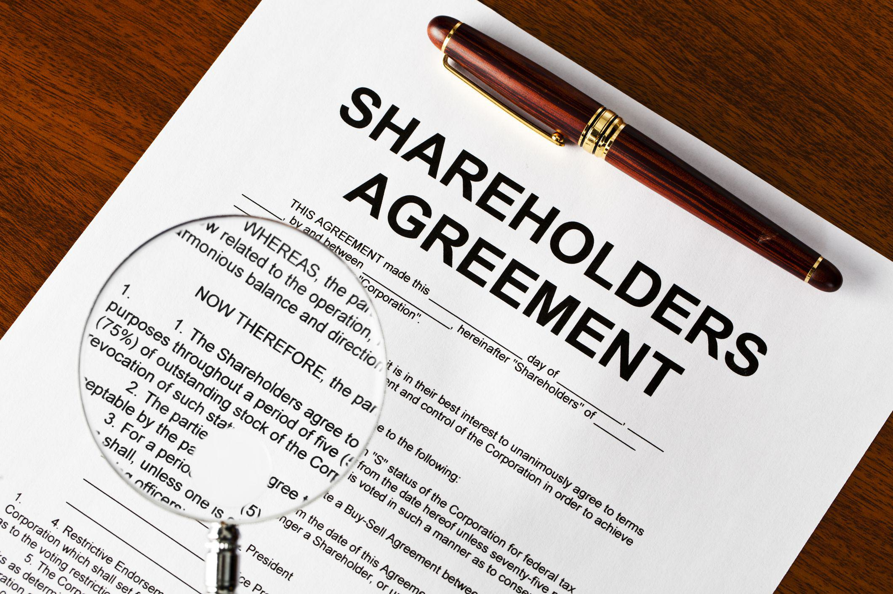

In today's financial markets, a confluence of factors such as stock market voting rights, shorted shares, and algorithmic trading significantly influence investment strategies and market dynamics. Voting rights empower shareholders by allowing them to partake in key corporate decisions, including mergers, board elections, and the establishment of corporate policies. Conversely, shorted shares, wherein investors sell borrowed stocks hoping to repurchase them at lower prices, come with the complexity of shifting voting rights. This is particularly influential when large volumes of shares are shorted, potentially affecting corporate governance and investor control.

Algorithmic trading, characterized by the use of automated systems to execute trades swiftly, further complicates the environment. These systems are capable of managing large volumes of transactions efficiently and can handle short-term market fluctuations and liquidity challenges. In stocks where shorting is prevalent, algorithms adjust for varying levels of voting power, presenting unique strategic opportunities for investors.



The intricate interplay between these elements—voting rights, shorting dynamics, and algorithmic trading—presents a critical area of focus for investors and traders aiming to optimize their decision-making processes. Understanding how these components interact not only aids in navigating the current market landscape but also reveals potential future trends that could shape corporate governance and market behavior. As technological advancements continue to propel the financial sector, the role of these factors is expected to evolve, offering both prospects and challenges for those involved.

## Table of Contents

## Understanding Stock Market Voting Rights

Voting rights in the stock market are a critical component, granting shareholders the ability to shape and influence corporate decisions. These rights allow shareholders to vote on major corporate matters, typically during annual meetings or through proxy voting. Common stockholders usually possess these voting rights, whereas holders of preferred stock may not, depending on the specific terms of the preferred stock issued by the company. The rights associated with common stocks can include voting on issues such as mergers and acquisitions, electing board members, and approving corporate policies and actions.

The concept of "holder of record" is central to exercising these voting rights. The holder of record is the individual or entity registered on the company’s books as the owner of the stock as of a specified date, known as the record date. This entity is legally entitled to vote. The determination of the holder of record is crucial, especially when navigating the complexities of shorted shares. In cases where shares are sold short, the borrower of these shares does not acquire voting rights. Instead, the voting rights remain with the lender who is the holder of record as of the record date.

Understanding who retains voting rights in the context of shorted shares is vital for investors. In certain scenarios, significant short positions can influence corporate governance choices if a substantial number of shares are out on loan. Investors need to be cognizant of how these dynamics may impact their ability to influence corporate decisions, especially when short interest is high.

The importance of voting rights should not be underestimated, as they empower shareholders to impact key strategic decisions and policy initiatives that could affect the company’s direction and, consequently, the value of their investments. For investors, possessing knowledge of how these rights are allocated, and especially how short sales can alter these allocations, is fundamental for effective and informed investment decision-making.

## The Complex Dynamics of Shorted Shares

A short sale is a strategic financial transaction where an investor sells shares that they have borrowed from a broker, with the intent to repurchase them at a lower price. The investor aims to capitalize on a decline in the share's value, gaining the difference between the higher selling price and the lower repurchase price. This process, though seemingly straightforward, introduces complexities, particularly concerning voting rights.

In a short sale, the borrower of the shares does not own them. Consequently, they do not possess the voting rights associated with those shares. Instead, these rights are retained by the actual owner of the shares who has lent them out. This distinction is crucial since it has direct implications on corporate governance. Voting rights play a significant role in influencing decisions on mergers, acquisitions, and other critical corporate actions. 

During the period of a short sale, voting rights are assigned based on who holds the shares on the record date—a specific date set by a company to determine which shareholders are eligible to vote in an upcoming shareholder meeting. The record date can sometimes result in a shift of voting rights depending on whether shares have been loaned out as part of a short sale. If a substantial percentage of a company's shares has been shorted, shifts in voting rights may influence the outcome of shareholder resolutions.

The potential influence of these voting rights is particularly pronounced if a large number of shares are simultaneously shorted. In such a scenario, the concentration of voting power could temporarily shift away from typical long-term shareholders, affecting the balance of corporate influence and potentially swaying the execution of corporate strategies and policies.

For investors, understanding the intricacies of short sales and their implications on voting rights is critical. The act of short selling not only involves a market risk due to price fluctuations but also a governance risk concerning the control over corporate actions. Shareholders looking to maintain influence over corporate decisions must stay aware of the shifting landscape of voting rights induced by short sales, as these can affect their strategies and positions within the company.

## Algorithmic Trading: Implications for Shorted Shares

Algorithmic trading employs mathematical models and computational algorithms to execute trades at speeds and frequencies that are challenging for human traders. This form of trading is especially advantageous in managing short-term market volatilities and [liquidity](/wiki/liquidity-risk-premium) issues, particularly for stocks with significant short interest. During periods of high [volatility](/wiki/volatility-trading-strategies), prices can fluctuate rapidly, and liquidity — the ability to buy or sell large quantities of a stock without affecting the price — is crucial. Algorithms can quickly analyze and respond to these fluctuations, often executing trades in fractions of a second, to capitalize on transient opportunities or mitigate risks.

Portfolio management with [algorithmic trading](/wiki/algorithmic-trading) takes into account not only the financial aspects of the securities involved but also their governance features, such as voting rights. Different classes of shares, particularly in corporations with dual-class structures, offer varying levels of voting power. Algorithms can be programmed to strategically manage these share classes, ensuring that the portfolio's voting weight aligns with the investor's corporate governance objectives. This strategic allocation allows investors to optimize their influence over corporate decisions, especially in scenarios involving mergers, acquisitions, or other pivotal votes.

The relationship between algorithmic trading and shorted shares unveils unique investment strategies. Short selling involves borrowing shares to sell at current prices, with the aim of repurchasing them later at a lower price. This practice can affect stock prices and market perceptions. Algorithms help investors navigate these market dynamics, allowing them to predict or anticipate price movements based on the extent of short interest and other related metrics. By understanding these patterns, algorithms can adjust their trading strategies to exploit discrepancies between a stock's market price and its perceived value, potentially enhancing returns.

Moreover, investors can leverage algorithmic systems to optimize trading outcomes when corporate control is a primary concern. By systematically analyzing vast amounts of market data, algorithms assess how trading decisions might impact or be impacted by changes in voting power associated with shares in the portfolio. This capability ensures that investors not only secure financial returns but also maintain desired levels of influence within targeted firms.

Python, as a leading language in data science and finance, is frequently used to implement these trading strategies. Libraries such as NumPy, pandas, and scikit-learn provide robust tools for data processing, analysis, and [machine learning](/wiki/machine-learning), facilitating the sophisticated modeling and computation required for real-time trading. Here is a basic example of how Python might be used to analyze stock volatility:

```python
import pandas as pd
import numpy as np

# Load historical stock data
stock_data = pd.read_csv('stock_data.csv', parse_dates=['Date'], index_col='Date')

# Calculate daily returns
stock_data['Return'] = stock_data['Close'].pct_change()

# Calculate volatility as the standard deviation of returns
volatility = stock_data['Return'].rolling(window=30).std()

print(volatility.tail())
```

In this snippet, `stock_data.csv` would be a file containing historical pricing data for a particular stock. The script calculates the daily return and subsequently the 30-day rolling volatility, a common measure employed by trading algorithms to estimate short-term risk and price movement potential. Such analyses enable the design of algorithms that can swiftly adapt to prevailing market conditions, aiding investors in optimizing both financial and corporate governance objectives.

## Impact on Corporate Governance and Investment Strategies

Voting rights and short selling play significant roles in shaping corporate governance and investment strategies. Shareholders typically exercise voting rights to influence corporate decisions, aligning these decisions with their interests. These rights become a tool for asserting control over corporate policies, mergers, and board elections. Consequently, the concentration and distribution of voting power among investors can impact corporate governance structures.

Short selling, involving the borrowing and selling of shares with the intention of repurchasing them at a lower price, can dynamically alter the landscape of voting rights. When a large portion of a company's shares is shorted, the allocation of voting rights may shift, potentially affecting corporate control. The implications of these shifts underscore the necessity for investors to closely monitor both their voting capabilities and short positions within their portfolios. 

Algorithmic trading adds another layer of complexity to these considerations, given its ability to execute trades at speeds unmatched by human traders. This rapid trading can change patterns of share ownership, thereby impacting voting distributions. Algorithms can be coded to consider these variables, optimizing trading outcomes in relation to ownership and voting influence. For example, a Python-based algorithm could be devised to account for stock classes with different levels of voting power when building a portfolio. The integration of algorithmic trading in managing shorted shares and voting rights necessitates a nuanced strategy. 

```python
# Example of a simple algorithmic trading strategy that considers voting power
def evaluate_stocks(stock_data):
    """
    Evaluate stocks based on potential market changes and voting class influence.

    Parameters:
    - stock_data (dict): A dictionary where keys are stock symbols and values are dicts
                         with keys 'price', 'short_interest', 'voting_power'

    Returns:
    - List of stocks recommended for buying
    """
    recommended_stocks = []

    for stock, data in stock_data.items():
        # Define strategy: buy if price is below threshold, short interest is high,
        # and voting power is significant
        if data['price'] < 100 and data['short_interest'] > 0.1 and data['voting_power'] > 0.5:
            recommended_stocks.append(stock)

    return recommended_stocks

# Example stock data
stocks = {
    'STOCK_A': {'price': 95, 'short_interest': 0.12, 'voting_power': 0.6},
    'STOCK_B': {'price': 105, 'short_interest': 0.05, 'voting_power': 0.4},
    'STOCK_C': {'price': 80, 'short_interest': 0.2, 'voting_power': 0.8},
}

print(evaluate_stocks(stocks))  # Output: ['STOCK_A', 'STOCK_C']
```

Such strategies indicate the importance of understanding the intricate interplay between short selling, voting rights, and algorithmic trading. Investors who can balance these factors tend to make more informed decisions, enhancing their influence over corporate governance frameworks. In the rapidly evolving financial landscape, recognizing these elements is pivotal for crafting forward-thinking investment strategies that maintain competitive advantages.

## The Future of Technology in Trading and Governance

Advancements in technology are playing an increasingly critical role in the trading and governance landscape. Technologies such as blockchain and [artificial intelligence](/wiki/ai-artificial-intelligence) (AI) are shaping how shareholder voting and corporate governance are conducted.

Blockchain technology holds promise for revolutionizing shareholder voting by ensuring a more secure, transparent, and efficient process. Blockchain's decentralized nature means that once a vote is recorded, it cannot be altered, thus enhancing the integrity and trustworthiness of voting records. This capability could potentially mitigate issues associated with fraud and manipulation in corporate voting, creating a more reliable way for shareholders to exert influence.

Furthermore, digital platforms are increasingly being used to provide shareholders with improved engagement opportunities and real-time analytics on voting outcomes. These platforms can streamline communication between the corporation and its shareholders, facilitating more informed decision-making. Shareholders can receive timely updates and insights, which can lead to more active and meaningful participation in corporate governance.

The integration of new technologies with traditional governance models could potentially redefine shareholder influence. The ease and transparency facilitated by blockchain and digital platforms may encourage broader shareholder participation and democratize corporate governance activities. This, in effect, could lead to a shift in how decisions are made within companies, emphasizing shareholder interests more prominently.

Investors must be vigilant and keep abreast of these technological advancements to navigate the evolving financial landscape effectively. As technology continues to evolve, staying informed will not only allow investors to optimize their decision-making processes but also to leverage new tools to gain a competitive edge. Consequently, the future of trading and corporate governance is poised to offer both challenges and opportunities, as the balance between traditional practices and technological innovations continues to shift.

## Conclusion

Voting rights, shorted shares, and algorithmic trading represent crucial components within the framework of today's financial markets. Their interconnectivity plays a significant role in shaping market behavior, influencing corporate governance, and determining investment strategies. Understanding how these elements interact is essential for investors aiming to make informed decisions, particularly as the complexity and velocity of market changes increase.

The capacity to exercise voting rights affects not only corporate decisions but also shareholder value and influence. Shorted shares, often a focus of market speculation, can temporarily alter voting power dynamics, impacting governance. Algorithmic trading, with its ability to rapidly execute trades, adds another layer of complexity by affecting share ownership patterns and liquidity.

Technological advancements promise to further transform these interactions. As technology progresses, especially in areas like artificial intelligence and blockchain, its influence on trading practices and governance structures is likely to expand. Blockchain technology, for example, holds the potential to streamline shareholder voting processes, making them more transparent and secure.

Investors who embrace these technological advancements stand to gain a competitive edge. By leveraging data analytics and algorithmic systems, they can optimize their strategies and better predict market movements. However, this also requires a continuous adaptation to new tools and an understanding of how these technologies integrate into existing frameworks.

The future presents both challenges and opportunities, balancing traditional investment practices with technological innovation. As these components continue to evolve, their impact on the financial markets will likely necessitate ongoing adaptation by all market participants, promising a dynamic landscape for future investment and governance strategies.

## References & Further Reading

[1]: ["The Handbook of Electronic Trading"](https://www.amazon.com/Handbook-Electronic-Trading-Joe-Rosen/dp/0981464602) edited by Joseph Rosen

[2]: ["Algorithmic Trading and DMA: An Introduction to Direct Access Trading Strategies"](https://www.amazon.com/Algorithmic-Trading-DMA-introduction-strategies/dp/0956399207) by Barry Johnson

[3]: ["The Little Book of Stock Market Cycles: How to Take Advantage of Time-Proven Market Patterns"](https://www.amazon.com/Little-Book-Stock-Market-Cycles/dp/1118270118) by Jeffrey A. Hirsch

[4]: Hu, B., & Salim, M. (2020). ["Machine Learning for Trading."](https://github.com/PacktPublishing/Machine-Learning-for-Algorithmic-Trading-Second-Edition) ResearchGate.

[5]: ["All About Short Selling"](https://www.investopedia.com/articles/investing/100913/basics-short-selling.asp) by Tom Taulli

[6]: Black, F., & Scholes, M. (1973). ["The Pricing of Options and Corporate Liabilities."](https://www.cs.princeton.edu/courses/archive/fall09/cos323/papers/black_scholes73.pdf) Journal of Political Economy.

[7]: ["Security Analysis"](https://www.amazon.com/Security-Analysis-Seventh-Principles-Techniques/dp/1264932405) by Benjamin Graham and David Dodd