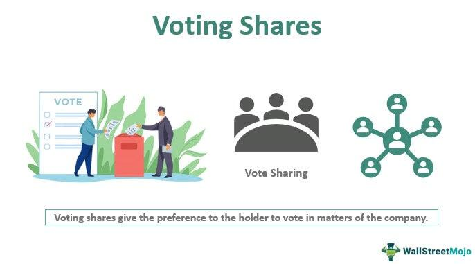

## Table of Contents

## What are voting shares?

Voting shares are a type of stock that gives the owner the right to vote on important company decisions. These decisions can include choosing the board of directors, approving mergers, or making changes to the company's rules. When you own voting shares, you get to have a say in how the company is run, which can be important if you want to influence the company's direction.

The number of votes you have usually depends on how many voting shares you own. For example, if you own 100 voting shares and each share gives you one vote, you would have 100 votes. Not all companies have voting shares, and some might have different classes of shares where some shares have more voting power than others. This can affect how much control different shareholders have over the company.

## How do voting shares differ from non-voting shares?

Voting shares and non-voting shares are two types of stock that companies can issue. Voting shares give the owner the right to vote on important company decisions, like choosing the board of directors or approving big changes. This means if you own voting shares, you can help decide how the company is run. The number of votes you get usually depends on how many voting shares you own.

On the other hand, non-voting shares do not give the owner any voting rights. If you own non-voting shares, you can't vote on company decisions. But, you still get to enjoy other benefits of owning stock, like receiving dividends if the company decides to pay them. Companies might issue non-voting shares to raise money without giving up control over decision-making.

In some companies, you might see different classes of shares. For example, Class A shares might be voting shares, while Class B shares are non-voting shares. This setup can help the company keep control in the hands of certain shareholders while still allowing others to invest in the company.

## What are the basic types of voting shares?

There are two basic types of voting shares: common shares and preferred shares. Common shares are the most common type of voting shares. If you own common shares, you get to vote on important things like who should be on the company's board of directors or if the company should merge with another company. The number of votes you get usually depends on how many common shares you own. For example, if you own 10 shares and each share gives you one vote, you would have 10 votes.

Preferred shares are another type of voting share, but they work a bit differently. People who own preferred shares usually get to vote on certain things, but not everything. They might get to vote on big changes to the company's rules, but not on who should be on the board of directors. Also, preferred shares often come with other benefits, like getting paid dividends before common shareholders. This means if the company decides to pay out money to shareholders, preferred shareholders get their share first.

## Can you explain the concept of dual-class shares?

Dual-class shares are a way for companies to have different types of stock with different voting rights. This means a company can have one type of share that gives the owner a lot of votes, and another type that gives the owner fewer votes or no votes at all. Usually, the people who started the company or the top leaders keep the shares with more votes. This helps them keep control over big decisions, even if other people own a lot of the company's stock.

For example, a company might have Class A shares and Class B shares. Class A shares might give the owner 10 votes per share, while Class B shares only give 1 vote per share. This way, the founders or top leaders can make sure they have a strong say in how the company is run, even if they don't own as much of the company as other investors. This can be good for keeping the company's original vision, but it can also mean that other shareholders have less say in what happens.

## How do voting rights affect corporate governance?

Voting rights are a big part of how a company is run. When shareholders have voting rights, they can vote on important things like who should be on the board of directors or if the company should merge with another company. This means shareholders can help decide the direction of the company. If a lot of shareholders agree on something, they can make it happen by voting together. This is called corporate governance, which is all about how a company is managed and controlled.

Sometimes, the way voting rights are set up can change how much control different people have over the company. For example, if a company has dual-class shares, the people with the shares that have more votes can keep a lot of control, even if they don't own most of the company. This can be good for keeping the company's original vision, but it can also mean that other shareholders have less say in what happens. So, voting rights are a key part of making sure the company is run in a way that everyone thinks is fair and good for the company's future.

## What are some examples of companies with different types of voting shares?

Some big companies use different types of voting shares to keep control in the hands of certain people. For example, Google's parent company, Alphabet, has Class A, Class B, and Class C shares. Class A shares give one vote per share, Class B shares give 10 votes per share, and Class C shares have no voting rights. This means the founders, Larry Page and Sergey Brin, can keep a lot of control over the company because they own most of the Class B shares.

Another example is Meta, the company that owns Facebook. They also have different classes of shares. Class A shares give one vote per share, and Class B shares give 10 votes per share. Mark Zuckerberg, the founder, owns most of the Class B shares, so he has a lot of control over what happens at Meta. This setup helps him keep the company's direction in line with his vision, even if other people own a lot of the company's stock.

## How can voting shares influence company decisions?

Voting shares give people who own them a say in how a company is run. When you own voting shares, you can vote on big decisions like who should be on the board of directors or if the company should merge with another company. If a lot of shareholders agree on something, they can make it happen by voting together. This means the people who own voting shares can help decide the direction of the company and make sure it does things they think are important.

Sometimes, the way voting shares are set up can change how much control different people have. For example, if a company has different types of shares, like Class A and Class B shares, the people with the shares that have more votes can keep a lot of control. This can be good for keeping the company's original vision, but it can also mean that other shareholders have less say in what happens. So, voting shares are a big part of making sure the company is run in a way that everyone thinks is fair and good for the company's future.

## What are the advantages and disadvantages of holding voting shares?

Holding voting shares can give you a lot of power in a company. When you own voting shares, you get to vote on big decisions like who should be on the board of directors or if the company should merge with another company. This means you can help decide the direction of the company and make sure it does things you think are important. If a lot of shareholders agree on something, they can make it happen by voting together. This can be really good if you want to have a say in how the company is run and make sure it follows a path you believe in.

But there are also some downsides to holding voting shares. Sometimes, the way voting shares are set up can mean that some people have more control than others. For example, if a company has different types of shares, like Class A and Class B shares, the people with the shares that have more votes can keep a lot of control. This can be frustrating if you own voting shares but don't have as much say as you'd like. Also, voting shares might not always come with other benefits like higher dividends, which some non-voting shares might offer. So, while voting shares give you a voice, they might not always be the best choice if you're looking for other financial benefits.

## How do shareholders vote in a company?

Shareholders vote in a company by taking part in meetings called shareholder meetings. These meetings can happen in person or online. At these meetings, shareholders get to vote on big decisions like who should be on the board of directors or if the company should merge with another company. Each voting share usually gives the owner one vote, but sometimes shares can have different voting power. For example, some shares might give 10 votes each, while others might give just one vote or none at all.

To vote, shareholders can go to the meeting and vote in person, or they can vote by sending in a proxy vote. A proxy vote is when you tell someone else how you want to vote, and they vote for you at the meeting. This is helpful if you can't go to the meeting yourself. Companies usually send out information before the meeting, telling shareholders what they will be voting on and how to vote. This way, everyone who owns voting shares can have a say in the company's decisions.

## What is the process for changing voting share structures?

Changing the voting share structure of a company is a big deal and usually needs a lot of people to agree. First, the company's board of directors has to suggest a change. They might want to do this to give more control to certain people or to make it easier to raise money. Once the board suggests a change, they have to tell all the shareholders about it. This is usually done in a special meeting where everyone can talk about the change and vote on it. To make the change happen, a certain number of shareholders have to agree. This number can be different for each company, but it's often a big majority, like two-thirds of the votes.

If the shareholders agree to the change, the company has to follow some rules to make it official. They have to file paperwork with the government to show that the voting share structure has changed. This can take some time and might need the help of lawyers to make sure everything is done right. Once everything is official, the new voting share structure starts to work. This means some shareholders might have more or less power in deciding how the company is run, depending on what the new structure is.

## How do voting shares impact mergers and acquisitions?

Voting shares can have a big impact on mergers and acquisitions. When a company wants to merge with another company or be bought by another company, the shareholders with voting shares get to vote on whether it should happen. If most of the shareholders with voting shares say yes, the merger or acquisition can go ahead. This means the people who own voting shares can help decide if a big change like this is good for the company. If they think it will make the company better or more valuable, they might vote yes. But if they think it's a bad idea, they can vote no and stop it from happening.

Sometimes, the way voting shares are set up can make a big difference in mergers and acquisitions. For example, if a company has different types of shares, like Class A and Class B shares, the people with the shares that have more votes can have a lot of control over whether a merger or acquisition happens. This can be good for keeping the company's original vision, but it can also mean that other shareholders have less say in what happens. So, voting shares are a key part of making sure that big changes to the company are done in a way that everyone thinks is fair and good for the company's future.

## What are the regulatory considerations for different types of voting shares?

When a company wants to have different types of voting shares, like Class A and Class B shares, they have to follow rules set by the government. These rules are there to make sure that the company is fair to all shareholders and that everyone knows what's going on. For example, in the United States, the Securities and Exchange Commission (SEC) has rules about how companies can set up different types of shares. Companies have to tell the SEC about their plans and get approval before they can change their voting share structure. This helps make sure that the changes are clear and fair.

Different countries might have different rules about voting shares. In some places, there might be strict rules about how much voting power different types of shares can have. For example, some countries might not allow shares that give one person a lot more votes than another. Companies have to know these rules and follow them when they set up their voting share structure. This can be tricky, but it's important to make sure that the company is run in a way that is fair and good for everyone who owns shares.

## References & Further Reading

[1]: Bebchuk, L. A., & Kastiel, K. (2017). "The Untenable Case for Perpetual Dual-Class Stock." Virginia Law Review, 103(4), 585-631.

[2]: Admati, A. R., & Pfleiderer, P. (2009). "The 'Wall Street Walk' and Shareholder Activism: Exit as a Form of Voice." Review of Financial Studies, 22(7), 2645-2685.

[3]: Shleifer, A., & Vishny, R. W. (1997). "A Survey of Corporate Governance." The Journal of Finance, 52(2), 737-783.

[4]: Malkiel, B. G. (1999). ["A Random Walk Down Wall Street: Including a Life-Cycle Guide to Personal Investing"](https://archive.org/details/randomwalkdownwa0000malk_y6n1)

[5]: O'Hara, M. (2015). "High-Frequency Trading and Its Impact on Markets." Financial Analysts Journal, 70(3), 18-27.

[6]: Gomber, P., Arndt, B., Lutat, M., & Uhle, T. (2011). "High-Frequency Trading." SpringerLink. In: High-frequency trading. Springer, Frankfurt.

[7]: Geisler, C. (2014). ["Blockchain: Blueprint for a New Economy"](https://dl.acm.org/doi/book/10.5555/3006358) by Melanie Swan

[8]: Gompers, P. A., Ishii, J. L., & Metrick, A. (2003). "Corporate Governance and Equity Prices." The Quarterly Journal of Economics, 118(1), 107-156.