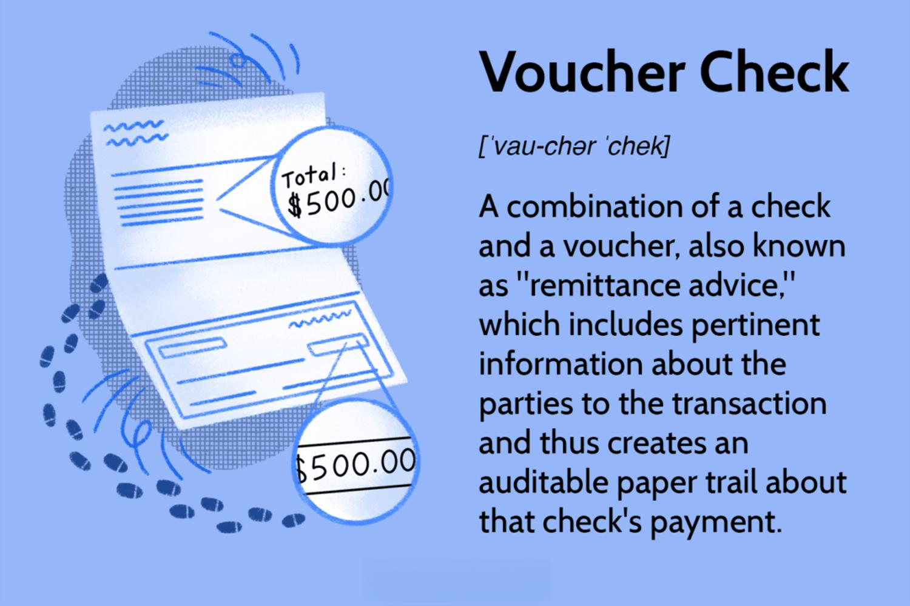

In this modern financial landscape, financial documents play a crucial role in ensuring transactions are accurately recorded and verified. Utilizing robust documentation practices is vital to maintaining transparency and accuracy in financial dealings. Payment verification vouchers, a pivotal component of this documentation framework, are increasingly significant in this context. They serve as concrete evidence of financial transactions, helping to substantiate claims, validate payments, and safeguard against many forms of financial discrepancies.

The integration of payment verification vouchers with algorithmic trading marks a notable advancement in the financial sector. Algorithmic trading, characterized by its reliance on complex algorithms to automate trade processes, capitalizes on speed and precision in executing transactions. Payment verification vouchers support this by ensuring that every transaction executed within the algorithms is properly documented and traceable. This integration enhances transparency, ensuring all trades are audible and compliant with existing financial regulations.

Understanding the nexus between financial documentation and technological advancements is critical for finance professionals today. As the financial landscape becomes increasingly digitized, professionals must not only grasp the technical aspects of these technologies but also their implications for financial governance and compliance. Embracing these advancements allows for the development of more efficient, transparent, and accountable financial systems, ultimately supporting the sophisticated world of algorithmic trading.

## Table of Contents

## Understanding Financial Documentation and Vouchers

Financial documentation is crucial in maintaining the integrity and transparency of an organization’s financial activities. It involves various records that meticulously capture and detail every financial transaction occurring within the entity. Among these records, vouchers play a vital role as they serve as tangible evidence substantiating each recorded financial transaction.

Vouchers are indispensable in the accounting process as they authenticate and support entries in the financial statements. They provide a detailed narrative of the transaction, including essential information such as the date, amount, nature of the expenditure or income, and authorization details. This comprehensive documentation ensures accuracy and accountability in financial reporting.

Several types of vouchers exist, tailored to the specific nature of a transaction. Payment vouchers are issued when payments are made, serving as proof of the financial outflow. They typically include the payee’s details, method of payment, and the reason for the transaction. Receipt vouchers, conversely, are generated when receipts of money are obtained. These serve as evidence of cash inflow and include payer details, received amount, and reason for the receipt. Journal vouchers are used for transactions not directly involving cash or bank facilities, facilitating adjustments and corrections in accounting records. They play a crucial role in the double-entry accounting system, ensuring that each transaction is recorded accurately in the appropriate ledgers.

The function of these vouchers extends beyond mere documentation; they are fundamental in establishing an effective accounting system. They provide a reliable audit trail, enabling auditors to trace transactions back to their origin, thereby verifying the authenticity and compliance of financial records. This traceability is pivotal in preventing fraud and errors, as it allows for the cross-verification of data between financial statements and source documents.

Overall, financial documentation, through the use of various vouchers, forms the backbone of a robust accounting system. It not only substantiates financial transactions but also enhances the reliability and integrity of financial reporting. As organizations continue to evolve, maintaining meticulous financial documentation remains integral to ensuring sound financial governance and transparency.

## The Role of Vouchers in Accounting

Vouchers serve as a foundational component in accounting systems, playing a pivotal role in the documentation, authorization, and verification of financial transactions. These documents are crucial for maintaining the integrity and accuracy of financial records, as they ensure that every transaction is appropriately authenticated and approved. Each voucher acts as a documentary evidence for a specific financial action, providing a definitive trail for auditors and accountants to follow.

In accounting, vouchers underpin ledger entries, forming the basis upon which financial statements are constructed. By substantiating transactions, they lend accuracy to trial balances, an essential step in preparing consistent and reliable financial statements. Ensuring compliance in financial reporting starts with vouchers, as they confirm that transactions adhere to the applicable accounting policies and standards.

Effective voucher management practices are critical in preventing accounting errors. Proper management entails meticulous documentation of transactions, regular reconciliation of vouchers with ledger entries, and stringent authorization procedures to prevent unauthorized transactions. This comprehensive documentation and verification process strengthen financial controls, mitigating the risk of fraud and financial misstatements.

The integration of vouchers in accounting processes not only establishes accountability but also facilitates the smooth operation of financial systems. Ensuring the proper handling and management of vouchers is thus indispensable for robust financial governance and control.

## Algorithmic Trading: A New Frontier

Algorithmic trading, commonly referred to as algo trading, has revolutionized the financial sector by employing computer algorithms to execute trades at speeds and precisions that surpass human capabilities. This technological advancement allows traders to respond instantly to market shifts, optimizing trading activities by exploiting temporary inefficiencies or patterns in the financial markets.

Algo trading provides several advantages over traditional trading methods. By utilizing sophisticated algorithms, traders can analyze vast datasets to identify profitable opportunities in milliseconds. This capability is crucial in today's fast-paced markets, where delay can result in lost profits. The automation of trades reduces human error and mitigates emotional biases that often impact trading decisions.

Several strategies are pivotal to [algorithmic trading](/wiki/algorithmic-trading):

1. **Trend Following**: This strategy involves algorithms identifying and acting upon market trends. Traders can capitalize on the upward or downward momentum of asset prices by using mathematical models that predict the continuation of market trends. Common techniques include moving averages and channel breakouts.

2. **Arbitrage**: Arbitrage exploits price discrepancies of the same asset across different markets or forms, seeking risk-free profit opportunities. Algorithms can simultaneously buy and sell the asset in different venues to lock in the price difference. This process requires extensive computational resources and swift execution to ensure profitability before the price gap closes.

3. **Mean Reversion**: This strategy is predicated on the concept that prices and returns eventually move back towards their mean or average level. Algorithms detect when an asset has deviated significantly from its historical mean, prompting a buying or selling action with the expectation that prices will revert to their average. This approach often employs statistical measures such as the Z-score to identify anomalies.

Understanding these algorithmic strategies is essential for finance professionals seeking to leverage advanced trading systems. Mastery of programming languages such as Python is often required, as traders must code algorithms and backtest them against historical market data to ensure efficacy. With these tools, professionals can harness the full potential of algorithmic trading, maintaining a competitive edge in dynamic and complex market environments.

In conclusion, algorithmic trading signifies a paradigm shift in the financial industry. By amalgamating finance and technology, it promises increased efficiency and accuracy, allowing practitioners to maximize their trading performance while adhering to strategic and regulatory frameworks.

## Integrating Financial Documentation in Algo Trading

Combining financial documentation with algorithmic trading has revolutionized the financial industry by enhancing both precision and compliance with regulatory standards. The seamless integration of these elements is made possible through advanced technologies such as blockchain and [artificial intelligence](/wiki/ai-artificial-intelligence) (AI), which streamline processes related to documentation, verification, and compliance.

Blockchain technology offers a decentralized method for recording transactions. It inherently provides enhanced security and transparency, making it a robust solution for financial documentation needs. By utilizing a distributed ledger, blockchain ensures that every transaction is immutable and verifiable, which significantly reduces the risk of fraud. In the context of algorithmic trading, blockchain can be used to create smart contracts. These are self-executing contracts with the terms of the agreement directly written into code. Smart contracts automate and verify transactions without the need for intermediaries, aligning with the rapid and automated processes of algo trading.

Artificial intelligence further augments the integration by offering capabilities such as pattern recognition and predictive analytics. AI can quickly analyze massive volumes of trading data to extract insights, ensuring that every transaction adheres to regulatory standards. Machine learning algorithms can predict market movements and suggest optimal trading strategies based on historical data and predictive modeling. This leads to increased accuracy and efficiency in algo trading, enhancing financial gains while adhering to compliance mandates.

Aligning traditional accounting practices with these modern trading technologies ensures robust financial governance and accountability. Traditional methodologies, historically reliant on manual interventions and prone to human error, benefit significantly from automation and digital verification. By translating conventional paper-based methods into digital formats, organizations streamline internal audits and financial reporting processes. This digital transformation facilitates real-time reporting and allows for instantaneous reconciliation of accounts, providing strategic insights that were previously difficult to obtain.

Integrated systems leveraging blockchain and AI enable a seamless flow of financial data. These systems can process vast amounts of data across multiple trading platforms and jurisdictions, ensuring consistency and accuracy in reporting. This capability is crucial for achieving compliance in a global trading environment where regulatory requirements can vary significantly. Real-time reporting capabilities enabled by these technologies allow organizations to make informed decisions swiftly, adapting to market conditions with agility.

In summary, the integration of financial documentation with algorithmic trading technologies represents a significant advancement in financial systems. By embracing blockchain and AI, financial entities can enhance compliance, improve accuracy and efficiency, and ensure robust governance. These integrated systems provide timely, strategic insights, enabling finance professionals to maintain a competitive edge in a rapidly evolving market landscape.

## Challenges and Opportunities in Accounting for Algo Trading

Managing data volumes and ensuring regulatory compliance present notable challenges in accounting for algorithmic trading. The sheer [volume](/wiki/volume-trading-strategy) of data generated by algorithms—orders, market data, executed trades, and operational logs—demands extensive storage and robust data management strategies. This data must be meticulously curated and maintained to ensure accuracy and consistency in financial reporting.

Advanced technologies offer opportunities to enhance the accuracy, efficiency, and compliance of accounting processes in algorithmic trading. Data analytics tools and [machine learning](/wiki/machine-learning) algorithms can identify patterns and anomalies within data sets, providing accountants with insights that inform decision-making. Blockchain technology promises immutable financial records, bolstering trust and transparency with all stakeholders involved. These innovations facilitate compliance with stringent regulatory standards, such as those mandated by the U.S. Securities and Exchange Commission (SEC) and the European Securities and Markets Authority (ESMA).

The need for ongoing education and technological integration is crucial for accountants managing the complexities of algorithmic trading. Professionals must stay informed on the latest technological advancements and regulatory updates to master the integration of these elements within their operations. This entails not only familiarizing themselves with new software and platforms but also understanding how to incorporate these tools into established accounting practices. 

Given the rapidly evolving landscape, the demand for skilled professionals who can effectively merge accounting expertise with technological knowledge is increasing. In this context, finance professionals are expected to possess a unique blend of skills—proficiency in using advanced technology, a robust understanding of financial documentation, and the ability to ensure compliance with relevant financial regulations. This amalgamation of expertise positions them to address the challenges posed by algorithmic trading and capitalize on its opportunities.

As the financial sector continues to evolve, mastery of these complex interactions will be indispensable. Those equipped to navigate the intricacies of accounting in algorithmic trading will not only safeguard the integrity of financial systems but also contribute to the sector's advancement and innovation.

## Conclusion

In today's rapidly evolving financial landscape, the integration of financial documentation with algorithmic trading is no longer a mere option but a necessity for finance professionals seeking to thrive. The convergence of robust accounting principles with cutting-edge technological advancements creates a paradigm where transparency and efficiency are paramount. Technology, when harnessed effectively, not only enhances accuracy but also ensures compliance with ever-evolving regulatory requirements, providing a solid foundation for sustainable financial practices.

Professionals adept in both accounting and technology position themselves advantageously at the forefront of industry innovations. This dual expertise is integral to navigating the complexities of modern financial systems, where traditional accounting roles are expanding to encompass technical fluency. Mastery in integrating these diverse skill sets empowers professionals to derive strategic insights from data, optimize trading strategies, and maximize financial outcomes.

The ability to merge these disciplines fosters an environment where professionals can drive financial success and maintain robust practices amidst ongoing market changes. By embracing technological tools such as blockchain and artificial intelligence, finance professionals can streamline processes, enhance real-time reporting capabilities, and ensure high standards of accountability. Consequently, this integration not only positions professionals to adeptly handle current market demands but also prepares them to anticipate and respond to future challenges, ensuring sustained growth and innovation within the financial sector.

## References & Further Reading

[1]: Bergstra, J., Bardenet, R., Bengio, Y., & Kégl, B. (2011). ["Algorithms for Hyper-Parameter Optimization."](https://dl.acm.org/doi/10.5555/2986459.2986743) Advances in Neural Information Processing Systems 24.

[2]: ["Advances in Financial Machine Learning"](https://www.amazon.com/Advances-Financial-Machine-Learning-Marcos/dp/1119482089) by Marcos Lopez de Prado

[3]: ["Evidence-Based Technical Analysis: Applying the Scientific Method and Statistical Inference to Trading Signals"](https://www.amazon.com/Evidence-Based-Technical-Analysis-Scientific-Statistical/dp/0470008741) by David Aronson

[4]: ["Machine Learning for Algorithmic Trading"](https://github.com/stefan-jansen/machine-learning-for-trading) by Stefan Jansen

[5]: ["Quantitative Trading: How to Build Your Own Algorithmic Trading Business"](https://www.amazon.com/Quantitative-Trading-Build-Algorithmic-Business/dp/1119800064) by Ernest P. Chan