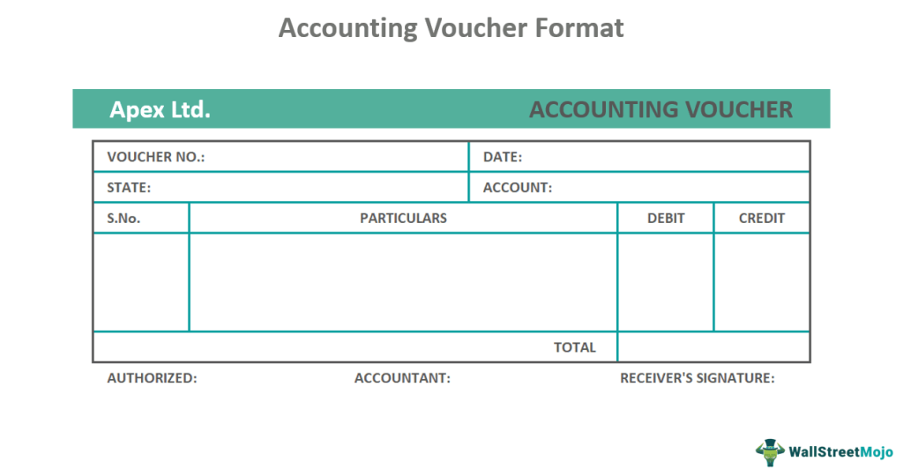

In the fast-evolving world of finance, understanding the intricacies of accounting and financial documentation is crucial for both traditional and modern trading practices. The financial industry is continually being reshaped by technological advancements, where the convergence of finance and technology is introducing transformative changes. Among these advances, algorithmic trading, often abbreviated as algo trading, stands out for its ability to revolutionize trading processes through automation and sophisticated algorithms. While algo trading offers significant advantages in terms of speed and efficiency, it also introduces a new layer of complexity, particularly regarding financial documentation, including vouchers and verification processes.

Financial documentation, the systematic recording of transactions and financial events, forms the backbone of sound accounting practices. This documentation is fundamental to ensuring transparency, accountability, and compliance with financial standards. Vouchers, as a component of documentation, serve as tangible evidence of transactions, supporting the details recorded in the accounting system. In an era where algorithmic strategies dominate trading floors, maintaining the integrity of such documentation becomes even more critical. The automated nature of algo trading necessitates stringent verification processes to ensure that every transaction is accurately recorded and compliant with regulatory frameworks.



This article explores the intersection of accounting, financial documentation, vouchers, and algorithmic trading. As financial professionals navigate this complex landscape, gaining a comprehensive understanding of these elements is essential. The integration of traditional accounting methodologies with modern algorithmic strategies requires a nuanced approach, balancing the precision of automated systems with the foundational principles of financial documentation. In an era of rapid innovation, mastering these techniques is pivotal for effective trading and financial reporting.

Our goal is to provide a comprehensive guide for finance professionals navigating this dynamic landscape. We aim to uncover how these elements—accounting, documentation, vouchers, and algorithmic trading—are interlinked and why mastery of them is essential for successful trading and financial reporting. This journey through the intricacies of modern finance will equip professionals with the insights needed to harness the potential of algorithmic trading while ensuring robustness and integrity in their financial practices.

## Table of Contents

## Understanding Financial Documentation and Vouchers

Financial documentation is a comprehensive record-keeping process that encompasses all financial transactions within an organization. It is an essential component of accounting, which ensures that financial records are accurate, complete, and compliant with various regulations. Among the critical elements of financial documentation are vouchers, which play a pivotal role in substantiating and supporting these transactions within the accounting system.

Vouchers act as evidence of financial transactions, detailing important information such as the transaction date, involved parties, and the transaction amount. They serve as a foundational element for all subsequent accounting processes. Common types of vouchers include debit, credit, and journal vouchers, each serving distinct functions:

1. **Debit Vouchers**: These are used to record transactions where money is paid out of a company, such as purchases of goods, services, or settlement of liabilities. They provide proof of payment and justify the entry made in the company's accounts.

2. **Credit Vouchers**: In contrast, credit vouchers record transactions where money is received by a company, including sales revenue, rent collection, or other forms of income. They serve as evidence of income-generating activities.

3. **Journal Vouchers**: These are used for making non-cash adjustments, corrections, or for recording entries that do not fit in the debit or credit category. This might involve accounting for depreciation, provisions, or adjustments necessary for closing financial statements at the end of an accounting period.

Proper documentation through vouchers ensures that financial records remain transparent, accurate, and compliant with accounting standards and regulatory requirements. Transparency in financial documentation facilitates trust and accountability, both internally among management and externally with stakeholders such as auditors, investors, and regulators.

Maintaining an organized financial documentation system is crucial for effective financial management and auditing. It enables companies to track and reconcile their financial transactions efficiently, reducing the risk of errors and fraud. Moreover, an orderly documentation process enhances the ability to perform internal audits, prepare for external audits, and undertake financial analysis and reporting tasks.

Organizations benefit from implemented digital solutions like enterprise resource planning (ERP) systems that automate the documentation process. These systems can streamline voucher management by generating, storing, and retrieving vouchers electronically, further increasing accuracy and reducing human intervention.

In summary, financial documentation and vouchers form the backbone of a robust accounting system, vital for transparency, compliance, and efficient financial management. A well-managed documentation system facilitates realistic financial analysis and reporting, helping organizations to achieve sound financial governance and decision-making.

## The Role of Vouchers in Accounting

Vouchers play a crucial role in the framework of accounting systems as they form the basis upon which financial transactions are recorded and verified. These documents, which may be written or electronic, capture essential information such as the transaction date, involved parties, purpose of the transaction, and the amount. This data is vital for maintaining the integrity and accuracy of financial records.

Their primary function is to serve as evidence to support the entries made in the company's [books](/wiki/algo-trading-books). Vouchers ensure that each transaction is properly authorized and legitimate before it is recorded, fostering transparency and accountability in financial management. For example, a payment voucher associated with an expense transaction will typically display the payment amount, the recipient, and a description of the expense, ensuring it is traceable and justifiable.

Vouchers are integrated into several accounting processes, including trial balances, ledgers, and balance sheets. In a trial balance, vouchers help verify that all credits and debits are accurately recorded, thus maintaining the double-entry bookkeeping system's balance. They are essential in ledger accounts, where they are used alongside journal entries to track financial activity over time. Furthermore, vouchers substantiate the figures reported in a company's balance sheet, thus protecting against discrepancies that could lead to significant financial misstatements.

Understanding the lifecycle of a voucher is imperative for accounting professionals. This lifecycle begins with the creation of the voucher at the initiation of a transaction. It is then approved, posted into the accounting system, and ultimately filed for future reference. Such meticulous management of vouchers ensures they can support audit processes and meet regulatory compliance requirements.

However, managing vouchers comes with challenges, including the potential for loss, misplacement, or unauthorized alteration. Overcoming these challenges requires the implementation of robust control systems. Best practices in voucher management include establishing standardized procedures for voucher creation and approval, utilizing digital voucher systems to prevent loss and damage, and ensuring proper authorization through multiple checks before a voucher is finalized.

Effective voucher management involves a concerted effort to maintain meticulous records, which aids in financial reporting compliance and supports strategic decision-making. As accounting continues to evolve with technological advancements, the principles of accurate voucher management remain a core aspect of maintaining reliable and reputable financial records.

## Algorithmic Trading: A New Frontier

Algorithmic trading, or algo trading, has revolutionized the finance sector by leveraging sophisticated computer algorithms to automate trading processes. This automation addresses the need for speed, efficiency, and the elimination of human error in executing trades. Algorithmic trading involves the use of pre-defined rules and complex mathematical models to determine the timing, price, and quantity of trades in financial markets. It operates on the principle of executing trades at optimal times based on patterns and data, often too complex for human traders to process instantaneously.

The primary advantages of algo trading include speed and precision, which are critical in markets where fractions of a second can significantly impact profitability. Algorithms can rapidly analyze vast datasets and execute trades at a pace far beyond human capability, thus optimizing trading decisions in real-time. This efficiency minimizes manual errors and takes advantage of short-lived market opportunities, maintaining consistency and discipline in trading strategies.

The increasing adoption of algorithmic strategies is evident across global financial markets, influencing the nature and [volume](/wiki/volume-trading-strategy) of trades executed. Indeed, it is estimated that a significant portion of equity trading volume in developed markets is driven by [algorithmic trading](/wiki/algorithmic-trading). As markets become more complex and competitive, the reliance on algorithms for quick decision-making and trade execution continues to grow, necessitating a robust understanding of their mechanisms.

Several popular trading strategies are employed within algo trading, each with its unique set of rules and objectives. Trend following is a strategy where algorithms capitalize on market trends. The algorithm might, for example, buy assets when an upward trend is identified and sell once the trend shows signs of reversing. This strategy relies on technical indicators such as moving averages to guide decisions.

Arbitrage is another key strategy, where algorithms exploit price differentials of the same asset across different markets. By simultaneously buying and selling an asset in different exchanges, traders can lock in profits from temporary discrepancies. This strategy requires high-frequency execution and precise timing, attributes where algorithms excel.

Mean reversion is based on the statistical theory that asset prices will revert to their historical mean or average over time. Algorithms utilizing this strategy identify assets that have deviated significantly from their mean price, betting on a reversal. This involves continuous monitoring and analysis of price levels to ascertain deviation points.

Understanding these strategies and their underpinning algorithms is crucial for finance professionals. Familiarity with programming languages such as Python is beneficial for developing and implementing these algorithms. Here is a simple example of a trend-following algorithm using Python and the pandas library:

```python
import pandas as pd

def moving_average_strategy(prices, window=20):
    """
    Simple moving average trading strategy.
    Buys if the price is above the moving average, sells otherwise.
    """
    prices['Moving Average'] = prices['Close'].rolling(window=window).mean()
    prices['Signal'] = 0
    prices['Signal'][window:] = np.where(prices['Close'][window:] > prices['Moving Average'][window:], 1, -1)
    return prices

prices = pd.DataFrame({'Close': [120, 119.5, 121, 122.5, 120, 118, 119, 120.5]})
result = moving_average_strategy(prices)
print(result)
```

This script calculates a 20-day moving average and generates buy/sell signals accordingly. By tailoring algorithms and leveraging such models, traders can systematically approach trading, harnessing the efficiency and reduced subjectivity offered by these technologies.

As algorithmic trading continues to evolve, it remains critical for financial professionals to grasp its foundational concepts and adaptably integrate them with traditional trading practices. Mastery of algo trading not only enhances trading efficiencies but also positions traders at the forefront of technological advancements in the financial sector.

## Integrating Financial Documentation in Algo Trading

The integration of financial documentation within algorithmic trading systems is both a challenge and an opportunity for the finance sector. As algorithmic trading automates processes and enhances trading efficiency, it necessitates sophisticated approaches to manage financial documentation accurately and transparently. This integration ensures that each trade is adequately recorded, validated, and compliant with regulatory standards, thereby safeguarding the financial system's integrity.

In automated trading systems, vouchers and financial records are managed through advanced software solutions that allow seamless processing of high-frequency transactions. Each transaction generates digital documentation, typically with metadata including the transaction time, involved parties, and transaction amount. This information is crucial for maintaining a precise and comprehensive audit trail of trading activities. The dynamic nature of algorithmic trading mandates real-time documentation, which is facilitated by high-speed computing and robust database management systems that can handle vast amounts of data efficiently.

Technological advances play a pivotal role in documenting and verifying trades in real-time. Blockchain technology, for instance, offers immutable ledgers where each transaction is timestamped and stored across a decentralized network, enhancing transparency and security. By leveraging smart contracts, automated checks can ensure that trades comply with predefined parameters and regulatory requirements before execution. 

Fintech innovations have further streamlined the integration of financial documentation in algorithmic trading. Tools that leverage [artificial intelligence](/wiki/ai-artificial-intelligence) and [machine learning](/wiki/machine-learning) algorithms can predict anomalies or discrepancies within financial records, minimizing the need for manual oversight and reducing the potential for error. These technologies also enable predictive analytics, improving decision-making processes and trade strategies.

One critical aspect of integrating financial documentation in algo trading is aligning traditional accounting practices with digital innovations. This alignment guarantees robust governance and accountability, as it preserves the foundational principles of financial record-keeping while embracing new technological possibilities. Modern accounting platforms now feature APIs (Application Programming Interfaces) that allow integration with algorithmic trading systems, ensuring that data flows seamlessly between trading platforms and accounting systems. This integration facilitates real-time financial analysis and reporting, enhancing the strategic capabilities of financial professionals.

In conclusion, the fusion of financial documentation processes with algorithmic trading systems reflects a broader trend of digitization in the financial sector. By adopting cutting-edge technologies and practices, financial professionals can ensure that they maintain the rigorous documentation standards necessary for compliance and transparency while harnessing the advantages of automated trading systems.

## Challenges and Opportunities in Accounting for Algo Trading

In the increasingly automated world of finance, algorithmic trading presents both intricate challenges and substantial opportunities for accountants. One of the primary challenges is the management of large volumes of data generated by high-frequency trading. This data must be accurately captured, analyzed, and reported, which necessitates robust data management systems. The integration of these systems with existing accounting frameworks can be complex, requiring seamless synchronization between trading algorithms and financial reporting protocols. Effective system integration ensures that all trades are reflected accurately in financial documentation, a critical aspect for maintaining compliance and transparency.

Regulatory compliance poses another significant challenge. Regulations such as the Markets in Financial Instruments Directive II (MiFID II) in Europe and the Dodd-Frank Act in the United States have established stringent reporting and documentation requirements for algorithmic trading. These regulations mandate comprehensive record-keeping, transparency in trading activities, and the ability to audit trading algorithms. As a result, accountants must be well-versed in both financial regulations and the technical aspects of algorithmic trading to ensure adherence to these legal standards.

Despite these challenges, algorithmic trading offers opportunities to enhance financial accounting accuracy, efficiency, and compliance. The utilization of advanced technologies such as artificial intelligence (AI) and machine learning can significantly streamline the accounting processes associated with algorithmic trading. These technologies enable the automation of routine tasks, reduce the likelihood of human error, and allow for real-time data analysis and reporting. For example, AI-based systems can automatically categorize and match trading transactions with corresponding vouchers, improving the speed and accuracy of financial documentation.

Adopting these technologies requires accountants to engage in ongoing education to enhance their technological acumen. Staying updated with the latest advancements in financial technology and regulatory changes is essential for accountants to remain effective in this rapidly evolving landscape. Professional development programs focusing on the intersection of technology and accounting are crucial for equipping finance professionals with the necessary skills to manage the complexities of algorithmic trading.

The demand for skilled professionals who can merge accounting expertise with technological knowledge is on the rise. Accountants who possess a strong understanding of both areas are valuable assets to financial institutions engaged in algorithmic trading. This growing demand underscores the importance of fostering a workforce adept in both traditional accounting practices and cutting-edge technological innovations.

In summary, while the integration of algorithmic trading into financial accounting practices presents formidable challenges, it also provides significant opportunities for those willing to adapt and embrace technological advancements. Mastery in this area not only enhances compliance and efficiency but also positions finance professionals to drive transformative changes within the industry.

## Conclusion

Mastering the intricacies of accounting, financial documentation, and algorithmic trading is crucial for finance professionals today. The synthesis of traditional accounting practices with modern trading methodologies, such as algorithmic trading, creates a dynamic landscape filled with both challenges and opportunities. Algorithmic trading necessitates robust financial documentation practices to ensure transactions are transparent, accurate, and in compliance with regulatory frameworks. Vouchers play a key role in this process, providing systematic evidence for financial transactions and facilitating accurate record-keeping.

In this technology-driven environment, adapting to new advancements is imperative while maintaining core principles of accounting. This includes integrating digital tools and fintech solutions to enhance the precision and efficiency of financial documentation and voucher management. Technologies such as blockchain and artificial intelligence offer promising avenues for improving transaction verification processes and real-time data management, supporting the seamless integration of documentation within algorithmic trading frameworks.

As financial markets continue to evolve, embracing these technological changes will empower finance professionals to stay ahead. The ability to combine accounting expertise with technological acumen is increasingly in demand, providing professionals the capability to navigate complex financial landscapes effectively. By embracing innovation while upholding rigorous financial standards, finance professionals can excel in their careers and play pivotal roles in driving financial success. This balanced approach ensures resilience and adaptability in the face of ongoing market innovations.

## References & Further Reading

[1]: ["Advances in Financial Machine Learning"](https://www.amazon.com/Advances-Financial-Machine-Learning-Marcos/dp/1119482089) by Marcos Lopez de Prado

[2]: Doyle, T. M., & Corley, S. P. (2017). ["Algorithmic Trading and Financial Regulation: A Substantial Transformation."](https://onlinelibrary.wiley.com/doi/abs/10.1002/pfi.21735) Stanford Journal of Law, Business & Finance.

[3]: ["Quantitative Trading: How to Build Your Own Algorithmic Trading Business"](https://www.amazon.com/Quantitative-Trading-Build-Algorithmic-Business/dp/1119800064) by Ernest P. Chan

[4]: Pardo, R. (2008). ["The Evaluation and Optimization of Trading Strategies."](https://onlinelibrary.wiley.com/doi/book/10.1002/9781119196969) Wiley.

[5]: ["Machine Learning for Algorithmic Trading"](https://github.com/PacktPublishing/Machine-Learning-for-Algorithmic-Trading-Second-Edition) by Stefan Jansen