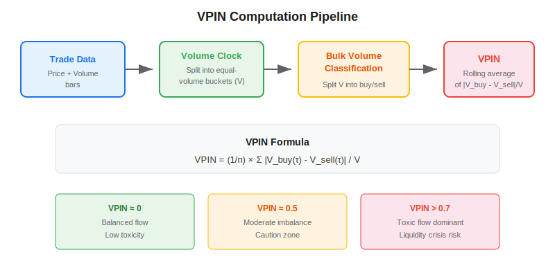
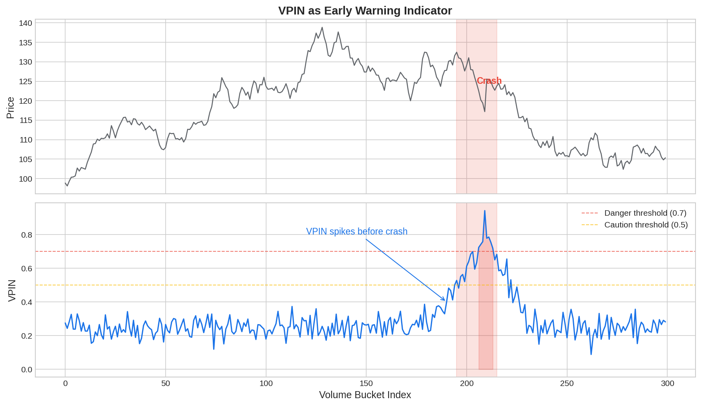

VPIN (Volume-Synchronized Probability of Informed Trading) is a market microstructure metric developed by Easley, Lopez de Prado, and O'Hara (2012) that estimates the probability of informed trading in real time. Unlike traditional time-based metrics, VPIN operates on a **volume clock** — it synchronizes data sampling with market activity, making it robust to the irregular pace of real-world trading. VPIN is best known for having produced a warning signal hours before the 2010 Flash Crash, and is now used by market makers, HFT firms, and regulators to monitor order flow toxicity.

## What Is VPIN?

The core idea behind VPIN comes from the PIN (Probability of Informed Trading) model of Easley and O'Hara (1996). In any market, trades come from two types of participants: **informed traders** who have private information about future prices, and **uninformed traders** who trade for liquidity, rebalancing, or other non-informational reasons. When informed traders dominate order flow, market makers face adverse selection losses — they are systematically buying at too high a price or selling at too low a price. This "toxic" flow eventually forces market makers to widen spreads or exit the market, which can trigger liquidity crises.

VPIN measures this toxicity by looking at the imbalance between buy volume and sell volume across equal-volume buckets:

$$\text{VPIN} = \frac{1}{n} \sum_{\tau=1}^{n} \frac{|V^B_\tau - V^S_\tau|}{V}$$

where $V$ is the fixed bucket size, $V^B_\tau$ and $V^S_\tau$ are the buy and sell volumes in bucket $\tau$, and $n$ is the number of buckets in the rolling window.



## How VPIN Works

### Step 1: Volume Bucketing

Instead of grouping trades into time bars (e.g., one bar per minute), VPIN groups trades into **volume buckets** of fixed size $V$. This is the "volume clock" — each bucket contains exactly $V$ shares traded, regardless of how long that took in wall-clock time. During high-activity periods, buckets fill quickly; during quiet periods, they fill slowly. This normalization ensures each bucket carries roughly the same amount of information.

### Step 2: Bulk Volume Classification (BVC)

Traditional trade classification (tick rule, Lee-Ready) assigns each individual trade as a buy or sell. VPIN uses a simpler, aggregate approach called Bulk Volume Classification. For each bar within a bucket, the fraction classified as "buy" is:

$$V^B = V \cdot Z\left(\frac{\Delta P}{\sigma_{\Delta P}}\right)$$

where $\Delta P$ is the price change over the bar, $\sigma_{\Delta P}$ is the standard deviation of price changes, and $Z(\cdot)$ is the standard normal CDF. The remainder is classified as sell: $V^S = V - V^B$. This avoids the need for tick-level trade data — only bar OHLCV data is required.

### Step 3: Rolling VPIN

Average the bucket-level imbalance over a rolling window of $n$ buckets to get the VPIN estimate. The window size controls the responsiveness-noise tradeoff.



## Python Implementation

```python
import numpy as np
import pandas as pd
from scipy.stats import norm

def compute_vpin(prices, volumes, bucket_size, n_buckets=50):
    """
    Compute VPIN from price and volume bar data.

    Parameters
    ----------
    prices : pd.Series
        Close prices for each bar.
    volumes : pd.Series
        Volume for each bar.
    bucket_size : float
        Target volume per bucket (V).
    n_buckets : int
        Rolling window length in buckets.

    Returns
    -------
    pd.Series
        VPIN values indexed by bucket number.
    """
    # Bulk Volume Classification
    dp = prices.diff()
    sigma = dp.rolling(20).std()
    z_scores = dp / sigma.replace(0, np.nan)
    buy_frac = z_scores.apply(norm.cdf)

    buy_vol = volumes * buy_frac
    sell_vol = volumes * (1 - buy_frac)

    # Aggregate into volume buckets
    cum_vol = volumes.cumsum()
    bucket_ids = (cum_vol / bucket_size).astype(int)

    bucket_buy = buy_vol.groupby(bucket_ids).sum()
    bucket_sell = sell_vol.groupby(bucket_ids).sum()
    bucket_total = volumes.groupby(bucket_ids).sum()

    # Compute imbalance per bucket
    imbalance = (bucket_buy - bucket_sell).abs() / bucket_total

    # Rolling VPIN
    vpin = imbalance.rolling(n_buckets).mean()

    return vpin.dropna()


# Example with simulated data
np.random.seed(42)
n = 5000
returns = np.random.normal(0, 0.001, n)
# Inject informed trading period
returns[3000:3100] -= 0.003  # persistent selling pressure
prices = pd.Series(100 * np.cumprod(1 + returns))
volumes = pd.Series(np.random.poisson(1000, n).astype(float))
volumes[3000:3100] *= 3  # volume spike

vpin = compute_vpin(prices, volumes, bucket_size=20000, n_buckets=50)
print(f"Mean VPIN: {vpin.mean():.3f}")
print(f"Max VPIN: {vpin.max():.3f}")
print(f"VPIN at crisis bucket: {vpin.iloc[int(3050/4)]:.3f}")
```

## Key Parameters

| Parameter | Typical Range | Effect |
|---|---|---|
| Bucket size ($V$) | Varies by instrument | Too small → noisy buckets; too large → slow updates. Target ~50 buckets per day |
| Rolling window ($n$) | 30 – 100 buckets | Fewer buckets → more responsive but noisier; more → smoother but lagged |
| BVC sigma window | 10 – 50 bars | Lookback for normalizing price changes in the CDF step |

The correct bucket size depends on the instrument's average daily volume. For liquid futures like the E-mini S&P 500, bucket sizes of around $\frac{1}{50}$ of average daily volume work well, producing roughly 50 buckets per session.

## Applications of VPIN

VPIN has found practical use across several domains in quantitative trading:

- **Market making:** When VPIN rises above a threshold, market makers widen their bid-ask spreads to protect against informed flow. This is directly related to [Kyle's Lambda](https://paperswithbacktest.com/wiki/kyles-lambda), which measures the price impact of order flow.
- **Risk management:** Portfolio managers monitor VPIN as an early warning of liquidity crises. A persistent rise in VPIN preceded the 2010 Flash Crash by several hours.
- **Trading signals:** VPIN spikes can signal upcoming volatility. Strategies that reduce exposure or hedge when VPIN is elevated have shown improved risk-adjusted returns.
- **Regulatory surveillance:** Exchanges and regulators use VPIN-like metrics to detect unusual market activity and potentially trigger circuit breakers.

## Limitations and Risks

VPIN is not without controversy. Andersen and Bondarenko (2014) challenged the Flash Crash prediction claim, arguing that the result was sensitive to parameter choices and that simpler volatility measures performed comparably. The Bulk Volume Classification step also introduces approximation error — in markets with large bid-ask spreads, BVC can misclassify volume direction. Additionally, VPIN's absolute level is not directly interpretable without calibration: what constitutes "high" VPIN varies by instrument, time period, and market regime. The CDF of VPIN values is more informative than raw levels.

## Conclusion

VPIN bridges the gap between academic microstructure theory and practical trading. By operating on a volume clock and using bulk classification, it provides a real-time estimate of informed trading activity that is simpler to compute than the original PIN model. For anyone working with [tick data](https://paperswithbacktest.com/wiki/tick-data) or building [high-frequency trading systems](https://paperswithbacktest.com/wiki/high-frequency-trading-ii-limit-order-book), VPIN is an essential metric for monitoring order flow toxicity and managing adverse selection risk.

---

**Explore further on PapersWithBacktest:**
- Browse [backtested microstructure strategies](https://paperswithbacktest.com/strategies) with Python code and performance metrics
- Access [clean historical market data](https://paperswithbacktest.com/datasets) for equities, crypto, and futures
- Take the [algo trading course](https://paperswithbacktest.com/course) — 60+ video lessons and notebooks
- Related wiki pages: [Kyle's Lambda](https://paperswithbacktest.com/wiki/kyles-lambda) · [Tick Imbalance Bars](https://paperswithbacktest.com/wiki/tick-imbalance-bars-tibs) · [Tick Data](https://paperswithbacktest.com/wiki/tick-data)
