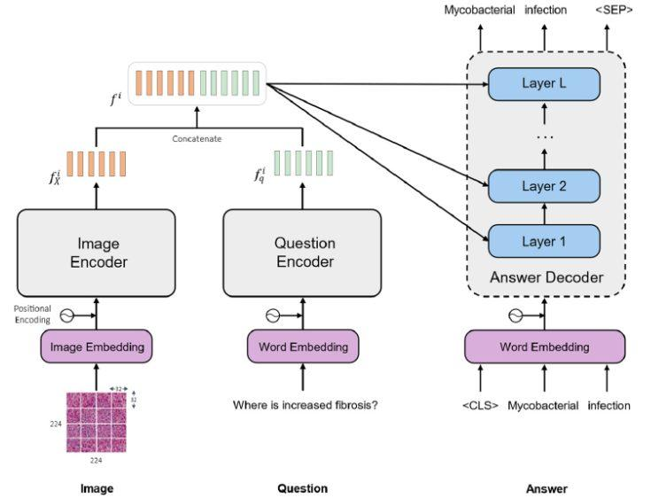

## Table of Contents

## What is Visual Question Answering (VQA) and how does it work?

Visual Question Answering (VQA) is a technology that combines computer vision and natural language processing to answer questions about images. It works by taking an image and a question about that image as inputs, and then producing an answer based on what it understands from both. For example, if you show VQA a picture of a dog and ask, "What is in the picture?", it might answer, "A dog."

The process of VQA involves several steps. First, the system uses computer vision techniques to analyze the image and identify objects, scenes, and other visual elements. Then, it uses natural language processing to understand the question being asked. Finally, it combines the information from the image analysis and the question to generate an appropriate answer. This requires the system to have a good understanding of both visual and textual data, making it a challenging but exciting area of research and development.

## What are the basic components of a VQA model?

A VQA model has three main parts: the image processing part, the question processing part, and the answer generation part. The image processing part uses computer vision to look at the picture and find things like objects, colors, and scenes. It turns the picture into numbers that a computer can understand. The question processing part uses natural language processing to understand the words in the question. It breaks down the question into smaller parts and figures out what the question is asking about.

The answer generation part is where the magic happens. It takes the information from the image and the question and combines them to come up with an answer. This part needs to know how to connect what it sees in the picture with what the question is asking. Sometimes, it uses a special kind of math called a [neural network](/wiki/neural-network) to help it make the best guess about the answer. The whole process is like a team effort where each part does its job to help answer the question about the picture.

## Can you explain the difference between single-modal and multi-modal VQA models?

Single-modal VQA models focus on one type of data at a time. For example, they might only look at the picture or only read the question, but not both together. These models are simpler because they don't have to deal with combining different kinds of information. They might use computer vision to understand the picture and then try to answer questions based on what they see. Or, they might use natural language processing to understand the question and then guess the answer without looking at the picture.

Multi-modal VQA models, on the other hand, use both the picture and the question together to come up with an answer. They have to figure out how to connect what they see in the picture with what the question is asking. This makes them more complicated but also more powerful because they can use all the information available. Multi-modal models often use special techniques to mix the data from the picture and the question, like attention mechanisms that help focus on the important parts of both. This allows them to give more accurate and detailed answers.

## What is the Hydra VQA model and how does it differ from other models?

The Hydra VQA model is a special kind of multi-modal VQA model that tries to answer questions about pictures in a smart way. It's called "Hydra" because it can handle many different types of questions and pictures at the same time, kind of like the many heads of a hydra in mythology. The main idea behind Hydra is to use a lot of different parts, or "heads," to look at the picture and the question from many angles. This helps it understand the picture and the question better and come up with the right answer.

What makes Hydra different from other VQA models is how it uses these many heads to work together. Instead of just looking at the picture and the question once, Hydra breaks them down into smaller pieces and looks at them many times. This way, it can catch details that other models might miss. For example, if you ask Hydra about the color of a dog in a picture, it will look at the dog from different angles and make sure it's giving the right answer. This makes Hydra more accurate and able to handle trickier questions than other models.

## How does the MODERN VQA model approach the task of answering questions about images?

The MODERN VQA model is another smart way to answer questions about pictures. It's designed to understand both the picture and the question really well before coming up with an answer. MODERN stands for "Multi-Objective DEep Reasoning Network," which means it uses a lot of different goals to figure out the answer. It looks at the picture to find important things like objects and scenes, and it reads the question to understand what you're asking. Then, it uses a special kind of math called a neural network to mix the information from the picture and the question together.

What makes MODERN different is that it tries to answer the question in steps. Instead of jumping straight to the answer, it breaks the problem into smaller parts and solves them one by one. This helps MODERN understand the picture and the question in more detail and come up with a more accurate answer. For example, if you ask about the color of a dog in a picture, MODERN will first find the dog, then check its color, and finally tell you the answer. This step-by-step approach makes MODERN good at handling complicated questions and giving detailed answers.

## What role does the HYDRA (VL4AI) model play in advancing VQA technology?

The HYDRA (VL4AI) model plays a big role in making Visual Question Answering (VQA) technology better. It's special because it uses a lot of different parts, or "heads," to look at pictures and questions from many angles. This helps HYDRA understand the picture and the question in a deeper way. By looking at things many times, HYDRA can catch details that other models might miss. This makes it more accurate and able to handle trickier questions. For example, if you ask HYDRA about the color of a dog in a picture, it will look at the dog from different angles and make sure it's giving the right answer.

HYDRA's approach is different from other models because it breaks down the picture and the question into smaller pieces and looks at them many times. This step-by-step way of understanding helps HYDRA give more detailed and correct answers. It's like having many experts working together to solve a puzzle. By using this method, HYDRA helps move VQA technology forward by making it smarter and more useful for answering all kinds of questions about pictures.

## How does the U-CAM model incorporate uncertainty in its VQA predictions?

The U-CAM model is special because it thinks about how sure it is when answering questions about pictures. It uses something called "uncertainty" to help it decide if its answer is probably right or if it's not so sure. When U-CAM looks at a picture and a question, it doesn't just give one answer. Instead, it gives a few possible answers and says how sure it is about each one. This helps people know if they can trust the answer or if they need to look at the picture more closely.

U-CAM uses a smart way to figure out how sure it is. It looks at the picture and the question many times, each time trying to understand them a bit differently. By doing this, it can see if the answers stay the same or if they change a lot. If the answers are mostly the same, U-CAM feels more sure about its answer. But if the answers change a lot, it knows it's not very sure. This helps U-CAM give better answers because it can tell people when it's guessing and when it's pretty sure it's right.

## What are the common datasets used for training and evaluating VQA models?

Common datasets used for training and evaluating Visual Question Answering (VQA) models include the VQA dataset, COCO-QA, and Visual7W. The VQA dataset is one of the most popular ones, with lots of pictures from the COCO dataset and questions about them. People have written answers to these questions, so the model can learn from them. COCO-QA is another big dataset that also uses pictures from COCO, but it has different questions that are made to test how well the model can understand the pictures. Visual7W is special because it has questions that start with "what," "where," "when," "who," "why," "how," and "which," helping the model learn to answer different kinds of questions.

These datasets help researchers see how good their VQA models are. They use them to train the models by showing them lots of pictures and questions, and then they check how well the models can answer new questions about new pictures. This helps them make the models better and better. By using these datasets, researchers can make sure their VQA models are smart enough to understand all sorts of pictures and answer all sorts of questions about them.

## How do you measure the performance of VQA models, and what metrics are typically used?

To measure how well Visual Question Answering (VQA) models work, researchers use special numbers called metrics. These metrics help them see if the model's answers are right and how good they are. One common metric is accuracy, which checks how often the model's answer matches the right answer. Another important metric is the VQA accuracy score, which is a bit more complicated. It gives the model points based on how many people agree with its answer. The formula for the VQA accuracy score is $$ \text{VQA Accuracy} = \min \left( \frac{\text{Number of people who gave the answer}}{3}, 1 \right) $$. This means the model gets full credit if at least three people agree with its answer.

Besides accuracy, researchers also look at other things like how well the model understands different kinds of questions and pictures. They might use metrics like the F1 score, which looks at both how correct the model is and how complete its answers are. Another useful metric is the BLEU score, which checks how similar the model's answer is to the right answer, kind of like comparing sentences. By using these different metrics, researchers can get a full picture of how well a VQA model is doing and where it needs to improve.

## What are some of the challenges faced when developing and deploying VQA models?

Developing and deploying Visual Question Answering (VQA) models comes with many challenges. One big challenge is understanding the picture and the question correctly. Pictures can be complicated, with lots of things happening at once, and questions can be tricky, asking about small details or needing a lot of thinking to answer. VQA models need to be smart enough to figure out what's important in the picture and what the question is really asking. This is hard because the model has to learn from lots of examples and still get it right when it sees something new.

Another challenge is making sure the model works well for everyone. VQA models are trained on big datasets, but these datasets might not include pictures and questions from all kinds of people and places. This can make the model less good at answering questions about things it hasn't seen before. Also, deploying the model means making it fast and easy to use, which can be tough because VQA models need a lot of computer power to work. Researchers have to find ways to make the models smaller and faster without losing their smarts. By working on these challenges, they can make VQA models better and more useful for everyone.

## Can you discuss any recent advancements or state-of-the-art techniques in VQA?

Recent advancements in Visual Question Answering (VQA) include the development of more sophisticated multi-modal models that can better understand both the picture and the question. One exciting technique is the use of transformer architectures, which have been very successful in natural language processing. These models can look at the picture and the question together and figure out which parts are important for answering the question. This helps them give more accurate answers, even for complicated questions. For example, the Vision Transformer (ViT) and BERT-like models have been adapted for VQA tasks, showing big improvements in understanding and answering questions about images.

Another state-of-the-art technique is the use of attention mechanisms, which help the model focus on the right parts of the picture and the question. By using attention, the model can weigh different parts of the image and the text differently, which helps it understand the context better. For instance, if you ask about the color of a dog in a picture, the model can use attention to zoom in on the dog and ignore other things in the picture. This makes the model's answers more precise. These advancements are making VQA models smarter and more useful, helping them handle a wider range of questions and images.

## How might future developments in VQA models impact other fields of AI and machine learning?

Future developments in Visual Question Answering (VQA) models could have a big impact on other parts of AI and [machine learning](/wiki/machine-learning). As VQA models get better at understanding pictures and questions, they can help improve other technologies that use both pictures and words. For example, in robotics, smarter VQA models could help robots understand their surroundings better by answering questions about what they see. This could make robots more useful in places like homes and hospitals. Also, in healthcare, VQA models could help doctors by answering questions about medical images, making it easier to find problems and decide on treatments.

Another way VQA could affect other fields is by helping to make better language models. Since VQA models need to understand both pictures and words, they can teach language models how to connect what they see with what they read. This could make language models better at understanding the world around them. For example, if a language model can use what it learns from VQA to understand pictures, it could give better answers to questions about real-life situations. This could help in areas like education, where smart language models could explain things using both words and pictures, making learning easier and more fun.

## References & Further Reading

[1]: Antol, S., Agrawal, A., Lu, J., Mitchell, M., Batra, D., Zitnick, C. L., & Parikh, D. (2015). ["VQA: Visual Question Answering."](https://arxiv.org/abs/1505.00468) Proceedings of the IEEE International Conference on Computer Vision (ICCV).

[2]: Goyal, Y., Khot, T., Summers-Stay, D., Batra, D., & Parikh, D. (2017). ["Making the V in VQA Matter: Elevating the Role of Image Understanding in Visual Question Answering."](https://arxiv.org/abs/1612.00837) Proceedings of the IEEE Conference on Computer Vision and Pattern Recognition (CVPR).

[3]: Tan, H., & Bansal, M. (2019). ["LXMERT: Learning Cross-Modality Encoder Representations from Transformers."](https://aclanthology.org/D19-1514/) Proceedings of the 2019 Conference on Empirical Methods in Natural Language Processing (EMNLP).

[4]: Johnson, J., Krishna, R., Stark, M., Li, L. J., Shamma, D. A., Bernstein, M. S., & Fei-Fei, L. (2015). ["Image Retrieval using Scene Graphs."](https://openaccess.thecvf.com/content_cvpr_2015/papers/Johnson_Image_Retrieval_Using_2015_CVPR_paper.pdf) Proceedings of the IEEE International Conference on Computer Vision (ICCV).

[5]: Lu, J., Yang, J., Batra, D., & Parikh, D. (2016). ["Hierarchical Question-Image Co-Attention for Visual Question Answering."](https://arxiv.org/abs/1606.00061) Advances in Neural Information Processing Systems 29 (NeurIPS).

[6]: Kim, J.-H., Jun, J., & Zhang, B.-T. (2018). ["Bilinear Attention Networks."](https://arxiv.org/abs/1805.07932) International Conference on Learning Representations (ICLR).