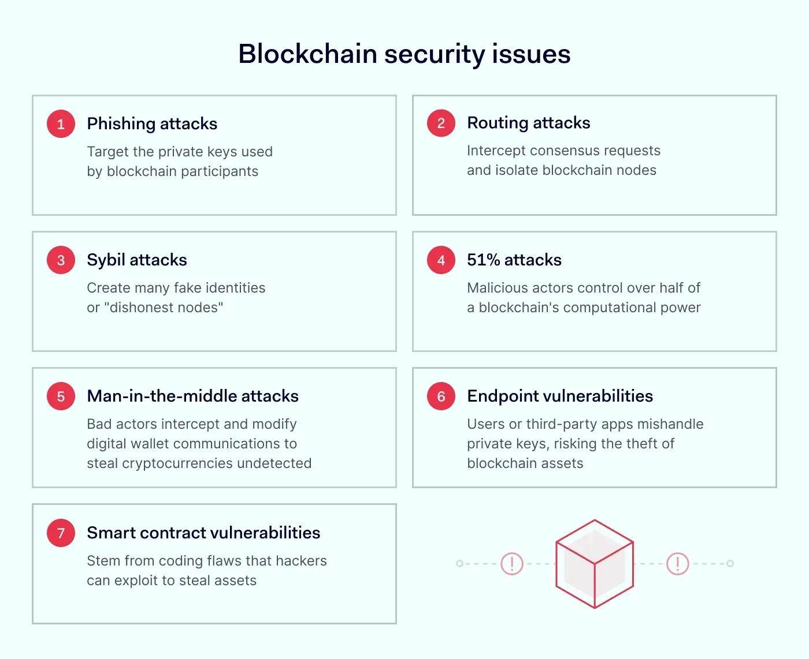

## Table of Contents

## What is cryptocurrency and why is security important?

Cryptocurrency is a type of digital money that you can use to buy things online. It's different from regular money because it's not controlled by banks or governments. Instead, it uses a technology called blockchain, which is like a big, secure notebook that keeps track of all the transactions. Some popular cryptocurrencies are Bitcoin and Ethereum. You can store your cryptocurrency in a digital wallet and use it to pay for things or trade it like you would with stocks.

Security is really important when it comes to cryptocurrency because it's all digital. If someone hacks into your digital wallet, they can steal your cryptocurrency, and there's no bank to help you get it back. That's why people use strong passwords, special security devices, and other ways to keep their cryptocurrency safe. Without good security, you could lose all your digital money, so it's crucial to take steps to protect it.

## What are the most common types of vulnerabilities in cryptocurrency systems?

The most common types of vulnerabilities in cryptocurrency systems are often related to software bugs and human errors. Software bugs can happen in the code that runs the cryptocurrency, like in the blockchain or in the wallet software. These bugs can be exploited by hackers to steal money or disrupt the system. For example, a bug might let someone spend the same cryptocurrency twice, which is called a double-spending attack. Human errors are also a big problem, like when people use weak passwords or fall for phishing scams where hackers trick them into giving away their private keys.

Another common vulnerability is in the way [cryptocurrency](/wiki/cryptocurrency) exchanges work. These are websites where people can buy, sell, or trade cryptocurrencies. If the exchange's security is not strong enough, hackers can break in and steal a lot of cryptocurrency at once. This has happened many times in the past, leading to big losses for users. Also, smart contracts, which are like automatic agreements on the blockchain, can have vulnerabilities. If the code in a smart contract has a mistake, it can be exploited, causing people to lose their money.

Overall, keeping cryptocurrency safe involves fixing software bugs, being careful with personal security, and making sure exchanges and smart contracts are secure. It's important for everyone involved to stay alert and keep learning about new ways to protect their digital money.

## How do phishing attacks target cryptocurrency users?

Phishing attacks target cryptocurrency users by tricking them into giving away their private keys or login information. Hackers send emails or messages that look like they come from a real cryptocurrency exchange or wallet provider. These messages might say there's a problem with your account or that you need to confirm a transaction. If you click on a link in the message, it takes you to a fake website that looks just like the real one. If you enter your information on this fake site, the hackers can steal your cryptocurrency.

Another way phishing attacks work is through social media and messaging apps. Hackers might pretend to be a friend or someone you trust and ask you to send them cryptocurrency or click on a link. They might promise to double your money or offer a special deal. It's easy to fall for these tricks because they seem to come from people you know. Always be careful and check who is really sending the message before you do anything with your cryptocurrency.

## What is a 51% attack and how does it affect cryptocurrency security?

A 51% attack happens when a group of people control more than half of the power in a cryptocurrency's network. This power comes from the computers that help run the cryptocurrency, called miners. If these people control more than half, they can change the rules and do things like spend the same cryptocurrency twice or stop other people from making transactions. This is a big problem because it breaks the trust that the cryptocurrency is safe and fair.

When a 51% attack happens, it can really hurt the cryptocurrency. People might lose trust in it and stop using it, which can make its value go down. Also, if someone can spend the same cryptocurrency twice, it's like stealing money from others. This makes the whole system less secure and can scare people away from using that cryptocurrency. That's why it's important for a cryptocurrency to have a lot of different miners so no one group can take over.

## How can private key management lead to vulnerabilities?

Private key management can lead to vulnerabilities if people don't keep their keys safe. A private key is like a secret password that lets you use your cryptocurrency. If someone else finds out your private key, they can take all your cryptocurrency. People sometimes write down their private keys or save them on their computer, but if someone steals that information, they can steal the cryptocurrency too. It's important to keep private keys in a very safe place, like a hardware wallet, which is a special device that keeps your keys secure.

Another way private key management can be a problem is if people use the same key for many different things. If one account gets hacked, all the other accounts using that key are at risk too. Also, if someone loses their private key, they can't use their cryptocurrency anymore. There's no way to get a new key or get the cryptocurrency back. That's why it's a good idea to use different keys for different accounts and to back up your keys in a safe place, but not where anyone else can find them.

## What are smart contract vulnerabilities and how can they be exploited?

Smart contract vulnerabilities are mistakes or weaknesses in the code that runs automatic agreements on the blockchain. These agreements, called smart contracts, are supposed to work like a vending machine: you put in your money, and it gives you what you paid for. But if there's a mistake in the code, someone can trick the smart contract into giving them more than they should get or taking money from others. For example, a common mistake is not checking if someone has enough money before letting them take something, which can let them take more than they paid for.

These vulnerabilities can be exploited by hackers who find the mistakes in the code and use them to steal money or cause problems. One famous example is the DAO hack, where hackers found a way to take money out of a smart contract over and over again, even though they shouldn't have been able to. This caused a lot of people to lose their money. To stop this from happening, people who write smart contracts need to test them a lot and have other experts check the code to find and fix any mistakes before the smart contract is used for real.

## How do exchange hacks occur and what are their impacts?

Exchange hacks happen when hackers break into a cryptocurrency exchange's website or system. They do this by finding weak spots in the exchange's security, like using stolen passwords or finding bugs in the software. Once they get in, they can steal a lot of cryptocurrency at once because exchanges hold a lot of people's money. Sometimes, hackers use tricks like phishing to get people's login information, or they might find a way to change the exchange's records to make it look like they have more cryptocurrency than they really do.

When an exchange gets hacked, it can cause big problems. People who had their cryptocurrency on the exchange can lose all their money, and there's no way to get it back. This makes people lose trust in the exchange and sometimes in cryptocurrency in general. The exchange might have to close down or lose a lot of customers. The value of the cryptocurrency might go down too, because people get scared and sell their cryptocurrency. It's important for exchanges to have strong security to stop these hacks from happening and to keep people's money safe.

## What role does software and hardware wallet security play in protecting cryptocurrencies?

Software and hardware wallets are important tools for keeping your cryptocurrencies safe. A software wallet is like a program on your computer or phone where you can store your cryptocurrency. It's easy to use, but it can be risky if your device gets a virus or if someone hacks into it. That's why it's important to use strong passwords and keep your software wallet up to date. A hardware wallet is a small device that you can plug into your computer. It's like a safe for your cryptocurrency because it keeps your private keys offline, which makes it much harder for hackers to steal your money.

Both types of wallets help protect your cryptocurrency in different ways. Software wallets are good because you can use them anytime and anywhere, but you need to be careful about security. You should always download them from trusted sources and use antivirus software. Hardware wallets are even safer because they don't connect to the internet all the time, so hackers can't get to them easily. But you need to keep the hardware wallet itself safe and make sure you don't lose it. By using these wallets correctly, you can keep your cryptocurrency secure and enjoy using digital money without worrying too much about losing it.

## How can social engineering be used to compromise cryptocurrency security?

Social engineering is when hackers trick people into giving away their private information, like passwords or private keys, to steal their cryptocurrency. They might send fake emails that look like they come from a real cryptocurrency exchange, saying there's a problem with your account or you need to confirm a transaction. If you click on a link in the email, it takes you to a fake website that looks just like the real one. If you enter your information on this fake site, the hackers can steal your cryptocurrency. They can also pretend to be someone you know on social media or messaging apps, asking you to send them cryptocurrency or click on a link. It's easy to fall for these tricks because they seem to come from people you trust.

To protect yourself from social engineering, always be careful with emails and messages that ask for your personal information or money. Check who is really sending the message before you do anything. Use strong, unique passwords for your cryptocurrency accounts and never share your private keys with anyone. It's also a good idea to use two-[factor](/wiki/factor-investing) authentication, which adds an extra layer of security by requiring a code sent to your phone before you can log in. By being careful and using these security measures, you can keep your cryptocurrency safe from social engineering attacks.

## What advanced cryptographic techniques can be used to enhance security in cryptocurrencies?

One advanced cryptographic technique that can help make cryptocurrencies more secure is called zero-knowledge proofs. This technique lets you prove something is true without giving away any extra information. For example, you can prove you have enough money to make a transaction without showing how much money you actually have. This makes it harder for hackers to steal your information because they can't see your private details. It also helps keep transactions private, which is important for people who want to use cryptocurrency without others knowing what they're doing.

Another technique is called multi-signature wallets, or multisig for short. This means that more than one person needs to agree before any money can be moved from a wallet. It's like having a bank account that needs two or more signatures to take out money. This makes it much harder for hackers to steal your cryptocurrency because they would need to trick more than one person to get the money. It's also useful for businesses or groups where different people need to approve spending. By using these advanced techniques, people can feel safer using cryptocurrencies and protect their digital money better.

## How do regulatory frameworks address vulnerabilities in cryptocurrency security?

Regulatory frameworks help make cryptocurrencies safer by setting rules that companies and people have to follow. These rules can say things like exchanges need to have strong security to protect people's money. They might also say that companies need to check who their customers are to stop bad people from using cryptocurrencies for illegal things. By making these rules, governments can help stop some of the common problems with cryptocurrencies, like hacks and scams. This makes people feel safer using digital money and can help more people trust and use cryptocurrencies.

Regulations also help by making sure that if something goes wrong, like an exchange getting hacked, there are ways to help people get their money back. For example, some rules might say that exchanges need to have insurance to cover losses if they get hacked. This can make a big difference because it means people might not lose all their money if something bad happens. Overall, regulatory frameworks try to make the world of cryptocurrencies safer and more fair for everyone, even though it can be hard to keep up with all the new ways people use digital money.

## What are the emerging trends in cryptocurrency security and how are they addressing new vulnerabilities?

One big trend in cryptocurrency security is the use of decentralized finance, or DeFi, which is like banking but without a central bank. DeFi uses smart contracts to let people lend, borrow, and trade cryptocurrencies directly with each other. To make DeFi safer, people are working on better ways to check smart contracts for mistakes before they are used. They are also using new kinds of security checks, like formal verification, which is a way to prove that the code will work correctly. This helps stop hackers from finding and using mistakes in the code to steal money.

Another trend is the use of privacy-focused cryptocurrencies and technologies. These are designed to keep transactions private so that no one can see what you're doing with your money. For example, some cryptocurrencies use techniques like ring signatures or zero-knowledge proofs to hide who is sending and receiving money. This makes it harder for hackers to target specific people or steal their information. By focusing on privacy and better smart contract security, these trends are helping to make cryptocurrencies safer and more trustworthy for everyone.

## References & Further Reading

[1]: Narayanan, A., Bonneau, J., Felten, E., Miller, A., & Goldfeder, S. (2016). ["Bitcoin and Cryptocurrency Technologies: A Comprehensive Introduction"](https://press.princeton.edu/books/hardcover/9780691171692/bitcoin-and-cryptocurrency-technologies). Princeton University Press.

[2]: Antonopoulos, A. M. (2017). ["Mastering Bitcoin: Unlocking Digital Cryptocurrencies"](https://books.google.com/books/about/Mastering_Bitcoin.html?id=IXmrBQAAQBAJ). O'Reilly Media.

[3]: de Filippi, P., & Wright, A. (2018). ["Blockchain and the Law: The Rule of Code"](https://www.jstor.org/stable/j.ctv2867sp). Harvard University Press.

[4]: Mougayar, W. (2016). ["The Business Blockchain: Promise, Practice, and Application of the Next Internet Technology"](https://books.google.com/books/about/The_Business_Blockchain.html?id=CEsPDAAAQBAJ). Wiley.

[5]: Zohar, A. (2015). ["Bitcoin: Under the Hood"](https://dl.acm.org/doi/10.1145/2701411). Communications of the ACM, 58(9), 104-113. 

[6]: Swan, M. (2015). ["Blockchain: Blueprint for a New Economy"](https://dl.acm.org/doi/book/10.5555/3006358). O'Reilly Media.