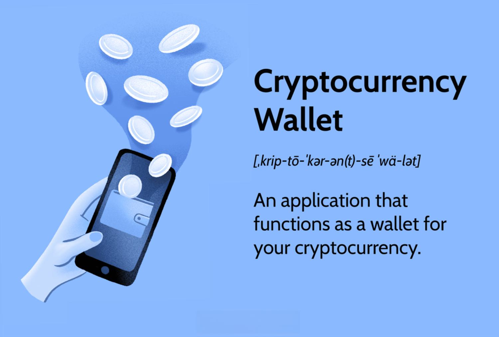

Blockchain technology has emerged as a fundamental framework underpinning cryptocurrencies by providing a decentralized ledger mechanism that ensures secure transaction records. This technology's critical role lies in its ability to maintain the integrity and transparency of cryptocurrency transactions. Blockchain operates through a distributed network where each participant, known as a node, holds a copy of the entire transaction history. This decentralized approach inherently reduces the risk of centralized manipulation or fraudulent alterations to the transaction records.

As the cryptocurrency market expands, there has been a significant rise in algorithmic trading. Algorithmic trading involves using complex mathematical models and high-speed computations to make trading decisions, which can offer substantial advantages over traditional human-led trading. It allows for executing trades at speeds and frequencies impossible for human traders, often resulting in improved market efficiency and liquidity.

However, the intersection of blockchain technology and algorithmic trading introduces specific challenges related to hacking and security. Both these technologies significantly impact how financial markets operate, but they also become lucrative targets for cybercriminals seeking to exploit vulnerabilities. Given the immutable nature of blockchain, once data is added, it is nearly impossible to alter, protecting the network from many forms of manipulation. However, vulnerabilities can still exist, whether through coding errors, inadequate security measures, or social engineering attacks.

Understanding blockchain security is paramount to protecting digital assets in a landscape where hacking attempts are becoming more sophisticated. Knowing how these technologies function together can help stakeholders identify potential vulnerabilities and adopt robust security measures to safeguard their assets. It's crucial to explore how hacking attempts target both blockchain systems and algorithmic trading platforms, often leading to significant financial repercussions.

In the evolving digital finance space, examining hacking's interaction with blockchain security and algorithmic trading is essential for maintaining trust and security. This exploration sets the stage for assessing the vulnerabilities within these systems and the ongoing efforts required to fortify them against increasingly complex cyber threats. Such an analysis is vital for anyone involved in cryptocurrency trading or development to ensure the future stability and security of digital assets.

## Table of Contents

## Understanding Blockchain Security

Blockchain technology is a foundational element in the cryptocurrency ecosystem, primarily due to its role as a decentralized ledger. Unlike traditional centralized databases managed by a single entity, blockchains operate on a peer-to-peer network where each participant, or node, has access to an up-to-date copy of the entire ledger. This decentralized nature ensures that no single point of failure exists, thereby increasing the resilience and security of the system.

One of the primary security features of blockchain technology is its immutability. Once data is recorded on a blockchain, it is exceedingly difficult to alter. This is achieved through cryptographic hashing, where each block of data is linked to the previous one via a hash. Thus, any attempt to modify a single block would require recalculations of all subsequent blocks, a task that grows exponentially difficult as the blockchain lengthens.

Transparency is another core attribute of blockchain systems. All transactions are recorded on the public ledger, allowing any node in the network to verify and audit them independently. This transparency discourages fraudulent activities, as every transaction is visible and traceable to anyone with access to the blockchain.

Cryptographic integrity signifies the use of cryptographic algorithms to secure data. Public and private keys are used for encrypting data, ensuring that only intended recipients can decrypt and access the information. Digital signatures further authenticate the origin and integrity of the transactions, making it arduous for malicious actors to engage in data tampering or spoofing.

Despite these robust security features, blockchains are not impervious to vulnerabilities. Common challenges include the risk of 51% attacks, where a single entity gains majority control over the network’s mining power, potentially allowing this entity to alter transaction history. Additionally, blockchains can be susceptible to double-spending attacks and exploits in smart contracts, which are self-executing contracts with the terms of the agreement directly written into code.

Blockchain systems employ various consensus mechanisms to strengthen security. The most well-known of these is Proof of Work (PoW), used by Bitcoin, wherein miners compete to solve complex mathematical puzzles to validate transactions and add new blocks. This mechanism requires significant computational resources, making it costly for attackers to execute a similar computational effort successfully. Other consensus mechanisms, like Proof of Stake (PoS) and Delegated Proof of Stake (DPoS), offer different methods of validation that can be more energy-efficient and equally secure.

The security of blockchain systems has significant implications for the broader [cryptocurrency](/wiki/cryptocurrency) market. As cryptocurrencies operate on blockchain networks, any breach or vulnerability can lead to substantial financial losses and erode trust within the community. A secure blockchain infrastructure is pivotal for ensuring the stability and growth of the cryptocurrency ecosystem, underscoring the necessity for ongoing advancements in blockchain security measures to protect digital assets and maintain confidence among stakeholders.

## The Advent and Evolution of Cryptocurrency Algo Trading

Algorithmic trading, often known as algo trading, has transformed the financial markets by leveraging automated and complex mathematical models to facilitate rapid and efficient trading decisions. In the cryptocurrency market, algo trading has emerged as a powerful tool due to its ability to capitalize on the inherent [volatility](/wiki/volatility-trading-strategies) and 24/7 nature of this digital asset class.

Algorithmic trading offers several benefits over traditional trading methods, primarily due to its speed, efficiency, and ability to handle large volumes of trades without the emotional and psychological biases that can affect human traders. Algorithms can analyze vast swathes of market data in real-time, execute trades at lightning speeds, and scan various crypto exchanges to identify [arbitrage](/wiki/arbitrage) opportunities, all of which are pivotal in securing a competitive edge.

Within the volatile cryptocurrency landscape, algo trading operates by executing pre-programmed trading instructions, taking into account factors such as timing, price, and market conditions. The algorithms are designed to exploit short-term price fluctuations and can handle trading volumes that would be unmanageable for a human trader. Strategies such as [market making](/wiki/market-making), [trend following](/wiki/trend-following), and mean reversion are commonly employed in cryptocurrency algo trading. For instance, market-making algos continuously buy and sell on exchanges, profiting from the bid-ask spread, whereas trend-following strategies utilize technical indicators to capitalize on the [momentum](/wiki/momentum) of a cryptocurrency's price movement.

Data analytics and [artificial intelligence](/wiki/ai-artificial-intelligence) (AI) play crucial roles in enhancing the performance of algo trading. AI models are capable of learning from historical data and making predictions about future price movements, thereby enabling more sophisticated decision-making processes. For example, [machine learning](/wiki/machine-learning) algorithms can continuously evolve by integrating new data inputs, thereby optimizing trading strategies over time. This ability to dynamically adapt is vital in reacting to rapid market changes typical in cryptocurrency trading.

However, the adoption of [algorithmic trading](/wiki/algorithmic-trading) in cryptocurrencies brings forth unique security concerns. Algo trading systems face vulnerabilities such as software bugs, which could lead to substantial financial losses if not adequately addressed. Moreover, these systems can be targets for cyber-attacks, where hackers may attempt to manipulate data feeds or trading signals. Ensuring robust security measures, such as encryption and continual software updates, are essential in safeguarding algorithmic trading operations from potential threats.

Overall, the advent and evolution of crypto algo trading represent a significant technological leap that facilitates improved trading precision and efficiency. As the cryptocurrency market continues to grow, leveraging data analytics and AI will be crucial in further advancing algo trading capabilities, while addressing security vulnerabilities will remain a top priority to maintain the integrity and trust in these automated systems.

## Hacking and its Impact on Blockchain and Algo Trading

### Hacking and its Impact on Blockchain and Algo Trading

Hacking incidents in the cryptocurrency domain have significantly influenced the field, revealing vulnerabilities and shaking the confidence of stakeholders. Throughout the history of cryptocurrencies, several major hacking incidents stand out due to their scale and impact. The infamous Mt. Gox hack in 2014 resulted in the loss of 850,000 Bitcoins, accounting for approximately 6% of the total Bitcoin supply at the time. This event highlighted the absence of secure custodial solutions and the need for rigorous security practices. Another notable incident was the DAO (Decentralized Autonomous Organization) attack in 2016, where a hacker exploited a vulnerability in a smart contract, leading to the theft of 3.6 million Ether, which was about a third of the DAO’s funds.

Hackers exploit blockchain vulnerabilities through various methods. A common approach is conducting a 51% attack, where attackers gain control of more than half of a blockchain's computing power, allowing them to double-spend coins and halt transactions. The attack on Ethereum Classic in 2019 demonstrated this vulnerability, as transactions were reorganized and double-spending occurred. Phishing attacks remain a prevalent threat, often targeting individual users by impersonating credible platforms to steal private keys and access digital wallets. Smart contract exploitations, like the one that affected the DAO, involve identifying flaws in the contract code to siphon off funds.

Such hacking activities profoundly impact algorithmic trading operations. Algo trading relies on speed, accuracy, and trust in data integrity—elements that are jeopardized during a security breach. For instance, during a 51% attack, algorithmic strategies might be misled by manipulated data, potentially executing trades based on false information. Similarly, when phishing attacks extract credentials from traders, it can lead to unauthorized trading activities and significant financial losses.

Case studies illustrate the broader impact of hacking incidents on cryptocurrency markets. The Mt. Gox hack not only resulted in immediate financial loss but also triggered a market crash, causing Bitcoin’s value to plummet by about 23% within a day. The DAO hack resulted in a split in the Ethereum community, leading to the creation of Ethereum (ETH) and Ethereum Classic (ETC), thus impacting the market dynamics and valuation of both cryptocurrencies. These incidents underscore the pervasive impact of security breaches, affecting individual and institutional participants alike and prompting advancements in security measures and regulatory oversight.

The hacking incidents serve as critical reminders of the importance of robust security measures in both blockchain systems and algorithmic trading operations. Identifying vulnerabilities, implementing best practices, and fostering a culture of continuous improvement are essential to safeguard the integrity and stability of the cryptocurrency ecosystem.

## Strategies to Bolster Security in Cryptocurrency Algo Trading

To secure cryptocurrency algorithmic trading platforms against cyber threats, a multifaceted approach is necessary. This involves implementing best practices, leveraging emerging technologies, adhering to regulatory frameworks, ensuring continuous monitoring, and fostering community contributions.

### Best Practices for Securing Algo Trading Platforms

1. **Robust Authentication Mechanisms:** Implement multi-factor authentication (MFA) to ensure that only authorized users have access to trading platforms. This reduces the risk of unauthorized access and data breaches.

2. **Encryption Protocols:** Use end-to-end encryption for data transmission. This ensures that sensitive information, such as private keys and personal details, remains secure against interception during transfer.

3. **Code Audits and Vulnerability Assessments:** Regularly conduct code audits and vulnerability assessments to identify potential security flaws. Employing automated tools for static and dynamic code analysis can help detect weaknesses that hackers might exploit.

4. **Secure API Integration:** APIs used for algorithmic trading should be secured by implementing token-based authentication and ensuring minimal data exposure.

5. **Emergency Response Plans:** Develop and regularly update an incident response plan to mitigate the impact of successful cyber-attacks and breaches quickly.

### Emerging Technologies and Solutions Enhancing Blockchain Security

1. **Zero-Knowledge Proofs (ZKP):** This cryptographic method allows transactions to be verified without revealing the underlying data. Companies can enhance privacy and security without compromising transparency.

2. **Quantum Resistance:** Blockchain platforms are exploring quantum-resistant algorithms to prepare for future vulnerabilities associated with quantum computing power.

3. **Decentralized Identity Solutions:** These systems allow users to have better control over their personal data, reducing risks associated with centralized data breaches.

### Role of Regulatory Frameworks

Regulatory frameworks play a crucial role in safeguarding digital assets by establishing standards and guidelines for operations:

1. **Compliance with Global Standards:** Trading platforms should adhere to international regulatory standards such as the Financial Action Task Force (FATF) guidelines to prevent illicit activities.

2. **Data Protection Regulations:** Follow data protection laws like the General Data Protection Regulation (GDPR) to ensure user data is processed and stored securely.

### Importance of Continuous Monitoring and Updating Security Protocols

Continuous monitoring is essential to promptly detect and respond to anomalies:

1. **SIEM Solutions:** Security Information and Event Management (SIEM) systems provide real-time analysis of security alerts generated by network hardware and applications.

2. **Automated Threat Detection:** Using machine learning algorithms to identify patterns that could indicate potential threats or breaches, which allows for rapid response.

### Community and Developer Contributions

1. **Open Source Development:** Encourage contributions to open source blockchain projects, which can lead to more robust and secure code collectively reviewed and tested by the global community.

2. **Bug Bounty Programs:** Implementing bug bounty programs that incentivize developers and experts to find and report vulnerabilities.

By combining these strategies, cryptocurrency algorithmic trading platforms can enhance their security posture, reduce the risk of cyber threats, and maintain the trust of their users. These measures collectively contribute to creating a more secure trading environment that can withstand evolving cyber challenges.

## Future Prospects for Blockchain Security and Algo Trading

Blockchain technology and algorithmic trading are at the forefront of the digital finance revolution, promising to enhance security and efficiency. The future of these technologies holds significant potential for development, driven by the need for sophisticated security measures and greater algorithmic precision.

### Evolution of Blockchain Technology in Enhancing Security

The innate security of blockchain technology, characterized by its decentralized, immutable nature, is expected to evolve further. Future advancements are likely to focus on enhancing transaction privacy and integrity. Techniques like zero-knowledge proofs, which allow verification of transactions without revealing sensitive information, are anticipated to become more prevalent. Additionally, advancements in consensus mechanisms, such as Proof of Stake (PoS) and its energy-efficient variants, aim to not only secure networks but also make them more sustainable and scalable.

### Advancements in Algorithmic Trading and Risk Management

Algorithmic trading in cryptocurrency markets will likely continue to leverage machine learning and artificial intelligence (AI) to enhance performance. Innovations in AI-driven predictive analytics are expected to improve the accuracy of market predictions, helping traders better navigate volatile markets. Risk management strategies will also evolve, with algorithms capable of dynamic adjustments in response to real-time market data and anomalies, thereby minimizing potential losses.

### Increasing Need for Sophisticated Security Measures

As the value and complexity of digital assets grow, so too does the threat vector facing blockchain and trading systems. Developing advanced cryptographic methods, such as quantum-resistant algorithms, will be crucial in safeguarding against future threats. Continuous advancements in cybersecurity protocols and the implementation of artificial intelligence for real-time threat detection and response are vital for maintaining system integrity.

### Collaborations Between AI and Blockchain

The convergence of AI and blockchain could revolutionize protection strategies in the cryptocurrency space. AI can enhance the blockchain’s security protocols by providing predictive analytics on potential vulnerabilities and automating the threat detection processes. Smart contracts, powered by AI, could autonomously modify security settings in response to emerging threats. Such integration promises to offer robust protection and operational efficiency.

### Proactive Security Measures

The future success of blockchain technology and algorithmic trading hinges on proactive security strategies. Constant vigilance, regular system updates, and adherence to best security practices are essential. Encouraging collaboration between developers, regulators, and industry stakeholders will further reinforce the security architecture. Emphasis on robust testing phases, coupled with a commitment to transparency and regular audits, will be key in anticipating and mitigating future security breaches.

In conclusion, blockchain security and algorithmic trading are poised for significant advancements, necessitated by the evolving landscape of digital finance. As these technologies mature, the emphasis on security will grow in tandem, ensuring the continued trust and viability of cryptocurrency markets.

## Conclusion

Blockchain security, hacking incidents, and algorithmic trading are intricately linked elements within the digital financial landscape. The secure and transparent nature of blockchain technology offers a foundation for safe cryptocurrency transactions, yet vulnerabilities remain, posing opportunities for exploitation by malicious entities. Algorithmic trading amplifies these risks due to its reliance on data integrity and computational processes. Therefore, understanding these interactions is crucial to protect digital assets effectively.

Maintaining vigilance in digital finance is of paramount importance. As technologies evolve, so do the tactics of cyber threats, necessitating continuous updates and robust security measures. Stakeholders, from developers to financial institutions, must prioritize security in their operations to safeguard against breaches that could result in significant financial losses or systemic disruptions.

Innovation and collaboration are essential in advancing security measures. New technologies and collaborative frameworks can yield sophisticated defenses against emerging threats. By fostering a culture of shared knowledge and joint development efforts, the digital finance community can enhance its overall resilience against attacks.

As the landscape rapidly changes, it is imperative for all stakeholders in the cryptocurrency and blockchain ecosystems to stay informed and proactive regarding security advancements and potential vulnerabilities. Ongoing education and awareness are fundamental to adapting to new challenges and ensuring the protection and integrity of digital financial infrastructures.

## References & Further Reading

[1]: Narayanan, A., Bonneau, J., Felten, E., Miller, A., & Goldfeder, S. (2016). ["Bitcoin and Cryptocurrency Technologies: A Comprehensive Introduction"](https://press.princeton.edu/books/hardcover/9780691171692/bitcoin-and-cryptocurrency-technologies). Princeton University Press.

[2]: Antonopoulos, A. M. (2017). ["Mastering Bitcoin: Unlocking Digital Cryptocurrencies"](https://books.google.com/books/about/Mastering_Bitcoin.html?id=IXmrBQAAQBAJ). O'Reilly Media.

[3]: de Filippi, P., & Wright, A. (2018). ["Blockchain and the Law: The Rule of Code"](https://www.jstor.org/stable/j.ctv2867sp). Harvard University Press.

[4]: Mougayar, W. (2016). ["The Business Blockchain: Promise, Practice, and Application of the Next Internet Technology"](https://books.google.com/books/about/The_Business_Blockchain.html?id=CEsPDAAAQBAJ). Wiley.

[5]: Zohar, A. (2015). ["Bitcoin: Under the Hood"](https://dl.acm.org/doi/10.1145/2701411). Communications of the ACM, 58(9), 104-113. 

[6]: Swan, M. (2015). ["Blockchain: Blueprint for a New Economy"](https://dl.acm.org/doi/book/10.5555/3006358). O'Reilly Media.