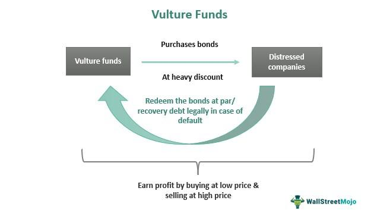

## Table of Contents

## What are vulture funds?

Vulture funds are investment funds that buy up debt or assets that are in trouble, usually at a low price. They often focus on debts of countries or companies that are struggling financially. The goal is to make a profit by buying these debts cheaply and then trying to get paid back more than they paid.

These funds got their name because they are seen as waiting for a troubled company or country to fail, much like vultures wait for animals to die. Critics say vulture funds can make it harder for struggling places to recover. But supporters argue that these funds help by providing money when it's needed and can help clean up financial messes.

## How do vulture funds operate?

Vulture funds work by buying debts or assets that are in trouble at a low price. They look for companies or countries that are having a hard time paying their debts. Once they buy these debts, they try to get paid back more than what they paid. For example, if a country owes money and can't pay it all back, a vulture fund might buy that debt for less than it's worth and then try to get the full amount from the country.

These funds often use legal action to get their money back. They might sue the debtor to force them to pay. This can make it harder for the struggling company or country to recover because they have to deal with these lawsuits. On the other hand, some people think vulture funds are helpful because they provide money to places that need it and can help clean up financial messes by taking over bad debts.

## What is the origin of the term 'vulture fund'?

The term 'vulture fund' started being used in the 1970s. It came about because these funds act a bit like vultures. Vultures are birds that eat animals that are already dead. In the same way, vulture funds look for companies or countries that are struggling and almost 'dead' financially. They buy up the debts of these troubled places, hoping to make a profit.

The name 'vulture fund' is not a compliment. It shows that people think these funds take advantage of others' problems. Critics say that these funds make it harder for struggling places to get better. But the people who run vulture funds say they help by giving money to places that really need it and by cleaning up financial messes.

## What are the typical investment strategies of vulture funds?

Vulture funds usually focus on buying debts or assets that are in trouble. They look for companies or countries that are having a hard time paying back what they owe. These funds buy the debts at a lower price than what they're worth. For example, if a country can't pay its debts, a vulture fund might buy those debts for less money and then try to get the full amount back later. The goal is to make a profit by paying less for the debt and then getting more money back.

To make money, vulture funds often use the courts. They might sue the company or country that owes the money to force them to pay. This can put more pressure on the struggling place and make it harder for them to recover. But vulture funds say they help by giving money to places that need it and by cleaning up financial problems. They argue that without them, these debts might just be ignored and cause bigger problems later.

## Can you explain the legal and ethical controversies surrounding vulture funds?

Vulture funds often face legal and ethical controversies. One big issue is that they buy debts of countries or companies that are in trouble, then sue to get their money back. This can make it even harder for these places to recover. For example, if a poor country can't pay its debts, a vulture fund might buy that debt and then sue the country for the full amount. This can lead to the country having to cut important services like healthcare or education to pay the fund. Critics say this is unfair because it hurts people who are already struggling.

On the ethical side, many people think vulture funds take advantage of others' problems. They argue that these funds are like vultures waiting for a company or country to fail before swooping in to make a profit. This can be seen as morally wrong because it seems to profit from others' misfortune. However, supporters of vulture funds say they provide a necessary service. They argue that by buying up bad debts, vulture funds help to clean up financial messes and provide money to places that need it. They say that without vulture funds, these debts might just be ignored, which could lead to even bigger problems later.

## What are some notable examples of vulture fund activities?

One well-known example of vulture fund activity happened in Argentina. In the early 2000s, Argentina was in a big financial crisis and couldn't pay its debts. Some vulture funds, like NML Capital, bought up these debts for a low price. Later, they sued Argentina to get paid back the full amount. In 2014, a U.S. court ruled that Argentina had to pay these funds, which caused a lot of trouble for the country. It showed how vulture funds can use legal action to make struggling countries pay.

Another example is the case of Zambia. In the 2000s, Zambia had a big debt to a company called Donegal International. A vulture fund bought this debt for a lot less than it was worth. Then, the fund took Zambia to court and won a huge amount of money, much more than they paid for the debt. This put a lot of pressure on Zambia, which was already having a hard time. It showed how vulture funds can make it hard for poor countries to recover from their financial problems.

## How do vulture funds impact economies and societies?

Vulture funds can have a big impact on economies and societies. When they buy debts of countries or companies that are in trouble, they often try to get their money back through lawsuits. This can make it harder for these places to recover because they have to spend money fighting in court instead of fixing their problems. For example, if a poor country has to pay a lot of money to a vulture fund, it might have to cut back on important services like healthcare or education. This can hurt the people who live there and make the country's economy even weaker.

On the other hand, some people think vulture funds can help. They argue that these funds give money to places that need it, which can help keep things running while they figure out their financial problems. Vulture funds also say they help clean up financial messes by taking over bad debts. But even with these arguments, many people still see vulture funds as taking advantage of others' problems, which can lead to a lot of anger and debate in society.

## What are the differences between vulture funds and other types of investment funds?

Vulture funds are different from other investment funds because they focus on buying debts or assets that are in trouble. Most other investment funds, like mutual funds or hedge funds, invest in stocks, bonds, or other assets that are doing well or have potential for growth. Vulture funds, on the other hand, look for companies or countries that are struggling and buy their debts at a low price. Their goal is to make a profit by getting paid back more than they paid for the debt.

Another big difference is how vulture funds make money. While other investment funds might make money by buying and selling assets or [earning](/wiki/earning-announcement) dividends, vulture funds often use legal action to force the debtor to pay. This can put a lot of pressure on the struggling company or country. Other funds usually don't use the courts to get their money back; they rely on the market to grow their investments. Because of these differences, vulture funds are often seen as controversial and are criticized for taking advantage of others' problems.

## What regulatory measures have been implemented to control vulture funds?

Some countries have made rules to control vulture funds because they can cause a lot of trouble for poor countries. For example, the UK passed a law in 2010 called the Debt Relief Act. This law says that vulture funds can't make more than the original debt plus some interest. This helps stop vulture funds from making huge profits by suing poor countries. Other countries, like Belgium and France, have also made laws to limit what vulture funds can do.

There have also been efforts to control vulture funds at the international level. The United Nations has talked about making rules to stop vulture funds from hurting poor countries. Some people want a global agreement to make sure that vulture funds don't make it harder for countries to recover from financial problems. But making these rules is hard because different countries have different ideas about what should be done.

## How can one identify a potential vulture fund investment opportunity?

To find a potential vulture fund investment opportunity, you need to look for companies or countries that are having a hard time paying their debts. These could be businesses that are struggling to make money or countries that are in a financial crisis. You can find these opportunities by keeping an eye on news about financial troubles, checking the credit ratings of different places, and looking at how much their debts are being sold for. If a debt is being sold for a lot less than what it's worth, it might be a good chance for a vulture fund to step in.

Once you find a struggling company or country, you need to figure out if you can make money from their debt. This means looking at how likely they are to pay back what they owe, even if it's just a little bit. You might also need to think about whether you can use the courts to get your money back. This can be tricky because it involves legal battles, but it's often how vulture funds make their profits. By buying debts cheap and then getting paid back more, vulture funds can turn a struggling situation into a profitable one.

## What are the risks associated with investing in or being targeted by vulture funds?

Investing in vulture funds can be risky because it's hard to know if you'll make money. You're buying debts from companies or countries that are already in trouble. If they can't pay back what they owe, you might lose your money. Also, getting your money back often involves going to court, which can take a long time and cost a lot. If you lose the court case, you could end up with nothing.

Being targeted by a vulture fund can be tough for a company or country. If a vulture fund buys your debt and then sues you, it can make your financial problems even worse. You might have to spend a lot of money fighting in court, which means less money for important things like healthcare or fixing your economy. This can make it harder to recover from your financial troubles and can hurt the people who depend on your services.

## What future trends might affect the operations and regulation of vulture funds?

In the future, more countries might make rules to control vulture funds. This could happen because people are worried about how these funds can hurt poor countries. For example, more countries might pass laws like the UK's Debt Relief Act, which stops vulture funds from making huge profits by suing struggling places. There could also be more talk at the United Nations about making global rules to stop vulture funds from causing too much trouble. These changes could make it harder for vulture funds to do what they do now, but it might also help struggling places recover faster.

Another trend could be changes in how vulture funds find and buy debts. With more information available online, vulture funds might use new technology to find good deals faster. They could use big data and computer programs to look at lots of information and find the best opportunities. But at the same time, more people might start using these tools to keep an eye on vulture funds, which could lead to more public pressure and more rules to control what they do. This could make the world of vulture funds more complicated and competitive.

## What is a Vulture Fund?

A vulture fund is a specialized type of [hedge fund](/wiki/hedge-fund-trading-strategies) that invests in the distressed debt of companies or sovereign entities that are either in or near bankruptcy. The strategy involves purchasing this debt at a significantly discounted price, usually from other investors looking to [exit](/wiki/exit-strategy) their positions due to the dire financial state of the issuer. The name "vulture fund" is derived from the fund's opportunistic investment approach, akin to vultures scavenging for carcasses—profiting from entities in dire straits.

Vulture funds typically target bonds or other debt instruments whose market value has plummeted due to the issuer's financial difficulties. Their primary objective is to realize substantial profits upon the debtor's recovery or restructuring. This can happen through various means, such as leverage during bankruptcy proceedings, settlement negotiations, or when the issuer successfully rebounds and the debt's value increases.

A key characteristic of vulture funds is their aggressive legal tactics to secure payouts. They often resort to litigation as a strategy to recover the invested capital or to gain a favorable reorganization plan. For instance, they might challenge the terms of debt restructuring, insisting on better conditions for themselves, which can slow down or complicate the process. One might note that vulture funds have drawn criticism due to these aggressive approaches, often being accused of exploiting financially distressed entities rather than contributing to their recovery.

The economic rationale behind vulture funds rests on the potential for high returns balanced with high risk. By purchasing debt at a deep discount, the funds stand to gain if the issuers' financial situation stabilizes or improves. A simple mathematical representation of this strategy can be expressed as:

$$
\text{Potential Profit} = \text{Face Value of Debt} - \text{Purchase Price}
$$

For example, if a vulture fund purchases distressed debt with a face value of $1,000 for $100, the potential profit upon full repayment or settlement would be $900, assuming no additional legal or operational costs are incurred. However, vulture funds face the risk that the issuer might default completely or the restructuring outcomes might be less favorable than anticipated, impacting their success rate.

In summary, vulture funds are a high-risk, high-reward investment strategy focusing on distressed entities. Their effectiveness largely depends on their ability to execute strategic legal and financial maneuvers, with outcomes varying significantly based on the complexities of each case.

## What is Algorithmic Trading: A Modern Approach?

Algorithmic trading, also known as algo trading or automated trading, utilizes computer programs to execute trades based on pre-defined criteria and strategies. This technologically driven approach hinges on algorithms—sets of rules or instructions outlined in computer code—that execute trades at speeds and frequencies imperceptible to human traders. The primary objective of [algorithmic trading](/wiki/algorithmic-trading) is to exploit market inconsistencies to enhance efficiency, providing significant advantages in terms of speed and accuracy.

Traders implementing algorithmic strategies can take advantage of various market scenarios, notably in domains such as [market making](/wiki/market-making), [arbitrage](/wiki/arbitrage), and [trend following](/wiki/trend-following). 

1. **Market Making**: In market making, algorithms provide liquidity to the market by simultaneously placing buy and sell orders for a financial asset. The goal is to capture the spread, which is the difference between the bid and ask price. An example of a simple market-making strategy can be represented in Python:
   ```python
   def market_maker(spread, current_price):
       bid_price = current_price - spread/2
       ask_price = current_price + spread/2
       return bid_price, ask_price
   ```

2. **Arbitrage**: Arbitrage involves taking advantage of price differentials of the same asset in different markets. Algorithmic trading is particularly suited for arbitrage given its capacity to process vast quantities of data across multiple markets within milliseconds. A basic arbitrage concept can be illustrated with a simple subtraction:
$$
   \text{Profit} = \text{Price in Market A} - \text{Price in Market B}

$$
   If `Profit > 0`, a trader can earn by buying in Market B and selling in Market A almost instantaneously.

3. **Trend Following**: Trend-following strategies are based on the premise that markets exhibit trends, which can be predicted to some extent. Algorithms detect patterns and trends, executing trades with the assumption that the observed directions will persist. Trend following often leverages moving averages to signal trades:
   ```python
   def moving_average(values, window):
       return sum(values[-window:]) / window

   def trend_following_strategy(prices, short_window, long_window):
       short_ma = moving_average(prices, short_window)
       long_ma = moving_average(prices, long_window)
       return "Buy" if short_ma > long_ma else "Sell"
   ```

These strategies capitalize on the computational advantages of algorithms: their ability to track market conditions continuously, execute transactions based on real-time data, and process numerous indicators faster than humanly possible. Furthermore, algorithms can minimize emotional decision-making, adhere strictly to strategic parameters, and facilitate [backtesting](/wiki/backtesting) on historical data to optimize strategies.

Despite the evident advantages of algorithmic trading, it is important to address associated challenges and risks. Algorithmic systems can contribute to market [volatility](/wiki/volatility-trading-strategies), particularly during unexpected disruptions or flash crashes. Therefore, robust risk management and system safeguards are essential to maintain market integrity and safeguard investor interests. 

As technology and financial markets continue to evolve, algorithmic trading remains a pivotal force in modern trading strategies, offering new opportunities for traders capable of navigating this complex landscape.

## References & Further Reading

[1]: ["Global Hedge Fund Industry Report"](https://www.hfr.com/product/global-report/) by Preqin (2021)

[2]: "The Argentina Debt Crisis" in ["Sovereign Debt: From Safety to Default"](https://www.batimes.com.ar/news/economy/imf-debt-deal-the-roots-of-argentinas-economic-crisis.phtml) by Robert W. Kolb

[3]: ["Flash Boys: A Wall Street Revolt"](https://en.wikipedia.org/wiki/Flash_Boys) by Michael Lewis

[4]: Zuckerman, G. (2009). ["The Greatest Trade Ever: The Behind-the-Scenes Story of How John Paulson Defied Wall Street and Made Financial History"](https://www.amazon.com/Greatest-Trade-Ever-Behind-Scenes/dp/0385529945).

[5]: "Puerto Rico Debt Crisis" in ["Chronicle of a Collapse Foretold"](https://www.gao.gov/products/gao-18-387) by Urban Institute (2017)

[6]: ["Algorithmic Trading: Winning Strategies and Their Rationale"](https://www.amazon.com/Algorithmic-Trading-Winning-Strategies-Rationale-ebook/dp/B00CY5HC0U) by Ernie Chan

[7]: Aldridge, I. a. (2016). ["High-Frequency Trading: A Practical Guide to Algorithmic Strategies and Trading Systems"](https://www.wiley.com/en-us/High+Frequency+Trading%3A+A+Practical+Guide+to+Algorithmic+Strategies+and+Trading+Systems-p-9780470579770).

[8]: "Elliott Management's Case Against Argentina" in ["Holdouts: Sovereign Debt and the Prospects of Restructuring"](https://www.amazon.com/Holdouts-Sovereign-Restructuring-Gregory-Manuel/dp/0866727241) by Rodrigo Olivares-Caminal

[9]: ["Financial Markets and Institutions"](https://www.pearson.com/en-us/pearsonplus/p/9780137554508) by Frederic S. Mishkin