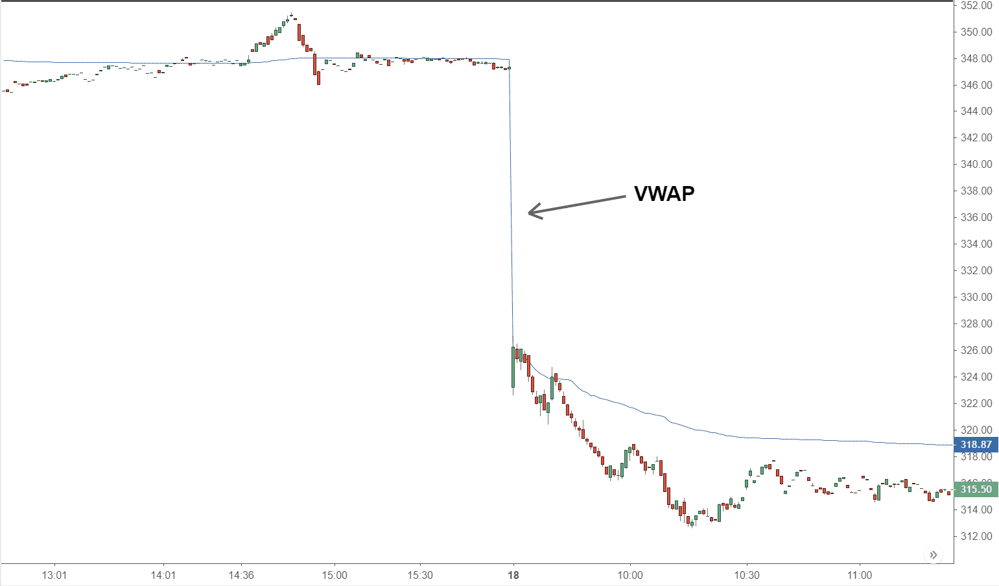

In financial trading, strategies that integrate price movements with volume trends are pivotal for enhancing trading effectiveness. The Volume Weighted Average Price (VWAP) Cross is a distinguished strategy in this domain. This article investigates the VWAP Cross strategy and its role in algorithmic trading. VWAP, as a calculation, is crucial for traders; it represents the average price of a security, accounting for its trading volume, generally over the period of a day. The significance of VWAP lies in its function as a trading benchmark, offering insights into how a trade's price compares to the market average, thereby providing a measure of trade efficiency.

Understanding and applying VWAP can elevate a trader's skill set by allowing them to align trades with market averages, thereby potentially improving profitability. The focus here is not only on how VWAP functions but also on how it can be practically implemented in the VWAP Cross strategy. This strategy generates trading signals when the price of a security crosses the VWAP line, enabling traders to identify potential entry and exit points based on perceived market trends.



Additionally, the article will consider the challenges and considerations associated with using VWAP in algorithmic trading. Factors like VWAP's nature as a lagging indicator and its limitations in volatile, low-volume markets can affect the accuracy and reliability of the signals it generates. Recognizing these challenges is essential for traders to effectively integrate VWAP into their trading algorithms and complement it with other technical indicators for improved decision-making. By leveraging VWAP, traders can enhance the precision of their trades and potentially optimize their trading outcomes.

## Table of Contents

## Understanding VWAP

The Volume Weighted Average Price (VWAP) serves as a crucial benchmark in trading, offering insight into the average price of a security where the trading volume is a key factor. Typically calculated over a single trading session, the VWAP reflects the true mean price at which a security has traded with consideration to the volume, which is vital for understanding the liquidity and market dynamics.

The formula for VWAP is expressed as:

$$
\text{VWAP} = \frac{\sum (\text{Price}_i \times \text{Volume}_i)}{\sum \text{Volume}_i}
$$

Where:
- $\text{Price}_i$ represents the price of the trade,
- $\text{Volume}_i$ is the volume of that trade.

This calculation requires iterating over all trades of a security throughout the trading day, making it a comprehensive measure of the market activity in relation to that security.

Institutional traders predominantly employ VWAP to ensure that their transactions occur close to the market's average trading price and thus optimize cost efficiency. When large orders need to be executed, the VWAP aids in minimizing the market impact, allowing these transactions to blend seamlessly with the existing market flow without causing sudden price changes.

For traders, using VWAP as a benchmark can provide a standard to gauge the performance of their trade executions. By comparing the execution price of a transaction to the VWAP, traders can determine whether they achieved a more favorable price or incurred additional cost due to timing inefficiencies.

The significance of VWAP extends to [algorithmic trading](/wiki/algorithmic-trading) as well, where algorithms may be programmed to execute orders around the VWAP, thus ensuring that trades are systematically aligned with this average price benchmark. Such alignment helps in reducing transaction costs and providing traders with a method to evaluate their trading efficiency in the context of overall market activity.

## The VWAP Cross Strategy

The VWAP Cross strategy is pivotal in financial trading, particularly in generating trading signals based on the relationship between a security's price and its Volume Weighted Average Price (VWAP). The core principle of this strategy is to monitor the price relative to the VWAP line, utilizing this relationship to identify potential market entry and [exit](/wiki/exit-strategy) points.

The strategy operates on the premise that when a security's price crosses above the VWAP line, it signals a potential bullish trend. Traders interpret this crossover as an indication that the price may continue to rise, suggesting an optimal entry point for buying. The logic is that if the price is above the VWAP, the market participants are willing to pay a premium over the average weighted by volumes of trades, signifying strong buying interest. 

Conversely, when the price crosses below the VWAP line, it generates a bearish signal. This downward crossover suggests that the security might be experiencing increased selling pressure, potentially leading to further price declines. Traders see this as an opportunity to sell or short the security, anticipating further downward movement. Essentially, if the price is below VWAP, it implies that the market is pricing the security at a discount compared to its [volume](/wiki/volume-trading-strategy)-weighted average, indicating selling interest.

To effectively implement the VWAP Cross strategy, continuous monitoring of price actions relative to the VWAP line is imperative. Traders must capitalize on these trend signals by validating whether the price movements support their trading decisions. It is crucial to understand that the VWAP itself is recalculated throughout the trading session, providing a dynamic benchmark that can reveal the shift in market sentiment as the day progresses.

Additionally, traders may employ simple programmable algorithms to automate these observations. Here's a basic Python snippet that demonstrates how one might identify the VWAP crossovers using historical price data:

```python
import numpy as np
import pandas as pd

# Example DataFrame with 'Price', 'Volume' columns
data = pd.DataFrame({'Price': [10, 10.5, 11, 11.5, 11, 10.7],
                     'Volume': [100, 150, 200, 250, 300, 350]})

# Calculate VWAP
data['Cumulative_PV'] = (data['Price'] * data['Volume']).cumsum()
data['Cumulative_Volume'] = data['Volume'].cumsum()
data['VWAP'] = data['Cumulative_PV'] / data['Cumulative_Volume']

# Identify crossovers
data['Signal'] = np.where(data['Price'] > data['VWAP'], 'Buy', 'Sell')

print(data[['Price', 'VWAP', 'Signal']])
```

This algorithm calculates the VWAP over the period of data, generating a buying signal when price crosses above the VWAP and a selling signal when it falls below.

The strategy inherently requires consistent analysis due to the dynamic nature of VWAP. While it can indicate potential trend reversals or confirmations, traders often incorporate additional techniques, such as technical indicators or market analysis, to validate these signals and avoid erroneous trades arising from temporary market fluctuations.

## Implementing the VWAP Cross in Algorithmic Trading

Algorithmic trading systems can effectively automate the implementation of the VWAP Cross strategy, optimizing trade execution and reducing market impact. This automation involves setting precise parameters for the execution of trades, ensuring that large orders are strategically broken down into smaller, manageable trades that align closely with the VWAP. This technique not only enhances execution efficiency but also minimizes the potential for significant market disturbances caused by large volume trades. 

For an algorithm to make precise entries and exits based on VWAP crossing points, it needs to continuously recalculate the VWAP in real-time and monitor live market conditions. This is crucial because market conditions are dynamic, and the VWAP line can shift throughout the trading session as volume and price changes occur. The algorithm can be programmed to issue buy or sell signals when the current security price crosses above or below the VWAP line, respectively. 

A fundamental aspect of implementing the VWAP Cross strategy in algorithmic trading includes integrating robust risk management tools. One such tool is the stop-loss order, which can be programmed to trigger automatically, helping to mitigate potential losses. Stop-loss orders can be set at levels informed by the VWAP and other relevant indicators to ensure that trades are closed if the market moves unfavorably.

Here's a simple Python code snippet to illustrate how an algorithm might calculate VWAP and generate trading signals:

```python
import pandas as pd

def calculate_vwap(dataframe):
    vwaps = (dataframe['Price'] * dataframe['Volume']).cumsum() / dataframe['Volume'].cumsum()
    return vwaps

def vwap_cross_strategy(dataframe):
    vwap_values = calculate_vwap(dataframe)
    signals = []

    for i in range(1, len(dataframe)):
        if dataframe['Price'][i] > vwap_values[i] and dataframe['Price'][i-1] <= vwap_values[i-1]:
            signals.append('Buy')
        elif dataframe['Price'][i] < vwap_values[i] and dataframe['Price'][i-1] >= vwap_values[i-1]:
            signals.append('Sell')
        else:
            signals.append('Hold')

    return pd.Series(signals, index=dataframe.index)

# Example usage:
# df = pd.DataFrame({'Price': [...], 'Volume': [...])
# df['VWAP_Signals'] = vwap_cross_strategy(df)
```

In this code, `calculate_vwap` computes the VWAP across a given DataFrame, while `vwap_cross_strategy` generates buy, sell, or hold signals based on the crossover of price and VWAP values. This simple model can be refined with additional parameters and risk management rules, tailored to match the strategies a trader or institution might employ within an automated trading environment.

## Advanced Techniques: Multi-Time Frame Analysis and VWAP Bands

Traders often employ multi-time frame analysis with VWAP to gain a comprehensive view of market dynamics and enhance their trading decisions. This approach enables traders to observe price movements across different time frames, such as hourly, daily, or weekly charts, thereby aligning trades with the prevailing market trends more effectively. By analyzing VWAP across multiple time frames, traders can identify significant levels of support and resistance, as well as detect potential reversals or continuations of trends.

In addition to multi-time frame analysis, VWAP Bands are utilized as an advanced technique to improve trading strategies. VWAP Bands operate similarly to Bollinger Bands, as they encompass upper and lower boundaries positioned around the VWAP line. These bands are calculated using standard deviations of VWAP and can indicate potential support and resistance levels within the market. The formula for VWAP Bands can be represented as:

- **Upper VWAP Band = VWAP + (n * standard deviation of VWAP)**
- **Lower VWAP Band = VWAP - (n * standard deviation of VWAP)**

Here, "n" represents the number of standard deviations, which traders can adjust based on their risk tolerance and market conditions.

VWAP Bands provide additional trading signals when prices approach or breach these boundaries. For instance, if the price of a security moves close to the upper VWAP Band, it may suggest that the security is overbought, indicating a potential selling opportunity. Conversely, if the price nears the lower VWAP Band, it might imply oversold conditions, possibly signaling a buying opportunity. By incorporating these techniques, traders can enhance the precision of their entry and exit points, thereby improving trade execution and potential profitability.

## Challenges and Considerations

The Volume Weighted Average Price (VWAP) serves as a crucial tool for traders when evaluating execution quality and timing their trades. However, traders need to be aware of certain challenges when implementing this indicator in their strategies. 

Since VWAP is a lagging indicator, it is primarily based on historical data — specifically, the average prices of past trades weighted by their respective volumes. This retrospective nature can lead to delayed signals, as the VWAP reflects what has already occurred rather than predicting future price movements. Consequently, traders may find that reliance solely on VWAP could result in entering or exiting trades suboptimally, particularly in swiftly changing market conditions.

Moreover, during periods of high [volatility](/wiki/volatility-trading-strategies) or when trading low-volume stocks, VWAP's effectiveness might diminish. In such cases, the influence of fewer trades or significant price swings can lead to distortions in the VWAP calculation, potentially generating false signals. This is because sudden, large trades can disproportionately affect the VWAP, causing it to deviate from the current market price and lead traders to make erroneous decisions.

To mitigate these issues, traders are advised to use VWAP in conjunction with other technical indicators. By integrating complementary tools, such as moving averages or [momentum](/wiki/momentum) indicators, traders can validate VWAP signals, gaining more assurance in their trading decisions. This multimodal approach helps in confirming trends and ensuring more accurate entry and exit points.

Furthermore, it is crucial for traders to adapt VWAP-based strategies to the prevailing market context. This involves tuning the strategy parameters or utilizing adaptive algorithms capable of recognizing changes in market conditions and responding accordingly. By maintaining awareness of the broader market environment, traders can better leverage VWAP's insights and minimize the risks associated with its inherent limitations. 

Through a measured application and judicious use of additional indicators, traders can enhance the reliability and effectiveness of VWAP within their trading frameworks.

## Conclusion

The VWAP Cross strategy stands out as a potent instrument for traders aiming to gain insights into market trends and make informed trading decisions. By integrating VWAP into algorithmic trading frameworks, traders can achieve enhanced precision in execution and set benchmarks for performance evaluation. VWAP, or Volume Weighted Average Price, serves as a reliable measure by which traders can gauge the price of a security relative to its trading volume, allowing for more informed buy and sell signals.

Importantly, while VWAP offers significant insight, its utility is not without limitations. As a lagging indicator, VWAP can sometimes delay signal accuracy, particularly in volatile markets with low trade volumes. Thus, relying solely on VWAP may not suffice for making robust trading decisions. It is crucial to pair VWAP with complementary indicators to confirm signals and adapt strategies to current market conditions, thereby optimizing trading results.

Understanding VWAP and its strategic application in algorithmic trading has the potential to significantly improve not only the efficiency but also the profitability of trading operations. Traders who adeptly employ VWAP alongside other indicators can craft strategies that are both precise and adaptable to varying market conditions, ultimately leading to more successful trading outcomes.

## References & Further Reading

[1]: ["Advances in Financial Machine Learning"](https://www.amazon.com/Advances-Financial-Machine-Learning-Marcos/dp/1119482089) by Marcos Lopez de Prado

[2]: ["Evidence-Based Technical Analysis: Applying the Scientific Method and Statistical Inference to Trading Signals"](https://www.amazon.com/Evidence-Based-Technical-Analysis-Scientific-Statistical/dp/0470008741) by David Aronson

[3]: ["Machine Learning for Algorithmic Trading"](https://github.com/stefan-jansen/machine-learning-for-trading) by Stefan Jansen

[4]: ["Quantitative Trading: How to Build Your Own Algorithmic Trading Business"](https://www.amazon.com/Quantitative-Trading-Build-Algorithmic-Business/dp/1119800064) by Ernest P. Chan

[5]: Vwap Trading Strategy, Finansoft Consulting, Inc. ["VWAP Trading Strategies"](https://www.quantifiedstrategies.com/vwap-trading-strategy/)