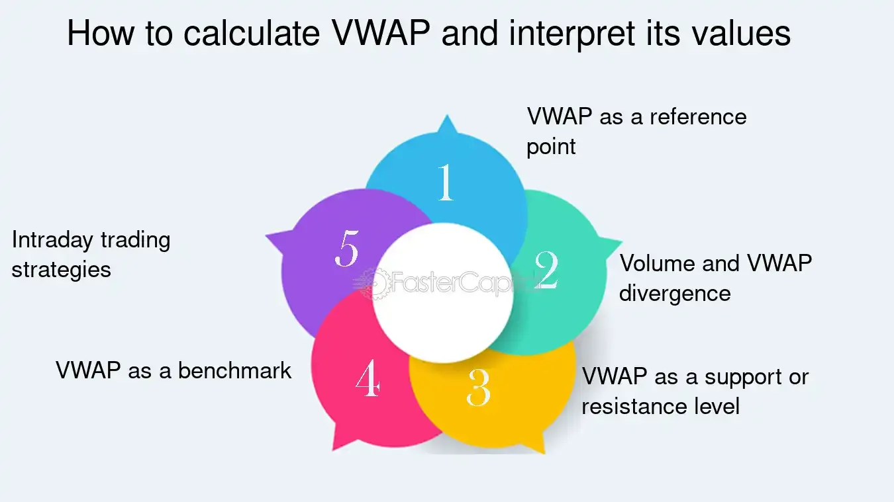

## Table of Contents

## What is the VWAP Cross and why is it important in trading?

The VWAP Cross, or Volume Weighted Average Price Cross, is a trading indicator that shows when the current price of a stock crosses above or below its VWAP. The VWAP is calculated by taking the total dollar value of all trades and dividing it by the total trading volume for a specific time period, usually a day. When the price of a stock goes above the VWAP, it's called a bullish cross, and when it goes below, it's called a bearish cross.

This indicator is important in trading because it helps traders understand the market's direction and make better decisions. If the price is above the VWAP, it might mean the stock is doing well and could keep going up. If it's below, it might mean the stock is not doing well and could keep going down. Many traders use the VWAP Cross to decide when to buy or sell a stock, making it a useful tool for figuring out good entry and exit points in the market.

## How is the Volume Weighted Average Price (VWAP) calculated?

The Volume Weighted Average Price (VWAP) is a way to figure out the average price of a stock during a certain time, usually a day. To find the VWAP, you take the total dollar amount of all the trades and divide it by the total number of shares traded. Here's how it works: if someone buys 100 shares at $10 each, that's $1,000. If someone else buys 200 shares at $11 each, that's $2,200. You add up all these dollar amounts and then divide by the total number of shares (300 in this example).

This calculation gives you a number that shows the average price people paid for the stock, taking into account how many shares were traded at each price. It's different from a simple average because it gives more weight to prices where more shares were traded. Traders use VWAP to see if a stock is a good buy or sell. If the current price is below the VWAP, it might be a good time to buy, and if it's above, it might be a good time to sell.

## What does a VWAP Cross indicate in market analysis?

A VWAP Cross happens when the price of a stock goes above or below the VWAP line. When the price goes above the VWAP, it's called a bullish cross. This can mean that the stock is doing well and might keep going up. Traders see this as a good sign and might decide to buy the stock. On the other hand, when the price goes below the VWAP, it's called a bearish cross. This can mean that the stock is not doing well and might keep going down. Traders might see this as a warning and decide to sell the stock.

In market analysis, the VWAP Cross helps traders understand the market's direction. It's a simple way to see if a stock is trending up or down. By watching for these crosses, traders can make better decisions about when to buy or sell. The VWAP Cross is especially useful because it takes into account both the price and the [volume](/wiki/volume-trading-strategy) of trades, giving a more complete picture of what's happening in the market.

## Can you explain the difference between a bullish and bearish VWAP Cross?

A bullish VWAP Cross happens when the price of a stock goes above the VWAP line. This is a good sign for traders because it means the stock might be doing well and could keep going up. When traders see a bullish cross, they might decide it's a good time to buy the stock. The VWAP line shows the average price people paid for the stock, so if the current price is higher, it suggests more people are willing to pay more for it.

On the other hand, a bearish VWAP Cross happens when the price of a stock goes below the VWAP line. This is a warning sign for traders because it means the stock might not be doing well and could keep going down. When traders see a bearish cross, they might decide it's a good time to sell the stock. The VWAP line helps traders see if the stock is trending down, and a bearish cross can signal that it's time to get out before the price drops even more.

## How can traders use the VWAP Cross to make trading decisions?

Traders use the VWAP Cross to help them decide when to buy or sell a stock. When they see the price of a stock go above the VWAP line, it's called a bullish cross. This is a good sign that tells traders the stock might be doing well and could keep going up. So, they might decide to buy the stock at this point, hoping to make money as the price goes higher.

On the other hand, when the price of a stock goes below the VWAP line, it's called a bearish cross. This is a warning sign that tells traders the stock might not be doing well and could keep going down. When they see this, traders might decide to sell the stock to avoid losing money if the price keeps dropping. By watching for these VWAP Crosses, traders can make smarter choices about when to get into or out of the market.

## What are the key components needed to perform a VWAP Cross analysis?

To do a VWAP Cross analysis, you need to know the current price of the stock and the VWAP line. The VWAP line is found by adding up the total dollar amount of all trades and dividing it by the total number of shares traded over a period, usually a day. You also need to keep an eye on the stock's price to see when it goes above or below the VWAP line. This is important because it helps you spot a bullish or bearish cross.

A bullish cross happens when the stock's price goes above the VWAP line. This is a good sign that the stock might be doing well and could keep going up. Traders often see this as a signal to buy the stock. On the other hand, a bearish cross happens when the stock's price goes below the VWAP line. This is a warning sign that the stock might not be doing well and could keep going down. Traders might see this as a signal to sell the stock. By watching for these crosses, traders can make better decisions about when to buy or sell.

## How does the time frame affect the VWAP Cross interpretation?

The time frame you use can change how you see a VWAP Cross. If you look at a short time frame, like an hour, the VWAP line will move a lot. This means you might see many bullish and bearish crosses in a short time. Traders who like to make quick trades might use short time frames to find these quick changes and make fast decisions to buy or sell.

On the other hand, if you look at a longer time frame, like a whole day or even a week, the VWAP line will be smoother and won't move as much. This means you will see fewer crosses, but the ones you do see can be more important. Traders who like to hold onto stocks for a longer time might use these longer time frames to make more careful decisions about when to buy or sell, based on these bigger trends.

## What are common strategies that incorporate the VWAP Cross?

One common strategy that uses the VWAP Cross is called the "VWAP Reversal Strategy." In this strategy, traders look for times when the stock price moves away from the VWAP line and then comes back to it. When they see a bullish cross, where the price goes above the VWAP, they might buy the stock, hoping it will keep going up. When they see a bearish cross, where the price goes below the VWAP, they might sell the stock, thinking it will keep going down. This strategy helps traders find good times to buy and sell based on how the stock price moves around the VWAP line.

Another strategy is the "VWAP Breakout Strategy." In this one, traders watch for the stock price to break away from the VWAP line in a strong way. If the price breaks above the VWAP with a lot of trading volume, it might mean the stock is starting a new upward trend. Traders might buy the stock at this point, hoping to ride the trend up. If the price breaks below the VWAP with a lot of volume, it might mean the stock is starting a new downward trend. Traders might sell the stock at this point, hoping to avoid losses as the price goes down. This strategy helps traders find big moves in the stock price and make decisions based on those moves.

## How can the VWAP Cross be combined with other technical indicators for better results?

Combining the VWAP Cross with other technical indicators can help traders make better decisions. One common way to do this is to use the VWAP Cross with the Relative Strength Index (RSI). The RSI helps traders see if a stock is overbought or oversold. If you see a bullish VWAP Cross and the RSI is below 30, it might mean the stock is oversold and could be a good time to buy. On the other hand, if you see a bearish VWAP Cross and the RSI is above 70, it might mean the stock is overbought and could be a good time to sell. By using both indicators together, traders can get a clearer picture of when to buy or sell.

Another way to use the VWAP Cross with other indicators is to combine it with moving averages. Moving averages help smooth out price data to see the overall trend. If the stock price is above both the VWAP and a moving average like the 50-day moving average, it might mean the stock is in a strong uptrend. This could be a good time to buy. If the stock price is below both the VWAP and the moving average, it might mean the stock is in a strong downtrend. This could be a good time to sell. By looking at the VWAP Cross along with moving averages, traders can confirm the trend and make more confident trading decisions.

## What are the limitations and potential pitfalls of relying on the VWAP Cross?

Using the VWAP Cross can be helpful, but it has some limits. One big problem is that it can give you false signals. This means you might see a bullish or bearish cross, but the stock price might not keep going in that direction. This can trick you into buying or selling at the wrong time. Also, the VWAP Cross works best in markets that are moving a lot. If the market is not moving much, the VWAP line might not be very useful because it won't show big changes in the stock price.

Another thing to watch out for is that the VWAP Cross is based on past data. It looks at what has already happened, not what will happen next. This means it might not be good at predicting future price moves. Traders need to be careful and use other tools along with the VWAP Cross to make better guesses about where the stock price might go. By knowing these limits, traders can use the VWAP Cross in a smarter way and avoid some common mistakes.

## How can one backtest a trading strategy that uses the VWAP Cross?

To backtest a trading strategy that uses the VWAP Cross, you need to look at old data to see how the strategy would have worked in the past. First, you need to get historical price and volume data for the stock you want to test. Then, you calculate the VWAP for each day or time period you are looking at. Next, you watch for bullish and bearish crosses in this old data. When you see a bullish cross, you pretend to buy the stock, and when you see a bearish cross, you pretend to sell it. You keep track of how much money you would have made or lost with each trade.

After you have done this for a lot of different days or time periods, you add up all the pretend trades to see if the strategy made money overall. This helps you see if the VWAP Cross strategy would have worked well in the past. But remember, just because it worked in the past doesn't mean it will work in the future. You also need to think about things like trading costs and how much the stock moves around, which can affect how well the strategy works. By doing this [backtesting](/wiki/backtesting), you can get a better idea of if the VWAP Cross strategy might be good to use in real trading.

## What advanced techniques can be applied to enhance the effectiveness of VWAP Cross analysis?

One advanced technique to make VWAP Cross analysis better is to use multiple time frames. Instead of just looking at one time frame, like a day, you can also look at shorter ones, like an hour, and longer ones, like a week. This helps you see the bigger picture and smaller details at the same time. If you see a bullish cross on both the daily and hourly charts, it might be a stronger sign to buy. On the other hand, if you see a bearish cross on the daily chart but not on the hourly chart, you might want to wait before selling. By checking different time frames, you can make more sure decisions about when to trade.

Another advanced technique is to combine the VWAP Cross with other technical indicators, like the Moving Average Convergence Divergence (MACD) or Bollinger Bands. For example, if you see a bullish VWAP Cross and the MACD line crosses above its signal line, it might be a stronger sign that the stock is starting to go up. Or, if the stock price goes above the upper Bollinger Band at the same time as a bullish VWAP Cross, it might mean the stock is really strong and could keep going up. By using these extra indicators, you can get more clues about what the stock might do next and make smarter trading choices.

## What is VWAP and how can it be understood?

The Volume Weighted Average Price (VWAP) serves as a crucial benchmark in trading, offering insight into the average price of a security where the trading volume is a key [factor](/wiki/factor-investing). Typically calculated over a single trading session, the VWAP reflects the true mean price at which a security has traded with consideration to the volume, which is vital for understanding the [liquidity](/wiki/liquidity-risk-premium) and market dynamics.

The formula for VWAP is expressed as:

$$
\text{VWAP} = \frac{\sum (\text{Price}_i \times \text{Volume}_i)}{\sum \text{Volume}_i}
$$

Where:
- $\text{Price}_i$ represents the price of the trade,
- $\text{Volume}_i$ is the volume of that trade.

This calculation requires iterating over all trades of a security throughout the trading day, making it a comprehensive measure of the market activity in relation to that security.

Institutional traders predominantly employ VWAP to ensure that their transactions occur close to the market's average trading price and thus optimize cost efficiency. When large orders need to be executed, the VWAP aids in minimizing the market impact, allowing these transactions to blend seamlessly with the existing market flow without causing sudden price changes.

For traders, using VWAP as a benchmark can provide a standard to gauge the performance of their trade executions. By comparing the execution price of a transaction to the VWAP, traders can determine whether they achieved a more favorable price or incurred additional cost due to timing inefficiencies.

The significance of VWAP extends to [algorithmic trading](/wiki/algorithmic-trading) as well, where algorithms may be programmed to execute orders around the VWAP, thus ensuring that trades are systematically aligned with this average price benchmark. Such alignment helps in reducing transaction costs and providing traders with a method to evaluate their trading efficiency in the context of overall market activity.

## References & Further Reading

[1]: ["Advances in Financial Machine Learning"](https://www.amazon.com/Advances-Financial-Machine-Learning-Marcos/dp/1119482089) by Marcos Lopez de Prado

[2]: ["Evidence-Based Technical Analysis: Applying the Scientific Method and Statistical Inference to Trading Signals"](https://www.amazon.com/Evidence-Based-Technical-Analysis-Scientific-Statistical/dp/0470008741) by David Aronson

[3]: ["Machine Learning for Algorithmic Trading"](https://github.com/stefan-jansen/machine-learning-for-trading) by Stefan Jansen

[4]: ["Quantitative Trading: How to Build Your Own Algorithmic Trading Business"](https://www.amazon.com/Quantitative-Trading-Build-Algorithmic-Business/dp/1119800064) by Ernest P. Chan

[5]: Vwap Trading Strategy, Finansoft Consulting, Inc. ["VWAP Trading Strategies"](https://www.quantifiedstrategies.com/vwap-trading-strategy/)