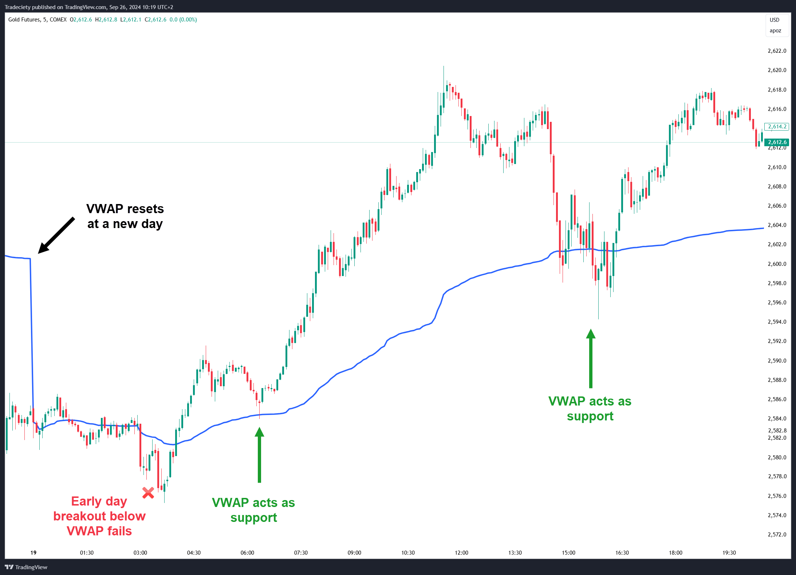

## Table of Contents

## What is VWAP and how is it calculated?

VWAP, or Volume Weighted Average Price, is a trading benchmark used by investors to determine the average price of a security over a specific time period, typically a trading day. It helps traders understand whether they are getting a good deal on a trade by comparing their transaction price to the VWAP. The main idea behind VWAP is to give more importance to price levels where a larger volume of trades occurred, making it a useful tool for institutional investors who trade large volumes.

To calculate VWAP, you start by multiplying the price of each trade by the volume of that trade. You do this for every trade that happens during the time period you're looking at. Then, you add up all these products (price times volume) and also add up all the volumes of the trades. Finally, you divide the total of the products by the total volume. This gives you the VWAP, which represents the average price paid for the security, weighted by the volume of each trade.

## Why is VWAP important in trading?

VWAP is important in trading because it helps traders see if they are getting a good price for a stock. When a trader buys a stock, they want to pay less than the VWAP. This means they are buying at a better price than the average trader that day. On the other hand, if a trader sells a stock, they want to get more than the VWAP. This means they are selling at a better price than the average. By comparing their trade price to the VWAP, traders can quickly tell if their trade was good or not.

VWAP is also useful for big investors who trade a lot of shares. These investors can move the market price if they buy or sell too many shares at once. To avoid this, they break their trades into smaller parts and spread them out over the day. They use VWAP to guide their trading, trying to buy or sell near the VWAP so they don't affect the market too much. This way, they can trade large volumes without causing big price changes, which helps them get the best possible price for their trades.

## How does the VWAP strategy work?

The VWAP strategy is a way for traders to buy or sell stocks at a good price. They use VWAP, which is the average price of a stock over a day, weighted by how many shares were traded at each price. Traders who want to buy a stock will try to buy it for less than the VWAP. This means they are getting a better deal than the average trader that day. On the other hand, traders who want to sell a stock will try to sell it for more than the VWAP. This means they are getting a better price than the average trader.

Big investors, who trade a lot of shares, also use the VWAP strategy. They don't want to buy or sell all their shares at once because it could change the stock's price a lot. Instead, they break their big order into smaller pieces and spread them out over the day. They use VWAP to guide when and at what price to trade these smaller pieces. By trying to buy or sell near the VWAP, they can trade large volumes without causing big price changes, which helps them get the best possible price for their trades.

## What are the key components of a VWAP trading strategy?

A VWAP trading strategy involves using the Volume Weighted Average Price to make trading decisions. Traders compare their buying or selling price to the VWAP to see if they are getting a good deal. If a trader wants to buy a stock, they aim to buy it for less than the VWAP. This means they are paying less than the average price that day. If a trader wants to sell a stock, they aim to sell it for more than the VWAP. This means they are getting more than the average price that day. By doing this, traders can tell if their trade was good or not.

Big investors also use the VWAP strategy when they need to trade a lot of shares. They don't want to buy or sell all their shares at once because it could change the stock's price a lot. Instead, they break their big order into smaller pieces and spread them out over the day. They use VWAP to guide when and at what price to trade these smaller pieces. By trying to buy or sell near the VWAP, they can trade large volumes without causing big price changes. This helps them get the best possible price for their trades.

## Can you explain the difference between VWAP and other volume indicators?

VWAP, or Volume Weighted Average Price, is different from other volume indicators because it shows the average price of a stock over a day, taking into account how many shares were traded at each price. Other volume indicators, like the On-Balance Volume (OBV) or the Volume Oscillator, focus on the total number of shares traded without considering the price at which those shares were traded. VWAP is more about the price and how it relates to volume, while other volume indicators are more about the total volume itself.

For example, OBV adds or subtracts the day's volume to a running total based on whether the stock's price went up or down that day. This helps traders see if volume is confirming price trends. The Volume Oscillator, on the other hand, shows the difference between two moving averages of volume, which can help traders spot increases or decreases in trading activity. These indicators give traders information about the strength of volume trends but don't tell them about the average price like VWAP does.

## How can VWAP be used to determine the entry and exit points in trading?

Traders use VWAP to find good times to buy or sell a stock. If a trader wants to buy a stock, they look for times when the stock's price is below the VWAP. This means they are buying the stock for less than the average price that day, which is a good deal. On the other hand, if a trader wants to sell a stock, they look for times when the stock's price is above the VWAP. This means they are selling the stock for more than the average price that day, which is also a good deal. By using VWAP, traders can see if the price they are getting is better than the average price.

Big investors also use VWAP to decide when to buy or sell big amounts of stock. They don't want to buy or sell all their shares at once because it could change the stock's price a lot. Instead, they break their big order into smaller pieces and spread them out over the day. They use VWAP to guide when and at what price to trade these smaller pieces. By trying to buy or sell near the VWAP, they can trade large volumes without causing big price changes. This helps them get the best possible price for their trades.

## What are the advantages of using a VWAP strategy?

Using a VWAP strategy can help traders get a good price for their trades. When a trader wants to buy a stock, they look for times when the stock's price is below the VWAP. This means they are buying the stock for less than the average price that day, which is a good deal. If a trader wants to sell a stock, they look for times when the stock's price is above the VWAP. This means they are selling the stock for more than the average price that day, which is also a good deal. By using VWAP, traders can see if the price they are getting is better than the average price.

Big investors also benefit from using a VWAP strategy when they need to trade a lot of shares. They don't want to buy or sell all their shares at once because it could change the stock's price a lot. Instead, they break their big order into smaller pieces and spread them out over the day. They use VWAP to guide when and at what price to trade these smaller pieces. By trying to buy or sell near the VWAP, they can trade large volumes without causing big price changes. This helps them get the best possible price for their trades.

## What are the potential limitations or risks of relying on VWAP?

One risk of using VWAP is that it only looks at the price and volume from one day. This means it might not be as useful for traders who want to see how a stock has been doing over a longer time. If a trader only uses VWAP, they might miss important trends or changes in the stock's price that happened over several days or weeks. Also, VWAP can be affected a lot by big trades early in the day. If a big investor buys or sells a lot of shares right when the market opens, it can change the VWAP for the whole day. This might make it hard for other traders to use VWAP to find good prices.

Another limitation is that VWAP does not tell traders about other important things that can affect a stock's price, like news or company reports. Traders who rely only on VWAP might miss out on these other factors that can make a big difference in the stock's price. Also, VWAP is not very useful for stocks that don't trade a lot. If a stock doesn't have many trades, the VWAP might not be a good measure of the average price. In these cases, traders need to look at other ways to decide when to buy or sell.

## How can VWAP be combined with other technical indicators for better results?

Traders can use VWAP along with other technical indicators to make better trading choices. For example, they might use the Relative Strength Index (RSI) to see if a stock is overbought or oversold. If the RSI shows that a stock is overbought and the stock's price is above the VWAP, a trader might decide to sell because the price could go down soon. On the other hand, if the RSI shows that a stock is oversold and the stock's price is below the VWAP, a trader might decide to buy because the price could go up soon. By using both VWAP and RSI, traders can get a better idea of when to buy or sell.

Another useful indicator to use with VWAP is the Moving Average Convergence Divergence (MACD). The MACD can help traders see if the stock's price is trending up or down. If the MACD shows a bullish signal (meaning the stock's price is likely to go up) and the stock's price is below the VWAP, a trader might see this as a good time to buy. If the MACD shows a bearish signal (meaning the stock's price is likely to go down) and the stock's price is above the VWAP, a trader might see this as a good time to sell. By combining VWAP with MACD, traders can get more information about the stock's price direction and make better trading decisions.

## What are some common mistakes traders make when using the VWAP strategy?

One common mistake traders make when using the VWAP strategy is relying too much on it without considering other factors. VWAP only shows the average price of a stock for one day, weighted by how many shares were traded at each price. It doesn't tell traders about other important things like news or company reports that can affect the stock's price. If traders only look at VWAP, they might miss out on these other factors and make bad trading decisions.

Another mistake is not understanding how early trades can affect the VWAP. If a big investor buys or sells a lot of shares right when the market opens, it can change the VWAP for the whole day. Traders who don't know this might think they are getting a good deal based on the VWAP, but the price could be different because of those early trades. It's important for traders to know how VWAP works and to use other tools and information along with it to make better trading choices.

## How does VWAP performance vary across different market conditions?

VWAP can work differently depending on whether the market is going up, going down, or staying the same. In a strong bull market, where prices are going up a lot, VWAP can help traders buy stocks at a good price. If the stock's price is below the VWAP, it might be a good time to buy because the price is lower than the average for that day. But, if the market is very hot and prices are rising fast, the VWAP might not be as useful because the price can keep going up after the trader buys.

In a bear market, where prices are going down, VWAP can help traders sell stocks at a good price. If the stock's price is above the VWAP, it might be a good time to sell because the price is higher than the average for that day. But, if the market is falling fast, the VWAP might not be as useful because the price can keep going down after the trader sells. In a market that is not moving much, VWAP can be very helpful because it gives a clear average price to compare with. But, if there are not many trades, the VWAP might not be a good measure of the average price.

## What advanced techniques can be applied to enhance the effectiveness of a VWAP strategy?

One advanced technique to make a VWAP strategy better is to use it along with other tools like the Relative Strength Index (RSI) or the Moving Average Convergence Divergence (MACD). These tools can help traders see if a stock is overbought or oversold, or if the stock's price is trending up or down. For example, if the RSI shows that a stock is overbought and the stock's price is above the VWAP, a trader might decide to sell because the price could go down soon. By using VWAP with these other tools, traders can get a better idea of when to buy or sell and make smarter trading choices.

Another technique is to use different time periods for VWAP. Instead of just looking at the VWAP for one day, traders can look at the VWAP for several days or even weeks. This can help them see longer-term trends and make better decisions about when to buy or sell. For example, if the daily VWAP is below the weekly VWAP, it might be a good time to buy because the stock's price is lower than the average over a longer time. By using different time periods, traders can get a fuller picture of the stock's price and make more informed trading decisions.

## What is VWAP?

VWAP stands for Volume Weighted Average Price, an essential trading algorithm used to calculate the average price at which a security is traded over the course of a trading day, taking into account the volume of trades. Unlike a simple arithmetic mean, which merely considers price, VWAP offers a more sophisticated measure by incorporating trade volume, thereby providing a comprehensive perspective on the average trading price. This inclusion of volume is critical as it helps mitigate the skewing effects of high-volume trades, offering traders a realistic view of trading activity.

Mathematically, VWAP is determined by the formula:

$$
\text{VWAP} = \frac{\sum (\text{Price} \times \text{Volume})}{\sum \text{Volume}}
$$

In practice, this involves calculating the cumulative total of the product of price and [volume](/wiki/volume-trading-strategy) for each trade, and then dividing by the total cumulative volume up to that point in the trading session. This calculation starts at the beginning of the trading day and updates with each new trade, reflecting real-time changes in the average price. VWAP is visually represented as a line on trading charts, providing a benchmark that traders and investors use to gauge whether the current market price is above or below the average trading price of the day.

This visual representation plays a critical role in trading strategies, as prices trading above the VWAP line may indicate a potential bullish trend, while those below it might suggest bearish [momentum](/wiki/momentum). Consequently, VWAP serves as both a trading benchmark for institutions executing large orders and as a tool for retail traders to better understand intraday market movements.

## How do you calculate VWAP?

The calculation of the Volume Weighted Average Price (VWAP) is essential for traders seeking a precise representation of a security's average trading price throughout a market day, adjusted for volume. The fundamental formula for determining VWAP can be expressed as follows:

$$
\text{VWAP} = \frac{\sum (\text{Price}_i \times \text{Volume}_i)}{\sum \text{Volume}_i}
$$

Here, each transaction $i$ contributes to both the numerator, capturing the total dollar volume traded, and the denominator, representing the cumulative volume. This method ensures that VWAP reflects the relative importance of both high-volume and low-volume trades. 

VWAP calculations start at the beginning of each trading day and incorporate every transaction up to the present moment. As a real-time indicator, VWAP adjusts continuously, providing traders with a dynamic measure of the average price. This is particularly useful for understanding how trading activity influences price movements over the [course](/wiki/best-algorithmic-trading-courses) of the day.

For traders aiming to compute VWAP, various approaches can be taken. Many spreadsheet applications, such as Microsoft Excel, can execute the necessary calculations through built-in functions that automate the iterative process of summing and averaging data. However, for more advanced and automated trading environments, most trading platforms offer integrated tools that calculate VWAP in real-time. These platforms typically use historical and current trade data to ensure accuracy and eliminate the potential for manual errors.

In Python, calculating VWAP can be performed by utilizing libraries such as Pandas, which facilitate data manipulation and provide a streamlined process for achieving real-time updates. Here is a basic example of how VWAP might be calculated using Python:

```python
import pandas as pd

# Sample data: Trade prices and volumes
data = {'Price': [100, 101, 102, 103], 'Volume': [200, 150, 100, 250]}
df = pd.DataFrame(data)

# Calculate VWAP
df['DollarVolume'] = df['Price'] * df['Volume']
vwap = df['DollarVolume'].cumsum() / df['Volume'].cumsum()
df['VWAP'] = vwap

print(df[['Price', 'Volume', 'VWAP']])
```

In this script, the cumulative sums are computed for both the dollar volume and the volume, and their quotient gives the VWAP. This example illustrates how easily VWAP can be integrated into data analysis routines to inform trading decisions.

## What are the differences between VWAP and MVWAP?

Volume Weighted Average Price (VWAP) and Moving Volume Weighted Average Price (MVWAP) are both essential tools in trading strategies, each offering unique insights based on their calculation methodologies and time frames.

VWAP is recalculated every trading day, beginning at the market open and integrating every trade executed throughout the day using the formula:

$$
\text{VWAP} = \frac{\sum (\text{Price} \times \text{Volume})}{\sum \text{Volume}}
$$

This daily recalibration allows traders to assess intraday price movements concerning daily volume, providing a benchmark for the day's trading activity.

In contrast, MVWAP extends the concept of VWAP over predefined periods, such as weeks or months, by aggregating multiple daily VWAPs. This approach creates a smoothed line on trading charts, making it suitable for traders focused on longer-term trends. It averages out the day-to-day fluctuations to present a clearer picture of the prevailing market sentiment over extended periods.

MVWAP's utility lies in its ability to mitigate short-term noise and provide a broader perspective of price trends, which is particularly valuable for swing traders. Swing traders often capitalize on trends lasting from several days to a few weeks, making MVWAP a useful tool for identifying entry and [exit](/wiki/exit-strategy) points within those periods. The formula for computing MVWAP over $n$ days combines the VWAPs of those days, calculated as:

$$
\text{MVWAP} = \frac{\sum \text{VWAP}_i \times \text{Volume}_i}{\sum \text{Volume}_i}
$$

where $\text{VWAP}_i$ and $\text{Volume}_i$ are the VWAP and total volume for day $i$.

**Comparative Scenarios:**

- **Intraday Traders:** Those focusing on day trading may find VWAP more beneficial as it aligns with their short-term trading horizons, providing real-time price points against which to measure trade execution quality.

- **Swing Traders:** For traders with strategies extending beyond single trading days, MVWAP can be more advantageous. It helps in capturing the underlying price trends shielded from daily price volatility, thus aiding strategic decision-making over extended time frames.

- **Market Analysis:** MVWAP, by highlighting longer-term price and volume trends, can be an effective tool for analysts looking to assess market sentiment and potential future price movements.

While both VWAP and MVWAP have their inherent strengths, the choice between them should align with the trader's specific objectives, strategy, and the market conditions they are navigating. Employing these tools appropriately can provide a robust foundation for nuanced trading strategies across different temporal scopes.

## References & Further Reading

[1]: Pardo, R. (2008). ["The Evaluation and Optimization of Trading Strategies."](https://onlinelibrary.wiley.com/doi/book/10.1002/9781119196969) Wiley.

[2]: Kissell, R. (2013). ["The Science of Algorithmic Trading and Portfolio Management."](https://www.sciencedirect.com/book/9780124016897/the-science-of-algorithmic-trading-and-portfolio-management) Academic Press.

[3]: Chan, E. P. (2009). ["Quantitative Trading: How to Build Your Own Algorithmic Trading Business."](https://github.com/ftvision/quant_trading_echan_book) Wiley.

[4]: Narang, R. K. (2013). ["Inside the Black Box: The Simple Truth About Quantitative Trading."](https://www.amazon.com/Inside-Black-Box-Quantitative-Trading/dp/0470432063) Wiley.

[5]: Rishi K. Narang. ["The Imperfect Markets Theory: A Neoclassical Interpretation of CRM."](https://www.amazon.com/Inside-Black-Box-Quantitative-Trading/dp/0470432063) Wiley.