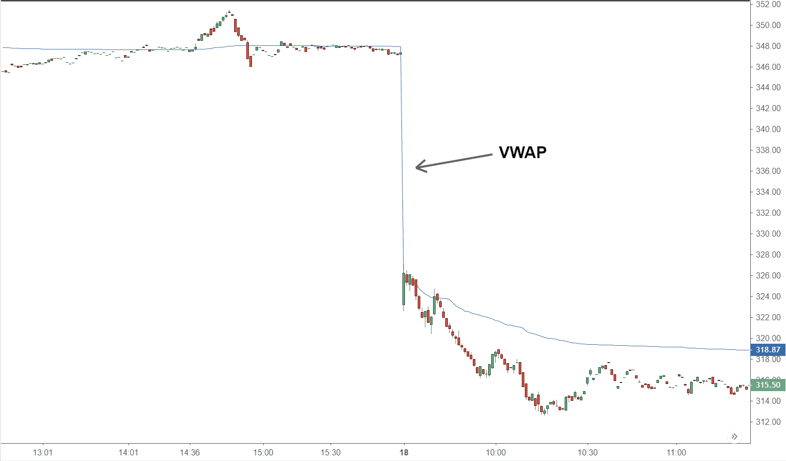

## Table of Contents

## What is VWAP and how is it calculated?

VWAP, or Volume Weighted Average Price, is a trading indicator used to show the average price at which a stock has traded throughout the day, based on both volume and price. It helps traders understand if they are getting a good deal compared to the average price others are paying. VWAP is especially useful for large traders who want to buy or sell a lot of shares without moving the market too much.

To calculate VWAP, you start by multiplying the price of each trade by the volume of that trade. You do this for every trade made during the day. Then, you add up all these products. Next, you add up the total volume of all trades made during the day. Finally, you divide the sum of the price-volume products by the total volume. This gives you the VWAP, which you can update throughout the trading day as more trades happen.

## Why is VWAP important in trading?

VWAP is important in trading because it helps traders see if they are buying or selling at a good price compared to the average price others are paying. Imagine you're buying a stock. If you can buy it for less than the VWAP, you're getting a better deal than the average trader. This is useful for both small and big traders. Big traders, who buy or sell a lot of shares, use VWAP to make sure their big trades don't move the market price too much. They try to trade near the VWAP to blend in with the market's flow.

Also, VWAP can show traders the overall trend of a stock's price during the day. If the stock price stays above the VWAP, it might mean the stock is doing well and could keep going up. If it stays below, it might be a sign that the stock is not doing so well and could go down. Traders use this information to decide when to buy or sell. By watching the VWAP, they can make smarter choices and hopefully make more money.

## How can VWAP be used as a trading strategy?

Traders can use VWAP as a trading strategy by buying a stock when its price is below the VWAP and selling it when the price is above the VWAP. This simple rule helps traders get a better price than the average trader. For example, if a stock's price is $50 and the VWAP is $52, a trader might buy the stock because it's cheaper than the average price. Then, if the stock's price goes up to $53, which is above the VWAP, the trader might sell it to make a profit.

Another way to use VWAP is to look at how the stock price moves compared to the VWAP over time. If the stock price stays above the VWAP for a while, it might mean the stock is in an uptrend and could keep going up. In this case, a trader might keep buying the stock as long as it stays above the VWAP. On the other hand, if the stock price stays below the VWAP, it might be in a downtrend, and the trader might keep selling the stock as long as it stays below the VWAP. This helps traders follow the market's trend and make decisions based on how the stock is doing compared to the average price.

## What are the key components of a VWAP trading strategy?

A VWAP trading strategy uses the Volume Weighted Average Price to help traders decide when to buy or sell a stock. The main idea is to buy when the stock price is below the VWAP and sell when it's above. This way, traders can get a better price than the average trader. For example, if a stock is trading at $50 and the VWAP is $52, a trader might buy it because it's cheaper than the average. Then, if the price goes up to $53, which is above the VWAP, the trader might sell to make a profit.

Another important part of a VWAP strategy is watching how the stock price moves compared to the VWAP over time. If the stock price stays above the VWAP for a while, it might mean the stock is in an uptrend and could keep going up. In this case, a trader might keep buying the stock as long as it stays above the VWAP. If the stock price stays below the VWAP, it might be in a downtrend, and the trader might keep selling the stock as long as it stays below the VWAP. This helps traders follow the market's trend and make decisions based on how the stock is doing compared to the average price.

## Can VWAP be used for both buying and selling?

Yes, VWAP can be used for both buying and selling. When you want to buy a stock, you look at the VWAP to see if the current price is lower than the average price. If it is, you might decide to buy because you're getting a better deal than the average trader. For example, if the stock price is $50 and the VWAP is $52, you might buy the stock because it's cheaper than the average.

When you want to sell a stock, you do the opposite. You look at the VWAP to see if the current price is higher than the average price. If it is, you might decide to sell because you're getting a better price than the average trader. For example, if the stock price goes up to $53, which is above the VWAP of $52, you might sell to make a profit. This way, VWAP helps you decide the best times to buy and sell based on the average price others are paying.

## How does VWAP compare to other trading indicators like moving averages?

VWAP and moving averages are both used to help traders understand how a stock's price is moving, but they do it in different ways. VWAP takes into account both the price and the volume of trades throughout the day. This means it shows you the average price people are actually paying for the stock, weighted by how many shares are being traded. On the other hand, a moving average just looks at the price of the stock over a certain period of time, like the last 50 or 200 days, and gives you an average of those prices without considering the volume.

Because VWAP includes volume, it can be more useful for traders who want to know if they're getting a good deal compared to the average trader. For example, if a stock's price is below the VWAP, it might be a good time to buy because you're paying less than the average. Moving averages, however, are good for seeing the overall trend of a stock's price over time. If the stock price is above the moving average, it might be in an uptrend, and if it's below, it might be in a downtrend. So, while VWAP is great for short-term trading and getting a sense of the current market price, moving averages are better for understanding longer-term trends.

## What are the advantages of using a VWAP trading strategy?

Using a VWAP trading strategy can help traders get a better price when buying or selling a stock. VWAP shows the average price that people are paying for a stock throughout the day, taking into account how many shares are being traded. If a trader buys a stock when its price is below the VWAP, they are getting a better deal than the average trader. On the other hand, if they sell a stock when its price is above the VWAP, they are selling at a better price than the average. This can lead to more profitable trades because the trader is always trying to buy low and sell high compared to the market average.

Another advantage of using VWAP is that it helps traders see the overall trend of a stock's price during the day. If the stock price stays above the VWAP for a while, it might mean the stock is doing well and could keep going up. This can give traders confidence to keep buying the stock as long as it stays above the VWAP. If the stock price stays below the VWAP, it might be a sign that the stock is not doing so well and could go down. This helps traders decide when to sell and avoid holding onto a stock that might lose value. By using VWAP, traders can make smarter decisions and hopefully make more money.

## What are the potential pitfalls or limitations of using VWAP?

Using VWAP can have some problems. One big issue is that VWAP is best for short-term trading, not long-term investing. It only looks at what's happening in the market during one day, so it doesn't help you understand what might happen over weeks or months. Also, VWAP can be affected a lot by big trades. If a big trader buys or sells a lot of shares at once, it can change the VWAP a lot, even if most other traders are doing something different. This can make it hard to know if you're really getting a good deal.

Another problem with VWAP is that it can be hard to use when the market is very busy or when there are big price changes. In these situations, the VWAP can move around a lot, making it tricky to decide when to buy or sell. Plus, VWAP is not as useful for stocks that don't trade very often because there might not be enough trades to make a good average price. So, while VWAP can be a helpful tool, it's important to understand its limits and use it carefully.

## How can VWAP be integrated with other technical analysis tools?

VWAP can be used with other technical analysis tools to make better trading decisions. One way to do this is by using VWAP with moving averages. Moving averages show the average price of a stock over a certain time, like 50 or 200 days. By looking at both VWAP and a moving average, traders can see if the stock's price is doing well compared to the average price for the day and over a longer time. For example, if the stock price is above both the VWAP and a moving average, it might mean the stock is in a strong uptrend, and a trader might want to buy it.

Another way to use VWAP with other tools is by combining it with support and resistance levels. Support levels are prices where a stock tends to stop falling, and resistance levels are prices where a stock tends to stop rising. If the VWAP is near a support or resistance level, it can help traders decide if the stock is likely to bounce back or keep moving in the same direction. For example, if the VWAP is close to a support level and the stock price is below the VWAP, a trader might see this as a good time to buy, hoping the stock will go back up to the VWAP or even higher.

## What time frames are most effective for VWAP trading?

VWAP works best for short-term trading, like during one day. It shows the average price of a stock based on how many shares are traded that day. So, if you're a day trader who buys and sells stocks within the same day, VWAP can help you decide if you're getting a good price compared to everyone else. For example, if you see the stock price is below the VWAP, you might buy because it's cheaper than what others are paying on average. If the price is above the VWAP, you might sell because you're getting a better price than average.

VWAP isn't as useful for longer time frames, like weeks or months. It resets every day, so it doesn't help you see trends over longer periods. If you're an investor who holds onto stocks for a long time, you might want to use other tools like moving averages to understand longer-term trends. But even for short-term trading, VWAP can be tricky to use during times when the market is very busy or when there are big price changes because the VWAP can move around a lot.

## How does market volatility affect VWAP trading strategies?

Market [volatility](/wiki/volatility-trading-strategies) can make VWAP trading strategies harder to use. When the market is very busy and prices are moving a lot, the VWAP can change quickly. This means the average price that traders are using to decide when to buy or sell can be different one minute to the next. If a stock's price is jumping around a lot, it might be below the VWAP one moment and above it the next. This can make it tough for traders to know if they're getting a good deal or not.

Because of this, traders need to be careful when using VWAP during times of high volatility. They might need to watch the market more closely and be ready to change their plans quickly. If they're not careful, they could end up buying or selling at the wrong time. But, if they pay attention and understand how the market is moving, they can still use VWAP to help them make good trading decisions even when things are a bit crazy.

## What advanced techniques can be used to enhance VWAP trading performance?

One way to make VWAP trading better is by using it with other tools, like moving averages. Moving averages show the average price of a stock over a longer time, like 50 or 200 days. When you use VWAP and a moving average together, you can see if the stock is doing well compared to the average price for the day and over a longer time. For example, if the stock price is above both the VWAP and a moving average, it might mean the stock is in a strong uptrend. This can give you more confidence to buy the stock because it's doing well both short-term and long-term.

Another technique is to use VWAP with support and resistance levels. Support levels are prices where a stock tends to stop falling, and resistance levels are prices where a stock tends to stop rising. If the VWAP is near a support or resistance level, it can help you decide if the stock is likely to bounce back or keep moving in the same direction. For example, if the VWAP is close to a support level and the stock price is below the VWAP, you might see this as a good time to buy, hoping the stock will go back up to the VWAP or even higher. By combining these tools, you can make smarter trading decisions and hopefully make more money.

## What is VWAP and how can it be understood?

The Volume Weighted Average Price (VWAP) is an essential trading metric that represents the average price at which a security has been traded over a specific period, factoring in both the price and the volume of trades. As a crucial tool for traders, VWAP provides a comprehensive view of the market’s perception of a stock’s value, distinguishing itself by incorporating trade volume in its calculation. This makes it superior to simple averages for gauging the true average price of a security.

VWAP is calculated by taking the total value of trades for a security and dividing it by the total volume of trades within the same timeframe. Mathematically, it is expressed as:

$$

\text{VWAP} = \frac{\sum_{i=1}^{n}(P_i \times V_i)}{\sum_{i=1}^{n}V_i} 
$$

Here, $P_i$ represents the price of the security at trade $i$, and $V_i$ denotes the [volume](/wiki/volume-trading-strategy) of shares traded at that price. The numerator reflects the total dollar value traded, while the denominator sums the shares traded over the [course](/wiki/best-algorithmic-trading-courses) of the day.

VWAP serves as a pivotal indicator for traders to ascertain market sentiment and potential trends, providing insight into whether a market is trending bullish or bearish. When the current price of the security is above the VWAP line, it typically indicates a bullish trend. Conversely, a price below the VWAP may signal a bearish trend. This alignment assists traders in making informed decisions, as engaging in trades at prices better than the VWAP is generally considered beneficial for positioning relative to the market's average price.

By integrating both price and volume, VWAP allows traders to see a holistic picture of market dynamics, making it indispensable for intraday trading and high-volume transactions. It helps in ensuring trades are executed close to the average market price, thereby reducing market impact and maintaining cost efficiency.

## How is the Volume Weighted Average Price (VWAP) calculated?

The Volume Weighted Average Price (VWAP) is calculated through a series of specific steps that incorporate both price and volume data. This ensures a dynamic and real-time understanding of intraday price movements. The calculation process begins with identifying the typical price for each time frame. This typical price is derived by taking the sum of the high, low, and closing prices of a security for a given period and dividing by three:

$$
\text{Typical Price} = \frac{\text{High} + \text{Low} + \text{Close}}{3}
$$

Once the typical price is calculated, it is then multiplied by the volume of the period, resulting in the Total Price Volume (TPV):

$$
\text{TPV} = \text{Typical Price} \times \text{Volume}
$$

The next step involves summing up all the TPV values for each time frame throughout the trading day. This cumulative measure reflects the total price volume of trades that have occurred. Simultaneously, aggregate the total volumes traded over the day.

The VWAP is finally calculated by dividing the sum of the TPV values by the cumulative total of traded volumes:

$$
\text{VWAP} = \frac{\sum (\text{TPV})}{\sum (\text{Volume})}
$$

This calculation process results in a cumulative running average price that is adjusted by volume, inherently capturing and reflecting real-time market sentiment and intraday price fluctuations. The use of VWAP, therefore, provides traders with a more robust benchmark for analyzing whether current prices are trading above or below the day’s average, aiding in more strategic decision-making for both buying and selling activities. 

In Python, the calculation can be efficiently performed with the help of libraries such as pandas for data manipulation:

```python
import pandas as pd

def calculate_vwap(df):
    df['Typical Price'] = (df['High'] + df['Low'] + df['Close']) / 3
    df['TPV'] = df['Typical Price'] * df['Volume']
    vwap = df['TPV'].sum() / df['Volume'].sum()
    return vwap

# Sample dataframe structure
data = {
    'High': [10, 12, 11],
    'Low': [9, 10, 10],
    'Close': [9.5, 11.5, 10.5],
    'Volume': [1000, 1500, 1200]
}

df = pd.DataFrame(data)
vwap_value = calculate_vwap(df)
print(f'VWAP: {vwap_value}')
```

By understanding and applying this process, traders can use VWAP not only as a standalone metric but also to enhance other trading strategies effectively.

## References & Further Reading

[1]: Berkowitz, S.A., Logue, D.E., & Noser, E.A. (1988). ["The Total Cost of Transactions on the NYSE."](https://onlinelibrary.wiley.com/doi/abs/10.1111/j.1540-6261.1988.tb02591.x) The Journal of Finance, 43(1), 97-112.

[2]: ["Advances in Financial Machine Learning"](https://www.amazon.com/Advances-Financial-Machine-Learning-Marcos/dp/1119482089) by Marcos Lopez de Prado

[3]: Madhavan, A. (2002). ["VWAP Strategies."](https://guides.pm-research.com/content/iijtrading/2002/1/32) The Journal of Portfolio Management, 28(3), 55-62.

[4]: ["Algorithmic Trading: Winning Strategies and Their Rationale"](https://books.google.com/books/about/Algorithmic_Trading.html?id=WAlFDwAAQBAJ) by Ernie Chan

[5]: Poggio, T., Rifkin, R., Mukherjee, S., & Verri, A. (2002). ["Regularization algorithms for learning that are equivalent to multilayer networks."](https://www.science.org/doi/10.1126/science.247.4945.978) Proceedings of the National Academy of Sciences, 97(24), 13781-13786.

[6]: Kissell, R. (2006). ["The Science of Algorithmic Trading and Portfolio Management."](https://www.sciencedirect.com/book/9780124016897/the-science-of-algorithmic-trading-and-portfolio-management) Academic Press.